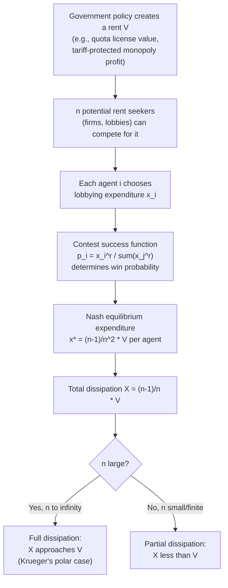

## Rent Seeking and Lobbying in Trade Policy

### Overview

Rent seeking refers to the expenditure of real resources by individuals or groups to obtain or preserve an artificially created transfer (a "rent") rather than to create new wealth. In the trade policy context, rent seeking describes the resources firms, unions, and industry associations spend — lobbying expenditures, legal fees, public relations campaigns, campaign contributions — to influence the government into granting import protection, export subsidies, or favorable regulatory treatment. This is distinct from the direct deadweight loss of a tariff itself (the standard Harberger triangle); rent seeking adds a *second* layer of resource waste, since the resources spent lobbying are diverted from productive use to purely redistributive competition.

The concept originates in Tullock's (1967) analysis of the welfare costs of tariffs, monopolies, and theft, and was formally named "rent seeking" by Anne Krueger (1974, "The Political Economy of the Rent-Seeking Society," *American Economic Review*), who applied it explicitly to import licensing and quota allocation in developing countries.

### The Tullock/Krueger Rent-Seeking Framework

**Standard Tariff Welfare Cost (Baseline)**

A tariff $t$ on an imported good creates the familiar deadweight loss from a production distortion (Harberger triangle 1) and a consumption distortion (Harberger triangle 2), while tariff revenue itself is a transfer from consumers to the government (not a welfare loss, assuming the government spends it with no further loss).

**Krueger's Insight: Quota Rents and Rent Dissipation**

Krueger's key extension examined **quantitative restrictions (quotas)** rather than tariffs. A quota that restricts imports to some quantity $\bar{M}$ raises the domestic price above the world price, creating a **quota rent** — the difference between the domestic and world price, multiplied by the quota quantity — that accrues to whoever holds the import license.

$$\text{Quota rent} = (p^d - p^w) \times \bar{M}$$

If import licenses are allocated through a competitive, non-price rationing process (e.g., firms must lobby, bribe officials, or engage in costly application procedures to obtain a license), then under free entry into rent-seeking activity, resources will be spent competing for the license **up to the point where the expected value of the rent is fully dissipated**:

$$\text{Rent-seeking expenditure} \to (p^d - p^w) \times \bar{M} \quad \text{(in the competitive-dissipation limiting case)}$$

**Key Points**

- In Krueger's polar case of full rent dissipation, the *entire* quota rent is consumed by wasteful lobbying/rent-seeking activity, meaning the welfare cost of the quota is far larger than the standard Harberger-triangle measure of a tariff generating the equivalent price increase — it can approach the full trapezoid (both triangles *plus* the rectangle that would otherwise have been either tariff revenue or producer/license-holder rents).
- This is why economists generally rank **tariffs as less costly than quotas** for a given level of protection, when license allocation is subject to rent-seeking competition — tariff revenue accrues to the government without requiring competitive dissipation, whereas quota rents are up for grabs.
- Full dissipation is a limiting/polar assumption; in practice, rent-seeking contests often only partially dissipate rents (see the Tullock contest-function literature below), so real-world welfare losses typically fall between the standard tariff-only DWL and the full-dissipation quota case.

### Tullock's Rent-Seeking Contest Model

Gordon Tullock's (1980) formalization models rent seeking as a **contest** in which $n$ risk-neutral agents each expend resources (effort/lobbying spending) $x_i$ to compete for a prize $V$ (e.g., the quota rent, or the value of a tariff being imposed on a lobbying industry's behalf). The probability that agent $i$ wins the prize is given by a **contest success function**, commonly the ratio form:

$$p_i(x_1, \dots, x_n) = \frac{x_i^r}{\sum_{j=1}^n x_j^r}$$

where $r > 0$ is a parameter governing the "decisiveness" of effort (higher $r$ means effort more strongly determines the outcome; $r=1$ is the standard linear Tullock contest; $r \to \infty$ approaches an all-pay auction/winner-take-all with certainty for the highest bidder).

**Symmetric Nash Equilibrium**

For $n$ symmetric risk-neutral players with $r=1$, each agent's expected payoff is:

$$\pi_i = p_i(x_i, x_{-i}) \cdot V - x_i$$

Solving the first-order condition and imposing symmetry ($x_i = x^*$ for all $i$) yields:

$$x^* = \frac{(n-1)}{n^2} V$$

Total rent-seeking expenditure across all $n$ agents:

$$X = n x^* = \frac{n-1}{n} V$$

**Key Points**

- As $n \to \infty$, total expenditure $X \to V$: the rent is **fully dissipated** in the limit of many competing lobbyists/rent seekers — consistent with Krueger's polar dissipation case.
- For finite $n$, dissipation is **partial**: with $n=2$ competitors, only half the rent ($X = V/2$) is dissipated in expected-value terms; with $n=5$, $X = 0.8V$.
- Under alternative assumptions (risk aversion, decisiveness parameter $r \ne 1$, or asymmetric valuations/costs across agents), dissipation can be less than, equal to, or in some configurations even exceed 100% of the prize value (over-dissipation), a result that has generated extensive follow-up literature in contest theory.
- **[Unverified]** The over-dissipation result depends on specific parameter configurations (e.g., risk-loving behavior or particular values of $r > 1$ with asymmetric contests) and is not a general feature of all Tullock-style contests; it should not be treated as the typical or expected outcome.

### Diagram: Rent Seeking as a Contest Game

### Rent Seeking vs. Tariff Revenue Seeking

Bhagwati (1982) generalized the concept beyond quota-license competition to what he termed **"Directly Unproductive Profit-seeking" (DUP) activities**, a broader category encompassing:

1. **Tariff-seeking (lobbying to get a tariff imposed)**: resources spent lobbying government to create a distortion in the first place, rather than competing for a rent from an already-existing distortion.
2. **Revenue-seeking (rent seeking for tariff revenue)**: Bhagwati and Srinivasan (1980) showed that if agents compete for a *share of tariff revenue itself* (e.g., through political processes distributing the fiscal proceeds), the total welfare cost can, under certain conditions, exceed even the quota-rent-dissipation case, because it adds a further distortion on top of the standard tariff triangles.
3. **Tariff-evasion-seeking (smuggling, quota-evasion)**: resources spent evading rather than complying with trade restrictions, a mirror-image DUP activity.
4. **Premium-seeking**: general lobbying for any policy-created scarcity premium, of which quota-license lobbying is a special case.

**Key Points**

- DUP theory formalizes the broader principle that **any policy-induced rent will attract socially wasteful competition** for that rent, unless the allocation mechanism is designed to avoid creating an incentive for costly competition (e.g., auctioning quota licenses converts the rent into government revenue rather than a prize for lobbying).
- This generalization moves the analysis beyond Krueger's original quota-specific case to a unified theory of the welfare costs of protectionist policy formation and administration.

### Why Quota Rents Are More Prone to Full Dissipation Than Tariff Protection

The comparison hinges on **who captures the rent and how it is allocated**:

| Instrument | Who captures the "rent" | Allocation mechanism | Dissipation risk |
| --- | --- | --- | --- |
| Tariff | Government (tariff revenue) | Fixed by law; no discretionary allocation | Low — revenue accrues automatically to treasury, no need to compete for it |
| Quota (auctioned) | Government (auction proceeds) | Competitive bidding via auction; auction revenue substitutes for lobbying | Low — competition is channeled into revenue-generating bids, not wasted lobbying |
| Quota (administratively allocated, e.g., first-come-first-served or discretionary licensing) | Whoever obtains the license | Bureaucratic discretion, historical allocation, or queuing | **High** — agents spend real resources lobbying/queuing/bribing to obtain a share of the rent |
| Voluntary Export Restraint (VER) | Foreign exporting firms/government | Foreign government allocates export licenses among its own firms | Rent accrues to foreign producers; may still trigger rent-seeking *within* the foreign country, but transfers real income away from the importing country entirely |

**[Inference]** This table's dissipation-risk ranking follows directly from the standard DUP/rent-seeking literature's logic that discretionary, non-price allocation mechanisms are what generate incentives for costly competition; auctioned or automatically-collected rents largely avoid this because there is no scarce discretionary "prize" to compete for.

### Lobbying as a Signal or Information-Transmission Mechanism (Alternative View)

Not all lobbying models treat lobbying expenditure as pure social waste. An important alternative strand — associated with Grossman and Helpman's later work (**"Special Interest Politics," 2001**) and models of **informative lobbying** — treats at least part of lobbying activity as:

- **Information provision**: lobbies possess superior information about the economic effects of policy (e.g., true elasticities, employment effects) that legislators lack, and lobbying serves to transmit this information, potentially improving policy from a social standpoint even while transferring rents to the lobby.
- **Electoral/persuasion spending**: contributions fund campaign advertising that informs or persuades voters, which can be socially valuable (informative advertising) or socially wasteful (purely persuasive/misleading advertising), depending on the model.

**Key Points**

- This contrasts with the pure Protection for Sale "contributions-for-policy" framing, where contributions are essentially a bribe with no informational content.
- The distinction matters normatively: if lobbying is purely rent-dissipating (Tullock/Krueger), the optimal policy response includes designing institutions (e.g., auctions) to minimize the scope for costly competition; if lobbying is informative, restricting it may worsen policy by depriving the government of useful information, even though it still involves redistribution toward organized groups.
- **[Speculation]** The relative empirical importance of the "informative" versus "pure rent-dissipation" channels in real-world trade lobbying is a matter of ongoing debate in the political economy literature and likely varies by policy context and country.

### Empirical Magnitude Estimates (Illustrative Historical Cases)

**[Unverified]** Krueger's original 1974 estimates, using data on India's and Turkey's import-licensing regimes in the 1960s, suggested rent-seeking costs associated with import licensing could be very large relative to conventional trade-restriction deadweight loss estimates — figures on the order of several percent of GNP have been cited in the literature for these specific historical episodes, though such estimates are highly sensitive to assumptions about the degree of rent dissipation and should be treated as illustrative orders of magnitude from specific historical case studies rather than general parameters applicable to all countries or time periods.

### Formal Welfare Comparison: Tariff vs. Quota with Full Rent Dissipation

Consider a small open economy importing good $X$ at world price $p^w$. A domestic policy raises the price to $p^d > p^w$, restricting imports from the free-trade level $M^{FT}$ to $\bar{M}$.

**Case 1 — Tariff** ($t = (p^d - p^w)/p^w$): Welfare loss = standard deadweight loss (Harberger triangles for production and consumption distortion) = area $(a+b)$ in the standard partial-equilibrium tariff diagram. Tariff revenue = area $c$ = $(p^d - p^w)\bar{M}$ remains a transfer, not a loss.

**Case 2 — Quota with full rent dissipation**: Welfare loss = $(a+b) + c$ = the *entire* trapezoid, because the rent that would have been government revenue under a tariff is instead consumed by competitive rent-seeking under the quota.

$$\text{DWL}_{quota, full\, dissipation} = \text{DWL}_{tariff} + (p^d - p^w)\bar{M}$$

This formalizes the standard textbook ranking that, for an equivalent restriction on quantity/price, tariffs dominate quotas whenever there is meaningful risk of rent dissipation in quota-license allocation.

### Rent Seeking and the Political Economy of Trade Policy Formation (Linking to PFS and Median Voter Models)

Rent-seeking theory is complementary to, rather than a substitute for, the formal political-economy models of endogenous protection:

- **Protection for Sale** models *why* and *how much* protection organized lobbies obtain from the government (the equilibrium tariff formula), while rent-seeking/DUP theory analyzes the *additional welfare cost* of the resources spent in the process of obtaining that protection — i.e., contributions/lobbying expenditure in the PFS model can itself be interpreted as a form of rent-seeking expenditure.
- **Median voter models** abstract from organized lobbying entirely and focus on electoral aggregation; rent-seeking theory is largely orthogonal to (and can be layered on top of) either framework, since rent-seeking competition can occur under many different political-institutional settings, not just common-agency lobbying games.

### Limitations and Critiques

1. **Full dissipation is a polar/limiting assumption**: real-world rent-seeking rarely dissipates 100% of the available rent; the degree of dissipation depends sensitively on the number of competitors, risk attitudes, the contest success function's decisiveness parameter, and entry costs, all of which are difficult to estimate empirically with precision.
2. **Rent-seeking expenditures may have alternative uses (opportunity cost ambiguity)**: some rent-seeking activity (e.g., legal expertise, information-gathering) may have residual social value or spillover benefits, complicating the assumption that all such expenditure is pure waste.
3. **Distinguishing "productive" lobbying (information transmission) from "unproductive" rent-seeking is empirically difficult**, since observationally similar expenditures (campaign contributions, hired lobbyists) can serve either function or both simultaneously.
4. **General equilibrium effects are often ignored** in partial-equilibrium contest models — resources diverted into lobbying are typically drawn from a specific factor market (e.g., skilled professionals who could otherwise be employed productively), and full general-equilibrium welfare accounting requires tracing these opportunity costs through the whole economy.
5. **Institutional design solutions (e.g., auctioning quota rights) are not always politically feasible**, since the same rent-seeking dynamics that create the original distortion may also block reforms (like auctions) that would eliminate the rent-seeking opportunity — a self-reinforcing political economy problem.

### Related Topics / Next Steps

- Krueger (1974) "The Political Economy of the Rent-Seeking Society"
- Tullock contest functions and generalized contest theory
- Bhagwati's theory of Directly Unproductive Profit-seeking (DUP) activities
- Tariffs vs. quotas: welfare-equivalence and non-equivalence under imperfect competition
- Voluntary Export Restraints (VERs) and quota-rent transfer to foreign producers
- The Protection for Sale model (Grossman-Helpman) and its relation to lobbying expenditure
- Median voter models of trade policy (alternative political mechanism)
- Auction mechanisms for import license allocation as a rent-dissipation remedy
- Olson's logic of collective action and lobby formation