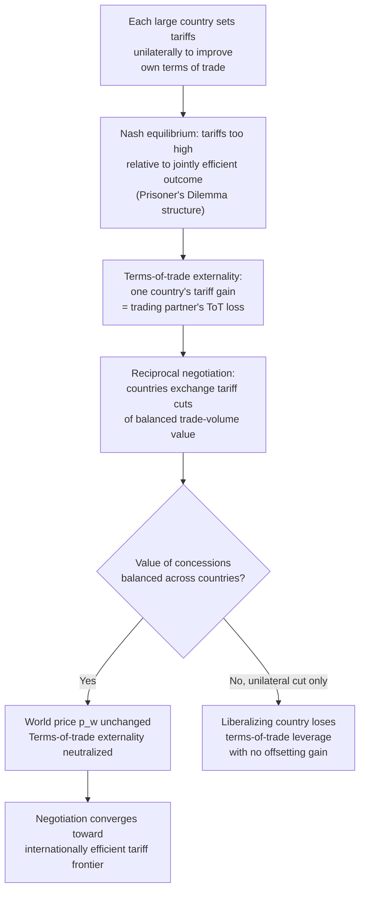

## Reciprocity and International Trade Negotiations

### Overview

Reciprocity is the norm and negotiating principle by which countries exchange roughly equivalent trade concessions — one country lowers tariffs or barriers on some set of goods in exchange for trading partners lowering theirs on another set. It is both a **descriptive feature** of how trade negotiations (GATT/WTO rounds, bilateral and regional agreements) have historically operated, and a **positive political-economy mechanism** that economists have modeled formally to explain why governments that are individually incentivized to protect their markets nevertheless negotiate mutual liberalization. Reciprocity is central to explaining the pattern, sequencing, and political sustainability of trade agreements, and is closely tied to the **terms-of-trade theory of trade agreements** developed most rigorously by Bagwell and Staiger.

### Why Reciprocity Matters: The Terms-of-Trade Externality Problem

**The Core Puzzle**

If a government sets trade policy purely to maximize its own national welfare, and if trade policy has no effect on other countries, unilateral free trade is optimal for a small country (no terms-of-trade motive). But for a **large country** — one big enough to affect world prices — a unilaterally optimal tariff is generally *positive*, because the country can improve its terms of trade by restricting imports (this is the standard **optimal tariff** argument, related to a monopsony-power logic in the import market).

**The Terms-of-Trade Externality**

When a large country sets a tariff to improve its own terms of trade, it necessarily *worsens* the terms of trade of its trading partners (the world price of the traded good falls, benefiting the tariff-imposing country at its partners' expense). Each government, acting unilaterally and non-cooperatively, has an incentive to impose such a tariff — but if **all** governments do so simultaneously, the terms-of-trade gains cancel out in aggregate (one country's improvement is another's deterioration), while the accumulated deadweight losses from the tariffs remain. This is a classic **prisoner's dilemma / negative externality** structure:

$$W_i(\vec{t}) = W_i^{domestic}(t_i) - \underbrace{\text{ToT loss imposed by other countries' tariffs}}_{\text{externality}}$$

**Key Points**

- Unilateral, non-cooperative (Nash) tariff-setting by all countries leads to a **Nash equilibrium tariff level that is inefficiently high** relative to the jointly efficient (cooperative) outcome — every country would be better off if all simultaneously lowered tariffs, but no individual country can unilaterally do so without sacrificing its own terms-of-trade gain unless others reciprocate.
- This is formally analogous to a **prisoner's dilemma**: mutual tariff reduction is Pareto-improving, but unilateral tariff reduction (without reciprocal reduction by trade partners) makes the liberalizing country worse off, because it loses its terms-of-trade leverage without gaining anything in return.
- Reciprocal trade agreements are the institutional mechanism by which countries escape this prisoner's dilemma: by exchanging tariff cuts of *equivalent value*, each country's terms-of-trade loss from cutting its own tariff is offset by the terms-of-trade gain from its partner's reciprocal cut.

### The Bagwell-Staiger Terms-of-Trade Theory of Trade Agreements

Kyle Bagwell and Robert Staiger (1999, *American Economic Review*; and their 2002 book *The Economics of the World Trading System*) formalized reciprocity's role as the mechanism that neutralizes the terms-of-trade externality, providing rigorous microfoundations for the GATT/WTO's own stated definition of reciprocity as balanced trade-volume concessions.

**Formal Logic**

Consider two large countries, Home and Foreign, each setting a tariff $t$ and $t^*$ respectively. Each country's welfare depends on its own tariff (directly) and on its trade partner's tariff (via the terms of trade, i.e., the world relative price $p^w$):

$$W(t, t^*) \quad \text{and} \quad W^*(t, t^*)$$

The **Nash equilibrium** (unilateral, non-cooperative tariff setting) yields tariffs $t^N, t^{*N}$ that are inefficiently high — both countries could be made better off by moving to lower, jointly negotiated tariffs.

**The Reciprocity Rule**

Bagwell and Staiger show that if trade negotiations proceed via an exchange of concessions satisfying:

$$\Delta M(t) \cdot p^w = \Delta M^*(t^*) \cdot p^w$$

(i.e., the **change in the volume of trade**, valued at the pre-negotiation world price, is **equalized** across the concessions each country makes), then the world price $p^w$ is left **unchanged** by the negotiated exchange of concessions. Because reciprocal, trade-volume-balanced concessions leave the terms of trade unaltered, each country's own domestic welfare gain from *its own* tariff reduction is not offset or contaminated by an adverse terms-of-trade movement — the negotiation becomes equivalent to each government solving its own **domestic** political-economy optimization problem without the terms-of-trade externality distorting the outcome.

**Key Result**: A sequence of GATT/WTO-style reciprocal, balanced concessions can move the world from the inefficient Nash equilibrium all the way to the internationally **efficient (Pareto-optimal) tariff frontier**, effectively "internalizing" the terms-of-trade externality through the negotiating rule itself, without requiring any supranational enforcement of a specific tariff level — only enforcement of the *balance* of concessions and, separately, non-violation of negotiated commitments (backstopped by dispute settlement).

**[Inference]** This result is often summarized as: *reciprocity neutralizes the terms-of-trade externality, allowing trade negotiations to function as a mechanism for eliminating an international market failure, analogous to a Coasian bargain over a negative externality.*

### Formal Illustration: Two-Country Partial Equilibrium

Let Home import good $X$ from Foreign. Home's import demand is $M(p^w)$ and Foreign's export supply is $X^*(p^w)$, with the world price $p^w$ clearing the world market: $M(p^w) = X^*(p^w)$.

A tariff $t$ imposed by Home drives a wedge between the domestic price $p^d = p^w(1+t)$ and the world price, reducing Home's import demand at the margin and (for a large country) reducing $p^w$ — improving Home's terms of trade (Home now pays less per unit for its still-substantial imports) while worsening Foreign's terms of trade (Foreign receives less per unit for its exports).

**Balanced concession condition (illustrative):**

Suppose Home agrees to cut its tariff enough to raise its import volume by $\Delta M$, and Foreign simultaneously agrees to cut its own tariff on a different good enough to raise Home's export volume (Foreign's import volume) by $\Delta M^*$. Reciprocity requires:

$$p^w \cdot \Delta M = p^{w*} \cdot \Delta M^*$$

so that the value of trade-volume expansion is equal in both directions, leaving no net first-order pressure on either country's terms of trade.

### Reciprocity vs. Unconditional MFN: The GATT/WTO Institutional Design

Reciprocity in practice operates alongside the **Most-Favored-Nation (MFN)** principle (Article I of GATT): any tariff concession negotiated bilaterally between two members must be extended unconditionally to all other WTO members. This creates a structural tension:

- **Free-rider problem under MFN**: if Country A and Country B negotiate a reciprocal tariff cut, Country C automatically receives the benefit of A's tariff cut (via MFN) without having offered anything in return.
- **Principal supplier rule**: GATT/WTO negotiating practice historically addressed this by having each country negotiate primarily with its **principal supplier** for each product — the country that supplies the largest share of its imports of that good — so that the country granting the concession is negotiating with (and extracting reciprocal concessions from) the country that actually captures most of the benefit, minimizing pure free-riding.
- **Request-offer negotiating procedure**: the traditional GATT method wherein each country submits "requests" for tariff cuts it wants from trading partners and "offers" concessions it is willing to make, iterating toward a mutually acceptable, balanced package — later largely superseded in multilateral rounds by linear/formula-based across-the-board tariff-cutting approaches (e.g., the Swiss formula in later rounds) to reduce negotiating complexity as membership grew.

**Key Points**

- MFN + reciprocity together explain why GATT/WTO rounds are negotiated as **large multilateral package deals** rather than a web of fully bilateral, non-generalizable agreements — reciprocity ensures balance in the overall exchange, while MFN ensures non-discrimination in how the resulting concessions are applied.
- **[Inference]** The tension between MFN's free-rider incentive and reciprocity's need for balanced exchange is one plausible explanation (among several proposed in the literature) for the shift toward large multilateral "rounds" with broad participation and formula-based cutting rules, since single-issue bilateral request-offer negotiations become increasingly vulnerable to free-riding as membership grows.

### Diagram: Reciprocity as an Escape from the Tariff Prisoner's Dilemma

### Reciprocity and Domestic Political Economy: The "Export Interests as Counterweight" View

A complementary (non-terms-of-trade) rationale for reciprocity, closer to the political-economy tradition (Bagwell-Staiger's own earlier work and the broader endogenous-protection literature), emphasizes reciprocity's role in **domestic political mobilization**:

- Import-competing lobbies favor protection and oppose unilateral liberalization.
- A purely unilateral tariff cut mobilizes only the losers (import-competing interests) politically, with no offsetting domestic constituency benefiting directly and visibly.
- A **reciprocal** negotiation, by contrast, simultaneously opens **foreign markets to the country's own exporters**, mobilizing export-oriented industries as a **political counterweight** to import-competing lobbies — export interests now have a direct stake in supporting the agreement, since their access to the foreign market is conditional on the domestic tariff cut being enacted.

**Key Points**

- This view treats reciprocity less as a device for correcting a terms-of-trade market failure and more as a **domestic political technology** for assembling a pro-liberalization coalition that can outweigh protectionist import-competing lobbies (connecting directly to the Protection for Sale / lobbying framework).
- The two rationales (terms-of-trade externality correction vs. domestic political coalition-building) are not mutually exclusive and are often presented as complementary explanations for why reciprocity, rather than unilateral liberalization, has been the dominant real-world negotiating norm.

### GATT/WTO Negotiating Rounds: Empirical Pattern

**[Unverified]** The historical sequence of GATT/WTO multilateral rounds (illustrative, from general trade-policy history) — Geneva (1947), Annecy (1949), Torquay (1950–51), Geneva (1955–56), Dillon Round (1960–61), Kennedy Round (1962–67), Tokyo Round (1973–79), Uruguay Round (1986–94, resulting in the WTO's creation), and the Doha Round (2001–, largely stalled) — reflects a broad shift from simple request-offer bilateral tariff bargaining in early rounds toward formula-based, broader-scope negotiations (including non-tariff barriers, services, intellectual property) in later rounds, consistent with reciprocity-driven negotiating dynamics operating at increasing scale and complexity. **Specific dates and outcomes of individual rounds should be verified against primary WTO historical sources** if precise figures are required, as this summary reflects general/commonly cited chronology rather than a freshly verified source check.

### Reciprocity's Relationship to Enforcement: Self-Enforcing Agreements

Because there is no supranational authority that can compel sovereign governments to honor trade agreements, Bagwell and Staiger's framework (extending earlier work by Dixit and others on self-enforcing agreements) emphasizes that GATT/WTO commitments are sustained as a **self-enforcing equilibrium of a repeated game**:

- If a country reneges on a negotiated tariff commitment (raises tariffs above the bound rate), the WTO dispute settlement system permits the injured trading partner to retaliate with tariff increases of "equivalent" value — itself an application of the reciprocity principle in the *enforcement* domain, not just the negotiation domain.
- The threat of reciprocal, WTO-sanctioned retaliation deters unilateral defection from negotiated commitments, sustaining cooperation as a subgame-perfect equilibrium of the repeated tariff-setting game, analogous to trigger-strategy equilibria in the broader theory of repeated games and international cooperation.

**Key Points**

- This dual role of reciprocity — as the principle governing both **how concessions are exchanged during negotiation** and **how retaliation is calibrated when commitments are violated** — is a distinguishing feature of the GATT/WTO system relative to purely non-binding "soft law" international agreements.
- Retaliation under WTO dispute settlement (e.g., authorized under the Dispute Settlement Understanding) is explicitly designed to be **proportionate/equivalent** to the harm caused by the violation, mirroring the balanced-value logic of reciprocity in the original negotiation.

### Reciprocity in Preferential/Regional Trade Agreements

The same balanced-exchange logic extends to bilateral and regional trade agreements (FTAs, customs unions) outside the multilateral WTO framework:

- Bilateral FTA negotiations (e.g., between two countries) do not face the MFN free-rider problem in the same way (since concessions are typically *not* extended to non-members), making direct bilateral reciprocity easier to calibrate and enforce than multilateral reciprocity.
- **[Speculation]** Some scholars have argued regional agreements can serve as a more tractable vehicle for achieving reciprocal, balanced liberalization among a smaller set of large trading partners when multilateral rounds (like Doha) stall due to the complexity of balancing concessions among a very large and heterogeneous WTO membership, though this remains a debated proposition in the trade policy literature rather than a settled empirical finding.

### Comparison: Reciprocity-Based vs. Unilateral Liberalization

| Dimension | Reciprocal (negotiated) liberalization | Unilateral liberalization |
| --- | --- | --- |
| Terms-of-trade effect | Neutralized if concessions are balanced (Bagwell-Staiger) | Country loses ToT leverage with no offsetting gain (large country) |
| Domestic political coalition | Export interests mobilized as counterweight to import-competing lobbies | Only import-competing losers mobilized; no natural domestic ally |
| Applicability for small countries | Less relevant (no ToT externality to correct) — unilateral free trade already optimal | Directly welfare-improving for a small, price-taking country |
| Institutional requirement | Requires negotiating partners, dispute settlement, enforcement mechanism | No negotiation required; can be done autonomously by domestic policy choice |
| Historical prevalence in practice | Dominant mode for large-country multilateral/bilateral liberalization (GATT/WTO) | More common for small, price-taking economies or as part of broader domestic reform packages |

### Limitations and Critiques of the Terms-of-Trade Theory

1. **Assumes governments are terms-of-trade-driven welfare maximizers**: critics note that many real-world protectionist episodes are better explained by domestic political-economy motives (lobbying, median-voter distributional concerns) than by a deliberate national terms-of-trade strategy, raising questions about whether the terms-of-trade externality is the primary driver of observed tariff levels in all cases.
2. **Empirical identification is difficult**: directly testing whether negotiated tariff changes satisfy the balanced trade-volume condition, and whether this leaves world prices unchanged as predicted, requires detailed bilateral trade and price data that can be hard to fully disentangle from other simultaneous shocks.
3. **Non-tariff barriers and modern trade agreements**: the classic Bagwell-Staiger framework is built primarily around tariffs in a relatively simple partial/general equilibrium trade model; extending the clean terms-of-trade logic to the deep, modern "WTO-plus" agreements covering services, intellectual property, investment, and regulatory harmonization is considerably more complex, and the terms-of-trade rationale is less directly applicable to many of these newer negotiating areas.
4. **Small-country members** of the WTO, who have no terms-of-trade motive to correct, still participate in reciprocal rounds — their participation is better explained by the domestic political-economy coalition-building rationale (or by a desire for market access/legal certainty) than by the terms-of-trade externality theory, suggesting the two rationales for reciprocity likely operate together rather than the terms-of-trade theory being a complete explanation on its own.

### Related Topics / Next Steps

- Bagwell and Staiger's terms-of-trade theory of trade agreements (full treatment)
- Optimal tariff theory and large-country trade policy
- GATT/WTO institutional design: MFN, national treatment, principal supplier rule
- WTO Dispute Settlement Understanding and retaliation/enforcement mechanisms
- Protection for Sale and domestic lobbying as a complementary rationale for reciprocity
- Self-enforcing international agreements and repeated-game cooperation theory
- Preferential/regional trade agreements and their relationship to multilateral reciprocity
- History of GATT/WTO negotiating rounds (Kennedy, Tokyo, Uruguay, Doha)
- The Swiss formula and other tariff-cutting negotiating formulas