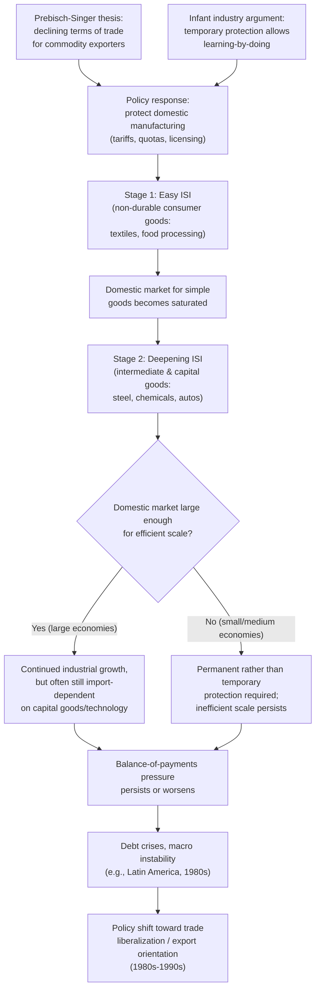

## Import Substitution Industrialization: Theory and Experience

### Overview

Import Substitution Industrialization (ISI) is a trade and development strategy in which a country deliberately protects domestic manufacturing industries — through tariffs, quotas, licensing, overvalued exchange rates, and directed credit — with the goal of replacing imported manufactured goods with domestically produced substitutes. The underlying rationale is to build domestic industrial capacity, reduce dependence on imports (particularly for economies exporting primary commodities), and diversify the production structure away from reliance on volatile world commodity markets. ISI was the dominant development strategy across much of Latin America, South Asia, and parts of Africa from roughly the 1930s/1950s through the 1980s, and its rise, theoretical justification, and eventual widespread abandonment (in favor of export-oriented strategies) form one of the central case studies in the political economy of trade and development.

### Theoretical Foundations

**1. The Prebisch-Singer Thesis (Structuralist Origins)**

Raúl Prebisch (Argentine economist, head of ECLA/CEPAL) and Hans Singer independently argued in the late 1940s/early 1950s that the **terms of trade** between primary commodities (exported by developing "periphery" countries) and manufactured goods (exported by industrialized "center" countries) exhibit a **long-run secular decline** for commodity exporters. The argument rested on:

- **Income elasticity differences**: demand for manufactured goods rises more than proportionally with income (Engel's Law extended to manufactures), while demand for many primary commodities (especially food) rises less than proportionally, so as world income grows, demand shifts toward manufactures, depressing relative commodity prices over time.
- **Market structure asymmetries**: labor markets and pricing in industrialized "center" countries were argued to be more oligopolistic/unionized, allowing productivity gains to be captured as higher wages/profits rather than passed through as lower prices, while commodity markets in the "periphery" were more competitive, so productivity gains there were passed through as lower export prices — a structural asymmetry disadvantaging commodity exporters.

**Policy Implication**: If commodity-exporting countries face persistently deteriorating terms of trade, remaining specialized in primary-commodity export (per static comparative advantage) is a losing long-run strategy; industrialization behind protective barriers is needed to escape this trap and capture the gains from manufacturing.

**Key Points**

- The Prebisch-Singer thesis was explicitly a critique of the **static gains-from-trade logic of Ricardian/Heckscher-Ohlin comparative advantage**, arguing that following current comparative advantage (specializing in primary commodities) could be dynamically inferior to deliberately altering the production structure through industrial policy.
- **[Unverified]** Subsequent empirical work on the long-run behavior of commodity terms of trade has produced mixed and contested results — some studies find evidence of a downward trend over long periods (e.g., work following Grilli and Yang, 1988), while others find the trend to be sensitive to the time period, commodity basket, and price index used, and note it can be dominated by short/medium-run volatility rather than a clean secular decline; this remains a debated empirical question rather than a settled fact.

**2. The Infant Industry Argument**

The classical theoretical justification for protecting manufacturing traces to Alexander Hamilton and Friedrich List in the 19th century, and remains the most direct theoretical case for ISI:

- New industries in a developing economy may be unable to compete with established foreign producers *initially*, not because they lack long-run comparative advantage, but because they have not yet accumulated the learning-by-doing, scale economies, or specialized labor skills that mature foreign competitors already possess.
- Temporary protection allows the domestic industry to grow, learn, and achieve competitiveness, after which protection can be removed and the industry competes successfully in world markets.

**Formal Condition (Mill-Bastable Test)**

For infant industry protection to be economically justified (not merely a subsidy to inefficiency), two conditions are typically required:

1. **Mill's test**: the industry must eventually become competitive without protection (i.e., the "learning" must actually occur and be sufficient to close the cost gap).
2. **Bastable's test**: the discounted future benefits (from the industry becoming competitive) must exceed the discounted costs incurred during the protected "infancy" period (i.e., the investment in protection must pass a cost-benefit test, not simply eventually succeed at any cost).

**Key Points**

- A key theoretical critique (associated with Baldwin, 1969, and others) is that even if an industry *would* become competitive with learning, this alone does not establish that **protection (tariffs) is the correct policy instrument** — if the underlying market failure is a learning/knowledge externality (firm-specific learning spills over to other firms who did not bear the cost) or a capital-market imperfection (firms cannot borrow against future profits to finance current losses), a **targeted production subsidy** or **directed credit/subsidized loan program** addresses the market failure more directly and with less distortion to consumption than a tariff, which additionally taxes consumers via higher domestic prices.
- This is a direct application of the general principle of **policy targeting** (closely related to the theory of the second best and Bhagwati-Ramaswami's targeting principle): the optimal policy instrument should intervene as close as possible to the source of the market failure.

**3. Balance-of-Payments and Foreign Exchange Constraints**

A further motivation, especially prominent in Latin American structuralist thought, was the **foreign exchange bottleneck**: developing economies dependent on volatile commodity export earnings faced periodic balance-of-payments crises when export earnings fell, constraining their ability to import capital goods and inputs needed for growth. Import substitution was seen as a way to reduce the economy's structural dependence on imports (at least of consumer manufactures), freeing scarce foreign exchange for capital-goods imports.

### Stages of ISI (Typical Sequencing)

ISI strategies typically proceeded through identifiable stages, especially in the larger Latin American economies (Brazil, Argentina, Mexico):

1. **"Easy" first-stage ISI**: protection of **non-durable consumer goods** industries (textiles, footwear, food processing) — technologically simple, labor-intensive, low capital requirements, and typically already having some pre-existing small-scale domestic production to build on.
2. **Exhaustion of easy ISI and turn to "deepening"**: once the domestic market for simple consumer goods is largely saturated by domestic production (a relatively small domestic market limits further easy-ISI growth), further industrialization requires moving into **intermediate goods** (steel, chemicals, petrochemicals) and eventually **durable consumer goods and capital goods** (automobiles, machinery) — industries requiring far larger capital investment, greater technological sophistication, and larger minimum efficient scale.
3. **"Deepening" ISI (second-stage ISI)**: pursuing capital- and technology-intensive industries often exceeds what a purely domestically-oriented small/medium market can efficiently support at world-competitive scale, frequently requiring continued (and often increasing) protection, state-owned enterprise involvement, and foreign direct investment, rather than the "infant industry" model of protection tapering off as competitiveness is achieved.

**Key Points**

- The transition from easy to deepening ISI is where many of the theoretical and practical problems of the strategy became most apparent — deepening ISI industries frequently required *permanent* rather than temporary protection, since domestic market size was often too small to achieve the scale economies needed for world competitiveness even after "learning" had occurred.
- This sequencing is closely associated with the **"stages of ISI"** framework developed in the dependency-theory and structuralist development economics literature (associated with economists at ECLA/CEPAL and later critics such as Albert Hirschman).

### Policy Instruments Typically Used in ISI Regimes

| Instrument | Function |
| --- | --- |
| High tariffs, especially cascading by stage of processing (low on capital goods/raw materials, high on finished consumer goods) | Protects final-goods assembly while keeping input costs low — generates very high **effective rates of protection** on domestic value-added |
| Import licensing and quantitative restrictions | Direct quantity control, often allocated administratively (creating quota rents and rent-seeking, per Krueger's analysis) |
| Overvalued exchange rates | Cheapens imported capital goods and inputs for domestic industry, while implicitly taxing traditional export sectors (commodity exporters) — a form of indirect taxation of agriculture/primary exports to subsidize industrialization |
| Directed/subsidized credit | State development banks channel below-market-rate credit to targeted industrial sectors |
| Local content requirements | Mandate a minimum domestic-value-added share in final products (especially common in automobile-sector ISI) |
| State-owned enterprises (SOEs) | Direct state ownership/operation in capital-intensive sectors (steel, petrochemicals, utilities) where private capital was seen as insufficient or unwilling to invest |

**Effective Rate of Protection (ERP) and Cascading Tariffs**

A defining technical feature of ISI tariff structures was **tariff escalation** — low or zero tariffs on imported raw materials and capital goods, combined with high tariffs on finished consumer goods — which generates an **effective rate of protection on value-added** far exceeding the nominal tariff rate on the final good:

$$ERP_j = \frac{V_j^d - V_j^w}{V_j^w}$$

where $V_j^d$ is domestic value-added in the tariff-inclusive price structure and $V_j^w$ is value-added at world prices, for industry $j$.

**[Inference]** ERP calculations for many ISI-era Latin American manufacturing sectors are frequently cited in the development economics literature as reaching very high levels (often well above the nominal tariff rates on final goods), reflecting the intended cascading structure; specific country/sector ERP figures vary substantially across studies and time periods and should be checked against the original empirical studies (e.g., Balassa's cross-country ERP studies from the 1970s) rather than treated as universal constants.

### Case Studies: Latin America (Argentina, Brazil, Mexico)

**Argentina**: Pursued ISI intensively from the 1930s (accelerated by the Depression-era collapse of commodity export markets and disrupted manufactured imports) through the Peron era and beyond; became a canonical case of both early ISI success in simple consumer goods and later stagnation in deepening-stage industries, compounded by macroeconomic instability (chronic inflation, balance-of-payments crises).

**Brazil**: Pursued a particularly aggressive "deepening" ISI strategy from the 1950s through the 1970s (including the "economic miracle" period of rapid growth in the late 1960s/early 1970s), building substantial domestic capacity in steel, automobiles, and capital goods, often with heavy state involvement (state-owned enterprises in steel, oil) and significant foreign direct investment in the automobile sector behind high protective walls.

**Mexico**: Pursued ISI from the 1940s through the early 1980s, with the debt crisis of 1982 (triggered by the collapse in oil prices and rising international interest rates against a backdrop of heavy external borrowing) marking a decisive turning point toward trade liberalization, culminating eventually in GATT accession (1986) and NAFTA (1994).

**Key Points**

- **[Unverified]** Specific growth rates, industrial output figures, and precise dating of policy shifts for each country vary across sources and are best verified against primary economic history sources (e.g., ECLAC/CEPAL statistical publications, World Bank country studies) if exact figures are needed for a specific claim.
- A common feature across the major Latin American ISI experiences was that industrialization proceeded successfully in the "easy" stage but ran into diminishing returns, chronic balance-of-payments pressure (since deepening-stage industries still required substantial imported capital equipment and technology, undermining the original foreign-exchange-saving rationale), and mounting fiscal burdens from subsidizing inefficient, protected industries.

### Case Study Contrast: East Asian Export-Oriented Industrialization (EOI)

The most influential comparative counterpoint to ISI is the **East Asian export-oriented industrialization** experience (South Korea, Taiwan, and later other "East Asian Tigers"), which is frequently used to frame the standard economics-literature critique of ISI:

- South Korea and Taiwan both initially pursued ISI-style policies in the 1950s (in Korea and Taiwan's cases, alongside substantial land reform and US aid), but shifted decisively toward **export promotion** in the early-to-mid 1960s — combining continued (sometimes substantial) protection of the domestic market with strong, often extensive, incentives for export performance (export subsidies, preferential credit tied to export targets, duty-free imports of inputs for exporters).
- This is sometimes characterized in the literature as a hybrid strategy — protection of the domestic market for import-substituting production, *combined with* aggressive promotion of manufactured exports — rather than a pure, unqualified "free trade" strategy, complicating simple "ISI failed, free trade succeeded" narratives.
- **[Inference]** The relative roles of trade openness *per se* versus other factors (high savings and investment rates, substantial public investment in education and infrastructure, land reform reducing inequality, industrial policy targeting and export discipline, geopolitical Cold War-era support) in explaining East Asian growth success remain actively debated in the development economics literature (e.g., the World Bank's *East Asian Miracle* report versus more state-centric accounts by economists such as Alice Amsden and Robert Wade); this summary should not be read as endorsing a single, settled causal account.

### Diagram: The ISI Policy Logic and Its Typical Trajectory

### Critiques of ISI

**1. Anti-Export Bias**

ISI's protective structure (overvalued exchange rates, high tariffs on manufactured imports) systematically **taxed exports implicitly** even without explicit export taxes: an overvalued currency makes exports less competitive in dollar terms, and resources drawn into protected, inefficient import-competing sectors are drawn away from potentially more efficient export sectors (particularly agriculture and traditional commodity exports). This is the **anti-export bias** critique most closely associated with Little, Scitovsky, and Scott's (1970) OECD-sponsored comparative study, and Bhagwati and Krueger's (1978) NBER project on trade regimes and economic development.

**2. Static Efficiency Losses and X-Inefficiency**

Protected industries, insulated from international competition, often exhibited:

- High-cost, low-quality production relative to world prices/standards (measured via high ERPs and negative value-added at world prices in some extreme cases — i.e., industries that *destroyed* economic value when properly measured, importing inputs worth more at world prices than the finished good they became).
- **X-inefficiency** (a term from Leibenstein): managerial slack and lack of competitive pressure to minimize costs, distinct from allocative inefficiency.

**3. Rent Seeking and Corruption**

As detailed in the Krueger/Bhagwati DUP literature (see "Rent Seeking and Lobbying in Trade Policy"), the administrative allocation of import licenses and protection under ISI regimes created substantial **rent-seeking costs**, with resources diverted into lobbying for and administering protection rather than productive investment.

**4. Fiscal and External Debt Burdens**

Subsidized credit to ISI industries, state-owned enterprise losses, and the continued need to import capital goods and technology (even for "import-substituting" industries) generated persistent fiscal deficits and external borrowing, contributing directly to the **Latin American debt crisis of the 1980s** (triggered by the 1979–1982 rise in US interest rates and the 1982 Mexican default), which in turn discredited the ISI model and precipitated the shift toward the **Washington Consensus** policy package (trade liberalization, privatization, fiscal discipline) across much of Latin America in the late 1980s and 1990s.

**5. Small Domestic Market Constraint**

For small and medium-sized economies, the domestic market was often too small to support efficient-scale production in deepening-stage capital-intensive industries, regardless of how long protection was maintained — meaning the Mill test (eventual competitiveness without protection) could never be satisfied, turning "infant" industries into permanently subsidized, uncompetitive "adult" industries.

### Defenses and Reassessments of ISI

**[Speculation]** Some development economists and economic historians have offered more qualified reassessments of ISI, noting that:

- ISI-era investment did build substantial human capital, industrial infrastructure, and technological capacity in several countries that later export-oriented growth phases (in Latin America and elsewhere) partly relied upon.
- The clean dichotomy between "ISI failure" and "East Asian export-oriented success" oversimplifies the East Asian experience, which itself involved substantial protection and industrial policy targeting (as noted above), suggesting the relevant contrast may be more about the *quality and discipline* of industrial policy (e.g., export-performance conditionality forcing firms to remain internationally competitive) than a simple binary of "protection versus free trade."

This remains a genuinely contested area of the development economics literature rather than a settled consensus, and characterizations of ISI as an unambiguous policy failure versus a more nuanced, partially successful (if ultimately overextended) strategy vary across scholars and specific country contexts.

### Related Topics / Next Steps

- Prebisch-Singer thesis and terms-of-trade debates
- Infant industry argument and the Mill-Bastable test
- Effective rate of protection and tariff cascading/escalation
- Bhagwati-Krueger NBER project on trade regimes and development
- Rent seeking and lobbying in trade policy (Krueger, DUP activities)
- East Asian export-oriented industrialization and the "East Asian Miracle" debate
- The Latin American debt crisis (1980s) and the Washington Consensus
- Policy targeting principle (Bhagwati-Ramaswami) and the theory of the second best
- Dependency theory and structuralist development economics (ECLA/CEPAL)