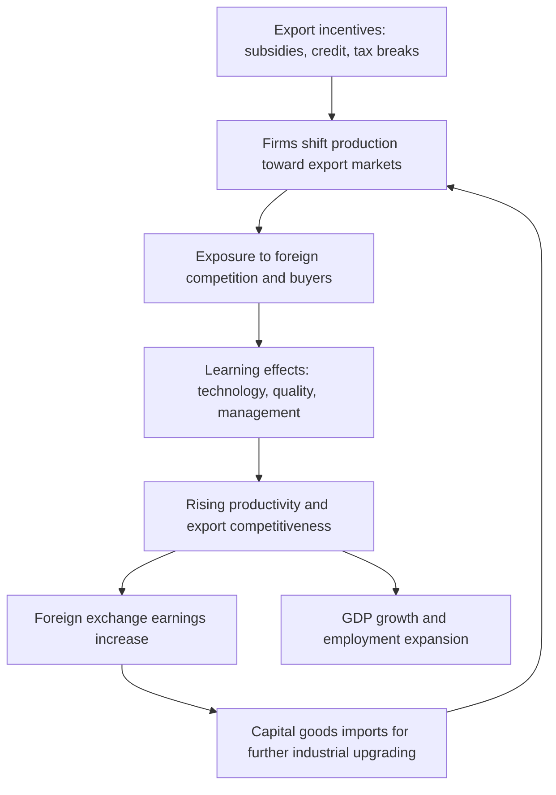

## Export-Oriented Industrialization Strategies

### Definition and Core Concept

Export-oriented industrialization (EOI), also called export-led growth or export promotion, is a trade and development strategy in which a country structures its industrial policy around producing goods for export markets rather than solely for domestic consumption. The strategy rests on the premise that integrating into global markets — rather than shielding domestic industry from them — accelerates industrialization, generates foreign exchange, and drives productivity growth through exposure to international competition.

EOI stands in direct contrast to import-substitution industrialization (ISI), which protects domestic infant industries via tariffs and quotas so they can serve the home market. Where ISI turns inward, EOI turns outward: firms are encouraged (via incentives, exchange rate policy, and infrastructure) to produce for the world market, and success is measured by the ability to compete internationally rather than merely to survive behind trade barriers.

### Historical Origins and Evolution

**Key Points**

- Emerged as a deliberate alternative to ISI, which dominated developing-country policy from the 1950s–1970s
- Pioneered by the "East Asian Tigers": South Korea, Taiwan, Hong Kong, Singapore
- Later adopted in varying forms by China, the ASEAN economies (Malaysia, Thailand, Indonesia, Vietnam), and parts of Latin America

The canonical narrative traces EOI's rise to the perceived failures of ISI in Latin America and South Asia during the 1960s–70s: persistent balance-of-payments crises, inefficient protected industries that never matured into competitive firms, and fiscal strain from subsidizing them. South Korea and Taiwan, by contrast, pivoted in the early-to-mid 1960s toward export promotion — using currency devaluation, export subsidies, and targeted credit to manufacturers who could sell abroad. Their subsequent rapid GDP growth (often cited as 8–10% annually for extended periods) became the empirical anchor for the World Bank's influential *East Asian Miracle* (1993) framing, which credited export orientation, though the report also acknowledged significant state intervention rather than pure laissez-faire markets. [Inference: the precise causal weight of export orientation versus other factors like land reform, education investment, and geopolitical aid remains debated among economists.]

### Theoretical Foundations

**Comparative Advantage and Trade Theory**

EOI's classical justification derives from Ricardian comparative advantage: countries should specialize in producing goods where they hold a relative efficiency advantage and trade for the rest. The Heckscher-Ohlin extension refines this for developing countries specifically — nations relatively abundant in labor should specialize in labor-intensive manufactured exports (textiles, electronics assembly, footwear), exploiting their factor endowment.

$$\text{Autarky price ratio} \neq \text{World price ratio} \implies \text{gains from trade exist}$$

**Dynamic/Learning Effects**

Beyond static comparative advantage, EOI proponents emphasize dynamic gains:

- **Learning-by-exporting**: firms exposed to foreign buyers and competitors absorb technology, quality standards, and managerial practices faster than protected domestic firms
- **Economies of scale**: export markets are far larger than most domestic markets, allowing firms to achieve scale economies unreachable if serving only the home market
- **Discipline effect**: international competition forces continuous productivity improvement, unlike protected ISI firms which can stagnate behind tariff walls
- **Foreign exchange generation**: export earnings relax the foreign exchange constraint that limits capital goods imports needed for further industrialization

**Endogenous Growth Linkages**

Later growth theory (Grossman-Helpman, Romer-style models) formalized how trade openness can affect the long-run growth rate, not just the level of output, via increased returns to innovation and technology diffusion — though this remains an area of ongoing empirical contention. [Inference: the strength of trade-openness-to-growth causality is sensitive to model specification and country sample, and cross-country regressions on this topic have been criticized on econometric grounds.]

### Policy Instruments Commonly Used

**Exchange Rate Policy**

- Currency devaluation or managed depreciation to make exports cheaper in foreign currency terms
- Dual or multiple exchange rate systems (historically used, e.g., in early South Korean policy) to favor exporters

**Fiscal and Financial Incentives**

- Export subsidies (direct or via tax rebates)
- Duty drawback schemes — refunding tariffs paid on imported inputs used in export production
- Preferential/subsidized credit allocated specifically to export-oriented firms (a hallmark of South Korean industrial policy under Park Chung-hee)
- Tax holidays for export-producing firms

**Institutional/Spatial Mechanisms**

- **Export Processing Zones (EPZs)** / **Special Economic Zones (SEZs)**: geographically delimited areas offering tariff-free import of inputs, streamlined regulation, and infrastructure, on the condition that output is exported. China's Shenzhen SEZ (established 1980) is the most cited example of scale.
- **Free trade zones/bonded warehouses** for input processing

**Trade Policy**

- Relatively liberalized import regime for inputs used in export production (even while some domestic-market protection persists — many EOI success cases were not pure free trade, a nuance often lost in simplified textbook accounts)
- Active participation in trade agreements and WTO/GATT accession to secure market access

### Country Models Compared

| Dimension | South Korea (1960s–80s) | Singapore | China (1980s–2000s) |
| --- | --- | --- | --- |
| Primary vehicle | Large conglomerates (chaebols) | Multinational FDI | SEZs + FDI + state enterprises |
| State role | Heavy, directive (credit allocation, targets) | Facilitative (infrastructure, rule of law) | Heavy, gradualist/experimental |
| Key sectors | Steel, shipbuilding, electronics, autos | Electronics, petrochemicals, finance | Textiles, electronics, manufacturing broadly |
| Domestic market protection | Significant, selectively | Minimal (small domestic market) | Significant, gradually liberalized |

[Unverified: exact quantitative policy parameters, such as specific subsidy rates or tariff schedules by year, vary across sources and periods; figures cited in secondary literature should be checked against primary trade-policy archives for precision.]

### Diagram: EOI Policy Feedback Loop (svg_diagram)

### Worked Example: Comparative Advantage Gain from Export Orientation

Consider a simplified two-good, two-country model. Country A (labor-abundant) can produce either 10 units of textiles or 2 units of machinery per unit of labor-capital input in autarky; Country B (capital-abundant) can produce either 4 units of textiles or 8 units of machinery.

**Autarky opportunity cost of textiles:**

- Country A: $0.2$ machinery per textile unit
- Country B: $2$ machinery per textile unit

Country A has comparative advantage in textiles ($0.2 < 2$). Under EOI, Country A reallocates resources toward textile production for export, trading with Country B at a world price ratio between the two autarky ratios — for instance $P_{world} = 0.5$ machinery/textile. Both countries gain: Country A can now obtain machinery at $0.5$ textiles-equivalent cost instead of $5$ (the autarky reciprocal), and Country B obtains textiles more cheaply than its own $2$-machinery-per-textile domestic cost.

This is the static trade-theoretic case; EOI's proponents argue the larger gains come dynamically, as Country A's textile sector — now serving a much larger export market — invests in better machinery, achieves scale economies, and gradually upgrades into higher-value textile segments or adjacent manufacturing (the "flying geese" pattern of sequential industrial upgrading observed in East Asia).

### Criticisms and Limitations

**Structural and Distributional Concerns**

- **Race-to-the-bottom pressure**: competition for export-oriented FDI can incentivize suppression of labor standards, wages, or environmental regulation
- **External demand dependence**: growth becomes exposed to demand fluctuations in destination markets (e.g., East Asian economies' exposure during the 1997–98 Asian Financial Crisis, and again during the 2008–09 global financial crisis, when export volumes to the US and EU collapsed)
- **Terms-of-trade risk**: if many developing countries simultaneously pursue export-led growth in similar labor-intensive sectors, the resulting supply glut can depress export prices (a "fallacy of composition" critique articulated by economists such as Paul Krugman and Dani Rodrik)
- **Middle-income trap risk**: labor-cost-based export competitiveness erodes as wages rise, and not all EOI economies successfully transition to higher-value-added, innovation-driven exports

**Political Economy Critiques**

- Heavy state involvement in credit allocation (as in the Korean chaebol model) can produce cronyism, moral hazard, and misallocation if not disciplined by genuine export performance metrics
- Currency undervaluation strategies can provoke trade tensions and accusations of currency manipulation from trade partners

[Speculation: whether currently industrializing economies (e.g., in Sub-Saharan Africa) can replicate the East Asian EOI trajectory is contested, given changed global conditions — automation reducing the labor-cost advantage of offshoring, and more constrained WTO-era policy space for the subsidies and tariffs historically used by Korea and Taiwan.]

### EOI versus Import Substitution Industrialization — Summary Contrast

**Key Points**

- **Orientation**: EOI targets external/world markets; ISI targets the domestic market
- **Protection**: ISI relies on sustained tariff/quota protection; EOI relies on temporary/selective support tied to export performance
- **Efficiency incentive**: EOI firms face continuous competitive discipline from foreign buyers; ISI firms can remain inefficient indefinitely behind protection
- **Foreign exchange**: EOI generates foreign exchange through exports; ISI consumes foreign exchange importing capital goods without a matching export offset, often producing balance-of-payments crises
- **Empirical association**: EOI is more strongly associated with the sustained high-growth episodes of East Asia; ISI is more associated with the stagnation and debt crises of 1970s–80s Latin America, though scholars increasingly document that most successful cases blended elements of both rather than practicing either in pure form

### Contemporary Relevance and Evolution

EOI strategy has evolved with changes in global production organization:

- **Global Value Chains (GVCs)**: modern export orientation increasingly means specializing in a specific *task or stage* of production (assembly, component manufacturing) within a fragmented international supply chain, rather than exporting a complete finished good — Vietnam's role in electronics assembly for firms like Samsung exemplifies this
- **Services export orientation**: India's IT and business-process-outsourcing (BPO) sector represents an EOI variant applied to tradable services rather than manufactured goods
- **Trade policy space constraints**: WTO Agreement on Subsidies and Countervailing Measures (SCM) restricts some traditional EOI tools (direct export subsidies), pushing countries toward WTO-compliant alternatives like special economic zones, infrastructure investment, and skills development rather than direct subsidy

**Related Topics**

- Import-substitution industrialization (ISI) and its historical failures
- Exchange rate policy and competitive devaluation
- Special Economic Zones: design and governance models
- Global value chains and trade in tasks
- The middle-income trap
- Infant industry protection argument
- Terms of trade and the Prebisch-Singer hypothesis
- WTO Agreement on Subsidies and Countervailing Measures (SCM)
- Foreign direct investment (FDI) as a development tool
- East Asian Miracle debate and its critics (Rodrik, Amsden, Wade)