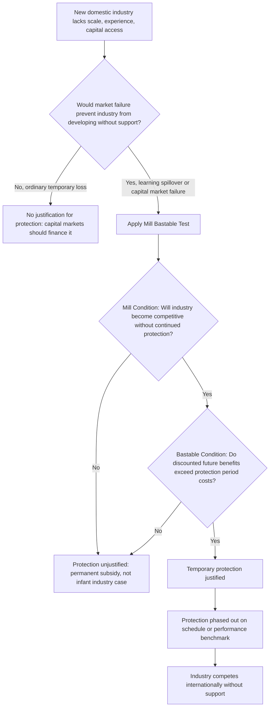

## Infant Industry Protection and Its Critiques

### Definition and Core Concept

The infant industry argument holds that new industries in developing economies, which lack the accumulated experience, scale, and capital that established foreign competitors already possess, cannot survive initial exposure to unrestricted international competition. Proponents argue that temporary protection — via tariffs, quotas, or subsidies — allows these nascent industries time to achieve the learning, scale economies, and technological maturity needed to eventually compete internationally without support. Once "grown up," protection is meant to be withdrawn.

The argument is one of the oldest and most durable justifications for departing from free trade, distinguishing itself from general protectionism by its explicitly *temporary* and *developmental* framing: protection is a means to an eventual competitive end, not a permanent shield.

### Historical Origins

**Key Points**

- First systematically articulated by Alexander Hamilton in *Report on Manufactures* (1791), advocating tariffs to build early American manufacturing
- Developed more rigorously by Friedrich List in *The National System of Political Economy* (1841), who argued Britain itself had used protection to industrialize before advocating free trade to others once it held a competitive lead
- Invoked historically by Germany, the United States, Japan, and later the East Asian Tigers during their respective industrialization phases

List's critique carried a pointed political-economy observation: that dominant industrial powers tend to champion free trade *after* achieving industrial supremacy, a strategic use of trade doctrine sometimes referred to as "kicking away the ladder" (a phrase popularized much later by economic historian Ha-Joon Chang). [Inference: whether this pattern reflects deliberate strategic behavior by historical hegemons or simply the natural point at which free trade becomes self-interested for any developed economy is a matter of historical interpretation rather than settled fact.]

### Theoretical Foundations

**The Basic Economic Logic**

The argument rests on the existence of a **dynamic** rather than static market failure. In a standard static comparative-advantage framework, a country lacking a competitive industry today has no incentive to develop it — resources are better allocated to sectors where comparative advantage already exists. The infant industry case argues that comparative advantage can be *created* through learning and investment, but private firms will underinvest in this creation because:

- **Learning spillovers**: Once a pioneering firm bears the cost of learning production techniques, that knowledge often diffuses to competitors who did not bear the cost, discouraging any single firm from making the investment (a positive externality problem)
- **Capital market imperfections**: Developing-country capital markets may be unable to finance the sustained losses a firm would need to absorb while building competitiveness, even if the eventual return is positive
- **Coordination failures**: Industrialization may require simultaneous investment across multiple interdependent sectors (suppliers, skilled labor pools, infrastructure) that no single firm can internalize alone

Formally, an industry qualifies for protection under the "infant industry" logic if:

$$PV(\text{future social benefits from maturity}) > PV(\text{costs of protection during the learning phase})$$

where the mechanism generating that future benefit must be an externality or market failure — not merely temporary losses, since ordinary temporary losses are something private capital markets should in principle finance without government intervention.

### The Mill-Bastable Test

Economist John Stuart Mill first gave the argument qualified acceptance in *Principles of Political Economy* (1848), and Irish economist C.F. Bastable later refined the conditions under which infant industry protection is economically justified. The **Mill-Bastable test** requires two conditions:

1. **Mill's condition**: The industry must be expected to become competitive (achieve comparative advantage) *without* continued protection within a reasonable time frame
2. **Bastable's condition**: The discounted future benefits to society from the industry's eventual maturity must exceed the discounted costs imposed on consumers and the economy during the protected period

**Key Points**

- Both conditions must hold simultaneously — an industry that never matures fails Mill's condition regardless of learning-curve theory; an industry that matures too slowly or at too high a cost fails Bastable's condition even if it eventually succeeds
- The test is rarely, if ever, actually applied ex ante by real governments, which is itself a central practical critique (see below)

### Diagram: Infant Industry Protection Logic and Decision Test (svg_diagram)

### Policy Instruments Used

- **Tariffs** on competing imports, allowing domestic infant firms to charge higher prices while building capacity
- **Import quotas**, functionally similar to tariffs but fixing quantity rather than price
- **Direct subsidies** (production or export subsidies) targeting the protected sector
- **Subsidized credit** allocated to targeted industries (as used extensively in South Korea's industrial policy)
- **Local content requirements**, mandating that final goods incorporate a minimum share of domestically produced inputs
- **Performance-linked protection**, where protection is tied to measurable benchmarks (export targets, productivity gains) and withdrawn if unmet — considered by many economists the most defensible variant, since it builds Mill's condition directly into policy design

### Worked Example

Consider a hypothetical domestic automobile parts industry in a developing economy. Without protection, foreign firms with decades of accumulated process knowledge can produce parts at a unit cost of $40, while the nascent domestic firm's unit cost is $70 due to inexperience and lack of scale.

Suppose the domestic industry, if allowed to operate and accumulate production experience (a "learning curve" effect), would reduce its unit cost by 8% for every doubling of cumulative output, eventually reaching $38 per unit once it has produced its 10-millionth unit — becoming competitive without support.

Under a *tariff* of $35 per unit (raising the effective price of imports to $75), domestic consumers pay an implicit tax during the learning phase: the "protection cost" is the sum, over the protected years, of $(\text{quantity consumed}) \times (\text{domestic price} - \text{world price})$. If the discounted sum of these annual costs is smaller than the discounted value of having a mature, internationally competitive domestic parts industry thereafter (through employment, tax revenue, forward/backward industrial linkages, and eventual export earnings), the Bastable condition is satisfied and protection is — in principle — economically justified.

[Unverified: real-world learning-curve cost-reduction rates, as in the "8% per output-doubling" figure above, vary enormously by industry and country and should be treated as illustrative rather than a general empirical constant.]

### Major Critiques

**The "Government Failure" Critique**

**Key Points**

- Governments frequently lack the information to identify which industries genuinely satisfy the Mill-Bastable test versus which will simply extract permanent rents
- Once protection is granted, politically organized beneficiaries (firms, unions in the protected sector) lobby intensely against its removal — the protected "infant" often never grows up, a phenomenon documented extensively in Latin American ISI economies through the 1970s–80s
- This produces a **time-inconsistency problem**: the socially optimal policy (protect temporarily, then liberalize) is not the policy a government under political pressure will actually implement once the protected industry has organized politically

**The Public Choice / Rent-Seeking Critique**

Economists in the public choice tradition (Anne Krueger's foundational 1974 work on rent-seeking is central here) argue that trade protection creates artificial scarcity rents that firms then expend real resources competing to capture — through lobbying, bribery, and politically directed allocation of import licenses — representing a pure economic loss beyond the standard deadweight loss of protection itself.

**The Comparative Institutional Critique**

Even accepting that learning externalities and capital market failures are real, critics (including many mainstream trade economists) argue that:

- Direct subsidies to address a capital market failure, or direct subsidies to learning/R&D specifically, are more efficient instruments than trade protection, because tariffs distort *both* production and consumption decisions, while a targeted subsidy distorts only the intended margin
- This is a version of the general theory-of-second-best insight (Bhagwati, Johnson) that the policy instrument should be targeted as closely as possible to the specific market failure it addresses — trade policy is rarely the closest instrument to a *domestic* learning or credit-market failure

**The Empirical Track Record Critique**

- For every East Asian success story (South Korea's steel and shipbuilding industries, often cited via POSCO), critics point to far more numerous cases where protected industries never became competitive — India's protected manufacturing sector prior to 1991 liberalization is frequently cited as an industry that remained inefficient for decades under protection
- Distinguishing which historical growth episodes were *caused* by infant industry protection versus merely *coincided* with it, amid other simultaneous policies (education investment, land reform, financial repression channeling savings to industry), remains econometrically difficult. [Inference: much of the debate over East Asian industrial policy's causal role, versus the role of other concurrent conditions, remains contested among economic historians and cannot be fully resolved by cross-country regression evidence alone.]

**The WTO-Era Legal Constraint**

Under the WTO Agreement on Subsidies and Countervailing Measures (SCM) and the Agreement on Trade-Related Investment Measures (TRIMs), many classic infant industry tools — direct export subsidies, local content requirements — are now restricted or prohibited for WTO members above certain development thresholds, narrowing the policy space historically used by South Korea and Taiwan. This has shifted contemporary infant-industry-style support toward WTO-compliant alternatives: general R&D subsidies, infrastructure investment, education/skills policy, and selectively permitted "special and differential treatment" provisions for least-developed countries.

### Infant Industry Protection versus Broader EOI/ISI Framing

**Key Points**

- Infant industry protection is a *specific policy justification*, not a full development strategy in itself — it can be deployed within either an ISI framework (protecting industry for the domestic market) or, more selectively, within an EOI framework (temporarily shielding an industry until it is export-ready, as in some Korean sectors)
- The critical difference from generic ISI protectionism is the *intended temporariness* and the *explicit performance benchmark* for graduation — in practice, this distinction is often more rhetorical than operational, since most protected industries in economic history have resisted graduation

### Conclusion

The infant industry argument remains theoretically coherent under narrow conditions — genuine learning externalities or capital market failures, credible time-bound protection, and periodic reassessment against the Mill-Bastable test. Its practical record is far more contested than its theoretical elegance suggests, largely because the political economy of protection systematically undermines the "temporary" component the theory requires. Contemporary development economics has generally shifted toward viewing the underlying market failures (learning spillovers, credit constraints, coordination problems) as real, while favoring more targeted, WTO-compliant instruments — direct innovation subsidies, public investment in skills and infrastructure — over broad trade protection as the appropriate policy response.

**Related Topics**

- Import-substitution industrialization (ISI)
- Export-oriented industrialization strategies
- Theory of the second best (Bhagwati, Johnson)
- Rent-seeking theory (Anne Krueger)
- Learning curves and dynamic economies of scale
- WTO Agreement on Subsidies and Countervailing Measures (SCM)
- Ha-Joon Chang's "Kicking Away the Ladder" thesis
- Industrial policy in South Korea and Taiwan
- Capital market imperfections in developing economies
- Time inconsistency in trade policy