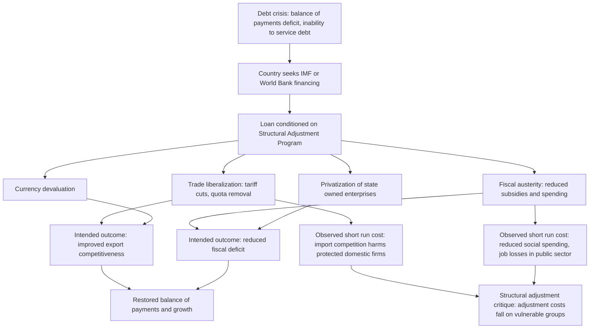

## Trade Liberalization and Structural Adjustment Programs

### Definition and Core Concept

Trade liberalization refers to the reduction or elimination of government-imposed barriers to international trade — tariffs, quotas, non-tariff barriers, and exchange controls — with the aim of allowing market forces and comparative advantage to determine trade flows. Structural Adjustment Programs (SAPs) are broader packages of policy reforms, typically conditioned on loans from the International Monetary Fund (IMF) and World Bank, that bundle trade liberalization together with fiscal austerity, privatization of state-owned enterprises, deregulation, and exchange rate reform. SAPs emerged as the dominant policy vehicle through which many developing countries liberalized trade during the 1980s and 1990s, making the two concepts historically and institutionally intertwined even though trade liberalization can, in principle, occur independently of an IMF/World Bank program.

### Historical Origins and Context

**Key Points**

- Rose to prominence following the developing-world debt crisis triggered by Mexico's 1982 default
- Institutionalized through IMF/World Bank lending conditionality beginning in the early 1980s
- Ideologically associated with the "Washington Consensus," a term coined by economist John Williamson in 1989 to describe the set of policy prescriptions favored by Washington-based institutions

The debt crisis context is essential to understanding SAPs: countries that had borrowed heavily in the 1970s (often to finance ISI-style industrialization or to absorb oil-price shocks) faced a sudden inability to service debt when US interest rates rose sharply in the early 1980s (the "Volcker shock"). The IMF and World Bank offered new lending, but conditioned it on recipient governments adopting a package of market-oriented reforms intended to restore macroeconomic stability and long-run growth capacity. Trade liberalization was one pillar among several, justified on the grounds that protected, ISI-oriented economies had become inefficient and uncompetitive, contributing to the balance-of-payments pressures that produced the crisis in the first place.

### Components of a Typical Structural Adjustment Program

**Key Points**

SAPs generally bundled reforms across several policy domains simultaneously, on the theory that partial reform (e.g., trade liberalization without fiscal discipline) would fail or produce macroeconomic instability:

- **Trade liberalization**: tariff reduction, quota removal, unification of multiple exchange rates, reduced non-tariff barriers
- **Fiscal austerity**: reduced government spending, reduced subsidies (including on food and fuel), tax reform to broaden revenue base
- **Privatization**: sale of state-owned enterprises (SOEs) to private investors, on the premise that SOEs were poorly managed and fiscally burdensome
- **Deregulation**: removal of price controls, labor market deregulation, financial sector liberalization
- **Exchange rate reform**: devaluation to correct overvalued currencies and restore export competitiveness
- **Monetary tightening**: reduced money supply growth to control inflation

### The "Washington Consensus" Policy List

Williamson's original 1989 formulation listed ten specific policy areas, later expanded and contested in subsequent debate:

1. Fiscal discipline
2. Redirection of public spending toward high-return, pro-poor sectors (health, education, infrastructure)
3. Tax reform (broadening the base, moderating marginal rates)
4. Interest rate liberalization
5. Competitive (market-determined) exchange rates
6. Trade liberalization
7. Openness to foreign direct investment
8. Privatization of state enterprises
9. Deregulation (abolition of barriers to entry/exit)
10. Secure property rights

[Unverified: Williamson himself later noted that the term "Washington Consensus" was frequently used by critics to describe a more rigid, ideologically neoliberal package than his original formulation intended, and disputed some characterizations of his list as advocating unconditional market fundamentalism.]

### Theoretical Rationale for Trade Liberalization Within SAPs

The economic logic draws on standard comparative advantage and efficiency arguments (see Ricardian and Heckscher-Ohlin trade theory), extended with a macroeconomic stabilization rationale specific to the debt-crisis context:

$$\text{Overvalued exchange rate} + \text{high tariffs} \implies \text{anti-export bias} \implies \text{persistent trade deficits} \implies \text{debt accumulation}$$

By correcting the exchange rate and reducing tariffs simultaneously, the theory held that a country could restore export competitiveness, generate foreign exchange to service debt, and reallocate resources from inefficient protected sectors toward internationally competitive ones — effectively transitioning economies from an ISI orientation toward an EOI-style orientation as part of the same reform package.

### Diagram: Structural Adjustment Program Logic Chain (svg_diagram)

### Sequencing Debates

A major technical debate within trade liberalization concerns the **order and pace** of reform:

- **"Big bang" / shock therapy approach**: implement liberalization across all fronts rapidly and simultaneously, on the theory that gradual reform allows entrenched interests time to organize resistance, and that policy credibility requires visible, irreversible commitment
- **Gradualist / sequenced approach**: liberalize incrementally, often starting with macroeconomic stabilization (reducing inflation, correcting exchange rate misalignment) before trade liberalization, and liberalizing trade before full capital account liberalization

The influential **McKinnon-Shaw sequencing framework** (building on financial liberalization theory) argued for a specific order: macroeconomic stabilization first, then domestic financial sector liberalization, then trade liberalization, with capital account liberalization (allowing free international capital flows) last — on the grounds that liberalizing capital flows before domestic institutions and trade sectors have adjusted risks destabilizing capital flight or asset bubbles. [Inference: the empirical validation of strict sequencing rules is mixed, and several successful liberalizers did not follow the theoretically prescribed order precisely, suggesting country-specific institutional context matters as much as sequence per se.]

### Worked Example: Tariff Liberalization and Adjustment Costs

Consider a domestic textile industry protected by a 40% tariff, employing 200,000 workers, with domestic production costs of $15/unit against a world price of $10/unit. Under an SAP-mandated tariff reduction to 10% over three years:

- **Static efficiency gain**: consumers pay closer to the $10 world price rather than the tariff-inflated ~$14 price, generating a calculable consumer surplus gain and reducing the deadweight loss triangle associated with the original 40% tariff
- **Short-run adjustment cost**: domestic firms unable to reduce costs to $11 (competitive at 10% tariff) face closure or must shed labor; if 60% of the workforce cannot be absorbed into expanding export sectors within the transition period, this represents a real transitional unemployment cost not captured in static trade models
- **Net welfare calculation**: the standard trade-theoretic prediction is that aggregate welfare rises (consumer gains exceed producer/worker losses), but this aggregate gain says nothing about the *distribution* of gains and losses — a technical point central to the political and social critique of SAPs

$$\Delta W = \Delta CS + \Delta PS + \Delta \text{Government Revenue}$$

where $\Delta CS$ (consumer surplus) typically rises, $\Delta PS$ (producer surplus in the protected sector) falls, and tariff revenue $\Delta \text{Government Revenue}$ also falls — the standard result is $\Delta W > 0$ in aggregate under most models, but the concentrated losses to specific groups (protected-sector workers) versus diffuse gains to consumers generates the classic political economy of trade policy resistance.

### Empirical Track Record and Outcomes

**Key Points**

- Results across SAP-implementing countries were highly heterogeneous — some economies (Chile, later Ghana in specific periods) are cited as relative success cases, while others (much of Sub-Saharan Africa in the 1980s–90s, several Latin American economies) experienced prolonged stagnation, deindustrialization, and rising poverty during the adjustment period
- Africa's experience under SAPs during the 1980s–90s is widely cited in the development economics literature as producing disappointing growth outcomes relative to program design expectations, feeding into the broader critique literature (e.g., UNICEF's *Adjustment with a Human Face*, 1987)
- The mixed track record contributed directly to a subsequent shift in World Bank/IMF policy design toward "second-generation reforms" emphasizing institutions, governance, and poverty-focused safeguards (post-2000, via Poverty Reduction Strategy Papers, PRSPs)

[Inference: attributing specific growth or poverty outcomes causally to SAP trade liberalization components, as opposed to concurrent fiscal austerity, external terms-of-trade shocks, or pre-existing structural weaknesses, remains a genuinely contested empirical question in the development economics literature, and cross-country studies have reached differing conclusions depending on methodology and country sample.]

### Major Critiques

**Social and Distributional Critique**

- Fiscal austerity components (reduced health, education, and food subsidy spending) imposed disproportionate costs on poor and vulnerable populations, a critique crystallized in the "human face" literature of the late 1980s
- Trade liberalization's adjustment costs (job losses in previously protected sectors) often fell on workers with limited capacity to retrain or relocate into expanding export sectors, particularly where those export sectors required different skills or were geographically concentrated

**Sovereignty and Conditionality Critique**

- Loan conditionality was criticized as compromising the policy autonomy of borrowing governments, effectively transferring significant domestic economic policy authority to international financial institutions
- Critics (including economists such as Joseph Stiglitz, in *Globalization and Its Discontents*, 2002) argued the IMF applied a relatively uniform policy template across highly heterogeneous country contexts without sufficient attention to local institutional conditions

**Sequencing and Design Critique**

- Simultaneous liberalization across multiple fronts (trade, capital account, domestic finance) without adequate institutional safeguards was linked to several financial crises, most notably contributing to conditions surrounding aspects of the 1994 Mexican peso crisis and the 1997–98 Asian Financial Crisis, where premature capital account liberalization is widely cited as a contributing factor [Inference: the relative causal weight of capital account liberalization versus other factors, such as currency-maturity mismatches in private borrowing, in triggering these specific crises remains debated among economists]
- Critics argued for greater "policy space" for developing countries to sequence reforms according to their own institutional readiness rather than a standardized template

**Effectiveness Critique**

- Some economists (e.g., Dani Rodrik) argued that the empirical growth benefits of trade liberalization specifically, isolated from the other bundled SAP components, were weaker and more context-dependent than proponents claimed, and that successful liberalizers (notably China and Vietnam) often liberalized gradually and selectively rather than following the standard SAP template

### From SAPs to Poverty Reduction Strategies

**Key Points**

- By the late 1990s, sustained criticism prompted the IMF and World Bank to formally replace SAPs with **Poverty Reduction Strategy Papers (PRSPs)** beginning in 1999
- PRSPs nominally emphasized country ownership of reform design, explicit poverty-reduction targeting, and broader stakeholder consultation, while retaining many underlying market-oriented policy elements
- The **Heavily Indebted Poor Countries (HIPC) Initiative** and later the **Multilateral Debt Relief Initiative (MDRI)** linked debt relief to PRSP adoption, continuing a form of policy conditionality under a different institutional label

[Inference: whether PRSPs represented a substantive break from SAP-era conditionality or primarily a rebranding with continued underlying policy content is a matter of ongoing scholarly debate rather than settled consensus.]

### Conclusion

Trade liberalization within structural adjustment programs represents one of the most consequential and contested policy experiments in modern development economics — a large-scale test of the proposition that removing trade barriers and correcting macroeconomic imbalances would restore growth in debt-distressed economies. The theoretical case for liberalization's efficiency gains is well established in trade theory; the empirical and political record of SAP implementation reveals that the *distribution* of adjustment costs, the *sequencing* of complementary reforms, and *country-specific institutional context* mattered as much as the direction of reform itself. The shift from SAPs to PRSPs reflects institutional learning from this record, though debate continues over how substantively policy content changed alongside the change in framing.

**Related Topics**

- Import-substitution industrialization (ISI)
- Export-oriented industrialization strategies
- The Washington Consensus (Williamson) and its critiques
- IMF conditionality and loan design
- McKinnon-Shaw financial liberalization sequencing
- The 1997–98 Asian Financial Crisis
- Poverty Reduction Strategy Papers (PRSPs)
- Heavily Indebted Poor Countries (HIPC) Initiative
- Exchange rate regimes and devaluation
- Joseph Stiglitz's critique of IMF policy design