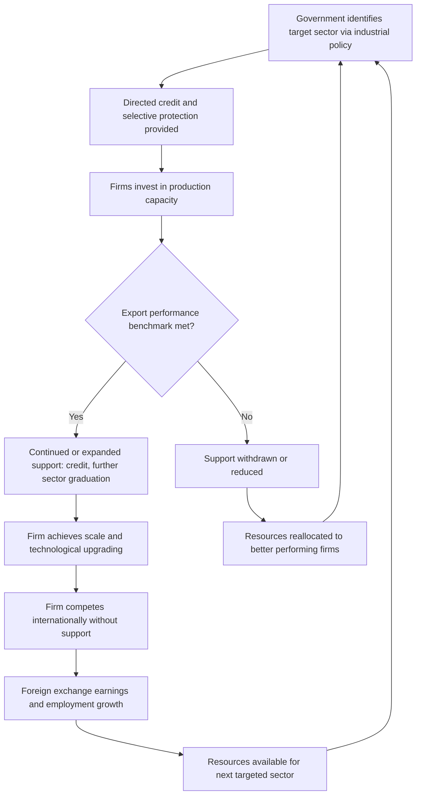

## Industrial Policy and Trade in East Asia

### Definition and Core Concept

Industrial policy refers to deliberate government action — beyond general macroeconomic management — to shape the sectoral composition of an economy, typically by favoring specific industries deemed strategically important for growth, technological upgrading, or export competitiveness. East Asian industrial policy refers specifically to the distinctive set of state interventions used by Japan, South Korea, Taiwan, and later Singapore and China, which combined selective sectoral targeting with export discipline in a way that produced sustained high growth from roughly the 1950s (Japan) through the 1990s (South Korea, Taiwan) and continuing today in China's evolving model. This experience became the central empirical battleground in development economics over whether the state can successfully "pick winners" and accelerate industrialization beyond what market forces alone would produce.

### Historical Overview by Country

**Key Points**

- **Japan (1950s–1980s)**: pioneered the model via the Ministry of International Trade and Industry (MITI), targeting steel, shipbuilding, automobiles, and later semiconductors and electronics through coordinated credit allocation, import protection during the developmental phase, and close government-business coordination (often termed "Japan Inc.")
- **South Korea (1960s–1980s)**: under President Park Chung-hee, pursued aggressive sectoral targeting through five-year economic plans, directing subsidized credit to large conglomerates (chaebols such as Samsung, Hyundai, LG) conditional on export performance
- **Taiwan (1950s–1980s)**: combined state-owned enterprises in upstream sectors (steel, petrochemicals) with a vibrant small-and-medium-enterprise export sector, coordinated through the Industrial Technology Research Institute (ITRI) and targeted credit
- **Singapore (1960s–present)**: relied more heavily on attracting multinational FDI into targeted sectors (electronics, petrochemicals, later finance and biotech) via the Economic Development Board (EDB), rather than building large domestic conglomerates
- **China (1980s–present)**: blended SEZ-based export platforms, state-owned enterprise reform, targeted industrial catalogues (e.g., "Made in China 2025"), and technology transfer requirements attached to FDI approval

### The "Developmental State" Concept

**Key Points**

- The unifying theoretical concept across these cases is the **developmental state**, a term coined by political scientist Chalmers Johnson in his 1982 study of Japan's MITI
- A developmental state is characterized by: a competent, relatively insulated economic bureaucracy; close but disciplined coordination with private business; a priority on production and export growth over pure market efficiency in the short run; and the capacity to withdraw support from underperforming firms
- Contrasted with a pure "regulatory state" (associated with Anglo-American economies), which limits itself to correcting market failures rather than actively directing sectoral development

Political economist Robert Wade extended this analysis in *Governing the Market* (1990), examining Taiwan specifically, and argued that the state's role was not merely to "get prices right" (the market-friendly framing) but sometimes deliberately to "get prices wrong" in strategic ways — such as subsidized credit for targeted sectors — in order to accelerate investment and learning beyond what market-determined prices would generate. [Inference: the precise degree to which "getting prices wrong" caused superior outcomes versus coincided with other favorable factors (high savings rates, land reform, US Cold War aid and market access) remains a central point of contested interpretation in the literature.]

### Core Policy Instruments

**Financial Sector Direction**

- State-influenced or state-owned banking systems allocated credit preferentially to targeted industries, often at below-market interest rates
- "Financial repression" — controlled interest rates and directed lending — channeled national savings toward priority industrial investment rather than allowing fully market-determined capital allocation

**Trade and Exchange Rate Policy**

- Selective import protection for targeted sectors during early development, combined with export promotion for the same or related sectors once export-ready — a hybrid rather than pure ISI or pure EOI approach
- Managed or periodically adjusted exchange rates to maintain export competitiveness

**Performance-Based Discipline**

- Crucially, support was frequently tied to measurable performance benchmarks — particularly **export performance** — creating a market-discipline mechanism absent in many failed ISI experiments elsewhere. Firms that failed to meet export targets could lose access to subsidized credit or protection
- This performance-linked conditionality is frequently cited by economists (including World Bank analyses) as the key structural difference between East Asian industrial policy and less successful industrial policy attempts in Latin America and South Asia during the same period

**Technology and Human Capital Policy**

- Heavy public investment in education (particularly technical and engineering education)
- Government-coordinated technology transfer arrangements, licensing agreements, and (in Korea and Taiwan) reverse engineering of foreign technology during early industrialization phases
- Public research institutes (Taiwan's ITRI, Korea's KIST) bridging basic research and commercial application

### Diagram: East Asian Developmental State Policy Loop (svg_diagram)

### The World Bank's "East Asian Miracle" Report and Its Reception

The World Bank's 1993 report *The East Asian Miracle* represented an influential and somewhat contested attempt by a mainstream market-oriented institution to account for the region's growth. The report's key conclusions:

- Acknowledged that industrial policy interventions (directed credit, selective protection) occurred extensively across the region
- Argued that the interventions' success depended on unusually disciplined implementation — particularly export-performance conditionality — that is difficult to replicate in weaker institutional contexts
- Emphasized that "market-friendly" fundamentals (high savings and investment rates, substantial investment in education, macroeconomic stability, openness to foreign technology) were necessary complements to, and arguably more important than, the selective industrial policy interventions themselves

**Key Points**

- Critics — notably Robert Wade and Alice Amsden (in her 1989 study of Korea, *Asia's Next Giant*) — argued the report understated the causal contribution of deliberate government intervention, framing successful sectoral targeting as incidental to fundamentally sound macroeconomic and market policy, when in their view the targeting was itself central to the outcome
- This "market-friendly" versus "developmental state" interpretive divide remains a defining fault line in the industrial policy literature, sometimes summarized as a dispute over whether East Asia succeeded *because of* or *despite* extensive government intervention

### Worked Example: Korea's Heavy and Chemical Industry (HCI) Drive

South Korea's 1973–1979 Heavy and Chemical Industry Drive illustrates both the mechanics and risks of the model. The government directed a large share of total domestic investment credit toward six targeted sectors: steel, non-ferrous metals, shipbuilding, machinery, electronics, and chemicals — sectors chosen for their expected contribution to long-run export competitiveness and industrial linkages rather than short-run comparative advantage.

- **Mechanism**: subsidized long-term loans from state-controlled banks, tax incentives, and tariff protection during the construction and initial operation phase of targeted plants
- **Outcome (positive)**: Korea developed globally competitive steel (POSCO) and shipbuilding (Hyundai Heavy Industries) industries that by the 1980s–90s ranked among world leaders by output and later by technological sophistication
- **Outcome (negative/costly)**: the drive also produced significant over-investment and excess capacity in some targeted sectors, contributed to inflationary pressure, and required a subsequent macroeconomic stabilization program in the early 1980s to correct imbalances

[Unverified: precise quantitative figures on the share of national credit or investment directed to HCI sectors during this period vary somewhat across sources and should be checked against primary Korean government or Bank of Korea historical data for exact figures.]

This example is frequently used pedagogically to illustrate that even the most-cited "successful" cases of East Asian industrial policy involved real costs, misallocation risk, and required subsequent correction — success was not unambiguous or costless even within the paradigm case.

### Critiques and Limitations

**Replicability Critique**

- The specific historical conditions supporting East Asian industrial policy — Cold War geopolitical alignment generating preferential US market access and aid (particularly for Korea and Taiwan), relatively high pre-existing human capital and land reform equalizing initial conditions, disciplined and relatively insulated bureaucracies — are difficult for other developing regions to replicate
- Attempts to apply similar industrial policy templates in Latin America, South Asia, and Sub-Saharan Africa during the same era frequently failed to achieve comparable outcomes, often producing entrenched rent-seeking rather than performance-disciplined firm behavior — suggesting institutional quality and implementation discipline, not the policy template alone, were decisive

**WTO-Era Legal Constraint**

- Many classic East Asian tools — direct export subsidies, local content requirements, preferential domestic credit tied to export performance — are now restricted under WTO rules (the SCM and TRIMs Agreements) for current WTO members, narrowing the policy space available to industrializing economies today compared to that available to Korea and Taiwan in the 1960s–80s

**Governance and Rent-Seeking Risk**

- Close government-business coordination carries an inherent risk of cronyism if not disciplined by genuine performance benchmarks — a risk realized in some East Asian cases (contributing factors in aspects of the 1997 Asian Financial Crisis have been linked by some analysts to overextended, politically connected corporate borrowing) and far more severely realized in industrial policy attempts elsewhere lacking equivalent discipline

**Market Distortion Critique**

- Standard trade economists (in the Bhagwati tradition) maintain that even successful sectoral targeting likely generated static efficiency losses relative to an undistorted market allocation, and that the dynamic gains, while real, are difficult to measure precisely against a counterfactual of what growth would have occurred under a less interventionist policy regime

### Contemporary Relevance: China and the Renewed Industrial Policy Debate

China's contemporary industrial policy — including sector-specific catalogues such as "Made in China 2025," targeted subsidies for semiconductors and electric vehicles, and continued state-owned enterprise involvement in strategic sectors — has revived the developmental-state debate in a new geopolitical context, generating substantial international trade friction (including US and EU responses involving tariffs and export controls on advanced technology). [Speculation: whether China's current industrial policy will replicate the earlier East Asian pattern of eventual graduation to unsubsidized international competitiveness, or will instead produce prolonged reliance on state support amid intensifying great-power trade conflict, remains an open and actively debated question among trade economists and policy analysts.]

### Conclusion

East Asian industrial policy represents the empirical core of the broader debate over whether selective state intervention can accelerate industrialization beyond market-driven outcomes. The evidence suggests that where such intervention was combined with genuine performance discipline (particularly export-performance conditionality), complementary investment in human capital, and relatively capable, insulated bureaucracies, substantial and sustained growth resulted — though even successful cases involved real costs, occasional excess, and later correction. The far more common global experience — industrial policy without equivalent discipline — has produced weaker or negative results, suggesting that the East Asian outcome reflects a specific and demanding institutional configuration rather than a simple, freely transferable policy template.

**Related Topics**

- The developmental state (Chalmers Johnson, Robert Wade)
- Export-oriented industrialization strategies
- Infant industry protection and its critiques
- The World Bank's East Asian Miracle report and its critics
- The 1997–98 Asian Financial Crisis
- Financial repression and directed credit
- WTO Agreement on Subsidies and Countervailing Measures (SCM)
- China's contemporary industrial policy ("Made in China 2025")
- Alice Amsden's "Asia's Next Giant"
- Rent-seeking and cronyism risk in state-directed development