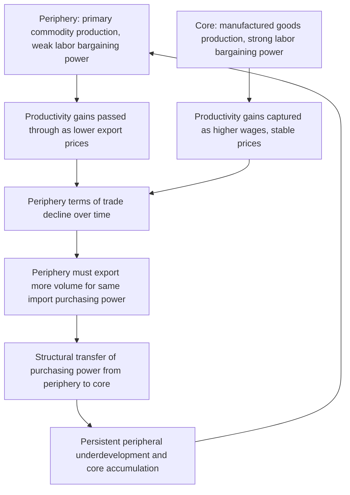

## Dependency Theory and Unequal Exchange Debates

### Definition and Core Concept

Dependency theory is a body of development economics thought holding that the underdevelopment of poorer "peripheral" countries is not simply an earlier stage on a common path toward the development already achieved by richer "core" countries, but is instead actively produced and perpetuated by the structural relationship between core and periphery within the world economic system. Unequal exchange theory is a closely related and more technically specific claim: that international trade between rich and poor countries systematically transfers value from the periphery to the core, even when trade appears to follow standard market pricing, because of underlying asymmetries in wages, productivity, and bargaining power embedded in the terms of trade.

Together, these frameworks constitute the major structuralist and Marxist-influenced challenge to the mainstream (neoclassical) view that free trade based on comparative advantage benefits all trading partners, reframing the international trading system itself as a mechanism of exploitation rather than mutual gain.

### Historical Origins and Key Theorists

**Key Points**

- Emerged primarily from Latin American structuralist economics in the 1950s, centered at the UN Economic Commission for Latin America (ECLA/CEPAL)
- **Raúl Prebisch** (Argentine economist, first Secretary-General of UNCTAD) and **Hans Singer** independently developed the foundational **Prebisch-Singer hypothesis** in the late 1940s–1950s
- **Andre Gunder Frank** extended the framework into an explicitly Marxist "development of underdevelopment" thesis in the 1960s
- **Immanuel Wallerstein** generalized dependency insights into **World-Systems Theory** in the 1970s, framing the global economy as a single integrated system with core, periphery, and semi-periphery zones
- **Arghiri Emmanuel** formalized the specific mechanics of "unequal exchange" in his 1972 work of that title

### The Prebisch-Singer Hypothesis

**Core Claim**

The Prebisch-Singer hypothesis holds that the **net barter terms of trade** for primary commodity-exporting countries exhibit a long-run secular tendency to decline relative to manufactured goods exporters, meaning peripheral countries must export an increasing quantity of raw materials over time to purchase the same quantity of manufactured imports.

$$\text{Terms of Trade} = \frac{P_{exports}}{P_{imports}} \times 100$$

A declining terms-of-trade trend means peripheral, primary-commodity-exporting economies experience a persistent transfer of purchasing power to core, manufacturing-exporting economies through the ordinary functioning of trade prices, independent of any formal coercion.

**Proposed Mechanisms**

- **Income elasticity asymmetry (Engel's Law effects)**: as global income rises, demand for manufactured goods and services rises more than proportionally, while demand for primary commodities (food, raw materials) rises less than proportionally — shifting relative prices against commodity exporters over time
- **Labor market asymmetry**: in core countries, productivity gains in manufacturing are captured by workers through higher wages (due to stronger labor organization and less labor market slack), keeping manufactured goods prices relatively stable even as productivity rises; in peripheral commodity sectors, productivity gains are passed through as lower prices rather than higher wages, due to weaker labor bargaining power and abundant labor supply
- **Market structure asymmetry**: manufactured goods markets in the core are more oligopolistic (allowing price administration), while primary commodity markets are more competitive (forcing full pass-through of productivity gains into lower prices)

### Formalizing Unequal Exchange (Emmanuel's Framework)

Emmanuel's technical contribution reframed the terms-of-trade problem in explicitly Marxist value-theoretic terms. In a simplified presentation:

- If wages in the core are substantially higher than wages in the periphery for comparable labor productivity/intensity, and if capital is internationally mobile (equalizing profit rates globally) while labor is not (preventing wage equalization), then the relative prices of goods produced with core labor will be bid up relative to goods produced with peripheral labor, independent of underlying labor-time content
- This produces a hidden transfer: peripheral countries must embody more labor-time in their exports to receive the same amount of value embodied in core-country imports

$$\text{Unequal exchange transfer} \propto (\text{Wage}_{core} - \text{Wage}_{periphery}) \times \text{Labor content of exports}$$

[Inference: Emmanuel's framework rests on Marxist labor-value theoretic assumptions that are not universally accepted even among heterodox economists, and the empirical measurement of "labor-time transferred" involves significant methodological difficulties that limit consensus on its magnitude.]

### Diagram: Core-Periphery Value Transfer Mechanism (svg_diagram)

### Frank's "Development of Underdevelopment" Thesis

Andre Gunder Frank's 1966 essay argued a stronger and more explicitly political claim than the Prebisch-Singer terms-of-trade mechanism alone: that underdevelopment in Latin America was not a residual, pre-modern condition but was itself *actively generated* by centuries of integration into the world capitalist system through colonialism and continued core-periphery trade relations. In this framing, the periphery's poverty and the core's wealth are two outcomes of the same historical process, not independent trajectories at different stages.

**Key Points**

- Frank's thesis implied that peripheral countries could only escape underdevelopment by substantially delinking from the core-dominated world economy, rather than by "catching up" through further integration — a conclusion sharply opposed to mainstream trade theory's integration-based growth prescriptions
- This delinking prescription provided part of the intellectual foundation for import-substitution industrialization (ISI) policies pursued across Latin America from the 1950s–1970s, since ECLA/CEPAL structuralism (Prebisch's own institutional home) directly informed Latin American industrial policy

### World-Systems Theory (Wallerstein)

Wallerstein's extension reframed the core-periphery relationship as a single integrated **world-system** rather than a set of separate national economies trading with one another, introducing a three-tier structure:

- **Core**: capital-intensive, high-wage, technologically advanced production; captures disproportionate share of system-wide surplus
- **Periphery**: labor-intensive, low-wage, primary/raw-material production; surplus extracted toward the core
- **Semi-periphery**: an intermediate zone (historically including countries like Brazil, and later cited in discussions of newly industrializing economies) that both exploits peripheral relationships and is exploited by core relationships, and which can serve as a zone of potential upward or downward mobility within the system over long historical time frames

[Unverified: precise classification of individual countries into core, periphery, or semi-periphery categories varies across analysts and time periods, and Wallerstein's own historical case selections have been contested by other historians on evidentiary grounds.]

### Worked Example: Illustrating Terms-of-Trade Decline

Consider a stylized two-country model: Country P (periphery) exports coffee; Country C (core) exports machinery. In year 1, one unit of machinery trades for 10 units of coffee. Suppose over 20 years, machinery productivity rises 50% but core wages also rise 50% (fully absorbing productivity gains, per the labor-bargaining-power mechanism), while coffee productivity also rises 50% but coffee prices fall by 30% (because peripheral labor cannot capture the gains as higher wages, per Prebisch-Singer).

By year 20, machinery's price is roughly unchanged (productivity gain offset by wage gain), while coffee's price has fallen 30%. The new exchange ratio requires Country P to export approximately 14.3 units of coffee for the same unit of machinery ($10 / 0.7 \approx 14.3$) — a 43% deterioration in the coffee-exporting country's terms of trade despite equal underlying productivity growth in both sectors. This illustrates the hypothesis's core mechanism: identical productivity growth does not translate into identical price/wage outcomes when labor market structures and bargaining power differ systematically between core and periphery.

### Major Critiques

**Empirical Critiques of the Terms-of-Trade Decline**

- Economic historians and mainstream trade economists have long disputed the empirical robustness of a genuine long-run secular decline in commodity terms of trade, noting that the original Prebisch-Singer evidence relied heavily on UK terms-of-trade data (1870s–1930s) that may not generalize globally or across other periods
- Commodity price series are highly volatile and cyclical (especially around commodity "supercycles"), making it statistically difficult to distinguish a genuine long-run secular trend from cyclical fluctuation, particularly over the relatively short data periods available when the hypothesis was first proposed
- Quality improvements and changing composition within "manufactured goods" and "commodities" categories over long time periods complicate like-for-like price comparison
- [Inference: subsequent econometric re-examinations of the Prebisch-Singer hypothesis using longer historical price series have produced mixed results, with some studies finding partial support for specific commodity categories and periods and others finding no robust long-run trend, such that the hypothesis's empirical status remains genuinely unsettled in the literature rather than either confirmed or refuted.]

**Theoretical Critiques from Mainstream Trade Economics**

- Neoclassical economists argue that even if terms of trade decline, this does not necessarily mean peripheral countries are worse off from trading than from not trading — comparative advantage gains can still exceed losses from terms-of-trade deterioration, an analytical distinction dependency theorists are accused of collapsing
- Critics argue dependency theory conflates *relative* income gaps (core growing faster than periphery) with *absolute* immiseration (periphery becoming worse off in absolute terms), when historical evidence shows many "peripheral" economies achieved substantial absolute income growth even while relative gaps with the core persisted or widened

**The East Asian Counter-Example**

- The most frequently cited empirical challenge to dependency theory is the East Asian experience: South Korea, Taiwan, Singapore, and Hong Kong achieved rapid sustained development precisely through deep integration into core-dominated world trade and investment networks (via export-oriented industrialization) rather than through delinking, directly contradicting Frank's central policy prescription
- Dependency theorists have offered various responses — arguing East Asia's Cold War geopolitical position provided atypical core support unavailable to other peripheral regions, or that East Asian states exercised unusually strong bargaining leverage over multinational capital relative to typical peripheral states — but these responses are contested as post-hoc rather than derived from the original theoretical framework [Inference: whether these defenses adequately preserve the theory's general applicability or represent ad hoc exceptions that undermine its universal claims is a matter of ongoing scholarly dispute rather than settled agreement.]

**Political Economy Critique**

- Critics note that ISI policies informed by dependency-theoretic delinking prescriptions were implemented extensively across Latin America and, empirically, produced disappointing long-run growth outcomes relative to the East Asian EOI alternative, weakening confidence in the policy prescriptions dependency theory generated even among some scholars sympathetic to its structural diagnosis

### Contemporary Relevance and Legacy

**Key Points**

- Pure dependency theory has substantially declined in mainstream development economics influence since the 1980s–90s, displaced by both the East Asian counter-evidence and the broader shift toward market-oriented and institutional economics
- Elements of the structural critique persist in contemporary heterodox economics — particularly in analyses of global value chains, where "upgrading" versus being locked into low-value-added segments of production networks echoes core-periphery dynamics in updated form
- Concerns about unequal bargaining power between multinational corporations and developing-country host governments (over tax treatment, technology transfer, labor standards) remain active policy topics that draw conceptually on dependency-theoretic insights, even without full theoretical adoption of the original framework
- The Prebisch-Singer hypothesis's institutional legacy persists through UNCTAD, which Prebisch helped establish and which continues to advocate for developing-country interests in the international trading system

### Conclusion

Dependency theory and unequal exchange frameworks posed a fundamental structural challenge to mainstream trade theory's presumption of mutual gains from trade, correctly highlighting real asymmetries in bargaining power, market structure, and historical relationships between rich and poor countries. However, the empirical record — particularly the terms-of-trade evidence's unsettled status and the striking counter-example of East Asian integration-based development — has left the theory's strongest claims (secular terms-of-trade decline, delinking as the necessary path to development) without robust support, while softer structural insights about bargaining power and value-chain positioning continue to inform contemporary heterodox development economics.

**Related Topics**

- Prebisch-Singer hypothesis and terms-of-trade measurement
- Import-substitution industrialization (ISI)
- Export-oriented industrialization strategies
- World-Systems Theory (Wallerstein)
- Global value chains and value-chain upgrading
- UNCTAD's role in international trade governance
- Arghiri Emmanuel's unequal exchange formalization
- The East Asian Miracle debate as counter-evidence
- Commodity price supercycles
- Structuralist economics and ECLA/CEPAL