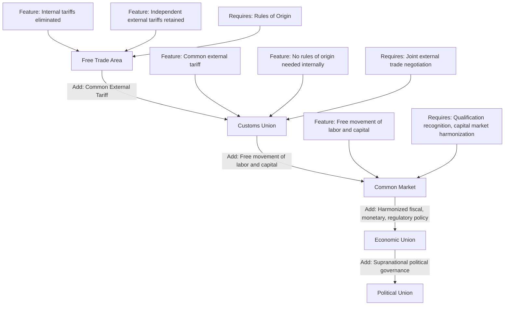

## Free Trade Areas, Customs Unions, and Common Markets

### Definition and Core Concept

Free trade areas, customs unions, and common markets are successive stages in Béla Balassa's classic taxonomy of regional economic integration (1961), each representing a deeper degree of economic and policy integration among member countries than the last. All three involve the elimination of trade barriers among member states, but they differ in how they treat trade with non-members and in how far integration extends beyond goods markets into factor markets and policy coordination. Understanding this taxonomy is foundational to analyzing preferential trade agreements (PTAs) and regional trade blocs such as the EU, NAFTA/USMCA, ASEAN, and Mercosur.

### The Balassa Stages of Integration

**Key Points**

Balassa identified five sequential stages, of which the first three are the focus here:

1. **Free Trade Area (FTA)**: member countries eliminate tariffs and quotas on trade *among themselves*, but each member retains its own independent external tariff schedule toward non-member countries
2. **Customs Union (CU)**: adds to an FTA a **Common External Tariff (CET)** — all members apply the same tariff schedule to imports from non-member countries, requiring harmonized external trade policy
3. **Common Market (CM)**: adds to a customs union the free movement of factors of production — labor and capital — across member borders, in addition to free movement of goods
4. **Economic Union**: adds coordination or harmonization of broader economic policies (fiscal policy, regulatory standards, sometimes a common currency)
5. **Complete/Political Economic Union**: full unification of economic and political institutions, including supranational governance authority

### Free Trade Area: Structure and Mechanics

**Defining Feature**: Internal tariff elimination combined with retained national external tariff autonomy.

Because each member keeps its own external tariff, an FTA requires a mechanism to prevent **trade deflection** — the practice of importing a good into the FTA member with the lowest external tariff, then re-exporting it tariff-free to a higher-tariff member. This is addressed through **rules of origin (ROO)**, which specify the minimum domestic/regional value-added or processing required for a good to qualify for the FTA's internal tariff-free treatment.

$$\text{Regional Value Content} = \frac{\text{Value of regional inputs}}{\text{Total value of the good}} \times 100\% \geq \text{ROO threshold}$$

**Key Points**

- Rules of origin add administrative and compliance costs (certification, customs verification) not present under a common external tariff
- Complex or restrictive ROOs can themselves become a form of protectionism, favoring firms with existing regional supply chains over new entrants
- Examples: NAFTA/USMCA (with especially detailed automotive-sector ROOs), EFTA (European Free Trade Association), ASEAN Free Trade Area (AFTA)

### Customs Union: Structure and Mechanics

**Defining Feature**: Common External Tariff eliminates the need for rules of origin on intra-union trade (since all members apply identical tariffs to the outside world, trade deflection incentives disappear), but requires members to surrender independent external trade policy authority.

**Key Points**

- Members must negotiate the CET jointly and cannot independently set tariffs with third countries, meaning individual members lose the ability to conduct their own bilateral trade negotiations with non-members
- Requires a mechanism for distributing tariff revenue collected at the union's external border among members (since a good entering through any member's port faces the same tariff and may be consumed elsewhere in the union)
- Examples: the EU's customs union component (distinct from and preceding its deeper common-market and economic-union features), Mercosur (Southern Common Market: Argentina, Brazil, Paraguay, Uruguay), the Southern African Customs Union (SACU)

### Common Market: Structure and Mechanics

**Defining Feature**: Adds free movement of factors of production (labor and capital) to the customs union's free movement of goods.

**Key Points**

- Requires harmonization or mutual recognition of far more policy areas than trade in goods alone: professional qualification recognition (allowing workers to practice across borders), capital market regulation, residency and labor market access rights
- The European Union's Single Market (established via the 1986 Single European Act, effective 1993) is the paradigmatic example, guaranteeing the "four freedoms": movement of goods, services, capital, and people
- Common markets face significantly higher political and sovereignty costs than FTAs or customs unions, since free labor mobility touches politically sensitive domestic issues (immigration, wage competition, social service access) beyond pure trade policy

### Diagram: Balassa Stages of Integration (svg_diagram)

### Comparative Summary Table

| Feature | Free Trade Area | Customs Union | Common Market |
| --- | --- | --- | --- |
| Internal tariffs on goods | Eliminated | Eliminated | Eliminated |
| External tariff policy | Independent per member | Common (CET) | Common (CET) |
| Rules of origin needed | Yes | No | No |
| Free movement of labor | No | No | Yes |
| Free movement of capital | No | No | Yes |
| Independent trade negotiation with third parties | Yes | No | No |
| Example | USMCA, EFTA | Mercosur, SACU | EU Single Market |

### Trade Creation and Trade Diversion (Viner's Framework)

Any preferential arrangement — FTA, customs union, or common market — raises a central analytical question first formalized by economist Jacob Viner (1950): does regional integration increase overall economic welfare, or merely redirect trade in ways that can reduce it?

**Trade Creation**: occurs when a member country shifts consumption from a higher-cost domestic producer to a lower-cost producer *within* the union, made possible by the removal of internal tariffs. This raises overall welfare, since production shifts toward genuinely lower-cost sources.

**Trade Diversion**: occurs when a member country shifts imports from a lower-cost producer *outside* the union to a higher-cost producer *inside* the union, purely because the external tariff makes the outside producer's goods relatively more expensive after the preferential arrangement takes effect. This can reduce overall welfare, since production shifts toward a less efficient source purely due to the artificial preference, not genuine cost advantage.

$$\Delta W_{net} = \Delta W_{trade\ creation} - \Delta W_{trade\ diversion}$$

**Worked Example**

Suppose Country H (home) imports a good, facing a pre-union external tariff of 20% applied uniformly. Three potential suppliers exist:

- Country M (a prospective union partner): production cost $100
- Country W (world/non-member, low-cost): production cost $80
- Domestic production in H: cost $115

Before the union: with the 20% tariff applied to all, Country W's landed price is $80 \times 1.20 = \$96$, still cheaper than domestic production ($115) and cheaper than M's landed price of $100 \times 1.20 = \$120$. Country H imports from W.

After Country H forms an FTA/customs union with M (tariff-free trade with M, 20% tariff retained on W): M's price becomes $100 (no tariff), while W's landed price remains $96 (tariff-inclusive). Country H now imports from M at $100, switching away from the genuinely lower-cost W supplier at $96 — this is **trade diversion**, and it makes Country H (and the world) worse off by the $4 cost difference, despite Country H's consumers technically paying less than before the union relative to what they would have paid buying from M under the old tariff.

Had domestic production instead been the pre-union source (say, domestic cost $115, always more expensive than tariff-inclusive M at $120 and W at $96 before the union, but now cheaper to switch to M's tariff-free $100 rather than producing domestically) — that shift from $115 domestic to $100 M-sourced import would represent **trade creation**, unambiguously welfare-improving.

**Key Points**

- Viner's central insight: preferential trade agreements are not unambiguously welfare-improving even though they involve tariff *reduction*, because a PTA is a departure from full free trade (0% tariffs to all) rather than an approach toward it — the outcome depends on the empirical balance between creation and diversion effects for the specific agreement and goods involved
- Trade diversion is more likely to be significant when the excluded low-cost non-member country's cost advantage over the union partner is large, and when the union's common/retained external tariff is high

### Static versus Dynamic Effects

Beyond Viner's static trade creation/diversion framework, regional integration is also associated with dynamic effects debated in the literature:

- **Economies of scale**: larger unified markets allow firms to achieve production scale unreachable in smaller national markets
- **Increased competition**: removal of internal barriers exposes previously protected domestic firms in each member to competition from partner-country firms, potentially raising productivity
- **Investment attraction**: larger integrated markets may attract more foreign direct investment than the sum of individual national markets would separately
- **Policy lock-in / credibility effects**: binding commitments within a regional agreement can make domestic policy reforms more credible and harder to reverse, an effect frequently cited regarding Eastern European countries' EU accession commitments

[Inference: dynamic effects are generally harder to measure empirically than static trade creation/diversion effects, and their magnitude relative to static effects varies substantially by agreement and is not resolved by a single generalizable empirical finding across the literature.]

### Multilateral versus Preferential Trade: The "Building Block or Stumbling Block" Debate

A long-standing debate in trade policy asks whether regional trade agreements (RTAs) — at any of the FTA/CU/CM stages — support or undermine progress toward global multilateral trade liberalization under the WTO:

- **"Building block" view**: RTAs demonstrate the feasibility and benefits of trade liberalization, build political constituencies for openness, and can serve as stepping stones toward eventual multilateral agreement
- **"Stumbling block" view** (associated particularly with economist Jagdish Bhagwati): the proliferation of overlapping RTAs creates a costly "spaghetti bowl" of differing rules of origin, tariff schedules, and regulatory standards across agreements, increasing compliance complexity for firms, diverting negotiating political capital away from multilateral WTO processes, and potentially entrenching trade diversion effects that a move to genuine multilateral free trade would eliminate

[Inference: empirical resolution of the building-block versus stumbling-block debate is contested and likely context-dependent, since evidence exists supporting both dynamics across different regions and time periods, rather than one view holding unambiguously across all cases studied in the literature.]

### WTO Legal Framework Governing RTAs

**Key Points**

- **GATT Article XXIV** permits FTAs and customs unions as an exception to the WTO's core Most-Favored-Nation (MFN) non-discrimination principle, subject to conditions: the arrangement must eliminate duties on "substantially all" internal trade, and must not raise external barriers against non-members above their pre-agreement level
- In practice, "substantially all trade" and other Article XXIV conditions have been interpreted loosely and are rarely strictly enforced through WTO dispute settlement, contributing to the proliferation of RTAs since the 1990s
- The **Enabling Clause** (1979) provides additional, more flexible legal cover for preferential arrangements among developing countries specifically

### Conclusion

The FTA-customs union-common market taxonomy provides the essential vocabulary for analyzing the depth and mechanics of regional trade agreements, but the taxonomy alone does not resolve the welfare question. Viner's trade creation/trade diversion framework remains the core analytical tool for evaluating whether a specific preferential arrangement, at any integration stage, improves or reduces overall economic welfare relative to both the pre-agreement status quo and to full multilateral free trade. In practice, real-world regional agreements generate both effects simultaneously, and their net welfare impact is an empirical question specific to the goods, tariff levels, and trading partners involved rather than a conclusion derivable from the integration stage classification alone.

**Related Topics**

- Trade creation and trade diversion (Viner)
- Rules of origin design and enforcement
- The European Union as an economic and political union case study
- GATT Article XXIV and WTO legal treatment of RTAs
- The "spaghetti bowl" phenomenon (Bhagwati)
- Regional value chains and preferential trade agreements
- Optimal currency area theory (relevant to monetary union, the stage beyond economic union)
- ASEAN and Mercosur as comparative regional integration cases
- Most-Favored-Nation (MFN) principle in multilateral trade law
- Trade diversion risk in mega-regional agreements (e.g., CPTPP, RCEP)