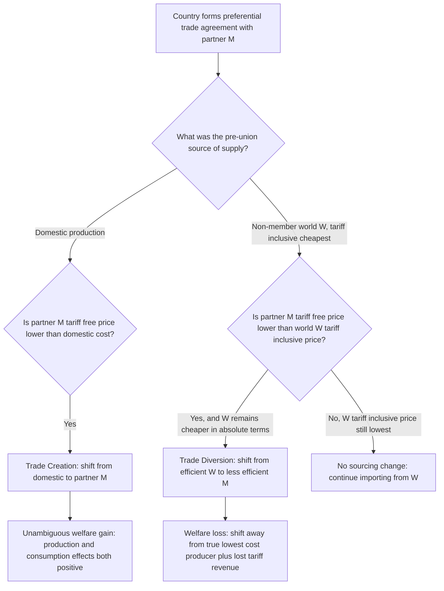

## Trade Creation versus Trade Diversion

### Definition and Core Concept

Trade creation and trade diversion are the two fundamental welfare effects produced when countries form a preferential trade arrangement — a free trade area, customs union, or common market — as formalized by economist Jacob Viner in his 1950 work *The Customs Union Issue*. The framework's central analytical purpose is to answer a question that is not obvious from trade theory alone: since a preferential trade agreement (PTA) is a movement toward zero tariffs *among some countries* while barriers remain against *others*, does this partial liberalization increase or decrease overall economic welfare relative to the pre-agreement situation? Viner's answer was that it depends — a PTA can be welfare-improving or welfare-reducing depending on the empirical balance between two opposing effects it necessarily generates simultaneously.

This framework is foundational to evaluating any regional trade agreement and represents one of the most influential contributions of pure trade theory to real-world trade policy analysis.

### Trade Creation Defined

**Trade creation** occurs when the formation of a preferential trade arrangement causes a member country to shift its consumption of a good from a higher-cost domestic producer to a lower-cost producer *within* the union, made possible by the elimination of the internal tariff. Because production shifts toward a genuinely more efficient source, trade creation unambiguously raises economic welfare — it is equivalent in effect to ordinary, efficiency-improving trade liberalization.

**Key Points**

- Trade creation has two components: a **production effect** (resources shift from inefficient domestic production to more efficient partner-country production) and a **consumption effect** (consumers benefit from lower prices, increasing consumption of the now-cheaper good)
- Both components represent genuine gains: real resources are freed for more productive use, and consumers gain purchasing power
- Trade creation is analytically identical to the standard case for gains from trade under Ricardian/Heckscher-Ohlin comparative advantage — the union simply reveals and exploits a genuine comparative advantage that domestic tariff protection had previously suppressed

### Trade Diversion Defined

**Trade diversion** occurs when the formation of a preferential trade arrangement causes a member country to shift its imports from a lower-cost producer *outside* the union to a higher-cost producer *inside* the union, purely because the preferential tariff treatment makes the outside producer's goods artificially more expensive by comparison after the agreement takes effect — even though the outside producer remains the genuinely more efficient source of supply.

**Key Points**

- Trade diversion represents a pure efficiency loss: production shifts *away* from the lowest-cost global producer toward a less efficient one, purely due to an artificial tariff-driven price distortion rather than any change in underlying production costs
- The consuming country's government also loses tariff revenue that it previously collected on imports from the (now-excluded) low-cost external supplier
- Trade diversion is the reason Viner's analysis overturned the earlier, simpler assumption that any move toward freer trade — including a preferential agreement — must be welfare-improving

### The Analytical Framework

**Setup**: Consider country H (home) importing a good, facing a uniform external tariff $t$ applied to all trading partners before any preferential agreement. Three potential sources exist:

- Domestic production in H, at cost $P_H$
- A prospective union partner M, at cost $P_M$
- The rest of the world (non-member), at cost $P_W$, where $P_W < P_M$ (the outside world is the lowest-cost producer)

**Pre-Union Sourcing Decision**: H imports from whichever source offers the lowest *tariff-inclusive* landed price:

$$\text{Landed price} = P_{source} \times (1 + t)$$

**Post-Union Sourcing Decision**: If H forms a preferential agreement with M (eliminating the tariff on M's goods specifically, while retaining tariff $t$ on W's goods), the comparison becomes:

$$P_M \text{ (tariff-free)} \quad \text{versus} \quad P_W \times (1 + t) \text{ (still tariff-inclusive)}$$

If $P_M < P_W \times (1+t)$ but $P_M > P_W$, the union causes H to switch from W to M — this is trade diversion, since W remains the lower-cost producer in absolute terms ($P_W < P_M$), but the tariff structure makes M appear cheaper after the preferential arrangement.

If, instead, the pre-union comparison had domestic production H as the cheapest tariff-inclusive source (i.e., protection was fully prohibitive, $P_H < P_W \times (1+t)$ and $P_H < P_M \times (1+t)$), and the post-union tariff-free price of M ($P_M$) is now below $P_H$, then H switches from domestic production to M — this is trade creation, since M is a genuinely more efficient producer than H, and the shift represents real resource reallocation toward efficiency.

### Diagram: Trade Creation versus Trade Diversion Decision Logic (svg_diagram)

### Worked Numerical Example

Let the external tariff before the union be $t = 25\%$, applied uniformly to all non-domestic sources. Consider a good with the following production costs:

- Domestic production (Country H): $110
- Prospective partner (Country M): $95
- Rest of world (Country W, the true lowest-cost producer): $80

**Pre-union landed prices** (tariff applied to both M and W, domestic production untaxed):

- Domestic: $110
- M: $95 \times 1.25 = \$118.75$
- W: $80 \times 1.25 = \$100$

Country H currently sources domestically at $110, since it is cheaper than either tariff-inclusive import option.

**Post-union scenario (H forms a preferential agreement with M only)**:

- Domestic: $110 (unchanged)
- M: $95 (tariff eliminated)
- W: $80 \times 1.25 = \$100$ (tariff retained)

Now M's tariff-free price ($95) is the lowest option, so Country H switches from domestic production ($110) to importing from M ($95).

**Welfare decomposition of this switch**:

- Compared to the true world price of $80 (Country W), Country H is now paying $95 — $15 more per unit than the genuinely cheapest global source, which it still does not access due to the retained external tariff
- However, compared to the pre-union domestic cost of $110, Country H is paying $15 *less* per unit than before

This example illustrates a case combining **elements of both effects**: relative to the domestic-production counterfactual, the shift to M looks like trade creation (moving to a lower-cost source, $110 to $95); but relative to the "first-best" counterfactual of full multilateral free trade (in which H would source from W at $80), the outcome reveals $15 of forgone efficiency per unit — because the union grants preference to M rather than to the genuinely lowest-cost global producer, W. Whether the *net* effect of forming the union is welfare-improving depends on the relative magnitudes of the consumption/production gains realized versus the tariff revenue and efficiency losses foregone by not liberalizing multilaterally instead.

[Unverified: real-world quantification of trade creation and trade diversion magnitudes for specific historical trade agreements requires detailed sector-level cost, elasticity, and trade-flow data; published empirical estimates for specific agreements (e.g., NAFTA, the EU's founding) vary across studies depending on methodology, time period, and sector coverage, and should be sourced from the specific empirical literature rather than treated as settled figures.]

### Determinants of Net Welfare Effect

**Key Points**

The likelihood that trade diversion dominates trade creation (making a given PTA welfare-reducing) is theoretically higher when:

- **The pre-union external tariff is high**: a high tariff means substantial protection was suppressing efficient trade with the outside world, making it more likely that the preferential partner — rather than the true lowest-cost producer — ends up capturing the newly opened market
- **The cost gap between the union partner and the excluded low-cost external producer is large**: a bigger gap means a larger absolute efficiency loss when trade is diverted
- **The union partners are not each other's natural, lowest-cost trading partners**: agreements between countries with genuinely complementary comparative advantages are more likely to generate creation; agreements between similar or inefficient producers are more likely to generate diversion
- **The share of trade affected that was previously with non-members (versus domestic production) is large**: trade diversion specifically requires a pre-existing trade relationship with an excluded efficient outside supplier; trade creation specifically requires a pre-existing domestically protected, inefficient production base

Conversely, trade creation is more likely to dominate when the pre-union tariff was already low (limiting the diversion risk, since even tariff-inclusive external prices remain competitive) and when substantial domestically protected inefficient production existed prior to the agreement (providing scope for genuine efficiency-improving reallocation).

### Extensions to the Basic Framework

**Terms-of-Trade Effects**: Viner's original framework focused on production and consumption effects for the country initiating the union; subsequent extensions incorporate terms-of-trade effects on excluded countries — a large union may have enough market power that trade diversion reduces demand for the excluded country's exports sufficiently to depress that country's export prices, creating additional welfare losses for non-members not captured in the basic two-effect decomposition.

**Multiple Goods and General Equilibrium**: the basic partial-equilibrium diagrammatic treatment (using a single-good, upward-sloping supply / downward-sloping demand framework with tariff wedges) extends to general equilibrium settings, where trade diversion in one sector can be accompanied by offsetting or compounding effects in related sectors through resource reallocation across the broader economy.

**Dynamic Considerations Beyond Viner**: the static creation/diversion framework does not capture dynamic effects sometimes claimed for regional integration — economies of scale, increased competition-driven productivity gains, and investment attraction — which some economists argue can outweigh static trade diversion losses even when the static Vinerian calculation is unfavorable. [Inference: the relative empirical weight of static trade diversion losses versus dynamic efficiency gains for any specific real-world agreement is a contested, agreement-specific empirical question rather than one resolved by theory alone.]

### Relation to the "Natural Trading Partners" Hypothesis

Economists Paul Krugman and Lawrence Summers proposed that preferential agreements are more likely to be trade-creating (and thus welfare-improving) when formed between "natural trading partners" — countries that are geographically proximate, already conduct substantial bilateral trade, and have complementary economic structures — since geographic and existing-trade-pattern proximity makes it more likely that a partner country is *already* a relatively efficient supplier rather than one artificially favored over a superior but more distant competitor.

**Key Points**

- This hypothesis has been used to argue that regional agreements among geographically close countries (e.g., within a continent) are less likely to generate substantial trade diversion than agreements between geographically distant countries with limited pre-existing trade relationships
- Critics note that geographic proximity does not guarantee comparative-advantage complementarity, and some empirically significant trade diversion has been documented even among geographically proximate agreements (particular sectors within Mercosur and NAFTA have been cited as examples in the empirical literature) [Unverified: specific sectoral trade diversion findings should be verified against the primary empirical studies for the relevant agreement and time period, as results vary by methodology and are subject to ongoing academic debate.]

### Policy Implications

- The trade creation/diversion framework provides the core theoretical justification for GATT/WTO Article XXIV's requirement that preferential agreements eliminate duties on "substantially all" internal trade and not raise external barriers — the intent being to maximize the likelihood of trade creation while constraining the scope for trade diversion
- The framework also underlies the case some economists make for **most-favored-nation (MFN) multilateral liberalization** as theoretically superior to preferential agreements: multilateral tariff reduction applied equally to all trading partners can generate the efficiency gains of trade creation without the risk of trade diversion inherent to any *preferential* (discriminatory) arrangement, since no partner receives an artificial advantage over a more efficient outside competitor

### Conclusion

Trade creation and trade diversion together form the essential analytical lens for evaluating whether a preferential trade agreement improves or reduces economic welfare — a question that is not answerable simply by observing that internal tariffs have fallen. Because any real-world preferential agreement generates both effects to some degree, assessing a specific agreement requires empirical analysis of relative production costs, pre-existing trade patterns, and the level of the external tariff being retained against non-members, rather than a general presumption that regional integration is always beneficial. This nuanced, empirically contingent conclusion remains one of the most important qualifications applied trade economists bring to the political enthusiasm often surrounding new regional trade agreements.

**Related Topics**

- Free trade areas, customs unions, and common markets
- GATT Article XXIV and WTO legal treatment of preferential agreements
- The "natural trading partners" hypothesis (Krugman and Summers)
- Rules of origin and trade deflection prevention
- Terms-of-trade effects of regional trade agreements
- Multilateral versus preferential liberalization (MFN principle)
- The "spaghetti bowl" phenomenon in overlapping RTAs
- Static versus dynamic gains from regional integration
- Jacob Viner's "The Customs Union Issue" (1950)
- Empirical measurement of trade creation and diversion in specific RTAs (NAFTA, EU, Mercosur)