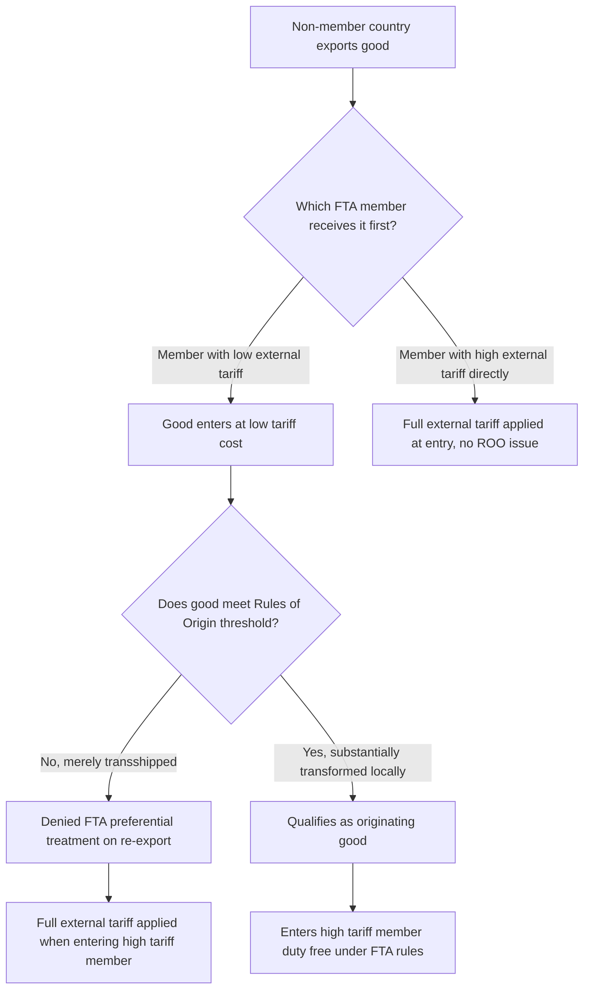

## Rules of Origin

### Definition and Core Concept

Rules of origin (ROO) are the criteria used to determine the economic "nationality" of a traded good — that is, which country a product is deemed to originate from for the purposes of applying tariffs, quotas, trade remedies, and preferential trade treatment. While seemingly a technical customs matter, rules of origin function as substantive trade policy instruments: they determine which goods actually qualify for the tariff preferences negotiated under a free trade area or other preferential arrangement, and are the primary mechanism preventing **trade deflection** — the practice of routing goods through a low-tariff member of a trade agreement solely to reach a higher-tariff member duty-free.

Rules of origin are necessary specifically in free trade areas (which retain independent external tariffs per member) rather than in customs unions or common markets (which apply a common external tariff, eliminating the trade deflection incentive that ROOs are designed to prevent).

### Why Rules of Origin Are Necessary

**Key Points**

- In a free trade area, each member retains its own external tariff schedule toward non-members
- Without ROOs, an exporter could ship goods to the FTA member with the *lowest* external tariff, then re-export those goods tariff-free to a higher-tariff member under the FTA's internal free trade provisions — undermining each member's independently negotiated external tariff policy
- ROOs close this loophole by requiring that only goods genuinely "originating" within the FTA (produced or substantially transformed there) receive the FTA's preferential internal treatment; goods merely transshipped through a member without sufficient local processing do not qualify

### Diagram: Trade Deflection Problem and Rules of Origin Solution (svg_diagram)

### Types of Rules of Origin Criteria

**Key Points**

Trade agreements typically use one or a combination of the following criteria to determine whether a good "originates" within the FTA:

**1. Wholly Obtained or Produced Criterion**

- Applies straightforwardly to goods entirely grown, extracted, or manufactured within a single member country using no foreign inputs at all (e.g., minerals mined domestically, agricultural products grown and harvested domestically, live animals born and raised domestically)
- Simplest category to administer since it requires no apportionment calculation, but covers a narrow share of modern manufactured trade given globally fragmented supply chains

**2. Substantial Transformation Criterion**

For goods incorporating imported (non-originating) inputs, agreements require that sufficient processing occur within the FTA for the good to be considered "substantially transformed" rather than merely assembled or repackaged. This is typically operationalized through one or more of the following sub-tests:

- **Change in Tariff Classification (CTC)**: the finished good must fall under a different tariff heading/subheading (per the Harmonized System, HS) than any of its non-originating inputs, reflecting the logic that a genuine transformation should change the product's fundamental classification, not merely its packaging or minor processing
- **Regional Value Content (RVC)** / **Value-Added Test**: a specified minimum percentage of the good's value must derive from originating (regional) materials, labor, and overhead

$$\text{RVC} = \frac{\text{Transaction Value} - \text{Value of Non-Originating Materials}}{\text{Transaction Value}} \times 100\% \geq \text{Threshold}$$

(Note: the precise RVC formula — build-down, build-up, or net-cost method — varies by agreement; the formula above illustrates the "build-down" method used in agreements such as USMCA.)

- **Specific Process/Technical Requirement**: the agreement specifies that particular manufacturing processes must occur within the FTA region regardless of value content (e.g., "yarn-forward" rules in textile agreements, requiring that yarn spinning, not just final garment assembly, occur within the region)

**3. Cumulation**

Cumulation provisions allow inputs sourced from *other* members of the same FTA (or, under extended cumulation, from countries with overlapping preferential agreements) to count toward the originating-content threshold, even though they are not from the exporting country itself. This allows regional supply chains spanning multiple FTA members to collectively satisfy origin requirements that no single member's contribution alone would meet.

### Worked Example: Regional Value Content Calculation

Consider an automobile assembled in Mexico for export to the United States under USMCA. The vehicle's components:

| Component | Value | Origin |
| --- | --- | --- |
| Engine | $4,000 | Non-originating (imported from Country X, non-member) |
| Transmission | $2,500 | Originating (produced in Canada) |
| Body/chassis assembly (Mexican labor and steel) | $8,000 | Originating (Mexico) |
| Electronics package | $3,500 | Non-originating (imported from Country Y, non-member) |
| **Total transaction value** | **$18,000** |  |

Using the build-down RVC method:

$$\text{RVC} = \frac{18{,}000 - (4{,}000 + 3{,}500)}{18{,}000} \times 100\% = \frac{10{,}500}{18{,}000} \times 100\% \approx 58.3\%$$

If USMCA's applicable regional value content threshold for passenger vehicles is 75% (the agreement's automotive-specific threshold, phased in over several years and among the most stringent ROO requirements in any modern FTA), this vehicle at 58.3% RVC would **fail** to qualify for preferential tariff-free treatment and would instead face the U.S. Most-Favored-Nation (MFN) tariff rate applicable to vehicles from non-preferential sources. The manufacturer would need to substitute originating components (e.g., sourcing the engine from within the USMCA region) to raise the RVC above the required threshold.

[Unverified: exact USMCA automotive RVC thresholds and phase-in schedules, along with specific labor value content (LVC) requirements also present in the agreement's automotive rules, should be verified against the current USMCA legal text, as thresholds were subject to negotiated phase-in periods and potential subsequent amendment.]

### Cumulation Example

Under a cumulation provision, if the engine in the example above had instead been produced in Canada (a fellow USMCA member) rather than non-member Country X, its $4,000 value would count as *originating* content rather than non-originating content:

$$\text{RVC (with cumulation)} = \frac{18{,}000 - 3{,}500}{18{,}000} \times 100\% \approx 80.6\%$$

This would clear the illustrative 75% threshold, qualifying the vehicle for preferential treatment. This example illustrates why cumulation provisions are economically significant: they allow firms to structure genuinely regional (multi-member) supply chains without being penalized relative to firms sourcing all inputs from a single member country.

### Administrative and Compliance Mechanisms

**Key Points**

- **Certificates of Origin**: exporters (or in "self-certification" systems, importers) must provide documentation attesting that a good meets the applicable ROO, subject to customs verification and audit
- **Self-certification versus third-party certification**: older agreements often required certification by government agencies or chambers of commerce; more recent agreements (including USMCA and the EU's agreements) increasingly permit exporter or importer self-certification, reducing administrative burden but shifting compliance risk and audit exposure onto the certifying party
- **De minimis provisions**: many agreements allow a small percentage (commonly around 7–10%, varying by agreement) of non-originating material value to be disregarded for CTC purposes, providing flexibility for minor non-qualifying inputs that would otherwise cause an entire product to fail a strict tariff-shift test

### Economic Effects and Critiques

**Compliance Cost Critique**

- Rules of origin impose real administrative costs: tracking input provenance, calculating regional value content, maintaining documentation, and managing customs audits
- For smaller firms, particularly small and medium enterprises (SMEs) without dedicated trade-compliance staff, these costs can be proportionally larger than for large multinational firms, potentially limiting SME utilization of preferential tariff rates even when goods would technically qualify
- Studies of FTA "utilization rates" (the share of eligible trade that actually claims preferential treatment rather than paying the MFN tariff) have found that some firms forgo claiming preferential treatment when compliance costs of proving origin exceed the tariff savings available — a phenomenon documented across multiple agreements in the empirical trade literature [Inference: the specific utilization rate for any given agreement, product, and time period varies considerably and should be sourced from agreement-specific customs or trade-flow studies rather than treated as a fixed general parameter.]

**Protectionist Design Critique**

- Restrictive rules of origin (high RVC thresholds, narrow tariff-shift definitions, specific-process requirements) can function as a disguised form of protectionism, favoring firms and countries with pre-existing regional supply chains over new entrants or firms seeking to source more cheaply from efficient non-member suppliers
- This connects directly to the trade creation/trade diversion framework: restrictive ROOs can effectively force firms to substitute cheaper non-member inputs for more expensive regional inputs purely to qualify for preferential treatment — a form of trade diversion operating at the input/component level rather than the finished-good level
- USMCA's tightened automotive ROOs (relative to the original NAFTA) and added labor value content requirements have been cited in the trade policy literature as an explicit example of ROOs being used to pursue industrial and labor policy objectives (incentivizing regional and specifically higher-wage production) beyond pure origin-verification purposes

**The "Spaghetti Bowl" Problem**

- Because different FTAs negotiated by the same country typically specify different ROO methodologies, thresholds, and product-specific rules, firms engaged in trade covered by multiple overlapping agreements face a proliferating complexity of differing origin requirements — a phenomenon economist Jagdish Bhagwati termed the "spaghetti bowl" problem
- This complexity is cited as a argument for multilateral (WTO-level) rather than preferential trade liberalization, since multilateral MFN tariff reduction requires no rules-of-origin apparatus at all

### Preferential versus Non-Preferential Rules of Origin

**Key Points**

- The discussion above concerns **preferential** rules of origin — those determining eligibility for tariff preferences under FTAs
- **Non-preferential** rules of origin serve different purposes even in the absence of any preferential agreement: applying trade remedies (anti-dumping and countervailing duties) to the correct country of origin, implementing quotas, country-of-origin labeling requirements ("Made in ___"), and government procurement rules favoring domestic-origin goods
- The WTO's Agreement on Rules of Origin governs non-preferential rules of origin and has pursued (with limited completed success) harmonization of non-preferential ROO methodology across members, while preferential ROOs remain governed by the terms of each individual trade agreement rather than a unified multilateral standard

### Conclusion

Rules of origin, though technically a customs administration tool, function as a substantive and sometimes contested element of trade policy design. They are the mechanism that makes free trade areas administratively workable given each member's retained external tariff autonomy, but their design choices — the strictness of value content thresholds, the specificity of technical process requirements, the availability of cumulation — determine in practice how much genuine preferential access an agreement provides, how much compliance burden it imposes on firms, and how much scope exists for ROOs to function as a disguised protectionist instrument favoring incumbent regional supply chains. Evaluating any preferential trade agreement's real economic effect requires examining its specific rules of origin architecture, not merely its headline tariff elimination schedule.

**Related Topics**

- Free trade areas, customs unions, and common markets
- Trade creation versus trade diversion
- USMCA automotive sector rules of origin and labor value content
- Harmonized System (HS) tariff classification
- FTA utilization rates and SME compliance costs
- The "spaghetti bowl" phenomenon (Bhagwati)
- WTO Agreement on Rules of Origin (non-preferential)
- Cumulation provisions in overlapping trade agreements
- Trade remedies: anti-dumping and countervailing duties
- Global value chains and regional supply chain structuring