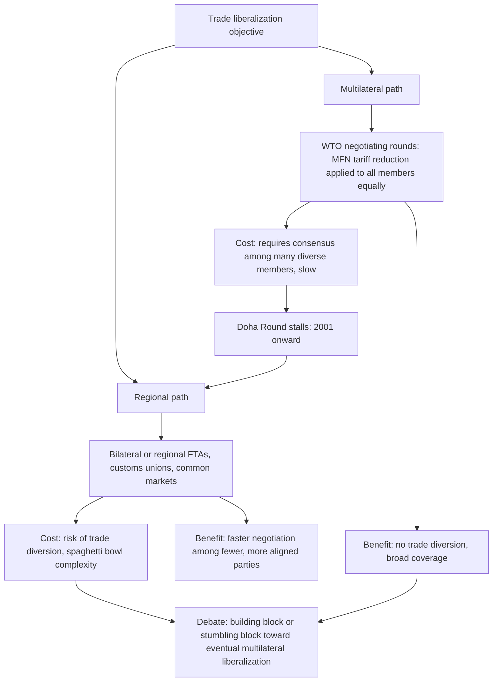

## Regionalism versus Multilateralism

### Definition and Core Concept

Regionalism and multilateralism represent two competing (or, in some framings, complementary) paths toward global trade liberalization. **Multilateralism** refers to trade liberalization negotiated among all (or nearly all) countries simultaneously through a single global institutional framework — historically GATT, now the World Trade Organization (WTO) — applying reduced barriers on a non-discriminatory, Most-Favored-Nation (MFN) basis to every trading partner equally. **Regionalism** refers to trade liberalization negotiated preferentially among a subset of countries — through free trade areas, customs unions, or common markets — that grants participating members better treatment than non-members, in explicit departure from the MFN principle.

The relationship between these two paths has been one of the central organizing debates in international trade policy since the 1990s, particularly given the dramatic proliferation of regional trade agreements (RTAs) occurring alongside a slowing pace of multilateral negotiation.

### Historical Trajectory

**Key Points**

- The post-WWII multilateral trading system was built around GATT (1947), progressively lowering tariffs through eight negotiating "rounds" culminating in the Uruguay Round (1986–1994), which created the WTO in 1995
- Regionalism existed alongside multilateralism from the outset (the European Economic Community formed in 1957 under GATT Article XXIV), but its pace accelerated dramatically from the 1990s onward
- The WTO's **Doha Development Round**, launched in 2001, stalled repeatedly over agricultural subsidies, market access, and special treatment for developing countries, and was effectively abandoned as a comprehensive single undertaking by the mid-2010s — widely regarded as the trigger for a marked shift of negotiating energy toward regional and bilateral agreements
- Since the Doha stall, major economies have pursued large "mega-regional" agreements — the Comprehensive and Progressive Agreement for Trans-Pacific Partnership (CPTPP), the Regional Comprehensive Economic Partnership (RCEP) in Asia-Pacific, and the EU's extensive network of bilateral FTAs — as substitute vehicles for trade liberalization and rule-setting

[Unverified: the precise total count of RTAs notified to the WTO changes continuously as new agreements are concluded; current figures should be verified against the WTO's Regional Trade Agreements Database rather than cited from a fixed historical number.]

### The Legal Framework Permitting Regionalism Within Multilateralism

**Key Points**

- **GATT Article XXIV** creates the legal exception allowing WTO members to form FTAs and customs unions despite the MFN non-discrimination principle, conditioned on the agreement covering "substantially all trade" between members and not raising external barriers against non-members
- The **Enabling Clause** (1979) provides a more flexible, less-conditioned legal basis for preferential arrangements specifically among developing countries
- The **General Agreement on Trade in Services (GATS) Article V** provides an analogous exception for services-sector regional agreements
- In practice, WTO dispute settlement has rarely strictly enforced Article XXIV's substantive conditions, and no RTA has ever been formally found non-compliant and dismantled through the WTO process — a frequently cited illustration of the gap between the legal framework's stated conditions and its actual enforcement

### Diagram: Two Paths to Trade Liberalization (svg_diagram)

### The "Building Block" View

Proponents of regionalism as complementary to multilateralism argue:

- **Political economy stepping stone**: regional agreements demonstrate liberalization's benefits concretely, building domestic political constituencies supportive of further, eventually multilateral, opening
- **Deeper integration laboratory**: RTAs, especially among developed economies with strong institutional capacity, often negotiate deeper disciplines (services, investment, intellectual property, regulatory cooperation, digital trade, labor and environmental standards) than the WTO has managed to achieve multilaterally, potentially establishing templates that later inform multilateral rule-making
- **Coalition-building for multilateral rounds**: regional groupings can coordinate negotiating positions, potentially strengthening smaller countries' bargaining leverage in subsequent multilateral talks rather than leaving them to negotiate individually against larger economies
- **Multilateralization over time**: some economists argue that as regional agreements proliferate and increasingly cover the bulk of world trade, the practical difference between "regional" and "multilateral" liberalization narrows, since most trade eventually becomes covered by *some* preferential arrangement even without a single unified global agreement

### The "Stumbling Block" View

The competing view, most closely associated with economist Jagdish Bhagwati, holds that regionalism actively undermines multilateral progress:

- **The "spaghetti bowl" problem**: proliferating, overlapping RTAs with differing rules of origin, tariff schedules, and regulatory provisions create a costly compliance patchwork for firms trading across multiple agreements, a phenomenon Bhagwati named explicitly to capture the tangled, inefficient complexity generated by many separate bilateral deals
- **Diversion of negotiating capital and political attention**: trade officials and political capital devoted to negotiating and ratifying regional deals are unavailable for multilateral negotiation, and successful regional deals may reduce the domestic political urgency for pursuing more difficult multilateral concessions
- **Trade diversion entrenchment**: to the extent RTAs generate trade diversion (see Viner's trade creation/diversion framework), they create new vested interests — firms and industries benefiting from preferential access — that will actively lobby *against* subsequent multilateral liberalization that would erode their preferential advantage relative to non-member competitors
- **Discriminatory rule-setting**: mega-regional agreements negotiated among a subset of large economies can set de facto global standards (e.g., on intellectual property, digital trade, or regulatory approaches) without the input or consent of excluded countries, potentially marginalizing smaller or excluded economies from rule-making processes that nonetheless affect them through supply chain and market access spillovers

[Inference: whether the net historical effect of regionalism has been to accelerate or retard multilateral liberalization is not resolved by a single decisive body of empirical evidence, and reasonable economists have reached differing conclusions depending on the time period, agreements, and methodology examined.]

### Comparative Analysis: Multilateralism versus Regionalism

| Dimension | Multilateralism (WTO) | Regionalism (RTAs) |
| --- | --- | --- |
| Non-discrimination | MFN principle: equal treatment for all members | Explicitly discriminatory: preference for members over non-members |
| Negotiation speed | Slow, requires broad consensus (Doha Round: 20+ years, unresolved) | Faster, fewer parties to align |
| Trade diversion risk | None (uniform tariff reduction) | Present (see Viner's framework) |
| Depth of coverage | Historically strong on tariffs; weaker on services, investment, digital trade, labor/environment | Often deeper: services, investment, IP, regulatory cooperation, e-commerce |
| Rule-setting inclusiveness | All members participate in rule design | Only agreement parties participate; can set de facto global standards without excluded countries' input |
| Administrative complexity for firms | Low (single tariff schedule per product) | High (requires navigating multiple agreements' differing rules of origin) |
| Enforcement mechanism | WTO Dispute Settlement Understanding (binding, though under strain in recent years) | Agreement-specific dispute mechanisms, variable in strength |

### Worked Illustration: Mega-Regional Rule-Setting

Consider a stylized case: three major economies (accounting for a substantial share of world manufacturing trade) negotiate a mega-regional agreement including a new, relatively strict digital trade and data-localization chapter. Because these three economies represent a large enough share of global trade and production, firms in *non-member* countries wishing to sell into or supply value chains connected to this bloc find it commercially necessary to adopt the bloc's digital trade standards regardless of whether their own country is a party to the agreement — a phenomenon sometimes described as **de facto extraterritorial standard-setting**.

This illustrates the "stumbling block" concern in its rule-setting dimension: multilateral processes at the WTO would in principle require the non-member countries' consent and participation in setting such standards; regional mega-agreements can establish functionally global standards without it. [Inference: the actual extent of de facto extraterritorial influence exerted by any specific mega-regional agreement's standards depends on that bloc's real share of relevant global trade and production, and generalizations about this effect should be evaluated agreement-by-agreement rather than assumed uniformly.]

### The WTO's Weakened Multilateral Position

**Key Points**

- The Doha Round's effective collapse as a comprehensive undertaking (though some narrower sectoral agreements, such as the 2013 Bali Package on trade facilitation, were concluded within the broader Doha framework) reflects underlying structural difficulties in multilateral negotiation among 160+ members with sharply differing development levels and interests
- The WTO's Appellate Body — the binding appeal mechanism of its dispute settlement system — became unable to function from December 2019 onward due to the US blocking new appointments of Appellate Body members, a development that has significantly weakened the enforceability of multilateral trade rulings and is frequently cited as compounding the broader crisis of multilateral trade governance [Unverified: the current operational status of WTO dispute settlement reform efforts, including the Multi-Party Interim Appeal Arbitration Arrangement (MPIA) adopted by a subset of WTO members as a partial workaround, should be checked against current WTO reporting, as this is an actively evolving institutional situation.]
- This institutional weakening has been cited by both defenders and critics of regionalism as further evidence for their respective positions: defenders argue it makes regional agreements a necessary substitute given multilateral paralysis; critics argue institutional weakening and regional proliferation are mutually reinforcing in a way that further erodes the multilateral system's centrality

### Plurilateral Agreements as a Middle Path

**Key Points**

- **Plurilateral agreements** — negotiated within the WTO framework but among a subset of willing members rather than requiring universal consensus — represent an institutional middle ground between full multilateralism and purely external regionalism
- Examples include the Information Technology Agreement (ITA) and ongoing plurilateral negotiations on e-commerce/digital trade and services domestic regulation among willing WTO subsets
- Proponents argue plurilaterals retain WTO institutional legitimacy and MFN extension potential (some plurilaterals extend benefits to all WTO members via MFN even though only a subset formally negotiates and commits) while avoiding the paralysis of requiring full 160+ member consensus

### Conclusion

The regionalism-versus-multilateralism debate reflects a genuine and unresolved tension in international trade governance: multilateralism offers non-discriminatory, broadly inclusive liberalization but has struggled institutionally to advance meaningfully since the Uruguay Round, while regionalism offers faster, often deeper liberalization among willing partners but at the cost of discrimination against non-members, potential trade diversion, and rule-setting processes that can exclude affected countries. Neither the "building block" nor "stumbling block" characterization has been definitively established as the general rule; the actual effect of any specific regional agreement on the broader multilateral trading system depends on that agreement's design (its openness to eventual expansion, its rules of origin strictness, its consistency with WTO disciplines) and on the broader trajectory of multilateral negotiations occurring alongside it.

**Related Topics**

- Trade creation versus trade diversion
- GATT Article XXIV and the Enabling Clause
- The "spaghetti bowl" phenomenon (Bhagwati)
- The WTO Doha Development Round and its stall
- WTO Dispute Settlement Understanding and Appellate Body crisis
- Mega-regional agreements: CPTPP and RCEP
- Plurilateral agreements within the WTO framework
- Most-Favored-Nation (MFN) principle
- Free trade areas, customs unions, and common markets
- Rules of origin