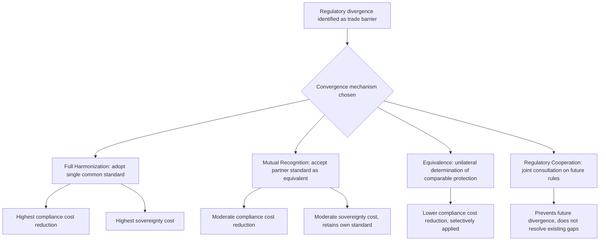

## Deep Integration and Regulatory Harmonization

### Definition and Core Concept

Deep integration refers to trade and economic cooperation that extends beyond the elimination of border measures (tariffs and quotas) — the domain of traditional "shallow" trade agreements — into the harmonization or mutual recognition of behind-the-border domestic regulatory and institutional structures: product standards, competition policy, intellectual property rules, investment protections, labor and environmental standards, regulatory approval processes, and government procurement rules. Regulatory harmonization is the specific mechanism most closely associated with achieving deep integration: the alignment of differing national regulations into a common or mutually accepted standard, reducing the compliance costs that regulatory divergence imposes on cross-border trade even after tariffs have been eliminated.

As traditional tariff barriers have fallen substantially worldwide since GATT/WTO negotiations reduced average tariffs to historically low levels, the relative importance of non-tariff, behind-the-border regulatory divergence as a trade barrier has increased correspondingly — making deep integration the central frontier of contemporary trade agreement design, particularly among developed economies.

### Shallow versus Deep Integration

**Key Points**

| Dimension | Shallow Integration | Deep Integration |
| --- | --- | --- |
| Primary focus | Border measures: tariffs, quotas | Behind-the-border measures: regulations, standards, institutions |
| Typical instrument | Traditional FTA tariff schedules | Regulatory chapters, mutual recognition agreements, harmonized standards |
| Sovereignty implications | Limited (retains domestic regulatory autonomy) | Substantial (requires ceding some domestic regulatory discretion) |
| Negotiation complexity | Relatively lower | Substantially higher (involves domestic regulatory agencies, not just trade ministries) |
| Historical era of prominence | GATT rounds through the 1980s | WTO-era and especially post-2000 mega-regional and bilateral agreements |

### Why Regulatory Divergence Matters as a Trade Barrier

**Key Points**

- Even with zero tariffs, a firm exporting to a foreign market may face substantial compliance costs if that market requires different product testing procedures, safety certifications, packaging/labeling standards, or technical specifications than the firm's home market
- These costs function economically similarly to a tariff — raising the effective cost of cross-border trade — but are harder to identify, quantify, and negotiate away than a simple tariff line, since they are often embedded in legitimate domestic regulatory objectives (consumer safety, environmental protection, financial stability) rather than designed explicitly as trade barriers
- Compliance costs from regulatory divergence tend to fall disproportionately on smaller firms lacking the scale to maintain separate product lines or certification processes for each export market, similarly to the SME compliance burden discussed in the context of rules of origin

### Mechanisms for Achieving Regulatory Convergence

**1. Harmonization**

Full harmonization involves parties adopting identical (or near-identical) regulatory standards, eliminating divergence entirely. This provides the greatest compliance-cost reduction but requires the greatest sacrifice of domestic regulatory discretion, since it typically means all parties adopt one negotiated common standard rather than each retaining its own.

**2. Mutual Recognition**

Under mutual recognition, each party retains its own distinct domestic regulatory standards, but agrees to accept goods, services, or professional qualifications that meet a trading partner's standard as satisfying its own requirements — without requiring re-testing, re-certification, or re-licensing. The **EU's mutual recognition principle** for goods circulating within the Single Market (established via the 1979 *Cassis de Dijon* European Court of Justice ruling) is the most developed real-world example: a product lawfully sold in one EU member state may generally be sold in any other, without needing to meet that second state's specific technical requirements, provided it satisfies certain minimum EU-wide standards.

**3. Equivalence**

A weaker and more selectively applied form of mutual recognition, equivalence involves one party unilaterally (or bilaterally) determining that another party's regulatory regime achieves a comparable level of protection or outcome, even if the specific rules differ — commonly used in financial services regulation, where full harmonization is often politically infeasible but regulators may accept that a foreign jurisdiction's supervisory framework achieves adequately similar prudential outcomes.

**4. Regulatory Cooperation Mechanisms**

Rather than harmonizing existing rules, some agreements establish institutional processes for regulators from different jurisdictions to consult during the *development* of new regulations, aiming to prevent future divergence before it occurs rather than reconciling existing divergent rules after the fact.

### Diagram: Pathways to Regulatory Convergence (svg_diagram)

### The EU Single Market as the Paradigmatic Deep Integration Case

**Key Points**

- The EU Single Market, formally established through the 1986 Single European Act and effective from 1993, represents the most extensive real-world deep integration project, combining harmonization (particularly through EU-wide directives and regulations binding on all member states), mutual recognition (for goods not covered by specific harmonized EU standards), and extensive regulatory cooperation through EU institutions
- Achieving this required the development of supranational institutions (the European Commission, European Court of Justice) with authority to develop, interpret, and enforce common regulatory standards binding on member states — an institutional depth far beyond what most other regional agreements have pursued, reflecting the far larger sovereignty transfer deep integration of this scope requires
- The EU experience illustrates the sovereignty-integration tradeoff directly: achieving the compliance-cost benefits of genuine regulatory convergence required member states to accept binding external rule-making authority over significant areas of domestic policy, a tradeoff that has generated sustained political contestation (including centrally in the UK's 2016 Brexit referendum debate)

### Worked Example: Cost of Regulatory Divergence versus Harmonization

Consider a manufacturer of electrical appliances seeking to sell into two markets, A and B, which currently maintain differing electrical safety certification standards despite having eliminated tariffs on the product entirely under an existing FTA.

**Under divergent standards**: the manufacturer must obtain separate certification testing for market A ($150,000 fixed cost) and market B ($180,000 fixed cost), plus maintain potentially different product specifications (different plug designs, voltage tolerances) for each market, adding approximately $8 per unit in dual-production-line costs.

**Under a mutual recognition agreement**: if markets A and B agree that either country's certification process is accepted in both, the manufacturer incurs only one certification cost (say, $150,000, testing to market A's standard) and can sell an identical product specification in both markets, eliminating the $180,000 duplicate certification cost and the $8 per-unit dual-specification cost entirely.

For a firm exporting, say, 500,000 units annually to market B, mutual recognition would save approximately $180{,}000 + (500{,}000 \times \$8) = \$4{,}180{,}000$ — illustrating why compliance-cost reduction from regulatory convergence can represent a substantially larger trade barrier reduction than the tariff elimination that preceded it, particularly for products with high fixed certification costs or where per-unit specification differences are significant.

[Unverified: the specific magnitude of compliance cost savings from any real regulatory convergence agreement is highly product- and sector-specific; the figures above are illustrative rather than representative of a general empirical parameter, and actual savings for any specific agreement should be sourced from sector-specific regulatory impact assessments.]

### Deep Integration in Modern Mega-Regional Agreements

**Key Points**

- The **Comprehensive and Progressive Agreement for Trans-Pacific Partnership (CPTPP)** and the (unratified by the US) original TPP text included substantial regulatory coherence chapters, investment protection provisions, intellectual property standards, state-owned enterprise disciplines, and digital trade rules extending well beyond tariff schedules
- The since-abandoned Transatlantic Trade and Investment Partnership (TTIP) negotiations between the US and EU were centrally focused on regulatory cooperation and mutual recognition (particularly in areas like automotive safety standards, pharmaceutical approval processes, and chemical regulation) rather than tariffs, which were already low between the two economies — illustrating how deep integration, not tariff elimination, has become the primary substantive content of negotiations between already-low-tariff developed economies
- TTIP's negotiations also illustrated deep integration's political sensitivity: proposed investor-state dispute settlement (ISDS) mechanisms and concerns over potential downward pressure on EU regulatory standards (particularly regarding food safety and environmental rules) generated substantial public opposition and contributed to the negotiations' eventual suspension

### Critiques and Tensions

**Sovereignty Critique**

- Deep integration, by its nature, requires ceding some domestic regulatory discretion to either a harmonized common standard or a foreign jurisdiction's judged-equivalent standard — a transfer of policy authority with direct democratic accountability implications, since domestic regulators and legislatures lose some ability to unilaterally set standards reflecting purely domestic preferences
- This concern is amplified when harmonization or mutual recognition effectively requires the politically weaker or smaller party in a negotiation to adopt the larger party's standards as the practical baseline, a dynamic frequently observed in agreements between economies of substantially different size and negotiating leverage

**"Race to the Bottom" Concern**

- Critics worry that regulatory harmonization or mutual recognition, if poorly designed, could create pressure toward the lowest common denominator standard among negotiating parties, particularly in areas like labor, environmental, or consumer protection standards, if firms and negotiators favor whichever standard imposes the least compliance burden
- Proponents counter that well-designed agreements can instead produce a "race to the top," since harmonization toward the *higher* of two parties' standards is also possible depending on negotiating dynamics and political will, and cite instances where trade agreements have incorporated binding labor and environmental provisions [Inference: whether harmonization dynamics in practice tend toward higher or lower common standards is empirically contingent on the specific agreement's design and the relative bargaining power and priorities of negotiating parties, rather than a fixed general tendency in either direction.]

**Legitimate Regulatory Diversity Critique**

- Some regulatory divergence reflects genuine differences in national risk preferences, cultural values, or domestic political consensus (e.g., differing approaches to genetically modified organisms, data privacy, or precautionary principle application) rather than arbitrary or protectionist barriers
- Critics of aggressive harmonization agendas argue that treating all regulatory divergence as a "barrier to be removed" risks overriding legitimate democratic policy choices that happen to differ from a trading partner's preferences, rather than recognizing that some divergence reflects genuinely different, equally legitimate societal preferences rather than inefficiency

### Deep Integration and Developing Countries

**Key Points**

- Deep integration agreements can pose particular challenges for developing-country participants, who may lack the regulatory and institutional capacity to implement complex harmonization commitments (in areas like intellectual property enforcement, financial regulation, or technical standards administration) at the same pace or depth as developed-country partners
- This has generated debate over appropriate "special and differential treatment" — extended implementation timelines, technical assistance, or reduced compliance obligations — within deep integration agreements involving developing-country parties, echoing similar debates in the broader multilateral trading system

### Conclusion

Deep integration and regulatory harmonization represent the evolving frontier of trade agreement design in an era where traditional tariff barriers have fallen substantially, shifting the locus of trade friction toward behind-the-border regulatory divergence. The economic case for reducing this friction — substantial compliance cost savings, particularly benefiting firms facing high fixed certification or dual-specification costs — is well established, but achieving it requires a qualitatively different and more politically sensitive negotiation than traditional tariff bargaining, since it directly implicates domestic regulatory sovereignty and democratic policy-making authority in ways that pure tariff schedules do not. The EU Single Market demonstrates deep integration's achievable economic benefits at its most extensive, while the political contestation surrounding agreements like TTIP demonstrates the corresponding sovereignty and legitimacy tensions that limit how far and how fast such integration can proceed in most other contexts.

**Related Topics**

- The EU Single Market and the "four freedoms"
- Mutual recognition principle (Cassis de Dijon case)
- Non-tariff barriers and technical barriers to trade (TBT Agreement)
- Investor-state dispute settlement (ISDS)
- The Transatlantic Trade and Investment Partnership (TTIP) and its suspension
- CPTPP regulatory coherence provisions
- Special and differential treatment for developing countries in trade agreements
- WTO Technical Barriers to Trade (TBT) and Sanitary and Phytosanitary (SPS) Agreements
- Brexit and the sovereignty-integration tradeoff
- Digital trade and data governance in modern trade agreements