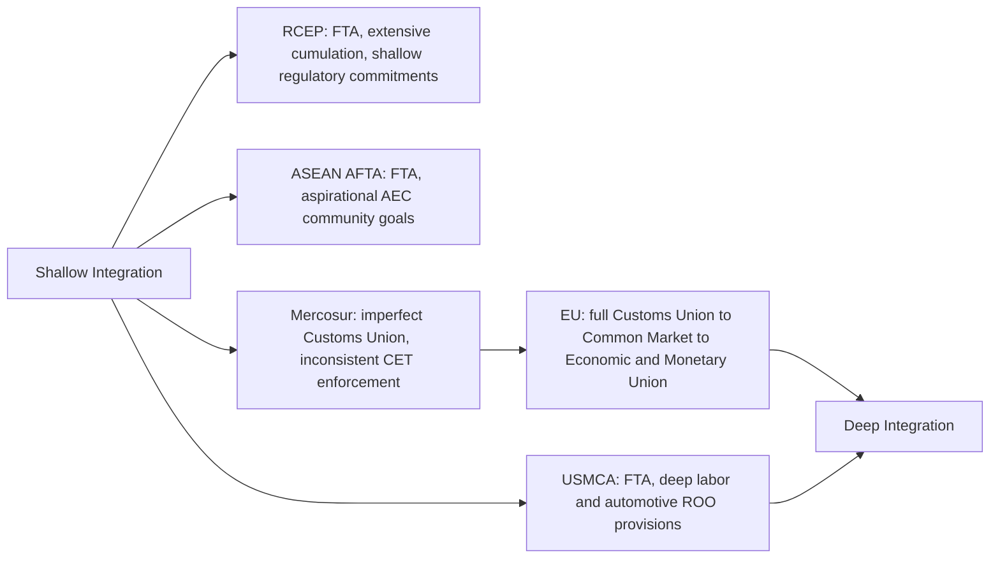

## Comparative Cases: The EU, USMCA, ASEAN, Mercosur, and RCEP

### Purpose of Comparative Analysis

Examining the European Union, USMCA, ASEAN, Mercosur, and RCEP side by side illustrates the full range of the Balassa integration taxonomy and the trade creation/diversion, rules of origin, and deep integration frameworks in real institutional settings. Each bloc represents a distinct combination of integration depth, institutional design, geographic and development context, and degree of behind-the-border regulatory harmonization — making comparison across them a practical synthesis of the chapter's preceding theoretical material.

### Summary Comparison Table

| Dimension | EU | USMCA | ASEAN (AFTA/AEC) | Mercosur | RCEP |
| --- | --- | --- | --- | --- | --- |
| Integration stage (Balassa) | Economic and political union (beyond common market) | Free trade area | Free trade area, moving toward community-level cooperation | Customs union (imperfect) | Free trade area |
| Members | 27 (as of post-Brexit) | US, Mexico, Canada | 10 Southeast Asian states | Argentina, Brazil, Paraguay, Uruguay (plus associate states) | 15: ASEAN-10 plus Australia, China, Japan, New Zealand, South Korea |
| Common external tariff | Yes | No (each retains own external tariff) | No | Nominally yes, with significant exceptions | No |
| Free movement of labor/capital | Yes (four freedoms) | No | Limited, aspirational under AEC | No | No |
| Common currency | Yes (Eurozone subset) | No | No | No | No |
| Rules of origin required | No (internal), N/A externally due to CET | Yes, notably strict for automotives | Yes | Yes, though enforcement inconsistent | Yes, with extensive cumulation provisions |
| Depth of regulatory harmonization | Very high (supranational institutions) | Moderate (labor, environment, digital trade chapters) | Low to moderate, largely aspirational | Low, limited institutional capacity | Low to moderate (ASEAN+1 template-based) |
| Dispute settlement | European Court of Justice (binding, supranational) | State-to-state and limited investor mechanisms | Largely consultative, weak enforcement | Ad hoc arbitral tribunals | State-to-state, relatively limited |

### The European Union: Deepest Integration Case

**Key Points**

- Progressed sequentially through the full Balassa sequence: European Coal and Steel Community (1951) and European Economic Community customs union (from 1957/58) → Single Market common market (1993) → Economic and Monetary Union with the euro (1999/2002 for cash circulation) → ongoing political union elements (European Parliament, qualified majority voting in many policy areas)
- Distinguished by supranational institutions with binding authority over member states: the European Commission (executive/regulatory initiative), European Parliament and Council (co-legislators), and European Court of Justice (binding judicial interpretation, as established through the doctrine of direct effect and supremacy of EU law over conflicting national law)
- The Eurozone subset (not all 27 EU members) represents monetary union — a stage beyond Balassa's five-stage taxonomy in some formulations, requiring a shared central bank (European Central Bank) and surrendered independent national monetary policy
- Achieved deep integration through decades of accumulated regulatory harmonization (directives requiring domestic legal transposition) and mutual recognition (per the *Cassis de Dijon* principle), making it the reference case for "deep integration" as discussed in the preceding syllabus item

**Distinctive Challenge**: The EU's depth of integration has generated the most significant sovereignty-related political contestation of any regional bloc, exemplified by the UK's 2016 Brexit referendum and subsequent 2020 withdrawal — illustrating that even the most institutionally successful deep-integration project faces genuine limits tied to domestic political consent for continued supranational authority.

### USMCA: A Modernized Free Trade Area

**Key Points**

- The United States-Mexico-Canada Agreement (USMCA), which entered into force July 1, 2020, replaced NAFTA (in force 1994–2020), retaining the free trade area structure (no common external tariff; each member retains independent trade policy toward non-members) while substantially updating rules of origin, labor standards, and dispute settlement provisions
- **Automotive rules of origin** were significantly tightened relative to NAFTA — raising regional value content thresholds and adding a **labor value content (LVC)** requirement mandating that a specified share of vehicle value be produced by workers earning at least a specified minimum wage, an explicit and unusual use of ROO design to pursue labor-standard and reshoring objectives directly (see the prior syllabus item on Rules of Origin for detailed RVC mechanics)
- Added enforceable labor chapter provisions, including the **Rapid Response Labor Mechanism**, allowing facility-specific complaints regarding labor rights violations (particularly targeted at Mexican manufacturing facilities) with the potential for expedited tariff or trade remedy consequences — representing a novel enforcement mechanism more direct than typical state-to-state dispute processes in prior US trade agreements
- Retains dispute settlement mechanisms inherited and modified from NAFTA (state-to-state panels under Chapter 31equivalent provisions), with investor-state dispute settlement (ISDS) substantially narrowed relative to NAFTA's broader original provisions, reflecting the political backlash ISDS mechanisms generated in the 2010s trade policy debate

### ASEAN: Free Trade Area with Aspirational Community Goals

**Key Points**

- The **ASEAN Free Trade Area (AFTA)**, established via the Common Effective Preferential Tariff (CEPT) scheme in 1992, forms the trade-liberalization core of the broader **ASEAN Economic Community (AEC)**, launched in 2015 with aspirations toward deeper integration (a "single market and production base") beyond a conventional FTA
- ASEAN's institutional design emphasizes consensus-based decision-making and non-interference in members' domestic affairs (the "ASEAN Way"), resulting in comparatively weak supranational enforcement capacity relative to the EU — AEC commitments are frequently characterized in the academic literature as aspirational targets with variable implementation across the diverse membership (spanning highly developed Singapore to less-developed Laos, Cambodia, and Myanmar)
- ASEAN has served as the negotiating hub for the broader "ASEAN+1" bilateral FTA network (separate agreements between ASEAN as a bloc and China, Japan, South Korea, India, Australia-New Zealand), which subsequently provided the template consolidated into RCEP
- Significant intra-ASEAN development-level heterogeneity limits the depth of achievable regulatory harmonization compared to the EU, since less-developed members often lack the institutional and administrative capacity to implement complex harmonized standards at the same pace as more developed members

### Mercosur: An Imperfect Customs Union

**Key Points**

- **Mercosur** (Mercado Común del Sur), founded via the 1991 Treaty of Asunción among Argentina, Brazil, Paraguay, and Uruguay (Venezuela's membership has been suspended; several other South American states hold associate status), is nominally a customs union with a Common External Tariff (CET) — placing it, in principle, one Balassa stage deeper than the FTA-structured USMCA, ASEAN, or RCEP
- In practice, Mercosur's CET has been described in the trade policy literature as an "imperfect" customs union, since numerous product-specific exceptions, national tariff exemption lists, and inconsistent implementation across members mean the common external tariff is not uniformly applied in the way a fully realized customs union (per the Balassa definition) would require
- Mercosur has experienced periodic political and economic instability among member states (including significant macroeconomic volatility in Argentina) that has constrained the bloc's institutional development and negotiating capacity for external agreements — the long-negotiated **EU-Mercosur Association Agreement** illustrates this, having reached political conclusion after over two decades of on-and-off negotiation, with subsequent ratification facing continued political contestation in various EU member states over agricultural market access and environmental standards concerns [Unverified: the precise ratification status of the EU-Mercosur agreement across individual EU member state legislatures is an actively evolving political process and should be verified against current reporting.]
- Institutional enforcement relies on ad hoc arbitral tribunals rather than a permanent supranational court, reflecting comparatively lower institutional investment than the EU model

### RCEP: The World's Largest FTA by Membership GDP

**Key Points**

- The **Regional Comprehensive Economic Partnership (RCEP)**, signed November 15, 2020, brings together the ten ASEAN member states with five ASEAN+1 partners: Australia, China, Japan, New Zealand, and South Korea, having entered into force on January 1, 2022 for the initial group of ratifying parties. [Australian Government Department of Foreign Affairs and Trade](https://www.dfat.gov.au/trade/agreements/in-force/rcep)
- RCEP is described as the world's largest free trade agreement by members' combined GDP, and per the RCEP Secretariat, the bloc accounted for 27.6% of global GDP in 2024 and contributed 43.7% of global GDP growth over the preceding decade (2015–2024). [Australian Government Department of Foreign Affairs and Trade](https://www.dfat.gov.au/trade/agreements/in-force/rcep)[RCEP](https://rcepsec.org/)
- India participated in RCEP negotiations from their 2012 launch but withdrew in 2019 prior to signing, reportedly over concerns regarding market access asymmetries and potential import surges (particularly from China) — a significant absence given India's economic scale, distinguishing RCEP's membership from the broader Asia-Pacific region it might otherwise have encompassed
- Myanmar's status within RCEP is institutionally distinctive: Myanmar was a signatory but has not yet completed the ratification process activating the agreement between itself and other parties, and RCEP members were left to individually determine if and when their bilateral relationship with Myanmar under the agreement would take effect, given concerns raised about the legitimacy of Myanmar's governing authorities — an unusual case illustrating how political legitimacy concerns about a member government can affect even a nominally technical trade agreement's implementation [Wikipedia](https://en.wikipedia.org/wiki/Regional_Comprehensive_Economic_Partnership)[World Population Review](https://worldpopulationreview.com/country-rankings/rcep-member-countries)
- RCEP is explicitly designed with **relatively shallow integration ambitions** compared to CPTPP or USMCA: RCEP has less extensive commitments than agreements like CPTPP or USMCA, though many analysts view it as a significant multilateral achievement given the diversity of its membership [Congress.gov](https://www.congress.gov/crs-product/IF11891)
- RCEP employs extensive **cumulation provisions** in its rules of origin — allowing inputs from any RCEP member to count toward regional value content thresholds for goods traded among any other members — which is considered one of its most economically significant features for regional supply chain integration, since it consolidates the previously fragmented "noodle bowl" of separate bilateral ASEAN+1 rules of origin into a single unified regional framework
- Services liberalization within RCEP reflects the bloc's diversity: seven members adopted a more liberal "negative list" approach restricting only explicitly listed sectors, while eight members including China retained a more restrictive "positive list" approach — illustrating how RCEP accommodates significant variation in liberalization ambition across its diverse membership rather than requiring uniform commitments [Congress.gov](https://www.congress.gov/crs-product/IF11891)

### Diagram: Comparative Integration Depth Positioning (svg_diagram)

### Cross-Cutting Analytical Themes

**Institutional Capacity as a Determinant of Integration Depth**

The comparison illustrates a consistent pattern: integration depth correlates strongly with the negotiating parties' institutional capacity and pre-existing convergence in development level and governance systems. The EU's uniquely deep integration reflects both decades of accumulated institution-building and a membership of relatively high-income, institutionally similar states (notwithstanding real intra-EU heterogeneity). ASEAN, Mercosur, and RCEP each involve members with more significant development-level and institutional-capacity heterogeneity, correlating with shallower realized integration despite sometimes ambitious stated aspirations (as with the ASEAN Economic Community).

**Rules of Origin as a Practical Differentiator**

USMCA, ASEAN, Mercosur, and RCEP all require rules of origin as FTA-type (or imperfect customs union) arrangements; the EU's genuine customs union status eliminates this requirement for internal trade. RCEP's extensive cumulation provisions represent a deliberate design choice to reduce the "spaghetti bowl" complexity that had previously existed across the fragmented ASEAN+1 bilateral agreement network — directly applying the rules-of-origin design lessons discussed in the preceding syllabus item.

**Trade Creation and Diversion Considerations**

Applying Viner's framework comparatively: the EU's decades-long tariff-free internal market with a common external tariff has generated extensively studied trade creation and diversion effects in the empirical literature; RCEP, given its relatively modest tariff reduction ambitions (targeting up to 90% tariff elimination over a 20-year phase-in per most estimates) and pre-existing extensive ASEAN+1 bilateral tariff preferences among many members, is expected by some analysts to generate comparatively modest *incremental* trade creation beyond what pre-existing bilateral agreements already produced, with its primary economic contribution instead coming from rules-of-origin consolidation and reduced compliance complexity rather than new tariff liberalization per se. [Inference: quantifying the relative trade creation and diversion magnitudes across these five blocs requires detailed empirical trade-flow studies specific to each agreement and time period, and the qualitative comparative characterization here should not be read as a precise quantitative ranking.]

### Conclusion

The EU, USMCA, ASEAN, Mercosur, and RCEP collectively span nearly the full range of regional integration possibilities discussed throughout this chapter — from the EU's supranational economic and political union, through Mercosur's imperfect customs union, to the free-trade-area structures of USMCA, ASEAN, and RCEP, each reflecting distinct rules-of-origin architectures, institutional enforcement capacities, and regulatory harmonization ambitions. No single "best" integration model emerges from the comparison; each bloc's design reflects its members' specific development-level heterogeneity, institutional capacity, geopolitical context, and political tolerance for sovereignty transfer, illustrating that the theoretical Balassa taxonomy and Viner's welfare framework must be applied with close attention to real-world institutional and political constraints rather than treated as a simple linear progression every regional grouping should be expected to pursue.

**Related Topics**

- Free trade areas, customs unions, and common markets (Balassa taxonomy)
- Trade creation versus trade diversion
- Rules of origin and cumulation mechanisms
- Deep integration and regulatory harmonization
- Regionalism versus multilateralism
- The EU Single Market and Economic and Monetary Union
- Brexit and sovereignty-integration tradeoffs
- India's withdrawal from RCEP negotiations
- The ASEAN Economic Community (AEC) aspirations
- EU-Mercosur Association Agreement ratification process