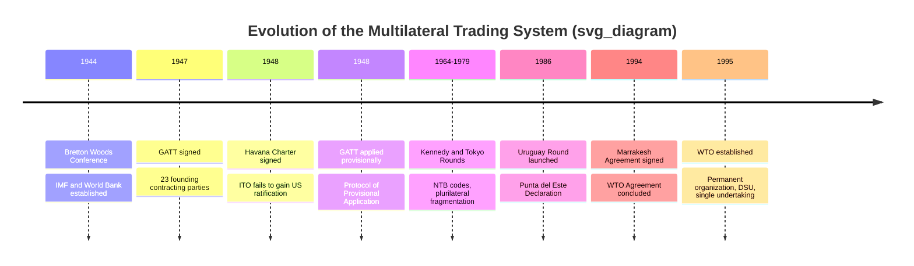

## History of the GATT and Founding of the WTO

### Overview

The General Agreement on Tariffs and Trade (GATT) and its successor, the World Trade Organization (WTO), represent the institutional backbone of the postwar multilateral trading system. GATT operated from 1948 to 1994 as a provisional treaty-based framework governing trade in goods, while the WTO, established in 1995, transformed this arrangement into a permanent international organization with expanded scope, stronger enforcement mechanisms, and a formal legal personality.

### Historical Origins: The Bretton Woods Context

**Post-WWII Economic Planning (1944)**

At the Bretton Woods Conference of July 1944, Allied nations designed three pillars intended to govern the postwar international economic order:

- The International Monetary Fund (IMF) — exchange rate stability and balance-of-payments support
- The International Bank for Reconstruction and Development (IBRD, later the World Bank) — reconstruction and development financing
- The International Trade Organization (ITO) — intended to govern international trade

The ITO was conceived as the third pillar, but its charter proved to be the most ambitious and ultimately the least successful of the three.

**The Havana Charter (1948)**

Negotiations for the ITO culminated in the Havana Charter, signed in March 1948 at the UN Conference on Trade and Employment. The charter's scope was expansive, covering not just tariffs but also employment policy, commodity agreements, restrictive business practices, and investment.

**Key Points**

- The Havana Charter required ratification by national legislatures, most critically the U.S. Congress
- The U.S. administration under President Truman failed to submit the charter to Congress by 1950, largely due to domestic opposition from business groups wary of its scope and from protectionist interests
- Without U.S. ratification, the ITO never came into being, leaving a gap in the institutional trade architecture

### Birth of GATT as a Provisional Arrangement

**The 1947 Geneva Negotiations**

While the ITO charter was still being negotiated, 23 founding countries conducted parallel tariff negotiations in Geneva in 1947. To make these negotiated tariff concessions legally operative before the ITO was ratified, negotiators drafted the General Agreement on Tariffs and Trade, signed on October 30, 1947, and applied provisionally from January 1, 1948, via the Protocol of Provisional Application (PPA).

**Key Points**

- GATT was never intended to be a standalone institution — it was meant to be a subsidiary agreement operating under the ITO
- When the ITO collapsed, GATT became the default, de facto institution governing world trade by circumstance rather than design
- Because it was "provisional," GATT technically lacked full legal status as an international organization for its entire 47-year existence; it operated more like a treaty administered by an ad hoc secretariat than a formal organization

**The Grandfather Clause**

The PPA contained a "grandfather clause" allowing existing domestic legislation inconsistent with GATT rules (particularly Part II) to remain in force if it predated GATT accession. This created long-standing exceptions, most notably in agriculture and areas of U.S. trade law, that persisted for decades.

### Structure and Core Principles of GATT

GATT established a rules-based framework built on a small number of foundational principles that remain central to the WTO today.

**Most-Favored-Nation (MFN) Treatment — Article I**

Any trade advantage, favor, privilege, or immunity granted by a member to any country must be extended immediately and unconditionally to all other members. This multilateralized bilateral tariff concessions.

**National Treatment — Article III**

Imported goods, once they have cleared customs, must be treated no less favorably than domestically produced like goods with respect to internal taxes and regulations. This prevents domestic policy from functioning as disguised protectionism.

**Tariff Bindings and Reciprocity**

Members negotiate "bound" tariff rates (ceilings) through reciprocal, mutually advantageous concessions. Bound rates are recorded in each member's schedule of concessions and cannot be raised without compensating affected trading partners.

**General Elimination of Quantitative Restrictions — Article XI**

GATT generally prohibits quotas and import/export bans in favor of tariffs, which are considered more transparent and less trade-distorting.

**Key exceptions and safeguard provisions:**

- Article VI — anti-dumping and countervailing duties
- Article XIX — safeguard actions against import surges
- Article XX — general exceptions (public morals, health, exhaustible natural resources, etc.)
- Article XXIV — permits customs unions and free trade areas as exceptions to MFN

### The GATT Negotiating Rounds

GATT evolved through eight successive "rounds" of multilateral trade negotiations, each broadening the agenda and membership.

| Round | Years | Participants | Key Outcomes |
| --- | --- | --- | --- |
| Geneva | 1947 | 23 | Original GATT text; ~45,000 tariff concessions |
| Annecy | 1949 | 13 | Tariff reductions; new member accessions |
| Torquay | 1950–51 | 38 | Further tariff cuts |
| Geneva II | 1955–56 | 26 | Tariff reductions |
| Dillon Round | 1960–61 | 26 | Tariff cuts; response to EEC formation |
| Kennedy Round | 1964–67 | 62 | ~35% average tariff cut; first anti-dumping code |
| Tokyo Round | 1973–79 | 102 | Non-tariff barrier codes; tariff cuts on manufactures |
| Uruguay Round | 1986–94 | 123 | Creation of the WTO; GATS; TRIPS; agriculture and textiles brought under disciplines |

**Key Points**

- Early rounds (Geneva through Dillon) focused almost exclusively on tariff reduction via item-by-item negotiation
- The Kennedy Round introduced across-the-board (linear) tariff-cutting formulas rather than product-by-product bargaining
- The Tokyo Round addressed non-tariff barriers (NTBs) for the first time, producing plurilateral "codes" on subsidies, technical barriers to trade, customs valuation, and government procurement — but these applied only to signatories, fragmenting the system ("GATT à la carte")
- Agriculture and textiles remained largely outside effective GATT discipline until the Uruguay Round; textiles were governed separately by the Multi-Fibre Arrangement (MFA) from 1974

### The Uruguay Round (1986–1994): Transition to the WTO

**Launch and Scope**

Launched at Punta del Este, Uruguay in September 1986, this was the most ambitious and complex round, running nearly eight years — far longer than the intended four. It was the first round to seriously tackle agriculture, services, intellectual property, and institutional reform.

**Key Negotiating Areas**

- **Agriculture**: Establishment of disciplines on market access, domestic support, and export subsidies (the Agreement on Agriculture)
- **Services**: Creation of the General Agreement on Trade in Services (GATS), extending multilateral rules beyond goods for the first time
- **Intellectual Property**: The Agreement on Trade-Related Aspects of Intellectual Property Rights (TRIPS), setting minimum standards for patents, copyrights, and trademarks
- **Textiles and Clothing**: Agreement to phase out the MFA quota system over a ten-year transition (completed by 2005)
- **Dispute Settlement**: Creation of the Dispute Settlement Understanding (DSU) with a quasi-automatic adoption process and an Appellate Body
- **Institutional reform**: Agreement to establish the WTO as a permanent organization with legal personality

**Key sticking points and near-collapse:**

- Negotiations nearly collapsed in 1990 at the Brussels Ministerial over agricultural subsidy disputes between the U.S. and the European Community
- The Blair House Accord (1992) between the U.S. and EC on agricultural subsidies helped unlock the impasse
- The round concluded with the Marrakesh Agreement, signed April 15, 1994, in Marrakesh, Morocco

### Founding of the WTO

**Legal Basis**

The WTO was established by the Marrakesh Agreement Establishing the World Trade Organization, entering into force on January 1, 1995. It absorbed and updated GATT, which was renamed GATT 1994 and incorporated as one of several annexed multilateral agreements.

**Key Structural Differences from GATT**

| Feature | GATT (1947–1994) | WTO (1995–present) |
| --- | --- | --- |
| Legal status | Provisional treaty; no formal legal personality | Permanent international organization with legal personality |
| Scope | Trade in goods only | Goods (GATT), services (GATS), intellectual property (TRIPS) |
| Dispute settlement | Consensus-based; losing party could block adoption of rulings | Quasi-automatic adoption; Appellate Body; enforceable rulings |
| Commitments | "GATT à la carte" — plurilateral codes optional | "Single undertaking" — members accept nearly the entire package |
| Institutional home | Ad hoc secretariat in Geneva | Formal Secretariat, Ministerial Conference, General Council |

**The Single Undertaking Principle**

Unlike the fragmented Tokyo Round codes, WTO membership requires acceptance of virtually all covered agreements as a package (with limited plurilateral exceptions such as the Agreement on Government Procurement), preventing the selective adherence that weakened GATT's later years.

**Dispute Settlement Reform**

This was arguably the most consequential institutional change. Under GATT, panel rulings required consensus to be *adopted*, meaning the losing party could block enforcement by withholding consent. Under the WTO's DSU, rulings are adopted automatically unless there is a consensus *against* adoption ("negative consensus" or "reverse consensus"), making enforcement far more binding. An Appellate Body was also created to review panel decisions.

### WTO Institutional Structure

**Key Points**

- **Ministerial Conference**: Highest decision-making body, meets at least every two years
- **General Council**: Conducts day-to-day business between Ministerial Conferences; also convenes as the Dispute Settlement Body (DSB) and Trade Policy Review Body (TPRB)
- **Councils for Trade in Goods, Services, and TRIPS**: Oversee respective agreements
- **Secretariat**: Based in Geneva, headed by a Director-General, providing technical and administrative support (not a supranational executive body — the WTO has no power to impose policy on members)
- Decision-making formally proceeds by consensus, a practice carried over from GATT, though this has been criticized as slowing reform (e.g., the stalled Doha Round)

### Founding Membership and Accession

GATT began with 23 contracting parties in 1947. By the time of the WTO's founding in 1995, membership had grown to 128 countries. Accession to the WTO requires a working party review, bilateral market-access negotiations with interested members, and approval by two-thirds of the existing membership — a process that can take many years (China's accession, for example, took approximately 15 years, concluding in 2001).

### Diagram: Evolution from ITO to WTO

### Why the ITO Failed but GATT Survived

**Key Points**

- The ITO's broad mandate (covering employment, investment, commodity agreements, and restrictive business practices) generated opposition from multiple domestic constituencies simultaneously
- GATT's narrower, tariff-focused scope made it politically easier to accept without full legislative ratification, since it could be implemented via existing executive trade authority (in the U.S. case, the Reciprocal Trade Agreements Act)
- [Inference] The very narrowness that allowed GATT to survive without formal ratification also constrained its institutional authority and enforcement power for nearly five decades, which is why WTO founders deliberately built a treaty-ratified, legally grounded organization the second time

### Conclusion

The transition from GATT to the WTO reflects a fundamental shift from a provisional, goods-focused tariff agreement administered informally to a permanent, rules-based international organization with binding dispute settlement and a broadened mandate covering goods, services, and intellectual property. This evolution was not a planned trajectory but an adaptive response: GATT emerged as a stopgap after the ITO's failure, and the WTO emerged after decades of experience revealed GATT's institutional and enforcement limitations, particularly around agriculture, non-tariff barriers, and the unenforceability of dispute rulings.

**Related Topics**

- Most-Favored-Nation treatment and its exceptions (Article XXIV, GSP)
- WTO Dispute Settlement Understanding and the Appellate Body crisis
- The Doha Development Round and the stalling of multilateral negotiations
- Agreement on Agriculture and the Blair House Accord
- TRIPS Agreement and the Doha Declaration on Public Health
- Regional Trade Agreements (RTAs) versus multilateralism
- China's WTO accession and its systemic impact
- Plurilateral agreements post-Uruguay Round (Government Procurement, ITA)