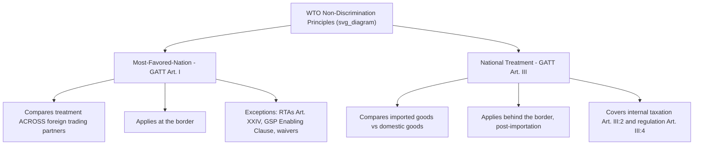

## Most Favored Nation and National Treatment Principles

### Overview

Most-Favored-Nation (MFN) treatment and National Treatment (NT) are the twin non-discrimination pillars of the multilateral trading system. MFN governs how a WTO member treats *other countries* relative to each other (discrimination at the border, between trading partners), while National Treatment governs how a member treats *foreign goods, services, or persons* relative to domestic ones (discrimination behind the border, between imports and domestic products). Together they form the legal architecture that prevents trade policy from being used as a tool of selective favoritism or disguised protectionism.

### Most-Favored-Nation Treatment

**Legal Basis**

MFN is codified primarily in **GATT Article I:1** for trade in goods, **GATS Article II** for trade in services, and **TRIPS Article 4** for intellectual property — making it one of the few principles that spans all three WTO pillar agreements.

**Core Rule**

Any advantage, favor, privilege, or immunity granted by a member to a product originating in or destined for any other country must be extended **immediately and unconditionally** to the like product originating in or destined for the territories of all other members.

**Key Points**

- The name is historically counterintuitive: MFN does not mean one country receives special treatment — it means *all* members receive the *same* best treatment given to *any single* member
- MFN converts what were historically bilateral tariff concessions into automatically multilateralized benefits
- The obligation applies to customs duties, charges connected with importation/exportation, methods of levying duties, rules and formalities, and internal taxation matters covered under Article III

**Elements of an Article I MFN Violation**

For a measure to breach MFN, three elements are generally required:

1. The measure confers a "trade advantage" of the kind covered by Article I:1
2. The products at issue are "like products"
3. The advantage is not extended immediately and unconditionally to all like products from other members

**"Like Products" Determination**

Whether products are "like" is determined case-by-case using a set of criteria developed through GATT/WTO jurisprudence (notably in *Border Tax Adjustments* and later refined in cases like *EC – Asbestos*):

- Physical characteristics of the products
- End-uses in a given market
- Consumer tastes and habits
- Tariff classification

### Example: MFN in Practice

If Country A lowers its tariff on imported automobiles from Country B to 5% as part of a bilateral negotiation, MFN requires Country A to extend that same 5% tariff rate to automobile imports from *all* other WTO members — Country C, D, E, and so on — even though only Country B was party to the original negotiation.

### Exceptions to MFN

MFN is not absolute. GATT and other WTO agreements carve out several permitted departures:

**Regional Trade Agreements — Article XXIV**

Customs unions and free trade areas are permitted exceptions, allowing members to grant preferential treatment to FTA/CU partners that is not extended to other WTO members, subject to conditions (substantially all trade covered, external barriers not raised against non-members, notification requirements).

**Generalized System of Preferences (GSP)**

The 1979 "Enabling Clause" permits developed countries to grant non-reciprocal tariff preferences to developing countries without extending them to all members, formally exempting GSP schemes from strict MFN.

**Article XX General Exceptions**

Measures necessary to protect public morals, human/animal/plant health, or conservation of exhaustible natural resources may justify otherwise MFN-inconsistent measures, subject to the chapeau requirement that they not be applied as arbitrary or unjustifiable discrimination.

**Security Exceptions — Article XXI**

Allows deviation from MFN obligations for essential security interests.

**Anti-Dumping and Countervailing Duties**

Duties applied to specific exporting countries found to be dumping or subsidizing are permitted departures, since they target the specific unfair-trade practice rather than constituting general discrimination.

**Waivers**

Members may collectively grant waivers from MFN obligations under Article IX of the WTO Agreement (e.g., historically used for preferences to specific developing regions).

### National Treatment

**Legal Basis**

Codified in **GATT Article III** for goods, **GATS Article XVII** for services (as a specific, negotiated commitment rather than a general obligation), and **TRIPS Article 3** for intellectual property.

**Core Rule**

Once imported goods have cleared customs and entered the domestic market, they must be treated **no less favorably** than "like" domestic products with respect to internal taxes, charges, laws, regulations, and requirements affecting their sale, distribution, transportation, or use.

**Key Points**

- National Treatment applies only *after* the border — tariffs themselves are governed by market access schedules, not NT
- The principle prevents members from using internal (behind-the-border) measures to nullify the value of negotiated tariff concessions
- Article III:1 sets out the general principle; Article III:2 addresses internal taxation; Article III:4 addresses internal regulation

**Two Distinct Disciplines Within Article III**

**Article III:2 — Internal Taxation**

- *First sentence*: Taxes on imported products cannot exceed those applied to "like" domestic products (a stricter "like product" standard)
- *Second sentence*: Applies to "directly competitive or substitutable" products (a broader category), prohibiting taxation "so as to afford protection" even if products are not strictly "like"

**Article III:4 — Internal Regulation**

- Imported products must receive treatment "no less favorable" than like domestic products with respect to laws, regulations, and requirements affecting internal sale, offering for sale, purchase, transportation, distribution, or use

### Example: National Treatment in Practice

If a country imposes a 10% excise tax on both domestically produced and imported beer, this is consistent with National Treatment. If instead it taxes imported beer at 15% while taxing domestically produced beer at 10% — or imposes a labeling requirement that is more burdensome for imports than for domestic equivalents — this violates Article III, regardless of the country's stated policy rationale.

### MFN vs. National Treatment: Comparative Summary

| Dimension | MFN (Article I) | National Treatment (Article III) |
| --- | --- | --- |
| Discrimination axis | Between foreign trading partners | Between domestic and foreign products |
| Point of application | At/regarding the border | Behind the border (internal market) |
| Core comparison | Country B's goods vs. Country C's goods | Imported goods vs. domestic goods |
| Typical violation | Preferential tariff to one country not extended to others | Higher internal tax/regulation applied only to imports |
| Key exceptions | RTAs (Art. XXIV), GSP (Enabling Clause), waivers | General exceptions (Art. XX), government procurement carve-outs |

### Diagram: Non-Discrimination Framework

### Extension to Services and Intellectual Property

**GATS (Services)**

- MFN under GATS Article II is a general obligation, though members were permitted to list one-time MFN exemptions at the WTO's founding (subject to review and normally lasting no more than 10 years)
- National Treatment under GATS Article XVII is *not* a general obligation — it applies only to the extent a member has made a specific commitment for a given service sector in its schedule

**TRIPS (Intellectual Property)**

- Both MFN (Article 4) and National Treatment (Article 3) apply as general obligations, with limited exceptions (e.g., for existing international agreements on IP predating TRIPS)

### Landmark Disputes Illustrating These Principles

**Key Points**

- ***EC – Bananas III*** (1997): Addressed both MFN and NT issues in the EC's banana import licensing regime favoring former colonies
- ***Canada – Autos*** (2000): Found Canada's import duty exemption scheme, conditioned on manufacturers meeting Canadian value-added requirements, violated MFN because the exemption was not extended unconditionally to all members
- ***Korea – Alcoholic Beverages*** (1999): Applied the "directly competitive or substitutable" standard under Article III:2 to find Korea's differential taxation of soju versus imported spirits inconsistent with National Treatment
- ***EC – Asbestos*** (2001): Refined the "like products" test under Article III:4, holding that health risk could be a relevant factor in determining likeness

### Rationale and Economic Function

**Key Points**

- [Inference] MFN and NT jointly reduce the transaction costs and uncertainty of international trade by preventing a patchwork of country-specific and product-specific rules, which supports the WTO's broader function of "locking in" negotiated concessions
- Non-discrimination principles are viewed as central to preventing trade diversion and preserving the value of negotiated tariff bindings, since a country could otherwise erode market access commitments through internal discriminatory measures rather than formal tariff increases
- These principles do not require free trade in an absolute sense — a member may still protect domestic industry through tariffs (within bound limits) — but they prohibit discriminatory treatment once the level of protection has been negotiated and bound

### Conclusion

MFN and National Treatment operate as complementary, not overlapping, disciplines: MFN ensures equality of treatment *among* trading partners at the border, while National Treatment ensures equality of treatment *between* domestic and foreign products once inside the market. Both principles admit structured exceptions (RTAs, GSP, general exceptions under Article XX) that reflect political and developmental realities, but the core non-discrimination architecture remains the foundation on which the rest of the WTO's substantive obligations — tariff bindings, subsidies disciplines, and services/IP commitments — are built.

**Related Topics**

- Article XXIV and the proliferation of Regional Trade Agreements
- The Enabling Clause and special/differential treatment for developing countries
- "Like products" jurisprudence across GATT and TRIPS
- GATS specific commitments and scheduling of services sectors
- Tariff bindings and the concept of "locking in" concessions
- Anti-dumping and countervailing duty disciplines as MFN exceptions
- WTO dispute settlement case law on non-discrimination