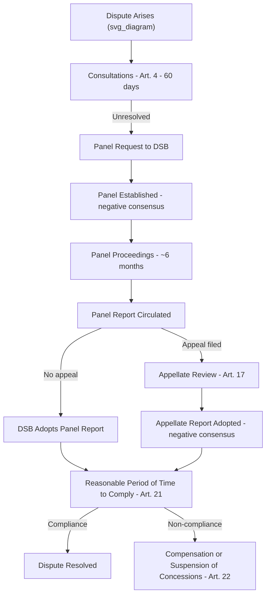

## The WTO Dispute Settlement Mechanism

### Overview

The WTO dispute settlement mechanism (DSM) is the system through which members resolve disagreements over compliance with WTO agreements. Codified in the **Understanding on Rules and Procedures Governing the Settlement of Disputes (DSU)**, it is often described as the "central pillar" of the multilateral trading system because it provides security and predictability by converting political trade disputes into a rules-based, adjudicative process. It represented one of the most significant institutional upgrades from GATT to the WTO, replacing a consensus-blockable system with one governed by "negative consensus."

### Legal Basis and Institutional Home

**Key Points**

- Governed by the DSU, one of the WTO's binding "single undertaking" agreements, meaning all members are automatically subject to it
- Administered by the **Dispute Settlement Body (DSB)**, which is technically the General Council meeting under different rules and procedures
- The DSB has exclusive authority to establish panels, adopt panel and Appellate Body reports, monitor implementation of rulings, and authorize retaliation

### Core Objectives

**Key Points**

- Provide security and predictability to the multilateral trading system
- Preserve members' rights and obligations under the covered agreements
- Clarify existing provisions through customary rules of treaty interpretation (per DSU Article 3.2), while making clear that panels and the Appellate Body cannot "add to or diminish" rights and obligations
- Achieve prompt settlement, with a strong preference for a mutually agreed solution over litigated outcomes

### Stages of the Dispute Settlement Process

**1. Consultations (DSU Article 4)**

- The complaining member must request consultations with the respondent before proceeding further
- The respondent must reply within 10 days and enter into consultations within 30 days
- If consultations fail to resolve the matter within 60 days, the complainant may request the establishment of a panel
- [Inference] This stage exists to encourage negotiated settlement and narrow the scope of disagreement before formal adjudication, consistent with the DSU's stated preference for mutually agreed solutions

**2. Panel Establishment and Composition (Articles 6–8)**

- The DSB establishes a panel upon request, unless there is a consensus *against* establishment (negative consensus) — meaning panel establishment is virtually automatic
- Panels typically consist of three (occasionally five) individuals, chosen for expertise and independence
- Panelists are not permanent staff; they are selected on an ad hoc, case-by-case basis, often from trade officials, academics, or former diplomats

**3. Panel Proceedings**

- Panels examine written submissions, hold hearings, and may consult experts
- The standard timeframe for a panel to issue its final report to the parties is six months (nine months in cases involving perishable goods), though in practice many disputes take considerably longer
- The panel issues an interim report to the parties for comment before finalizing

**4. Adoption of Panel Reports (Article 16)**

- The DSB adopts the panel report within 60 days of circulation **unless** a party formally appeals it, or the DSB decides by consensus not to adopt it (negative consensus again applies — meaning adoption is virtually automatic unless appealed)

**5. Appellate Review (Article 17)**

- Either party may appeal a panel report on legal issues and legal interpretations (not new factual findings)
- Historically undertaken by the **Appellate Body**, a standing body that (pre-crisis) had seven members serving four-year terms, with three sitting on any given appeal
- Appeals were to be completed within 60 days, extendable to 90 days
- The Appellate Body could uphold, modify, or reverse the panel's legal findings and conclusions

**6. Adoption of Appellate Reports**

- Adopted by the DSB via negative consensus, making Appellate Body rulings effectively binding once adopted

**7. Implementation and Surveillance (Article 21)**

- The losing member must inform the DSB of its intentions regarding implementation
- If immediate compliance is impracticable, the member is given a "reasonable period of time" (RPT) to comply, determined by arbitration, mutual agreement, or DSB approval
- Implementation is monitored by the DSB on an ongoing basis until the matter is resolved

**8. Compensation and Suspension of Concessions (Article 22)**

- If the losing party fails to comply within the RPT, the complainant may seek compensation (negotiated, voluntary) or request authorization to suspend concessions ("retaliation")
- Retaliation should first be sought in the same sector as the violation; cross-sectoral or cross-agreement retaliation is permitted only under specified conditions
- The level of suspension must be equivalent to the level of nullification or impairment caused by the violation, subject to arbitration if disputed

### Diagram: WTO Dispute Settlement Process Flow

### The "Negative Consensus" Innovation

**Key Points**

- Under GATT, panel reports required **positive consensus** to be adopted — meaning the losing party could single-handedly block adoption, rendering enforcement largely toothless in contested cases
- Under the WTO's DSU, panel and Appellate Body reports are adopted **automatically unless there is a consensus against adoption** — since the winning party will never join such a consensus, adoption is effectively guaranteed
- This single procedural change is widely regarded as the most consequential structural difference between GATT-era and WTO-era dispute settlement, converting a diplomatic, blockable process into a quasi-automatic, rules-based one

### Remedies: Prospective, Not Punitive

**Key Points**

- WTO remedies are fundamentally **prospective** — a country is required to bring its measure into conformity going forward, not to pay retroactive damages or fines for past violations
- Compensation (if agreed) is voluntary and typically involves additional trade concessions, not monetary payment
- Suspension of concessions (retaliation) is meant to be temporary and used only until compliance is achieved, not as a punitive measure

### The Appellate Body Crisis

**Key Points**

- Beginning in 2016–2017, the United States blocked consensus on appointing/reappointing Appellate Body members, citing concerns over judicial overreach, disregard for the 90-day deadline, and treatment of precedent
- By December 2019, the Appellate Body fell below the minimum of three members required to hear appeals, rendering it **non-functional**
- This created a practical loophole: a losing party can appeal a panel report "into the void," since no functioning Appellate Body exists to hear it, effectively blocking adoption of the panel report indefinitely
- In response, a subset of WTO members created the **Multi-Party Interim Appeal Arbitration Arrangement (MPIA)** in 2020, using DSU Article 25 arbitration as a voluntary substitute appeal mechanism among participating members
- [Unverified] As of the most recent multilateral efforts, WTO members have not reached consensus on a permanent restoration or reform of the Appellate Body; the MPIA remains a plurilateral workaround rather than a systemic fix, and the situation may have evolved further — current status should be verified against the WTO's official reporting

### Nullification or Impairment: The Underlying Legal Theory

**Key Points**

- Claims under the DSU are framed around whether a measure causes "nullification or impairment" of benefits accruing under the covered agreements (GATT Article XXIII)
- **Violation complaints**: the most common type, where nullification is presumed once a breach of an agreement is established
- **Non-violation complaints**: allege that a measure, even if not breaching any specific provision, upsets the legitimate expectations of a negotiated concession (rare, and narrowly applied, primarily in goods trade)
- **Situation complaints**: an even rarer category concerning circumstances not covered by the other two (has never been successfully invoked)

### Special and Differential Treatment for Developing Countries

**Key Points**

- The DSU includes provisions (Articles 4.10, 8.10, 12.10, 21.2, 21.7, 21.8, 24, 27.2) intended to give special consideration to developing- and least-developed-country members, including extended timeframes and technical assistance
- The WTO Secretariat's Legal Advisory Centre-adjacent support and the **Advisory Centre on WTO Law (ACWL)**, a separate international organization, provide subsidized legal assistance to developing-country members to help offset resource asymmetries in litigation capacity
- [Inference] Despite these provisions, significant asymmetries in legal and technical capacity between developed and developing members remain a recurring critique of the practical accessibility of the system

### Notable Landmark Disputes

**Key Points**

- ***US – Gasoline*** (1996): First case decided under the WTO system; addressed Clean Air Act gasoline standards and Article XX exceptions
- ***EC – Hormones*** (1998): Landmark SPS Agreement case on risk assessment standards for beef treated with growth hormones
- ***US – Shrimp/Turtle*** (1998): Significant for interpreting Article XX(g) exceptions relating to environmental measures and process-based trade restrictions
- ***Brazil – Aircraft*** and ***Canada – Aircraft*** (1999–2000): Major early cases under the Subsidies and Countervailing Measures (SCM) Agreement involving export subsidies to regional aircraft manufacturers
- ***US – Cotton*** (2005) and various agricultural subsidy disputes: Illustrated the interaction between the Agreement on Agriculture and the SCM Agreement

### Strengths and Criticisms

**Key Points**

- **Strengths**: relatively high compliance rate historically, binding character via negative consensus, contributes to legal certainty and reduces unilateral trade retaliation
- **Criticisms**:
  - Length of proceedings often exceeds DSU-prescribed deadlines in practice
  - Remedies are prospective only, creating limited disincentive for a member to violate rules and simply comply once a ruling issues years later ("free ride" during litigation)
  - Asymmetric capacity to litigate between large and small economies
  - The ongoing Appellate Body impasse has significantly weakened the system's enforceability since 2019

### Conclusion

The WTO dispute settlement mechanism represents a deliberate institutional evolution from GATT's diplomacy-dependent, blockable process to a rules-based system anchored by negative consensus and, historically, a standing Appellate Body. While its structural design — consultations, panels, appellate review, and DSB-supervised implementation — remains a model frequently cited as one of the most developed adjudicative systems in international law, the mechanism's practical effectiveness has been significantly strained by the Appellate Body crisis since 2019, underscoring how institutional design and members' political will must operate together for the system to function as intended.

**Related Topics**

- The Appellate Body crisis and the Multi-Party Interim Appeal Arbitration Arrangement (MPIA)
- Article XX general exceptions and their interpretation in dispute settlement
- The Subsidies and Countervailing Measures (SCM) Agreement
- Special and differential treatment for developing countries in WTO law
- Retaliation and cross-retaliation case studies (e.g., US – Gambling)
- Comparison of WTO dispute settlement with investor-state dispute settlement (ISDS)
- Reform proposals for the WTO dispute settlement system