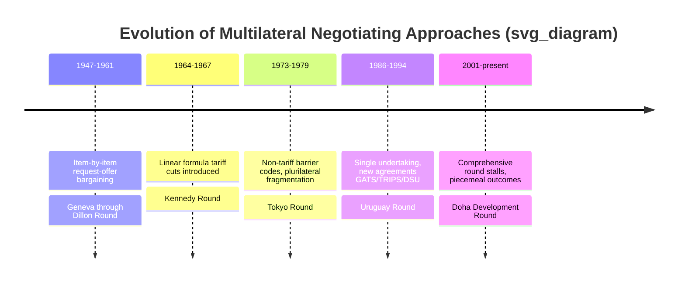

## Multilateral Trade Rounds and Negotiations

### Overview

Multilateral trade rounds are periodic, comprehensive negotiations among GATT/WTO members aimed at liberalizing trade and expanding the rules-based system through reciprocal concessions. Unlike bilateral or plurilateral deals, these rounds operate on the principle of a broad, multi-issue package negotiated simultaneously across many members, with results generally extended to the entire membership via MFN. Understanding their structure, negotiating techniques, and historical trajectory is essential to understanding how the modern trading system's rules were built — and why the process has struggled since the Uruguay Round.

### Defining Features of a Multilateral Round

**Key Points**

- **Comprehensive agenda**: rounds typically bundle multiple issues (tariffs, non-tariff barriers, services, IP, agriculture) rather than negotiating single issues in isolation
- **Single undertaking** (post-Uruguay Round): "nothing is agreed until everything is agreed," meaning the entire package must be accepted as a whole rather than piecemeal
- **Consensus-based decision-making**: formal votes are rare; agreements proceed by consensus among the full membership, giving every member an effective veto
- **Reciprocity and mercantilist bargaining**: concessions are traded on a roughly reciprocal basis, even though the ultimate benefits (via MFN) are multilateralized to all members, including those who conceded little ("free rider" dynamic)

### Negotiating Techniques Across Rounds

**Item-by-Item (Request-Offer) Negotiation**

Used in the earliest rounds (Geneva 1947 through Dillon Round). Each pair of countries negotiated tariff concessions product by product, based on principal supplier interests, with results then multilateralized via MFN.

**Key Points**

- Time-consuming and favored countries with large negotiating teams and diverse trade interests
- Tended to produce uneven liberalization, concentrated in products of interest to major trading powers

**Linear (Formula) Tariff Cutting**

Introduced in the **Kennedy Round** (1964–67). Instead of negotiating product-by-product, participants agreed to an across-the-board percentage cut applied to most tariff lines, with exceptions negotiated separately.

**Key Points**

- Dramatically increased negotiating efficiency
- Produced an average tariff cut of roughly 35% on industrial products among participants
- Introduced the first GATT anti-dumping code, addressing non-tariff conduct for the first time

**Sector-Specific and Non-Tariff Barrier (NTB) Negotiations**

The **Tokyo Round** (1973–79) shifted focus toward non-tariff barriers as tariffs had already fallen substantially in prior rounds.

**Key Points**

- Produced plurilateral "codes" covering subsidies and countervailing duties, technical barriers to trade (standards code), customs valuation, import licensing, government procurement, and anti-dumping
- These codes were **optional** — only signatories were bound — creating a fragmented system sometimes called "GATT à la carte"
- This fragmentation was a direct motivation for the Uruguay Round's later "single undertaking" requirement

### The Uruguay Round as the Watershed Round

**Key Points**

- Launched 1986 at Punta del Este, concluded 1994 with the Marrakesh Agreement
- First round to seriously bring **agriculture** and **textiles/clothing** under substantive multilateral discipline
- Created entirely new agreements: **GATS** (services), **TRIPS** (intellectual property), and the **DSU** (dispute settlement)
- Established the **single undertaking** principle, ending the plurilateral fragmentation of the Tokyo Round codes
- Culminated in the creation of the **WTO** itself as a permanent institution

*(See the dedicated "History of the GATT and Founding of the WTO" material for full detail on this round's institutional outcomes.)*

### The Doha Development Round: The Stalled Round

**Launch and Ambitions**

Launched in November 2001 in Doha, Qatar, explicitly framed as a "development round" intended to address developing-country concerns left over from the Uruguay Round, particularly in agriculture.

**Key Agenda Items**

- Agricultural market access, domestic support reduction, and export subsidy elimination
- Non-agricultural market access (NAMA) — industrial tariff reduction
- Services negotiations (GATS)
- Trade facilitation
- Rules on subsidies, anti-dumping, and regional trade agreements
- Special and differential treatment for developing countries
- TRIPS and public health (culminating in the 2001 Doha Declaration on TRIPS and Public Health)

**Why Doha Stalled**

**Key Points**

- Persistent deadlock between developed countries (particularly the U.S. and EU) over agricultural subsidy reduction, and developing countries (led by coalitions such as the **G20** developing-country group and **G33**) demanding greater market access and flexibility for food security
- Disagreements over special safeguard mechanisms for developing-country agriculture
- The 2008 mini-ministerial collapse over agricultural safeguard triggers is often cited as a key breaking point
- [Inference] The scale and diversity of WTO membership (contrasted with the 23 founding GATT members) made consensus-based, single-undertaking negotiation across such a broad agenda increasingly difficult to conclude as a comprehensive package
- No comprehensive Doha Round conclusion has been reached; elements have instead been addressed piecemeal outside a full "round" conclusion

### Partial Outcomes Salvaged from Doha

Rather than concluding as a single package, several elements were eventually agreed separately:

- **Bali Package (2013)**: Included the **Trade Facilitation Agreement (TFA)**, later entering into force in 2017 — the first multilateral agreement concluded since the WTO's founding
- **Nairobi Package (2015)**: Included a landmark commitment to eliminate agricultural export subsidies
- **Information Technology Agreement (ITA) expansion (2015)**: A plurilateral tariff elimination deal on an expanded list of tech products among a subset of members

### Diagram: Timeline of Negotiating Technique Evolution

### Shift Toward Plurilateral and Regional Alternatives

**Key Points**

- With the multilateral round process largely stalled since Doha, momentum has shifted toward:
  - **Plurilateral agreements** among subsets of willing WTO members (e.g., the Trade in Services Agreement negotiations, expanded ITA, e-commerce/digital trade discussions under the Joint Statement Initiatives)
  - **Regional and mega-regional trade agreements** (RTAs), permitted under GATT Article XXIV and GATS Article V, which have proliferated substantially since the 1990s as an alternative liberalization channel
- [Inference] This shift reflects, at least in part, the practical difficulty of achieving consensus across an increasingly large and heterogeneous WTO membership on a comprehensive single-undertaking basis, though views differ on whether this represents a durable alternative model or a temporary substitute pending eventual multilateral progress

### Negotiating Group Coalitions

Modern rounds, particularly Doha, have been shaped heavily by member coalitions rather than purely bilateral dynamics:

| Coalition | Focus | Notable Members |
| --- | --- | --- |
| Cairns Group | Agricultural export liberalization | Australia, Brazil, Canada, Argentina |
| G20 (developing) | Agricultural market access/subsidy reduction | Brazil, India, China, South Africa |
| G33 | Food security, special safeguard mechanisms | India, Indonesia, Philippines |
| African Group | Development concerns, S&D treatment | African WTO members |
| LDC Group | Least-developed country priorities | Bangladesh, and other LDC members |

### Ministerial Conferences as Negotiating Milestones

**Key Points**

- The **Ministerial Conference**, the WTO's top decision-making body, meets at least once every two years and often serves as the venue where round-level breakthroughs (or breakdowns) occur
- Notable ministerials: Seattle (1999, collapsed amid protests and disagreement), Cancún (2003, collapsed over agriculture and the "Singapore issues"), Hong Kong (2005), Bali (2013), Nairobi (2015), Buenos Aires (2017), and subsequent conferences continuing to address unresolved fisheries subsidies, e-commerce, and agricultural issues
- [Unverified] Given the pace of ministerial-level developments, the most current status of ongoing negotiating issues (e.g., fisheries subsidies implementation, e-commerce moratorium renewal) should be verified against current WTO reporting, as outcomes may have evolved past the reference point of this material

### Comparative Table: Major Rounds at a Glance

| Round | Duration | Key Innovation | Institutional Legacy |
| --- | --- | --- | --- |
| Kennedy Round | 1964–67 | Linear tariff-cutting formula | First anti-dumping code |
| Tokyo Round | 1973–79 | NTB codes | Plurilateral fragmentation ("GATT à la carte") |
| Uruguay Round | 1986–94 | Single undertaking | WTO, GATS, TRIPS, DSU |
| Doha Round | 2001–ongoing/stalled | "Development round" framing | Bali TFA, Nairobi export subsidy elimination |

### Conclusion

The history of multilateral trade rounds traces a shift from narrow, tariff-focused, item-by-item bargaining toward increasingly comprehensive, rules-based negotiations covering services, intellectual property, and development concerns — culminating institutionally in the WTO itself. However, the post-Uruguay experience, epitomized by the unresolved Doha Round, illustrates the structural strain that comprehensive, consensus-based, single-undertaking negotiation faces as WTO membership has grown larger and more heterogeneous, driving a partial shift toward plurilateral and regional alternatives as supplementary (or, in some views, competing) channels for trade liberalization.

**Related Topics**

- The Uruguay Round and founding of the WTO (institutional detail)
- The Doha Development Agenda and agricultural subsidy disputes
- Regional Trade Agreements and Article XXIV
- Plurilateral agreements: Government Procurement, expanded ITA, Joint Statement Initiatives
- The Trade Facilitation Agreement (Bali Package)
- WTO Ministerial Conferences as negotiating venues
- Special and differential treatment for developing countries in negotiations