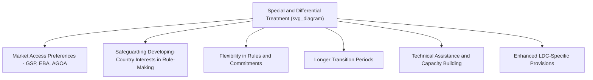

## Special and Differential Treatment for Developing Countries

### Overview

Special and Differential Treatment (S&DT, often abbreviated S&D) refers to the body of WTO provisions that grant developing- and least-developed-country (LDC) members more favorable, flexible, or preferential treatment than what strict reciprocity and uniform obligations would otherwise require. S&DT reflects the recognition, embedded since GATT's early decades, that formally equal rules can produce substantively unequal outcomes given vast disparities in economic capacity, institutional infrastructure, and negotiating power among members.

### Legal and Historical Foundations

**Part IV of GATT (1965)**

Added to GATT as "Trade and Development," Part IV was the first systematic acknowledgment that developed countries should not expect reciprocity from developing countries in trade negotiations.

**Key Points**

- Article XXXVI recognizes that developing countries need not make trade concessions inconsistent with their development, financial, and trade needs
- Established the principle of **non-reciprocity**: developed countries should not seek, and developing countries should not be required to grant, reciprocal concessions
- Largely aspirational/best-endeavors language rather than binding obligation — a recurring critique of S&DT provisions generally

**The Enabling Clause (1979)**

Formally titled the "Decision on Differential and More Favourable Treatment, Reciprocity and Fuller Participation of Developing Countries," adopted during the Tokyo Round.

**Key Points**

- Provides the legal basis for the **Generalized System of Preferences (GSP)**, permitting developed countries to grant non-reciprocal, non-MFN-extended tariff preferences to developing countries
- Legalizes preferential treatment among developing countries themselves (South-South preferences)
- Permits special treatment for LDCs "in the context of any general or specific measures in favor of developing countries"
- Functions as a permanent legal exception to the MFN obligation under GATT Article I

### Categories of S&DT Provisions

The WTO Secretariat has historically classified S&DT provisions into several functional categories, spanning roughly 155+ provisions across the WTO agreements.

**1. Provisions to Increase Trade Opportunities**

Preferential market access commitments, such as GSP schemes and initiatives like the EU's "Everything But Arms" and the U.S. African Growth and Opportunity Act (AGOA), which grant preferential or duty-free access to developing-country/LDC exports.

**2. Provisions Requiring WTO Members to Safeguard Developing-Country Interests**

Provisions requiring members to consider the effects of proposed measures on developing countries before adopting them (e.g., in safeguards and anti-dumping contexts).

**3. Flexibility in Rules and Commitments**

Longer implementation periods, lower reduction commitments, and broader policy space, such as:

- Extended transition periods for implementing TRIPS obligations
- Higher de minimis thresholds for trade-distorting domestic agricultural support under the Agreement on Agriculture
- Greater flexibility in subsidy disciplines under the SCM Agreement for developing-country members

**4. Transitional Time Periods**

Delayed implementation deadlines for specific obligations — for example, LDCs were given extended timeframes to implement TRIPS pharmaceutical patent protections.

**5. Technical Assistance**

Commitments by developed members and the WTO Secretariat to provide capacity-building support, training, and technical cooperation to help developing countries implement obligations and participate effectively in negotiations and dispute settlement.

**6. Provisions Relating to Least-Developed Countries**

A distinct, more favorable sub-category specifically for LDCs (as designated by the UN), who receive the most extensive flexibilities and longest transition periods across virtually all WTO agreements.

### Diagram: S&DT Provision Categories

### S&DT in Key WTO Agreements

**Agreement on Agriculture**

**Key Points**

- Developing countries face lower tariff reduction commitments and longer implementation periods relative to developed members
- Higher **de minimis** thresholds (10% of production value for developing countries vs. 5% for developed) for trade-distorting domestic support exempt from reduction commitments
- **Special Products (SP)** and the proposed **Special Safeguard Mechanism (SSM)** — a major unresolved Doha Round issue — would allow developing countries additional flexibility to protect food-security-sensitive agricultural products

**TRIPS Agreement**

**Key Points**

- Extended transition periods were granted for developing countries (until 2000) and LDCs (originally until 2006, subsequently extended multiple times — most recently to **July 2034** for pharmaceutical patents specifically, per WTO Council decisions)
- The **2001 Doha Declaration on TRIPS and Public Health** clarified that TRIPS should not prevent members from taking measures to protect public health, affirming the right to use compulsory licensing
- The 2003 decision (later formalized as a TRIPS amendment, Article 31bis) established a mechanism allowing countries with insufficient pharmaceutical manufacturing capacity to import generic medicines produced under compulsory license elsewhere

**Subsidies and Countervailing Measures (SCM) Agreement**

**Key Points**

- Certain export subsidies otherwise prohibited under the SCM Agreement were subject to phase-out exemptions for developing countries and, with more extended timeframes, for LDCs
- Higher thresholds before a developing country's subsidies are considered actionable

**Trade Facilitation Agreement (Bali Package, 2013)**

**Key Points**

- Notably innovative in its S&DT design: it links the *implementation timeline* of specific obligations directly to the *provision of technical assistance and capacity-building support*, meaning developing/LDC members self-designate which commitments they can implement immediately versus which require assistance or longer timeframes — often cited as a model for future S&DT design

### Dispute Settlement Understanding (DSU) S&DT Provisions

**Key Points**

- Article 4.10: panels should give special attention to developing-country members' particular problems during consultations
- Article 8.10: a panel must include at least one panelist from a developing country if a developing country is party to a dispute against a developed country, upon request
- Article 12.10: additional time may be given to developing countries to prepare arguments
- Article 21.2 and 21.7–21.8: special attention to developing-country interests in surveillance of implementation
- Article 24: particular consideration for LDC members regarding retaliation measures against them

### The Advisory Centre on WTO Law (ACWL)

**Key Points**

- Established in 2001 as a separate international organization (not part of the WTO Secretariat) to provide subsidized legal advice and litigation support to developing-country and LDC members in WTO dispute settlement
- Addresses the practical capacity asymmetry in accessing the dispute settlement system, where developed members typically have far greater in-house legal resources

### Criticisms and Debates Surrounding S&DT

**Key Points**

- **Effectiveness critique**: many S&DT provisions use "best endeavor" language ("shall," "should," "may") rather than binding commitments, limiting enforceability
- **Self-designation debate**: WTO rules historically allow members to self-designate as "developing country," a practice that has drawn criticism (notably from the U.S. during the Trump administration, which argued that advanced emerging economies such as China, South Korea, Singapore, and others should not claim developing-country flexibilities)
- **Differentiation proposals**: ongoing discussions (particularly since 2019) about whether S&DT should be more precisely calibrated to actual development levels rather than applied uniformly to any self-declared developing country
- [Inference] This self-designation controversy reflects a broader tension between the WTO's founding-era assumption of a relatively clear developed/developing divide and the far more differentiated range of economic development levels among today's membership
- **LDC graduation concerns**: countries graduating from UN LDC status face the loss of enhanced S&DT provisions and preferential market access, raising "smooth transition" concerns that have prompted extended phase-out arrangements in some agreements

### S&DT and the Doha Round

**Key Points**

- S&DT reform was a central pillar of the Doha Development Agenda, explicitly framed as a "development round"
- Proposals to make S&DT provisions more precise, effective, and operational (a mandate agreed at Doha itself) remain largely unresolved, tied to the broader stalemate over agriculture and market access
- The persistent disagreement over the scope and beneficiaries of S&DT is frequently cited as one of several structural factors contributing to the Doha Round's inability to conclude as a comprehensive package

### Conclusion

Special and Differential Treatment represents the WTO system's structural acknowledgment that formal legal equality among vastly unequal economies can produce substantively unequal outcomes, translating into preferential market access, extended implementation timelines, and greater rule flexibility for developing and least-developed members across virtually every WTO agreement. Yet S&DT's practical impact has long been constrained by its frequently non-binding "best-endeavors" character, unresolved debates over self-designation and differentiation among developing countries, and its entanglement with the broader stalemate in Doha Round negotiations — making S&DT reform simultaneously a legal, political, and developmental question central to the future direction of the multilateral trading system.

**Related Topics**

- The Enabling Clause and the Generalized System of Preferences (GSP)
- The Doha Declaration on TRIPS and Public Health
- LDC graduation and smooth transition mechanisms
- The Trade Facilitation Agreement as an S&DT design model
- Agricultural Special Products and Special Safeguard Mechanism proposals
- The Advisory Centre on WTO Law (ACWL)
- Debates over developing-country self-designation at the WTO