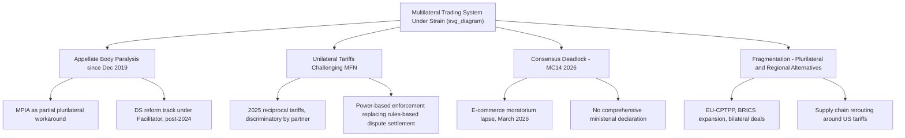

## Contemporary Challenges to the Multilateral Trading System

### Overview

The multilateral trading system faces its most serious crisis of legitimacy and functionality since the WTO's founding in 1995. Four intersecting pressures define this crisis: the paralysis of the Appellate Body, a resurgence of unilateral tariff measures that directly challenge the MFN principle, the WTO's structural difficulty reaching consensus among 166 increasingly heterogeneous members, and accelerating fragmentation toward plurilateral, regional, and bilateral alternatives. This is an actively evolving situation; readers should verify current developments against WTO reporting, as circumstances continue to shift rapidly.

### The Appellate Body Paralysis

**Key Points**

- The Appellate Body has been non-functional since December 2019, when it fell below the minimum of three members required to hear appeals, after the United States blocked consecutive appointment/reappointment processes
- As of September 2025, the United States had blocked Appellate Body appointments for the 90th consecutive time, indicating the impasse has continued essentially unbroken for roughly six years [Ujiyari](https://ujiyari.com/editorials/2026/03/wto-mc14-outcomes-multilateral-trade/)
- The practical effect is a return to something resembling the pre-1995 GATT dynamic: the suspension of the Appellate Body effectively returns dispute settlement to a system in which panel decisions are not automatically binding, since a losing party can "appeal into the void" [Chatham House](https://www.chathamhouse.org/2020/09/reforming-world-trade-organization/04-dispute-settlement-crisis)
- Because the US does not see itself as the party seeking change, it has not tabled formal proposals of its own for reforming or restoring the Appellate Body, which has complicated efforts to identify a negotiating path forward [Chatham House](https://www.chathamhouse.org/2020/09/reforming-world-trade-organization/04-dispute-settlement-crisis)

**The Multi-Party Interim Appeal Arbitration Arrangement (MPIA)**

A subset of WTO members created this voluntary Article 25 arbitration mechanism in 2020 as a substitute appellate process among participating members. It remains a plurilateral workaround rather than a systemic fix, since non-participating members (including the U.S.) are not bound by it.

**Formal Reform Process**

Following the MC12 outcome document (June 2022), WTO members committed to conducting discussions aimed at having a fully and well-functioning dispute settlement system accessible to all members by 2024 — a deadline that passed without resolution. In April 2024, Ambassador Usha Chandnee Dwarka-Canabady of Mauritius was appointed as Facilitator for dispute settlement reform, establishing monthly Heads of Delegation meetings and technical-level work focused first on appeal/review mechanisms and accessibility. Analysts increasingly view comprehensive dispute settlement reform as likely to be the culmination of the broader WTO reform process rather than an issue resolvable in the short term, given that it is entangled with deeper disagreements over subsidies disciplines and trade defense instruments. [WTO | Dispute Settlement Reform +2](https://www.wto.org/english/tratop_e/dispu_e/dsr_e.htm)

### The Return of Unilateral Tariffs and Erosion of MFN

**The 2025 U.S. Tariff Actions**

In early April 2025, the U.S. administration imposed unilateral "reciprocal tariffs," including a base rate of 10 percent on nearly all countries worldwide, under the so-called "Liberation Day" framework, with stated but often unclear objectives spanning reshoring manufacturing, rebalancing trade flows, and retaliating against perceived unfavorable foreign policies. [ITIF](https://itif.org/publications/2026/06/01/aftermath-2025-us-tariffs-how-countries-adapting-to-uncertain-global-trade-system/)

**Key Points**

- These tariffs are calculated according to perceived bilateral trade imbalances, directly subverting the MFN principle that has anchored the system since 1947, since rates vary systematically by trading partner rather than applying uniformly [ScienceDirect](https://www.sciencedirect.com/science/article/pii/S2667111525000155)
- A defining feature is that the tariffs are discriminatory — the U.S. applies a different rate to each trading partner rather than a uniform schedule, which has re-routed trade patterns and imposed efficiency losses even where aggregate trade volumes have remained comparatively intact [Intereconomics](https://www.intereconomics.eu/contents/year/2026/number/1/article/trump-s-tariffs-global-trade-and-europe-s-strategic-choice.html)
- U.S. Trade Representative Jamieson Greer articulated the underlying philosophy in an August 2025 essay explicitly rejecting "the drawn-out dispute settlement process favored by trade bureaucrats," announcing that the U.S. would instead closely monitor implementation and swiftly reimpose higher tariffs for noncompliance — a deliberate shift from rules-based to power-based enforcement [ScienceDirect](https://www.sciencedirect.com/science/article/pii/S2667111525000155)
- [Inference] This represents a more fundamental challenge than prior trade tensions because it targets the *legal architecture* of non-discrimination itself, rather than operating through recognized exceptions (safeguards, anti-dumping) within that architecture

**Bilateral "Deal" Dynamics**

The EU, facing this pressure, agreed in July 2025 to a deal under which the U.S. would impose a 15% tariff on EU goods in exchange for EU tariff reductions on U.S. goods — illustrating how bilateral negotiation, rather than multilateral rule-application, increasingly determines market access terms. Such deals often prove difficult to fully implement in practice since they are non-binding, as demonstrated by implementation gaps with South Korea, and the tariffs frequently disregard prior trade agreements and existing U.S. commitments, undermining the credibility of negotiated outcomes generally. [Trump’s Tariffs, Global Trade and Europe’s Strategic Choice - Intereconomics +2](https://www.intereconomics.eu/contents/year/2026/number/1/article/trump-s-tariffs-global-trade-and-europe-s-strategic-choice.html)

**Economic Costs**

The Tax Foundation has estimated that announced and imposed U.S. tariffs will increase household taxes by an average of $900 in 2026 and reduce long-run U.S. GDP by approximately 0.4 percent, with analysts warning of sustained inflationary pressure and reduced international competitiveness for U.S. firms as a result. [China Daily](https://global.chinadaily.com.cn/a/202608/04/WS6a714910a310986e2b468dc3.html)

### The 14th Ministerial Conference (Yaoundé, March 2026)

**Key Points**

- MC14 took place from March 26–30, 2026 in Yaoundé, Cameroon — only the second time a Ministerial has been hosted on the African continent — bringing together nearly 2,000 trade officials [World Economic Forum](https://www.weforum.org/stories/all/mc14-yaounde-wto-trade/)
- The conference concluded without a comprehensive overall ministerial declaration and without agreement on its core priorities, with progress instead shifting toward plurilateral agreements among coalitions of willing members rather than full multilateral consensus [World Economic Forum](https://www.weforum.org/stories/all/mc14-yaounde-wto-trade/)
- WTO Director-General Ngozi Okonjo-Iweala confirmed that work toward a "Yaoundé Package" would continue in Geneva, with the General Council meeting in May 2026 as the next focal point [World Economic Forum](https://www.weforum.org/stories/all/mc14-yaounde-wto-trade/)

**The E-Commerce Moratorium Lapse**

The most consequential single outcome at MC14 was a failure: the multilateral moratorium on customs duties on electronic transmissions — covering software, audiovisual content, digital media, and cross-border digitally delivered services — expired on 30 March 2026 for the first time since its introduction in 1998, after some members blocked its renewal despite broad support from the majority. The lapse also caused the related moratorium on non-violation situation complaints under TRIPS to fall. [World Economic Forum](https://www.weforum.org/stories/all/mc14-yaounde-wto-trade/)[UK Parliament](https://hansard.parliament.uk/commons/2026-04-21/debates/26042165000009/WorldTradeOrganisation14ThMinisterialConference)

**Limited Positive Outcomes**

Ministers agreed to continue negotiations on fisheries subsidies, aiming to recommend comprehensive disciplines to the 15th Ministerial Conference under Article 12 of the Agreement on Fisheries Subsidies, and adopted decisions on improving the integration of small economies into the trading system and on enhancing implementation of special and differential treatment provisions within the SPS and TBT Agreements. Other agreed outcomes were characterized as high-level and procedural, including recommitment to fisheries subsidies work and moving SPS/TBT-related S&DT proposals to technical committees. [WTO | 2026 News items - MC14 concludes with adopted decisions, progress on key outstanding issues +2](https://www.wto.org/english/news_e/news26_e/mc14_30mar26_354_e.htm)

**Reaction**

The EU stated it regretted that members were unable to demonstrate the flexibility needed to agree on a way forward regarding WTO reform, the e-commerce moratorium, and other outcomes at what it called "a pivotal moment for the global trading system". Some observer accounts characterized the close as contentious rather than merely inconclusive. [EU Trade](https://policy.trade.ec.europa.eu/news/outcome-14th-wto-ministerial-conference-2026-03-30_en)

### The WTO Reform Track

**Key Points**

- Ambassador Petter Ølberg was appointed reform facilitator in June 2025 and launched informal consultations aimed at shaping a comprehensive, open, inclusive, transparent, and member-driven reform process [WTO](https://www.wto.org/english/thewto_e/minist_e/mc14_e/briefing_notes_e/wtoreform_e.htm)
- Discussions have been organized around three tracks: governance (institutional issues), fairness (level playing field and balanced trade), and "issues of our time," with early convergence efforts focused on development/S&DT, decision-making, and level-playing-field concerns [WTO](https://www.wto.org/english/thewto_e/minist_e/mc14_e/briefing_notes_e/wtoreform_e.htm)
- The post-MC14 work plan references continued dispute settlement reform consultations under the Dispute Settlement Body, with the facilitator noting that this draft carefully balances differing levels of ambition across all 166 members, though concerns persist that further drafting alone will not resolve them [WTO](https://www.wto.org/english/thewto_e/minist_e/mc14_e/briefing_notes_e/wtoreform_e.htm)

**Proposed Priority Areas for Reform**

One prominent policy analysis identifies four critical areas for WTO reform: joint action to support sustainable development, improving disciplines on subsidies, facilitating the integration of plurilateral agreements into the WTO framework, and — as the culmination of the process — reforming dispute settlement, with subsidy-discipline negotiation seen as central since trade defense instruments have been the main source of U.S. dissatisfaction with WTO jurisprudence. [Bruegel](https://www.bruegel.org/policy-brief/plan-revitalise-world-trade-organization)[Bruegel](https://www.bruegel.org/policy-brief/plan-revitalise-world-trade-organization)

### Fragmentation: The Shift Toward Alternatives to Multilateralism

**Key Points**

- Recent developments through late 2025 suggest coordinated adaptation rather than pure fragmentation defines the response to reduced U.S. multilateral engagement, visible in EU–CPTPP negotiation efforts, deepening Asian regional integration, and BRICS expansion [ScienceDirect](https://www.sciencedirect.com/science/article/pii/S2667111525000155)
- As the U.S. embraces tariffs, other countries have responded by lowering trade barriers with each other, concluding new bilateral and plurilateral agreements, and reconfiguring supply chains to route around American protectionism [Cato Institute](https://www.cato.org/policy-analysis/world-trade-without-us)
- [Inference] This dynamic suggests a bifurcating system: a shrinking multilateral consensus-based core alongside an expanding periphery of regional/plurilateral arrangements — though whether this represents a durable alternative architecture or a temporary adaptation pending eventual multilateral repair remains genuinely contested among trade economists

### Supply Chain and Sectoral Disruption

**Key Points**

- Because contemporary supply chains are tightly interlinked, tariffs imposed at one production stage ripple through many others — a levy on steel or semiconductors does not simply raise import costs but undermines downstream sectors from automotive manufacturing to consumer electronics [LSE Public Policy Review](https://ppr.lse.ac.uk/articles/10.31389/lseppr.155)
- Evidence from the 2025 tariff episode shows firms rapidly reorganizing sourcing patterns in response to targeted tariffs, which dilutes the intended country-specific effect while raising overall costs [LSE Public Policy Review](https://ppr.lse.ac.uk/articles/10.31389/lseppr.155)
- Sector-specific effects have been uneven: UK pharmaceutical exports to the U.S. surged as firms front-loaded shipments ahead of anticipated escalation, while automotive components trade contracted sharply as integrated supply chains fragmented [LSE Public Policy Review](https://ppr.lse.ac.uk/articles/10.31389/lseppr.155)

### Diagram: Contemporary Pressure Points on the Multilateral System

### Developing Country Perspectives

**Key Points**

- For developing countries, restoring a functioning dispute settlement system is viewed as essential to protecting market access and enforcing trade rules, while preserving special and differential treatment remains critical to supporting industrialization and food security objectives [UNCTAD](https://unctad.org/publication/global-trade-update-january-2026-top-trends-redefining-global-trade-2026)
- Global tariff levels rose through 2025, driven largely by U.S. measures, with manufacturing sectors most affected; governments are expected to continue using tariffs strategically for industrial policy objectives through 2026 [UNCTAD](https://unctad.org/publication/global-trade-update-january-2026-top-trends-redefining-global-trade-2026)
- Frequent policy shifts increase uncertainty, discourage investment, and disrupt supply chains, with smaller and less economically diversified economies most exposed to resulting cost increases and trade volatility [UNCTAD](https://unctad.org/publication/global-trade-update-january-2026-top-trends-redefining-global-trade-2026)
- Some developing-country voices frame U.S. unilateralism as confirming longstanding Global South critiques that developed countries have historically shaped trade rules to favor their own strategic interests while constraining developing-country industrial policy space [China Daily](https://global.chinadaily.com.cn/a/202608/04/WS6a714910a310986e2b468dc3.html)

### Structural Critiques of the Consensus Model

**Key Points**

- [Inference] The WTO's consensus-based decision-making, workable among 23 founding GATT members in 1947, faces mounting strain across 166 members (as of MC14) with far more divergent economic interests, development levels, and political systems — a structural tension underlying both the Doha Round's inconclusiveness and MC14's outcome
- The growing use of Joint Statement Initiatives and plurilateral tracks (e.g., on e-commerce, investment facilitation, services domestic regulation) reflects an emerging pragmatic workaround: negotiating among willing subsets of members rather than requiring full consensus, though integrating such plurilateral outcomes into the formal WTO legal architecture remains contested and unresolved

### Conclusion

The multilateral trading system faces compounding, mutually reinforcing challenges: a paralyzed appellate mechanism that has effectively hollowed out binding dispute enforcement since 2019; a major re-emergence of discriminatory unilateral tariffs that directly erode the MFN principle at the system's core; and a consensus-based decision-making process that produced an inconclusive 14th Ministerial Conference in March 2026, most visibly marked by the lapse of the longstanding e-commerce moratorium. The combined effect has accelerated a shift toward plurilateral, regional, and bilateral alternatives operating alongside — and in some respects supplanting — multilateral rule-making. Whether the ongoing WTO reform process, still in its early consultative stages as of 2026, can restore the system's rules-based character or whether fragmentation represents a durable new equilibrium remains an open and actively contested question; developments should be tracked against current WTO and General Council reporting given the pace of change.

**Related Topics**

- WTO dispute settlement mechanism and the Appellate Body crisis (detailed mechanics)
- The Multi-Party Interim Appeal Arbitration Arrangement (MPIA)
- MFN principle erosion and discriminatory tariff structures
- Regional and mega-regional trade agreements as alternatives to multilateralism
- The e-commerce moratorium and digital trade governance
- WTO reform tracks: governance, fairness, and "issues of our time"
- Special and differential treatment in the context of systemic fragmentation
- Fisheries subsidies negotiations and Article 12 disciplines