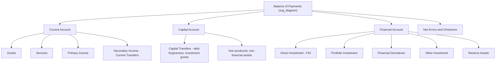

## The Current Account, Capital Account, and Financial Account

### Overview

The balance of payments (BOP) is a systematic record of all economic transactions between residents of a country and residents of the rest of the world over a given period, typically a quarter or year. It is structured around three principal accounts — the **current account**, the **capital account**, and the **financial account** — each capturing a distinct category of cross-border economic activity. Together, under the double-entry accounting convention used in BOP statistics, these accounts must sum to zero (subject to a statistical discrepancy term), reflecting the fundamental accounting identity that every transaction generates two offsetting entries.

### The Balance of Payments Accounting Framework

**Key Points**

- BOP statistics follow the **IMF's Balance of Payments and International Investment Position Manual (BPM6)**, the current international standard
- Every international transaction is recorded twice: once as a **credit** (inflow, recorded with a positive sign — exports, income receipts, incurring of foreign liabilities) and once as a **debit** (outflow, negative sign — imports, income payments, acquisition of foreign assets)
- This double-entry structure ensures that, in principle, the overall balance of payments always balances to zero; in practice, a **statistical discrepancy / net errors and omissions** line reconciles imperfect data collection

### Fundamental BOP Identity

$$\text{Current Account} + \text{Capital Account} + \text{Financial Account} + \text{Net Errors and Omissions} = 0$$

Under BPM6 sign conventions, the financial account is typically presented such that a **surplus in the current and capital accounts** corresponds to **net lending to the rest of the world** (net acquisition of foreign financial assets), while a **deficit** corresponds to **net borrowing from the rest of the world**.

### The Current Account

**Definition**

The current account records transactions in **goods, services, primary income, and secondary income** between residents and non-residents. It captures the flow of real resources and current income across borders.

**Components**

**1. Goods (Merchandise Trade)**

- Exports and imports of physical, tangible products
- The difference between goods exports and imports is the **merchandise trade balance**

**2. Services**

- Cross-border trade in intangibles: transportation, travel/tourism, financial services, insurance, telecommunications, construction, royalties and licensing fees, and other business services
- Combined with goods, forms the overall **trade balance**

**3. Primary Income**

- Income associated with the use of factors of production across borders
- **Compensation of employees**: wages earned by cross-border/seasonal workers
- **Investment income**: dividends, interest, and reinvested earnings on foreign direct investment (FDI), portfolio investment, and other investment
- Distinguished from "capital" in the everyday sense — this is *return on* capital, not capital transfers themselves

**4. Secondary Income (Current Transfers)**

- Transactions where one party provides real resources or financial items to another **without receiving anything of economic value in return**, and where the transfer does not affect the capital stock
- Examples: workers' remittances, foreign aid grants for current spending, pension payments, and international organization dues

### Current Account Balance Formula

$$CA = (X - M) + NY + NCT$$

Where $X$ is exports of goods and services, $M$ is imports of goods and services, $NY$ is net primary income from abroad, and $NCT$ is net secondary income (current transfers).

### Example: Current Account Entries

| Transaction | Component | Credit/Debit |
| --- | --- | --- |
| Domestic firm exports machinery to Germany | Goods | Credit |
| Resident travels abroad and pays for hotel | Services (travel) | Debit |
| Domestic firm receives dividend from foreign subsidiary | Primary income | Credit |
| Migrant worker sends remittance to family abroad | Secondary income | Debit |

### The Capital Account

**Definition**

Under BPM6, the capital account is a **much narrower and less prominent category** than commonly assumed from its name — it should not be confused with the financial account (a common source of confusion given older BOP terminology, particularly pre-BPM6 U.S. presentations that used "capital account" to refer to what is now the financial account).

**Components**

**1. Capital Transfers**

- Transfers involving the transfer of ownership of a fixed asset, or transfers linked to (or conditional on) the acquisition/disposal of a fixed asset
- Examples: debt forgiveness, investment grants (e.g., a foreign government funding a resident's fixed capital purchase), and migrants' capital transfers

**2. Acquisition/Disposal of Non-Produced, Non-Financial Assets**

- Examples: transactions in **natural resources** (rights to natural resources located within a territory), **marketing assets** (trademarks, brand names), and other transferable contracts, leases, or licenses that are not produced assets

**Key Points**

- The capital account is typically the **smallest** of the three accounts in most countries' BOP statistics, often a minor line item relative to current and financial account flows
- [Inference] Its narrow scope is precisely why it is frequently absent or negligible in simplified BOP presentations, which sometimes causes students to conflate "capital account" loosely with "financial account" — a terminological legacy of pre-BPM6 conventions that persists informally in some textbooks and media

### The Financial Account

**Definition**

The financial account records transactions that result in a **change in ownership of financial assets and liabilities** between residents and non-residents — essentially, cross-border **investment and financing flows**. This is the account most people colloquially (but technically incorrectly, under BPM6) refer to as the "capital account."

**Components by Functional Category**

**1. Direct Investment (FDI)**

- Investment reflecting a **lasting interest and significant degree of influence** by a resident entity in an enterprise in another economy
- Conventionally, ownership of 10% or more of voting power is the threshold distinguishing direct investment from portfolio investment
- Includes equity capital, reinvested earnings, and inter-company debt

**2. Portfolio Investment**

- Cross-border transactions in **equity and debt securities** that do not meet the direct investment ownership threshold, and are not classified as reserve assets
- Includes shares, bonds, notes, and money market instruments held primarily for financial return rather than control

**3. Financial Derivatives (and Employee Stock Options)**

- Instruments whose value derives from an underlying reference item (currencies, interest rates, commodities, equities)
- Recorded separately due to their distinct valuation and risk characteristics

**4. Other Investment**

- A residual category covering transactions not classified elsewhere: trade credits and advances, loans, currency and deposits, and other accounts receivable/payable

**5. Reserve Assets**

- Foreign assets readily available to and controlled by monetary authorities for financing BOP needs, intervention in exchange markets, and other purposes
- Includes monetary gold, Special Drawing Rights (SDRs), reserve position in the IMF, and foreign currency reserves
- Changes in reserve assets are a critical link to exchange rate policy, particularly under fixed or managed exchange rate regimes

### Diagram: Balance of Payments Structure

### The Interconnection: Why the Accounts Must Balance

**Key Points**

- Every transaction that generates a current account entry has an offsetting financial (or capital) account entry, because payment for goods/services/income must be settled through some financial instrument
- Example: if a domestic firm exports $1 million of goods (current account credit), and the foreign buyer pays via a bank transfer, the domestic firm's foreign bank deposit rises — this is recorded as a financial account debit (net acquisition of a foreign financial asset), balancing the transaction
- This identity underlies the frequently cited relationship: a country running a **current account deficit** is, by construction, running an offsetting **financial account surplus** (net borrowing from/net liabilities to the rest of the world) of a corresponding magnitude, net of capital account flows and the statistical discrepancy

### Relationship to National Saving and Investment

**Key Points**

- The current account balance is macroeconomically linked to the gap between national saving ($S$) and domestic investment ($I$):

$$CA = S - I$$

- A current account deficit implies that a country's domestic investment exceeds its national saving, with the shortfall financed by net capital inflows recorded in the financial account (borrowing from abroad)
- [Inference] This identity is why current account deficits are not inherently "bad" in a normative sense — a fast-growing, capital-scarce economy that borrows abroad to fund productive investment may run persistent, sustainable current account deficits, whereas a deficit driven by low national saving to fund consumption is often viewed as a different (and potentially more concerning) macroeconomic pattern

### Sign Conventions and Interpretation Under BPM6

**Key Points**

- BPM6 introduced a convention where financial account transactions are presented on a **net acquisition of assets minus net incurrence of liabilities** basis
- A **positive** financial account balance under this convention indicates the country is a **net lender** to the rest of the world (net outflow of capital / net purchase of foreign assets)
- A **negative** financial account balance indicates the country is a **net borrower** (net inflow of capital / net sale of assets or liabilities to foreigners)
- This BPM6 convention represented a shift from the older BPM5 presentation, which some countries' statistical agencies (including, historically, the U.S. Bureau of Economic Analysis in certain presentations) took time to fully align with — behavior in specific national statistical releases may vary in how prominently this sign convention is displayed

### Example: A Country's Simplified BOP Summary

| Account | Balance (USD billions) |
| --- | --- |
| Current Account | −50 (deficit) |
| Capital Account | +2 |
| Financial Account | −49 (net borrowing, using inflow-positive convention) |
| Net Errors and Omissions | −1 |
| **Total** | **0** |

This illustrates a country running a current account deficit financed predominantly through net financial inflows (foreign investment and borrowing), with a small capital account contribution and a modest statistical discrepancy.

### Practical Uses of BOP Accounts

**Key Points**

- **Current account balance**: used to assess a country's external competitiveness, trade dependence, and net international income position
- **Financial account composition**: used to assess vulnerability to capital flow volatility — countries relying heavily on volatile portfolio investment or short-term "other investment" flows are generally considered more exposed to sudden stops than those financed primarily through stable FDI
- **Reserve asset changes**: central to understanding exchange rate intervention, particularly for countries operating fixed, pegged, or managed exchange rate regimes
- BOP data feeds directly into the calculation of a country's **International Investment Position (IIP)**, the stock counterpart to the BOP's flow measures, recording the value of a country's external financial assets and liabilities at a point in time

### Conclusion

The current account, capital account, and financial account together provide the structural accounting framework through which international economists track a country's real and financial engagement with the rest of the world. The current account captures flows of goods, services, income, and transfers; the capital account — often the smallest and most frequently overlooked category — captures capital transfers and non-produced, non-financial asset transactions; and the financial account captures cross-border investment and financing flows across direct investment, portfolio investment, derivatives, other investment, and reserve assets. Because BOP accounting is fundamentally double-entry, these accounts are mechanically linked: a current account deficit is definitionally financed by an offsetting net financial inflow, making the balance of payments not three independent measures but three interlocking views of the same underlying set of cross-border transactions.

**Related Topics**

- The saving-investment identity and current account sustainability
- International Investment Position (IIP) as the BOP's stock counterpart
- BPM6 sign conventions and their evolution from BPM5
- Foreign direct investment versus portfolio investment distinctions
- Exchange rate regimes and reserve asset management
- "Sudden stop" crises and financial account composition risk
- Twin deficits hypothesis (fiscal and current account deficits)