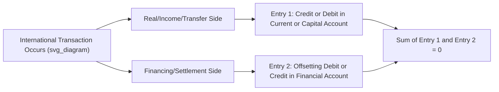

## Double Entry Bookkeeping in the Balance of Payments

### Overview

Double-entry bookkeeping is the accounting methodology that underlies all balance of payments (BOP) statistics. Every international economic transaction between a resident and a non-resident is recorded as **two offsetting entries** of equal value — a **credit** and a **debit** — ensuring that the BOP always balances by construction. Understanding this convention is essential to correctly interpreting current, capital, and financial account balances, as well as recognizing why BOP "deficits" and "surpluses" are partial-account concepts rather than reflections of true accounting imbalance.

### The Core Principle

**Key Points**

- Derived from standard double-entry accounting used in business bookkeeping, applied by the IMF's **Balance of Payments and International Investment Position Manual (BPM6)** to international transactions
- Every transaction generates two entries of **equal value but opposite sign**: one entry records the real or financial resource that moves, the other records the corresponding payment or offsetting claim
- Because every transaction is captured twice, the sum of all credit entries must equal the sum of all debit entries **by definition** — this is a structural accounting fact, not an empirical observation subject to testing

### Credits and Debits Defined

**Credit entries (recorded with a positive sign)** represent transactions that bring value into the country or reduce the country's net foreign asset position in the sense of generating an inflow-type claim:

- Exports of goods and services
- Income received from abroad (primary income)
- Transfers received from abroad (secondary income)
- Increase in liabilities to non-residents (e.g., foreigners buying domestic bonds)
- Decrease in claims on non-residents (e.g., selling foreign assets)

**Debit entries (recorded with a negative sign)** represent transactions that send value abroad or increase the country's claims on foreigners:

- Imports of goods and services
- Income paid abroad
- Transfers paid abroad
- Increase in claims on non-residents (e.g., domestic residents buying foreign bonds)
- Decrease in liabilities to non-residents (e.g., repaying foreign debt)

### Worked Example: A Single Transaction, Two Entries

Consider a domestic firm exporting $1 million worth of machinery to a foreign buyer, paid via a wire transfer into the domestic firm's account at a foreign bank.

| Entry | Account | Type | Value |
| --- | --- | --- | --- |
| 1. Machinery leaves the country | Current Account — Goods (export) | Credit | +$1,000,000 |
| 2. Domestic firm's foreign bank deposit increases | Financial Account — Other Investment (claim on non-resident) | Debit | −$1,000,000 |

**Key Points**

- The export itself is a **credit** in the current account (value flowing out of the country in real terms, but recorded as a credit because it is a receivable/inflow-generating transaction)
- The corresponding rise in the exporter's foreign bank balance is a **debit** in the financial account, because the domestic resident has acquired a foreign financial asset (a claim on a non-resident)
- Net effect on the overall BOP: **zero** — the two entries offset exactly

### Worked Example: An Import Financed by Foreign Borrowing

A domestic importer purchases $500,000 of oil from abroad, financed by drawing down a foreign-currency loan from a foreign bank.

| Entry | Account | Type | Value |
| --- | --- | --- | --- |
| 1. Oil enters the country | Current Account — Goods (import) | Debit | −$500,000 |
| 2. Domestic firm's liability to the foreign bank increases | Financial Account — Other Investment (liability to non-resident) | Credit | +$500,000 |

Here, the import is a debit (value flowing into the country but recorded as a debit reflecting a payable/outflow-generating transaction), offset by a credit in the financial account since the domestic economy has incurred a new liability to a non-resident.

### Why "Deficit" and "Surplus" Still Make Sense Despite Zero-Sum Accounting

**Key Points**

- Although the **overall** balance of payments always nets to zero, individual **sub-accounts** (current account, capital account, financial account, or components within them) can and do show deficits or surpluses
- A "current account deficit" means the current account's own credits fall short of its own debits — this deficit is, by the logic of double-entry accounting, necessarily offset by a surplus (net inflow) elsewhere in the capital and financial accounts
- [Inference] This is the accounting basis for the frequently cited statement that a current account deficit "must be financed" by capital/financial inflows — it is not merely a macroeconomic tendency but a direct mechanical consequence of double-entry recording

### Diagram: Double-Entry Flow for a Single Transaction

### The Role of Net Errors and Omissions

**Key Points**

- In theory, the sum of all credits and debits across the current, capital, and financial accounts should be exactly zero
- In practice, BOP compilers rely on different data sources for different transaction types (customs records for goods, survey data for services, banking records for financial flows), which are collected at different times, with different degrees of accuracy, and are rarely perfectly reconciled
- The resulting imbalance is captured in a residual line item, **Net Errors and Omissions**, which forces the accounts to balance to zero as reported, while flagging the extent of underlying measurement imperfection
- A persistently large Net Errors and Omissions figure can itself be informative — for instance, it is sometimes used by analysts as an indirect indicator of unrecorded capital flight or informal/illicit financial flows, though such interpretations require caution and corroborating evidence

### Functional Categories and Their Entry Logic

**Key Points**

- **Current account transactions** (goods, services, primary income, secondary income) are typically financed or settled via financial account entries — this is the most common linkage encountered in examples
- **Capital account transactions** (capital transfers, non-produced non-financial assets) similarly generate offsetting financial account entries when a real or non-financial asset transfer requires a corresponding payment or claim adjustment
- **Financial account-to-financial account entries** also occur: for example, a domestic resident selling a foreign bond (debit reduces a claim on non-residents / credit increases another financial asset such as cash) — illustrating that double-entry logic applies *within* as well as *across* the three principal accounts

### Common Misunderstanding: "The BOP Must Balance" vs. "Sub-Balances Can Diverge"

**Key Points**

- A frequent conceptual error is treating "the balance of payments always balances" as implying that a country cannot run persistent current account deficits or surpluses — this conflates the *overall* double-entry identity with the *composition* of the accounts
- The overall BOP balancing to zero is a **tautological accounting identity**; the current account balance, financial account balance, and their sustainability are **substantive economic questions** about saving, investment, competitiveness, and capital flows that the accounting identity does not resolve
- [Inference] This distinction is pedagogically important: students sometimes infer that "the BOP always balances" means BOP imbalances are not a meaningful economic phenomenon, when in fact double-entry accounting is precisely what allows economists to identify *how* an economy's real transactions are being financed — the analytically interesting content lies in the *composition*, not the zero-sum total

### Comparative Table: Debit vs. Credit by Transaction Type

| Transaction Type | Recorded As | Account |
| --- | --- | --- |
| Export of goods/services | Credit | Current |
| Import of goods/services | Debit | Current |
| Income received from abroad | Credit | Current |
| Income paid abroad | Debit | Current |
| Remittance received | Credit | Current |
| Remittance sent | Debit | Current |
| Debt forgiven by foreign creditor | Credit | Capital |
| Foreigner buys domestic bond (incurs domestic liability) | Credit | Financial |
| Resident buys foreign bond (acquires foreign asset) | Debit | Financial |
| Resident repays foreign loan (reduces liability) | Debit | Financial |
| Foreign investor repatriates funds (reduces domestic liability) | Debit | Financial |

### Conclusion

Double-entry bookkeeping is the structural foundation of balance of payments accounting: every cross-border transaction is recorded twice, as an offsetting credit and debit, guaranteeing that the overall balance of payments sums to zero by construction (net of a statistical discrepancy). This mechanical property does not mean BOP imbalances are economically meaningless — rather, it clarifies precisely how apparent imbalances in one account (such as a current account deficit) are necessarily mirrored by offsetting flows elsewhere in the accounts (typically the financial account), providing the analytical basis for understanding how a country's real economic activity with the rest of the world is financed.

**Related Topics**

- The current account, capital account, and financial account (component detail)
- Net errors and omissions and data reconciliation challenges in BOP compilation
- The saving-investment identity and current account sustainability
- International Investment Position (IIP) as the stock counterpart to BOP flows
- BPM6 versus BPM5 accounting conventions
- Capital flight and informal financial flow estimation methods