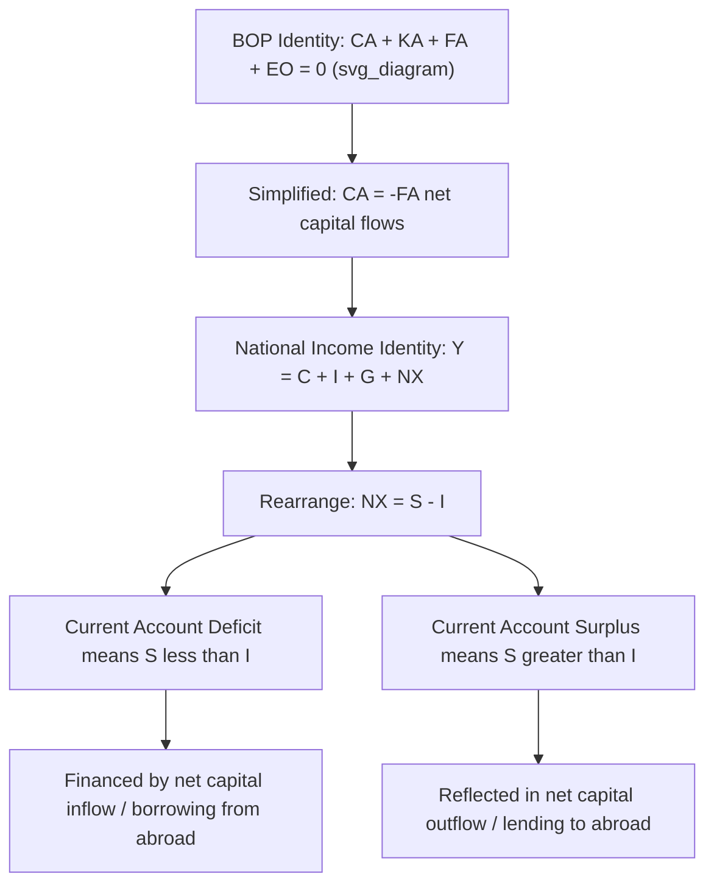

## The Balance of Payments Identity

### Overview

The balance of payments identity is the formal accounting relationship stating that the sum of the current account, capital account, and financial account — net of statistical discrepancies — must equal zero. This identity is not an empirical regularity but a mathematical consequence of double-entry recording applied to international transactions. It serves as the foundation for deriving several of the most important relationships in open-economy macroeconomics, including the link between the current account and national saving/investment, and the mechanics of exchange rate regimes.

### Formal Statement of the Identity

$$CA + KA + FA + EO = 0$$

Where $CA$ is the current account balance, $KA$ is the capital account balance, $FA$ is the financial account balance, and $EO$ is net errors and omissions (the statistical reconciliation term).

**Key Points**

- This identity holds **by construction** for any country in any period, given the double-entry accounting convention underlying BOP compilation
- It should be distinguished from a *behavioral* or *equilibrium* relationship — it is true regardless of economic conditions, policy, or exchange rate regime, because it reflects an accounting tautology rather than an economic mechanism
- The sign convention for the financial account matters for correct interpretation: under BPM6, a positive financial account balance denotes **net lending** (net acquisition of foreign assets), while a negative balance denotes **net borrowing** (net incurrence of foreign liabilities)

### Alternative, Simplified Presentation

In many textbook treatments — particularly at the introductory level, and in older BPM5-based conventions still used informally — the capital account is folded into the financial account or omitted due to its small size, yielding the widely used simplified form:

$$CA = -FA$$

or, in the sign convention where the financial account is expressed as net capital inflows ($KI$):

$$CA + KI = 0 \quad \Rightarrow \quad CA = -KI$$

**Key Points**

- This simplified identity is the most commonly cited form in international economics courses: **a current account deficit is exactly offset by net capital inflows (borrowing from abroad), and a current account surplus is exactly offset by net capital outflows (lending to the rest of the world)**
- [Inference] This simplification is pedagogically useful but can obscure the formal three-way BPM6 structure; students should understand that the "capital account" in this simplified formula is colloquially referring to what BPM6 formally calls the financial account, not the (much smaller) BPM6 capital account

### Deriving the Saving-Investment Identity

The BOP identity connects directly to the national income accounting identity, providing one of the most important results in open-economy macroeconomics.

**Starting from the national income identity:**

$$Y = C + I + G + (X - M)$$

Where $Y$ is national income/output, $C$ is consumption, $I$ is investment, $G$ is government spending, and $(X-M)$ is net exports (approximately the current account balance, ignoring primary/secondary income for simplicity).

**Rearranging:**

$$(X - M) = Y - C - G - I$$

**Defining national saving** $S = Y - C - G$ (private plus public saving):

$$CA \approx X - M = S - I$$

**Key Points**

- This identity states that a country's current account balance equals the gap between its national saving and domestic investment
- A **current account deficit** ($CA < 0$) implies $S < I$: the country is investing more than it saves domestically, with the shortfall financed by borrowing from abroad (a financial account inflow)
- A **current account surplus** ($CA > 0$) implies $S > I$: the country saves more than it invests domestically, with the excess saving flowing abroad as net lending (a financial account outflow)
- This identity directly links the BOP identity (a purely accounting relationship) to macroeconomic fundamentals (saving and investment behavior), even though the BOP identity itself carries no causal information about *why* saving and investment diverge

### Diagram: From BOP Identity to Saving-Investment Identity

### The BOP Identity Under Different Exchange Rate Regimes

**Under a Floating Exchange Rate Regime**

**Key Points**

- With a freely floating exchange rate and no central bank intervention, reserve asset transactions are effectively zero (or negligible), so the exchange rate itself adjusts to clear the market and ensure the identity holds without requiring official reserve movements
- The current account and non-reserve financial account flows adjust to balance each other primarily through price (exchange rate) movements rather than through official financing

**Under a Fixed or Managed Exchange Rate Regime**

**Key Points**

- The central bank actively buys or sells foreign exchange reserves to maintain the pegged rate, meaning **reserve asset transactions** become an explicit, policy-driven component of the financial account
- The identity can be expanded to isolate this: $CA + KA + FA_{non\text{-}reserve} = -\Delta \text{Reserves}$
- A country running persistent current account deficits under a fixed exchange rate, without sufficient offsetting private capital inflows, will see its central bank draw down foreign exchange reserves — a dynamic that is unsustainable in the long run and historically a common precursor to currency crises
- [Inference] This expanded form of the identity is central to understanding balance of payments crises: when reserves are depleted below a level sufficient to defend the peg, the fixed exchange rate typically becomes unsustainable, often precipitating a devaluation or crisis-driven float

### Example: Applying the Identity Numerically

Suppose a country reports the following (in USD billions) for a given year:

| Account | Value |
| --- | --- |
| Current Account | −40 |
| Capital Account | +1 |
| Financial Account (BPM6 convention) | ? |
| Net Errors and Omissions | −0.5 |

Using the identity $CA + KA + FA + EO = 0$:

$$-40 + 1 + FA - 0.5 = 0$$

$$FA = 39.5$$

Under the BPM6 convention where a positive financial account indicates net lending, a positive value alongside a current account deficit might initially seem counterintuitive — this underscores the importance of confirming which sign convention (net lending vs. net borrowing presentation) a given dataset uses before interpreting the financial account figure. In many practical presentations, statistical agencies instead report the financial account such that it directly offsets the current account (i.e., as net borrowing, yielding $FA = -39.5$ under that alternative convention) — country- and agency-specific labeling should always be checked directly against source documentation.

### Common Analytical Applications of the Identity

**Key Points**

- **Twin deficits hypothesis**: examines the empirical/theoretical relationship between government budget deficits and current account deficits, since $S = S_{private} + S_{government}$, and a larger fiscal deficit (lower government saving) can, holding private saving and investment constant, be associated with a larger current account deficit
- **Sustainability analysis**: economists use the identity to assess whether a country's current account deficit is being financed by stable flows (FDI) versus volatile flows (short-term portfolio or bank debt), which has direct implications for vulnerability to sudden stops
- **Global imbalances debates**: the identity underlies discussions of persistent surplus countries (financing global deficits) and deficit countries (relying on continued capital inflows), a recurring theme in discussions of the pre-2008 financial crisis period and beyond

### Limitations of the Identity as an Analytical Tool

**Key Points**

- Because the BOP identity is a tautology, it cannot by itself explain *causation* — observing that a current account deficit is matched by a financial account surplus does not indicate whether capital inflows are "financing" the deficit or whether domestic saving/investment decisions are "causing" the need for capital inflows; economists debate the direction of causality depending on context (e.g., a "sudden stop" of capital inflows can force a current account adjustment, reversing the more traditional saving-investment-driven narrative)
- [Inference] This causality ambiguity is a genuinely debated methodological issue in open-economy macroeconomics rather than a settled question, and the appropriate interpretation often depends on the specific historical episode and the policy regime in place

### Conclusion

The balance of payments identity — that the current, capital, and financial accounts sum to zero net of statistical discrepancy — is a foundational accounting tautology that nonetheless underpins some of the most substantively important relationships in international economics, most notably the link between the current account and the gap between national saving and investment. While the identity itself carries no causal content, its expanded forms under different exchange rate regimes illuminate the mechanics of reserve accumulation, currency crises, and the financing of external imbalances, making it an essential analytical starting point—rather than an endpoint—for understanding a country's external economic position.

**Related Topics**

- The saving-investment identity and current account determinants
- The current account, capital account, and financial account (component detail)
- Double-entry bookkeeping in the balance of payments
- Twin deficits hypothesis
- Balance of payments crises and reserve depletion dynamics
- Sudden stops and capital flow reversals
- Fixed versus floating exchange rate regimes and BOP adjustment mechanisms