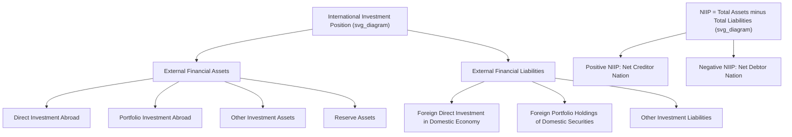

## The Net International Investment Position

### Overview

The Net International Investment Position (NIIP) is the balance sheet counterpart to the balance of payments' flow statistics — it measures the value of a country's stock of external financial assets minus its stock of external financial liabilities at a specific point in time. While BOP flow accounts (current, capital, financial accounts) capture transactions *during* a period, the International Investment Position (IIP) captures the *stock* that results from the accumulation of those transactions plus valuation changes, making it a critical indicator of a country's external wealth or indebtedness.

### Formal Definition

$$NIIP = \text{Stock of External Assets} - \text{Stock of External Liabilities}$$

**Key Points**

- A **positive NIIP** means a country is a **net creditor** to the rest of the world — its residents own more foreign assets than foreigners own of its domestic assets
- A **negative NIIP** means a country is a **net debtor** — foreign claims on the country's assets and liabilities exceed the country's claims on the rest of the world
- The NIIP is measured at **market value** at the reference date (typically end-of-quarter or end-of-year), governed by the IMF's **BPM6** standard, the same manual governing BOP flow statistics

### The Stock-Flow Relationship

**Key Points**

- The NIIP is conceptually analogous to a company's balance sheet, while the BOP financial account is analogous to its cash flow statement
- The change in NIIP between two periods is explained by two distinct forces: **(1) net financial account transactions** during the period (new borrowing/lending flows) and **(2) valuation changes** (exchange rate movements, asset price changes, and other adjustments unrelated to new transactions)

**Reconciliation formula:**

$$NIIP_{t} = NIIP_{t-1} + FA_{t} + \text{Valuation Changes}_{t} + \text{Other Adjustments}_{t}$$

Where $FA_t$ is the financial account balance (net lending/borrowing flow) during the period.

### Components of the International Investment Position

The IIP is broken down by the same functional categories as the financial account:

**1. Direct Investment**

- Stock of FDI assets (domestic residents' ownership stakes abroad) and FDI liabilities (foreign ownership stakes in domestic enterprises), valued at market or, where unavailable, own-funds-at-book-value approximations

**2. Portfolio Investment**

- Stock of equity and debt securities held by residents abroad (assets) versus held by non-residents domestically (liabilities), generally the most volatile component due to market price fluctuations

**3. Financial Derivatives**

- Net position in outstanding derivative contracts

**4. Other Investment**

- Loans, trade credit, currency and deposits, and other claims/liabilities not elsewhere classified

**5. Reserve Assets**

- Held exclusively on the asset side (a country cannot have "reserve liabilities" in the conventional sense), representing monetary authorities' foreign exchange holdings, gold, SDRs, and IMF reserve position

### Diagram: NIIP as the Stock Counterpart to BOP Flows

### Why Valuation Effects Matter

**Key Points**

- Because a large share of the IIP consists of equity, FDI, and long-term debt instruments valued at market prices, a country's NIIP can shift substantially even with **zero** net new financial account transactions, purely due to changes in exchange rates or global asset prices
- Example: if a country holds large foreign-currency-denominated equity assets abroad and the domestic currency depreciates, the domestic-currency value of those foreign assets rises, improving the NIIP even without any new capital flows
- [Inference] This valuation channel has become increasingly significant for major reserve-currency and financial-center economies with large gross external asset and liability positions, since even modest percentage swings in global equity or bond prices can generate NIIP movements of a magnitude comparable to, or exceeding, an entire year's current account flow

### The United States as a Case Study in Valuation Effects

**Key Points**

- [Inference] The U.S. has run persistent current account deficits for decades, which would mechanically be expected to steadily deteriorate its NIIP through accumulated financial account borrowing; however, the U.S. has at various points benefited from favorable valuation effects, partly because U.S. external liabilities are predominantly denominated in its own currency (dollars) while a meaningful share of U.S.-held foreign assets are denominated in foreign currencies and in higher-return equity/FDI instruments — this asymmetry is sometimes referred to informally as the U.S. "exorbitant privilege" in the international monetary system
- This illustrates why analysts caution against inferring a country's NIIP trajectory purely from its current account balance — valuation effects and the currency/instrument composition of gross assets and liabilities can meaningfully offset or amplify the flow-based prediction

### Interpreting Net Creditor vs. Net Debtor Status

**Key Points**

- A negative NIIP is not automatically a sign of economic weakness — a capital-scarce, rapidly growing economy attracting substantial FDI to fund productive investment may sustainably run a negative NIIP for extended periods, similar to how a young worker's borrowing to fund education is not inherently problematic
- Conversely, chronic negative NIIP driven by low national saving to fund consumption (rather than investment) is generally viewed with more concern, since it implies future income must be diverted to service growing external liabilities without a corresponding increase in productive capacity
- Large net creditor positions (positive NIIP), often associated with export-oriented, high-saving economies (historically Japan, Germany, and various oil-exporting economies), reflect sustained current account surpluses accumulated over time and provide a buffer of external claims that can support income in the primary income account of the current account (interest, dividends) even if trade balances shift

### NIIP as a Percentage of GDP: The Standard Comparative Metric

**Key Points**

- Because absolute NIIP figures scale with economy size, cross-country and historical comparisons are typically expressed as **NIIP-to-GDP ratio**
- The IMF and academic literature have historically used NIIP-to-GDP thresholds (commonly cited informally around −60% of GDP, though thresholds vary by study and context) as a rough indicator of heightened external vulnerability, beyond which a country's external debt servicing burden may become a more acute macroeconomic concern
- [Unverified] Specific numeric thresholds cited in various studies should not be treated as bright-line rules; vulnerability depends heavily on the currency denomination, maturity structure, and creditor composition of external liabilities, not simply the aggregate NIIP-to-GDP ratio, and any specific country's current NIIP-to-GDP standing should be verified against current IMF or national statistical data

### Relationship to Current Account and BOP Identity

**Key Points**

- The NIIP is the accumulated result of historical current account balances (via their financial account counterparts) plus valuation adjustments — a useful simplified intuition, though not an exact accounting identity given the role of valuation changes, capital account transfers, and other adjustments (such as debt write-offs or reclassifications) that also affect the stock over time
- Persistent current account deficits tend to push the NIIP more negative over time (all else equal), while persistent surpluses tend to push it more positive — but as the U.S. case illustrates, this relationship can be substantially modified by valuation dynamics over any given period

### Data Sources and Reporting

**Key Points**

- National statistical agencies and central banks compile IIP data according to BPM6 methodology; internationally comparable data is compiled and published by the **IMF** (International Financial Statistics, and country-specific IIP tables)
- Cross-country comparative NIIP data is also compiled in academic external wealth datasets, most notably the **"External Wealth of Nations" database** developed by Lane and Milesi-Ferretti, a widely cited academic resource for historical cross-country NIIP analysis
- [Unverified] For any current, country-specific NIIP figures, readers should consult the IMF's or the relevant national central bank's most recent published data, as these values are revised regularly and can shift meaningfully with market conditions

### Conclusion

The Net International Investment Position provides the essential stock-based complement to the balance of payments' flow-based current, capital, and financial accounts, functioning as a country's external balance sheet at a given point in time. While a country's NIIP trajectory is broadly shaped by the accumulation of historical current account imbalances, valuation effects arising from exchange rate and asset price movements can meaningfully alter the relationship between flow-based current account deficits/surpluses and the resulting stock position — a dynamic vividly illustrated by economies with large, currency-asymmetric gross external asset and liability positions. Understanding the NIIP alongside the BOP flow accounts gives a fuller picture of a country's external financial health than either measure provides in isolation.

**Related Topics**

- The balance of payments identity and its stock-flow reconciliation
- The current account, capital account, and financial account (component detail)
- Valuation effects and the "exorbitant privilege" hypothesis
- External debt sustainability analysis
- The External Wealth of Nations database (Lane and Milesi-Ferretti)
- Net creditor versus net debtor nation dynamics
- Currency composition of external assets and liabilities