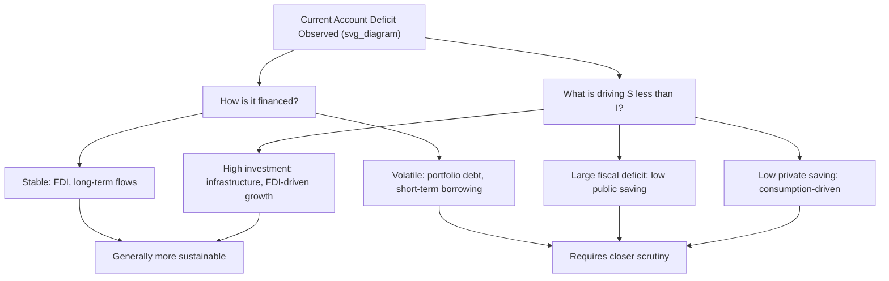

## Interpreting Current Account Surpluses and Deficits

### Overview

A current account balance — whether in surplus or deficit — is a summary statistic that, by itself, conveys limited information about a country's economic health. Correct interpretation requires examining the *underlying drivers* of the balance (saving-investment behavior, stage of development, exchange rate regime), the *composition* of financing flows, and the *sustainability* of the position over time. This topic addresses the analytical frameworks used to move beyond the raw number to a substantive economic assessment.

### The Core Interpretive Framework: Saving Minus Investment

**Key Points**

- As established by the identity $CA = S - I$, a current account deficit mechanically reflects domestic investment exceeding domestic saving, while a surplus reflects saving exceeding investment
- This reframes the interpretive question: rather than asking "is a deficit bad?", the more precise question is "why does $S$ fall short of $I$ (or exceed it), and is that gap likely to persist, widen, narrow, or reverse?"
- The same numeric current account deficit can reflect very different underlying economic stories depending on whether it stems from high investment, low private saving, or a large government deficit (low public saving)

### The "Good Deficit" vs. "Bad Deficit" Distinction

**Good (or "benign") deficits** are typically associated with:

- High domestic investment in productive capacity, infrastructure, or human capital
- A capital-scarce, fast-growing economy attracting foreign investment to fund development
- Financing composed primarily of stable, long-term flows (especially FDI)
- A credible expectation that future growth and export capacity will generate the income needed to service the resulting external liabilities

**Bad (or "concerning") deficits** are typically associated with:

- Low national saving driven by excessive consumption (private or government) rather than investment
- Persistent, large government budget deficits (low public saving) — see the twin deficits discussion below
- Financing composed of volatile, short-term flows (portfolio debt, short-term bank borrowing) vulnerable to sudden reversal
- An overvalued real exchange rate masking underlying competitiveness problems

**Key Points**

- [Inference] This "good deficit/bad deficit" framework, while widely used pedagogically and in policy commentary, is a heuristic rather than a rigorous, universally agreed classification — real-world cases often combine elements of both categories, and reasonable analysts can disagree about which dynamic dominates in a specific country at a specific time

### Financing Composition: Why It Matters as Much as the Balance Itself

**Key Points**

- Two countries with identical current account deficits (as a percentage of GDP) can face very different vulnerability profiles depending on how that deficit is financed
- **FDI-financed deficits** are generally considered more stable: FDI reflects long-term commitments, is harder to reverse quickly, and often comes bundled with technology transfer and productive capacity building
- **Portfolio and short-term debt-financed deficits** are generally considered more vulnerable: these flows can reverse rapidly in response to shifts in investor sentiment, interest rate differentials, or perceived risk, a dynamic central to "sudden stop" crises
- The **Lane-Milesi-Ferretti** and related academic literature on external vulnerability places significant weight on this composition question alongside the headline current account figure

### Diagram: Interpreting a Current Account Deficit

### Stage-of-Development Perspective: The Stages of the Balance of Payments Hypothesis

**Key Points**

- A classic framework (sometimes called the "stages of balance of payments" or life-cycle theory of external balances) suggests countries pass through predictable phases as they develop:
  1. **Young debtor**: capital-scarce, importing capital and running current account deficits to fund investment
  2. **Mature debtor**: current account moves toward balance as export capacity develops and debt service costs rise
  3. **Young creditor**: current account surplus emerges as export competitiveness strengthens and the country begins accumulating net foreign assets
  4. **Mature creditor**: large accumulated net foreign asset position; income from abroad (primary income) becomes a significant contributor to the current account even as the trade balance narrows
  5. **Declining creditor**: as demographics or competitiveness shift, the country may begin drawing down its accumulated net foreign assets
- [Inference] This stylized framework is a useful organizing heuristic rather than a strict empirical law — actual country trajectories deviate substantially due to policy choices, resource endowments, demographic shifts, and global financial conditions, and not all countries pass through the stages in the idealized sequence or timeframe

### The Twin Deficits Hypothesis

**Key Points**

- Examines the relationship between the **government fiscal balance** and the **current account balance**, motivated by the saving-investment identity: since $S = S_{private} + S_{government}$, a larger fiscal deficit (more negative $S_{government}$) can, holding private saving and investment constant, translate into a larger current account deficit
- Empirical support for a tight, mechanical link is mixed: the relationship depends heavily on whether private saving offsets (partially or fully) changes in public saving — a dynamic related to the Ricardian equivalence debate in macroeconomics
- [Inference] Because private saving responses to fiscal policy are empirically contested and vary by country and period, the twin deficits hypothesis is better understood as identifying a *channel* through which fiscal and external balances can be linked, rather than establishing a fixed, universally reliable quantitative relationship

### Exchange Rate and Competitiveness Considerations

**Key Points**

- A persistently large current account deficit can signal an overvalued real exchange rate, where domestic goods and services are priced uncompetitively relative to trading partners, suppressing exports and encouraging imports
- Under floating exchange rate regimes, current account imbalances create pressure for currency depreciation (deficit country) or appreciation (surplus country), which — absent offsetting capital flow dynamics — can act as a self-correcting mechanism over time
- Under fixed or heavily managed exchange rate regimes, this self-correction is suppressed, meaning persistent deficits must instead be financed through reserve depletion or private capital inflows, raising sustainability concerns discussed under the balance of payments identity topic

### Global Imbalances: The Surplus Side of the Interpretive Question

**Key Points**

- Persistent current account surpluses are sometimes framed uncritically as a sign of "competitiveness" or economic strength, but this framing is incomplete — surpluses also reflect a choice (or structural condition) of saving more than investing domestically, effectively **lending** accumulated resources abroad rather than deploying them for domestic consumption or investment
- Large, sustained surplus economies have periodically drawn international policy criticism (e.g., in G20 and IMF discussions of "global imbalances") on the grounds that persistently suppressed domestic demand in surplus countries requires offsetting deficits somewhere else in the global system, given that global current account balances must sum to approximately zero
- [Inference] Whether a given country's surplus reflects "excess" saving warranting policy correction, versus legitimate demographic or structural saving preferences (e.g., aging populations saving for retirement), remains a genuinely contested question in international economic policy debates rather than one with a clear consensus answer

### Sustainability Assessment: Key Questions Analysts Ask

**Key Points**

- Is the deficit financing productive investment, or consumption?
- What is the composition of financing (FDI vs. portfolio vs. short-term debt)?
- Is the country's NIIP-to-GDP ratio deteriorating at a pace that raises debt-servicing concerns?
- Is the real exchange rate aligned with fundamentals, or is it suppressing necessary adjustment?
- What is the currency denomination of external liabilities (own-currency debt is generally less risky than foreign-currency-denominated debt, since it avoids the "balance sheet effect" of currency depreciation raising the local-currency burden of debt)?
- Are capital inflows financing the deficit driven by durable factors (institutional quality, growth prospects) or by potentially reversible factors (interest rate differentials, carry trade dynamics)?

### Example: Contrasting Two Hypothetical Deficit Countries

| Dimension | Country A | Country B |
| --- | --- | --- |
| Current account deficit | −4% of GDP | −4% of GDP |
| Primary driver | High infrastructure investment | Low private saving, consumption-driven |
| Financing composition | 70% FDI | 70% short-term portfolio debt |
| External debt currency | Mostly local currency | Mostly foreign currency |
| NIIP trend | Gradually more negative, investment-linked | Rapidly deteriorating |
| Interpretation | Likely sustainable, growth-supporting | Elevated vulnerability to sudden stop |

Despite identical headline current account deficits, these two profiles carry meaningfully different risk implications — illustrating why the raw balance figure alone is an insufficient basis for assessment.

### Conclusion

Interpreting current account surpluses and deficits requires moving beyond the headline number to examine the underlying saving-investment dynamics, the composition and stability of financing flows, the country's stage of economic development, and the alignment of the real exchange rate with fundamentals. Neither deficits nor surpluses are inherently "good" or "bad" in isolation; a deficit financed by stable FDI and directed toward productive investment can be entirely sustainable, while a superficially similar deficit financed by volatile short-term debt and driven by consumption can signal significant vulnerability. This nuanced, multi-dimensional interpretive approach is central to sound external sector analysis in international economics.

**Related Topics**

- The balance of payments identity and the saving-investment relationship
- The net international investment position and sustainability thresholds
- Sudden stops and capital flow reversals
- The twin deficits hypothesis and Ricardian equivalence debate
- Real exchange rate misalignment and competitiveness
- Global imbalances and G20/IMF policy debates
- Currency composition of external debt and balance sheet effects