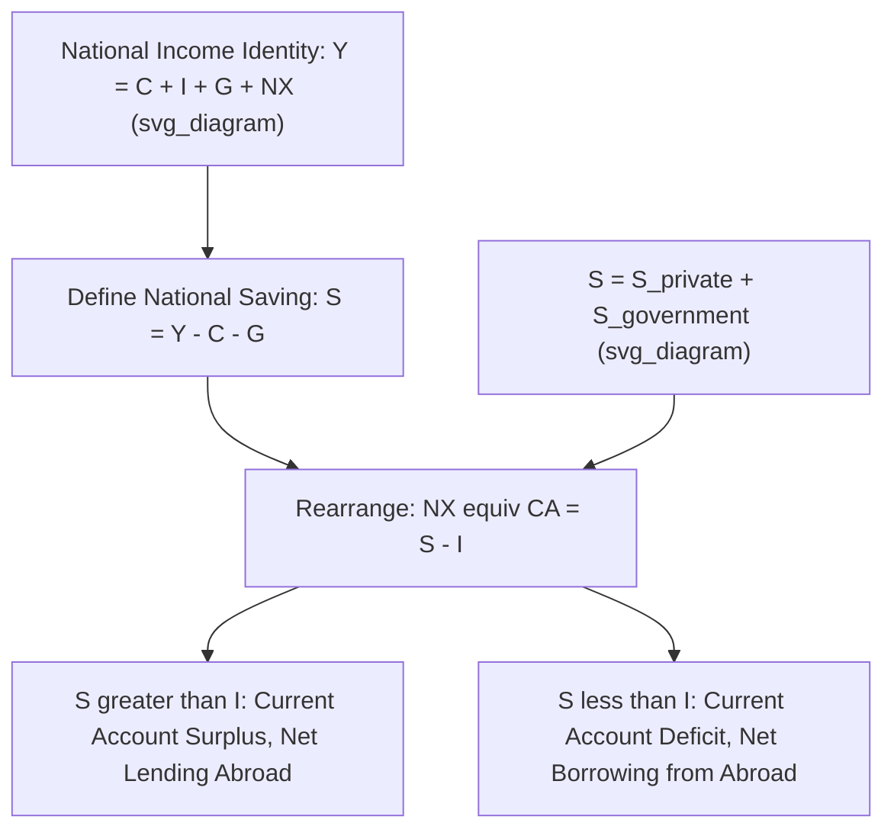

## National Saving, Investment, and the Current Account

### Overview

The relationship between national saving, domestic investment, and the current account is one of the most fundamental identities in open-economy macroeconomics. It formalizes the intuition that a country's external balance is not an isolated trade phenomenon but a direct reflection of the gap between how much a country saves and how much it invests domestically. This framework connects fiscal policy, private sector behavior, and international capital flows into a single coherent accounting structure.

### Deriving the Identity from National Income Accounting

**Starting Point: The Closed-Economy vs. Open-Economy Identity**

In a closed economy, total output equals total spending:

$$Y = C + I + G$$

In an **open economy**, spending can occur on foreign goods (imports) and foreign residents can spend on domestic goods (exports), giving:

$$Y = C + I + G + (X - M)$$

Where $(X - M)$ is net exports, which — abstracting from primary and secondary income for simplicity — closely approximates the current account balance $CA$.

**Rearranging to Isolate the Current Account**

$$CA \approx X - M = Y - C - G - I$$

**Defining National Saving**

National saving $S$ is defined as income not consumed by the private sector or the government:

$$S = Y - C - G$$

This can be decomposed into:

$$S = S_{private} + S_{government}$$

Where $S_{private} = Y - T - C$ (private disposable income minus consumption) and $S_{government} = T - G$ (government revenue minus spending, i.e., the fiscal balance).

**The Resulting Identity**

$$CA = S - I$$

### Economic Interpretation

**Key Points**

- A **current account surplus** ($CA > 0$) implies national saving exceeds domestic investment ($S > I$): the country is generating more saving than it needs for its own domestic investment, and the excess is lent to the rest of the world (a financial account outflow / net acquisition of foreign assets)
- A **current account deficit** ($CA < 0$) implies domestic investment exceeds national saving ($S < I$): the country's investment needs exceed what domestic saving can fund, and the gap is financed by borrowing from abroad (a financial account inflow / net incurrence of foreign liabilities)
- This identity holds by accounting construction — it is not a theory of what *causes* saving, investment, or current account outcomes, but a framework within which behavioral theories of saving and investment can be applied

### Diagram: From National Income to the Current Account

### Decomposing Saving: Private vs. Public

**Key Points**

- $S_{private} = Y - T - C$: income remaining after taxes and consumption, representing household and business saving
- $S_{government} = T - G$: the government fiscal balance; a **budget surplus** contributes positively to national saving, while a **budget deficit** subtracts from it (negative government saving)
- Substituting into the identity: $CA = (S_{private} - I) + S_{government}$
- This decomposition is the analytical foundation of the **twin deficits hypothesis**: holding private saving and investment constant, a larger fiscal deficit mechanically implies a larger current account deficit, though the *actual* empirical relationship depends on how private saving responds to changes in government saving

### The Loanable Funds Perspective

**Key Points**

- The identity can also be understood through a loanable funds lens: domestic investment can be financed either by domestic saving or by foreign saving (borrowing from abroad)
- A current account deficit represents the economy "importing" foreign saving to supplement insufficient domestic saving relative to investment demand
- This framing is useful for understanding capital flows to fast-growing, capital-scarce economies: if domestic saving is insufficient to fund attractive investment opportunities (e.g., infrastructure, industrialization), foreign capital inflows (recorded as a financial account surplus/current account deficit) can supplement the shortfall

### Example: Numerical Illustration

Consider a hypothetical economy with the following figures (as a percentage of GDP):

| Variable | Value (% of GDP) |
| --- | --- |
| Private Saving ($S_{private}$) | 18% |
| Government Balance ($S_{government}$) | −4% (fiscal deficit) |
| National Saving ($S$) | 14% |
| Domestic Investment ($I$) | 20% |
| Current Account ($CA = S - I$) | −6% |

This economy runs a current account deficit of 6% of GDP because its combined national saving (14%) falls short of its investment needs (20%) — driven by both the fiscal deficit and an investment rate exceeding private saving alone.

### Determinants of National Saving

**Key Points**

- **Demographics**: countries with aging populations (higher share of working-age savers relative to dependents) tend to exhibit higher private saving rates, per life-cycle saving theories, though the relationship is debated and varies by country-specific institutional factors (e.g., pension system design)
- **Fiscal policy**: government saving/dissaving directly affects national saving, subject to the degree of Ricardian offset from private saving behavior
- **Income levels and growth expectations**: precautionary saving motives, income uncertainty, and expected future income growth all influence private saving rates
- **Financial system development**: access to credit and financial products can reduce precautionary saving needs in some contexts, or expand saving vehicles (retirement accounts, financial markets) in others
- **Cultural and institutional factors**: cross-country saving rate differences (e.g., historically higher saving rates in several East Asian economies compared to the U.S.) are often attributed to a combination of these structural, demographic, and institutional factors, though the specific weighting of causes remains debated in the literature

### Determinants of Domestic Investment

**Key Points**

- **Expected return on capital**: investment responds to the marginal productivity of capital and expected profitability of projects
- **Cost of capital**: interest rates (domestic and, in an open economy, the global cost of capital available to domestic firms) directly affect investment decisions
- **Institutional quality and property rights**: affects the perceived security of investment returns, influencing both domestic and foreign investment flows
- **Stage of economic development**: capital-scarce developing economies often have higher marginal returns to investment, theoretically attracting capital inflows (per neoclassical growth theory predictions, though empirically this "Lucas Paradox" — capital not flowing as strongly to poorer countries as theory predicts — is a well-documented puzzle in the literature)

### Policy Implications of the Identity

**Key Points**

- Because $CA = S - I$ holds as an identity, policies aimed at "improving the current account" (e.g., tariffs, export subsidies) that do not address the underlying saving-investment gap will tend to be offset elsewhere in the macroeconomy — for instance, a tariff that reduces imports without changing national saving or investment behavior may, in a flexible exchange rate and open capital account setting, simply trigger currency appreciation or a compositional shift in trade rather than durably reduce the current account deficit
- [Inference] This is a key insight often used in economic commentary on trade policy: because the current account is fundamentally a saving-investment phenomenon rather than purely a trade-policy phenomenon, addressing a persistent current account imbalance is generally understood to require macroeconomic-level changes (fiscal policy, saving incentives) rather than trade-policy measures alone — though there is continued debate among economists regarding the magnitude, timing, and completeness of such offsetting adjustments in practice, and reasonable disagreement exists about the short-run effectiveness of targeted trade measures under specific conditions (e.g., non-flexible exchange rates, capital controls)

### Distinguishing the Identity from a Causal Theory

**Key Points**

- The identity $CA = S - I$ does not specify the *direction of causation* — it is equally consistent with a story where changes in fiscal policy (affecting $S$) drive the current account, or a story where foreign capital inflows (perhaps driven by global "push" factors such as low interest rates abroad) drive $I$ and by extension the current account
- This ambiguity is central to debates about so-called "global saving glut" explanations of persistent imbalances (where excess saving in surplus countries is argued to have driven investment and current account deficits in recipient countries) versus more traditional domestic saving-investment gap explanations
- [Inference] Both directions of causality plausibly operate simultaneously and with varying strength depending on the specific historical episode, meaning empirical current account analysis typically requires examining the specific institutional and policy context of a country-period rather than relying solely on the identity itself

### Conclusion

The relationship $CA = S - I$ formalizes the current account as fundamentally a saving-investment phenomenon rather than merely a trade balance statistic, connecting fiscal policy, private saving behavior, and domestic investment demand to a country's external financial position. While the identity holds by accounting construction and therefore cannot itself explain causation, it provides the essential analytical scaffold for understanding why current account imbalances arise, why trade-policy interventions alone are generally considered insufficient to durably correct them, and how fiscal deficits, demographic trends, and investment demand jointly determine a country's reliance on — or provision of — capital to the rest of the world.

**Related Topics**

- The balance of payments identity
- Interpreting current account surpluses and deficits
- The twin deficits hypothesis and Ricardian equivalence
- The "global saving glut" hypothesis
- The Lucas Paradox in international capital flows
- Determinants of national saving rates across countries
- Trade policy effectiveness given macroeconomic identities