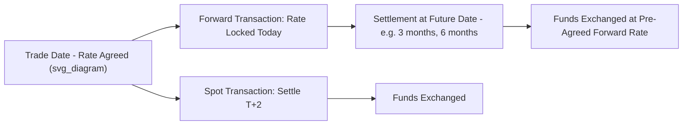

## Spot and Forward Foreign Exchange Markets

### Overview

The foreign exchange (FX) market is the global marketplace where currencies are bought and sold, and it is structured around several distinct transaction types differentiated primarily by settlement timing. The **spot market** governs the near-immediate exchange of currencies, while the **forward market** governs contracts to exchange currencies at a specified future date at a rate agreed upon today. Together, these two market segments form the foundation of currency risk management, exchange rate determination theory, and the broader architecture of international financial markets.

### The Spot Foreign Exchange Market

**Definition**

A spot transaction involves the exchange of two currencies at an agreed rate, with settlement (actual delivery of funds) occurring within a short standard settlement period, most commonly **T+2** (two business days after the trade date) for most major currency pairs.

**Key Points**

- The spot rate is the exchange rate quoted for this near-immediate settlement, and is the rate most commonly referenced in everyday currency price quotations (news reports, currency converter tools, etc.)
- T+2 settlement historically arose from the practical time needed for cross-border payment processing and settlement infrastructure; some currency pairs (e.g., involving certain North American currencies against each other, like USD/CAD) settle T+1
- The spot market is the largest single segment of global FX trading by transaction count, though when measured by notional turnover, FX swaps (combining spot and forward legs) represent the largest category in aggregate BIS triennial survey data

**Spot Rate Quotation Conventions**

- **Direct quotation**: domestic currency per unit of foreign currency (e.g., in the Philippines, PHP per USD)
- **Indirect quotation**: foreign currency per unit of domestic currency
- **Bid-ask spread**: dealers quote a bid (rate at which they buy the base currency) and an ask/offer (rate at which they sell it); the spread compensates the dealer for providing liquidity and bearing inventory risk

### The Forward Foreign Exchange Market

**Definition**

A forward contract is a binding agreement between two parties to exchange a specified amount of one currency for another at a **predetermined exchange rate** (the forward rate) on a **specified future date**, with no exchange of funds until settlement.

**Key Points**

- Forward contracts are traded **over-the-counter (OTC)**, meaning they are customized bilateral agreements between counterparties (typically a bank and a corporate client, or between banks) rather than standardized exchange-traded instruments
- Common standard maturities include 1 week, 1 month, 3 months, 6 months, and 12 months, though **non-standard ("broken date") forwards** can be tailored to any specific future date to match a client's exact cash flow needs
- Forward contracts are used primarily for **hedging** (locking in a known future exchange rate to eliminate currency risk on a known future cash flow) and, to a lesser extent, for speculation

### The Forward Premium and Discount

**Key Points**

- The forward rate is rarely identical to the spot rate; the difference reflects the **interest rate differential** between the two currencies, per **Covered Interest Rate Parity (CIRP)**
- A currency trades at a **forward premium** if its forward rate is more expensive (in terms of the other currency) than its spot rate — typically associated with the currency of the **lower-interest-rate** country
- A currency trades at a **forward discount** if its forward rate is cheaper than its spot rate — typically associated with the currency of the **higher-interest-rate** country

### Covered Interest Rate Parity: The Formal Relationship

$$F = S \times \frac{1 + i_d}{1 + i_f}$$

Where $F$ is the forward rate, $S$ is the spot rate (both expressed as domestic currency per unit of foreign currency), $i_d$ is the domestic interest rate, and $i_f$ is the foreign interest rate, both over the relevant maturity.

**Key Points**

- CIRP holds under the assumption of no arbitrage opportunities, capital mobility, and the absence of significant capital controls or counterparty risk premia
- If CIRP did not hold, an arbitrageur could borrow in the low-interest-rate currency, convert to the high-interest-rate currency at the spot rate, invest at the higher rate, and simultaneously lock in the future conversion back via a forward contract, earning a riskless profit — this arbitrage activity is what enforces the parity condition in liquid, well-functioning markets
- [Inference] Deviations from CIRP ("CIRP violations" or a positive "cross-currency basis") have been observed and studied extensively in academic literature, particularly since the 2008 global financial crisis, generally attributed to balance sheet constraints, regulatory capital costs, and differential counterparty/liquidity risk among major banks rather than the presence of unexploited pure arbitrage

### Diagram: Spot vs. Forward Transaction Timeline

### Example: Calculating a Forward Rate

Suppose the USD/EUR spot rate is 1.1000 (USD per EUR), the 1-year USD interest rate is 5%, and the 1-year EUR interest rate is 3%.

$$F = 1.1000 \times \frac{1 + 0.05}{1 + 0.03} = 1.1000 \times \frac{1.05}{1.03} \approx 1.1214$$

**Interpretation**: The dollar trades at a forward *discount* against the euro (it takes more dollars to buy one euro forward than spot), consistent with the dollar being the higher-interest-rate currency in this example — a higher-interest-rate currency must trade at a forward discount to prevent riskless arbitrage.

### Practical Uses of Forward Contracts

**Hedging (Primary Use)**

- An exporter expecting to receive foreign currency payment in 90 days can sell that currency forward today, locking in the exchange rate and eliminating uncertainty about the domestic-currency value of the future receipt
- An importer with a foreign-currency payment obligation can buy the required currency forward, locking in the cost

**Speculation**

- Traders without an underlying commercial exposure can use forwards to take a directional view on future exchange rate movements, profiting if the eventual spot rate diverges favorably from the locked-in forward rate

**Arbitrage**

- As described under CIRP, forwards are central to covered interest arbitrage strategies exploiting (or, in efficient markets, preventing) deviations from parity

### Non-Deliverable Forwards (NDFs)

**Key Points**

- For currencies subject to capital controls or limited convertibility (historically including various emerging-market currencies), **Non-Deliverable Forwards** allow market participants to hedge or speculate on the currency's movement without physical delivery of the restricted currency
- At settlement, only the **net difference** between the contracted forward rate and the prevailing spot (or an agreed reference) rate is exchanged, typically settled in a fully convertible currency such as USD
- NDFs are widely used for currencies where onshore forward markets are restricted, underdeveloped, or subject to regulatory approval requirements

### Key Distinctions: Spot vs. Forward Markets

| Dimension | Spot Market | Forward Market |
| --- | --- | --- |
| Settlement | Typically T+2 | Specified future date (days to years ahead) |
| Rate determination | Prevailing market rate at trade time | Determined by CIRP relative to spot and interest differential |
| Standardization | Highly standardized, continuous quotation | Customized (OTC); standard tenors available |
| Primary use | Immediate currency conversion needs | Hedging future currency exposure; speculation |
| Price transparency | High, continuously quoted | Lower; derived via dealer quotes and CIRP |
| Counterparty risk | Minimal given short settlement window | Present over the life of the contract; managed via credit lines, collateral, or clearing |

### Relationship to the Broader FX Market Structure

**Key Points**

- Spot and forward transactions are often combined into **FX swaps**, where a party simultaneously executes a spot transaction and an offsetting forward transaction (or two forwards of different maturities) — according to Bank for International Settlements (BIS) triennial surveys, FX swaps represent the largest single instrument category in global FX turnover
- The forward market is also foundational to pricing **currency futures** (exchange-traded, standardized equivalents to forwards) and **currency options**, both of which reference forward pricing principles in their valuation models
- [Unverified] Specific current turnover figures and market share statistics for spot versus forward and swap segments change with each BIS triennial survey cycle; readers seeking current figures should consult the most recent BIS Triennial Central Bank Survey of foreign exchange turnover

### Conclusion

The spot and forward foreign exchange markets together constitute the core infrastructure of international currency trading: the spot market provides near-immediate currency conversion at prevailing market rates, while the forward market allows participants to lock in future exchange rates today, with pricing governed by the no-arbitrage logic of covered interest rate parity. This distinction between immediate and future-dated currency transactions underlies virtually all subsequent topics in international finance, from corporate hedging strategy to the pricing of more complex derivative instruments and the analysis of interest rate parity conditions.

**Related Topics**

- Covered Interest Rate Parity and arbitrage conditions
- Uncovered Interest Rate Parity and the forward premium puzzle
- Currency futures and options as derivative extensions of forward pricing
- FX swaps and their role in global market turnover
- Non-Deliverable Forwards and emerging market currency hedging
- Exchange rate determination theories
- Corporate foreign exchange risk management strategies