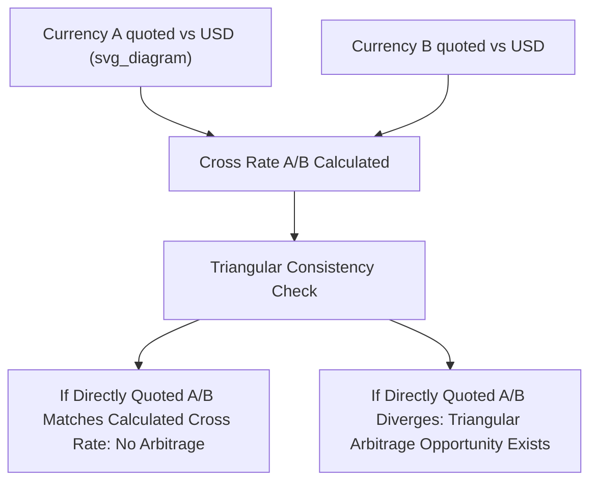

## Exchange Rate Quotations and Cross Rates

### Overview

Exchange rate quotation conventions and cross-rate calculations form the mechanical foundation of foreign exchange trading and analysis. Because currencies can be quoted in multiple equivalent ways, and because most currency pairs are not directly quoted against every other currency, understanding quotation conventions and how to derive **cross rates** (the exchange rate between two currencies neither of which is the quoting currency's home currency) is an essential technical skill in international economics and finance.

### Direct vs. Indirect Quotation

**Direct Quotation**

The domestic currency price of one unit of foreign currency — "how much domestic currency do I need to buy one unit of foreign currency."

**Key Points**

- Example: from a Philippine resident's perspective, PHP 56.50/USD is a direct quote (56.50 pesos per one US dollar)
- Most countries use direct quotation as their standard convention for quoting foreign currencies against their own

**Indirect Quotation**

The foreign currency price of one unit of domestic currency — "how much foreign currency do I get for one unit of domestic currency."

**Key Points**

- Example: from the same Philippine resident's perspective, USD 0.0177/PHP would be an indirect quote
- Indirect and direct quotes are reciprocals of one another: $\text{Indirect} = \frac{1}{\text{Direct}}$

### American Terms vs. European Terms

In global FX market convention (distinct from, but related to, the direct/indirect distinction), quotes are commonly described relative to the US dollar:

**Key Points**

- **American terms**: US dollars per unit of foreign currency (e.g., USD 1.10/EUR) — direct quotation from the U.S. perspective
- **European terms**: units of foreign currency per US dollar (e.g., JPY 150/USD) — indirect quotation from the U.S. perspective
- Certain currencies conventionally trade in American terms in interbank markets regardless of general global convention — historically this includes the British pound, euro, Australian dollar, and New Zealand dollar (quoted as USD per unit of that currency), while most other currencies are quoted in European terms (units per USD)
- [Inference] These market conventions persist for historical reasons tied to the relative importance and trading history of each currency, and traders/analysts should verify the prevailing convention for a specific currency pair rather than assuming uniformity across all pairs

### Bid-Ask (Bid-Offer) Spreads

**Key Points**

- Dealers quote two prices: the **bid** (the rate at which the dealer will buy the base currency) and the **ask/offer** (the rate at which the dealer will sell the base currency)
- The ask is always higher than the bid; the difference is the **bid-ask spread**, which compensates the dealer for providing liquidity, covering operational costs, and bearing inventory/holding risk
- Spreads are typically narrower for highly liquid, frequently traded pairs (e.g., EUR/USD) and wider for less liquid or more volatile pairs (e.g., many emerging market currency pairs)
- Example quote: EUR/USD 1.0850/1.0853 — a dealer buys EUR at 1.0850 and sells EUR at 1.0853, capturing a spread of 0.0003 (3 "pips" in common FX market terminology)

### Currency Pair Notation

**Key Points**

- Standard market convention writes currency pairs as BASE/QUOTE (or BASE/TERMS): e.g., EUR/USD means "how many US dollars per one euro"
- The **base currency** (first listed) is the currency being bought or sold; the **quote currency** (second listed) is the currency used to express the price
- A rise in the EUR/USD rate means the euro has appreciated against the dollar (it now takes more dollars to buy one euro); a fall means the euro has depreciated

### Cross Rates: Definition and Rationale

**Definition**

A cross rate is the exchange rate between two currencies, calculated using each currency's rate against a common third currency (most often the US dollar), when a direct quote between the two currencies is not readily available or when calculating implied consistency across markets.

**Key Points**

- Because the vast majority of global FX trading involves the US dollar as one leg of the transaction (the dollar remains the dominant vehicle currency), direct quotes for many non-dollar currency pairs (e.g., Mexican peso against Japanese yen) are often derived synthetically via the dollar rather than quoted directly in all markets
- Cross-rate calculation ensures **triangular consistency**: if direct quotes for all three pairs (A/B, B/C, A/C) exist simultaneously in the market, the implied and directly quoted cross rates should match; if they diverge, a **triangular arbitrage** opportunity exists

### Cross Rate Calculation Formula

If Currency A and Currency B are both quoted against a common currency C (e.g., USD):

$$\text{Rate}_{A/B} = \frac{\text{Rate}_{A/C}}{\text{Rate}_{B/C}}$$

More concretely, if both rates are expressed as "units of C per unit of A" and "units of C per unit of B":

$$\frac{A}{B} = \frac{A/C}{B/C}$$

### Worked Example: Calculating a Cross Rate

Suppose:

- USD/PHP = 56.50 (56.50 pesos per dollar)
- USD/JPY = 150.00 (150 yen per dollar)

To find the PHP/JPY cross rate (how many yen per peso, or vice versa):

$$\frac{JPY}{PHP} = \frac{USD/JPY}{USD/PHP} = \frac{150.00}{56.50} \approx 2.6549$$

This means 1 Philippine peso ≈ 2.6549 Japanese yen, or equivalently, PHP/JPY ≈ 0.3766 (pesos per yen), calculated as the reciprocal.

### Worked Example: EUR/GBP Cross Rate via USD

Suppose:

- GBP/USD = 1.2650 (1.2650 dollars per pound — GBP quoted in American terms)
- EUR/USD = 1.0850 (1.0850 dollars per euro — EUR quoted in American terms)

To find EUR/GBP:

$$\frac{EUR}{GBP} = \frac{EUR/USD}{GBP/USD} = \frac{1.0850}{1.2650} \approx 0.8577$$

This means 1 euro ≈ 0.8577 British pounds.

### Diagram: Cross Rate Derivation via a Vehicle Currency

### Triangular Arbitrage

**Key Points**

- Triangular arbitrage exploits inconsistencies between three related currency pairs' quoted rates, executing a sequence of three trades (e.g., USD → EUR → GBP → USD) that yields a riskless profit if pricing is misaligned
- In modern, highly liquid, electronically connected FX markets, such opportunities are typically extremely small in magnitude and exist for only fractions of a second, as algorithmic trading systems detect and exploit (thereby eliminating) discrepancies almost instantaneously
- [Inference] The rapid elimination of triangular arbitrage opportunities in liquid markets is generally cited as strong empirical support for market efficiency in major currency pairs, though smaller or less liquid currency pairs may exhibit more persistent, if still typically small, pricing discrepancies

### Common Sources of Confusion in Quotation

**Key Points**

- Students frequently confuse which currency is appreciating when a rate rises or falls — the key check is always to ask which currency is the "base" (first-listed) and which is the "quote" (second-listed) currency in the specific quotation convention being used
- Percentage change calculations differ depending on whether a currency's *direct* or *indirect* quote is used — a currency that depreciates by X% in direct terms does not depreciate by exactly X% in indirect (reciprocal) terms, due to the non-linear nature of reciprocal transformations (the indirect-quote percentage change is technically $\frac{1}{1-X} - 1$, not simply $-X$)
- Rounding conventions and the number of decimal places ("pips") vary by currency pair — most major pairs quote to four decimal places (or two for JPY-based pairs, given the yen's smaller unit value), which matters for precise arbitrage and hedging calculations

### Practical Applications of Cross Rate Calculation

**Key Points**

- **Multinational treasury management**: firms operating in multiple currencies must convert between non-dollar currency pairs even when market liquidity is concentrated in dollar-based quotes
- **Portfolio valuation**: investors holding assets denominated in multiple non-dollar currencies require cross rates to consolidate portfolio value into a single reporting currency
- **Trade invoicing and settlement**: exporters/importers dealing in third-country currencies (neither their home currency nor the counterparty's) rely on cross-rate calculations for accurate pricing and settlement

### Conclusion

Exchange rate quotation conventions — direct versus indirect, American versus European terms, and bid-ask spread mechanics — provide the essential vocabulary for reading and interpreting currency prices correctly, while cross-rate calculation extends this foundation to derive exchange rates between any two currencies via a common vehicle currency, typically the US dollar. Mastery of these mechanics, including the triangular consistency check that underlies arbitrage-free pricing, is a prerequisite for virtually all subsequent analysis of exchange rate behavior, currency risk management, and international financial market structure.

**Related Topics**

- Spot and forward foreign exchange markets
- Triangular arbitrage and market efficiency in FX markets
- Effective exchange rates (nominal and real, trade-weighted)
- The US dollar's role as a global vehicle currency
- Currency risk management for multinational corporations
- Exchange rate regimes and their effect on quotation stability