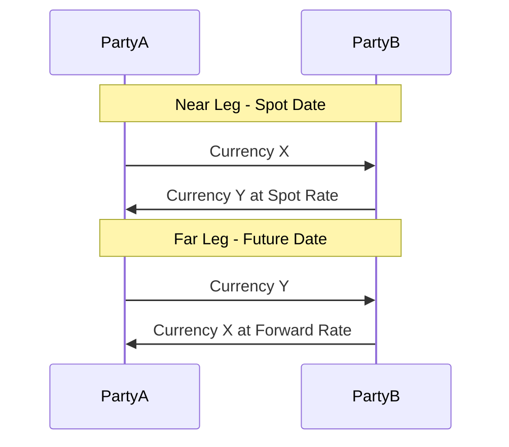
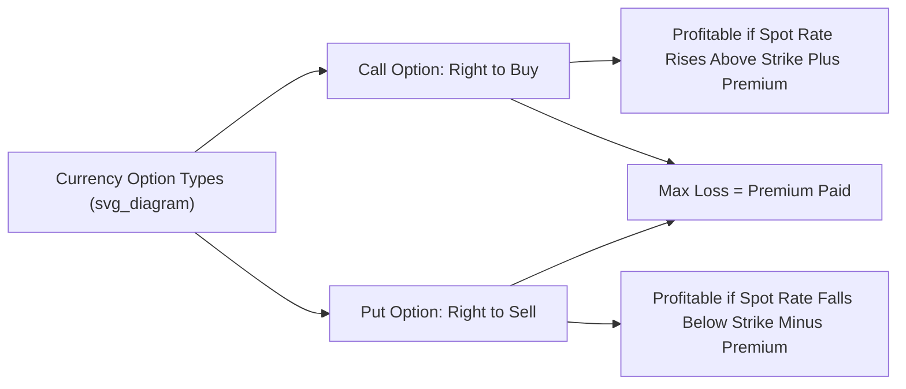

## Foreign Exchange Swaps, Futures, and Options

### Overview

Beyond the basic spot and forward transactions, the foreign exchange market offers a range of more structured derivative instruments — FX swaps, currency futures, and currency options — each serving distinct hedging, financing, and speculative purposes. These instruments differ significantly in their standardization, counterparty risk profile, flexibility, and pricing mechanics, and together they constitute the bulk of institutional and corporate currency risk management activity.

### Foreign Exchange Swaps

**Definition**

An FX swap is a single transaction combining **two simultaneous legs**: a spot (or near-date) transaction to exchange two currencies, and an offsetting forward (or far-date) transaction to reverse that exchange at a later date, both agreed upon at the outset.

**Key Points**

- Unlike a standalone forward contract (which involves only one future exchange), an FX swap involves an exchange now and a re-exchange later, effectively functioning as a **collateralized short-term borrowing/lending arrangement** in two currencies simultaneously
- According to the Bank for International Settlements' triennial surveys, FX swaps consistently represent the **largest single instrument category** in global FX market turnover, exceeding spot transactions in notional terms
- Primarily used by banks, corporations, and institutional investors to manage short-term currency funding needs, roll over hedging positions, and manage liquidity across currency-denominated balance sheets, rather than for outright speculative directional currency bets

**Structure of a Basic FX Swap**

1. **Near leg**: Party A exchanges Currency X for Currency Y with Party B at the current spot rate
2. **Far leg**: On a specified future date, the parties reverse the exchange — Party A returns Currency Y for Currency X — at a **pre-agreed forward rate** (calculated via covered interest rate parity, incorporating the "swap points" or forward premium/discount)

**Key Points**

- The difference between the near-leg rate and far-leg rate is called the **swap points**, reflecting the interest rate differential between the two currencies over the swap's tenor — mechanically the same underlying relationship as the standalone forward premium/discount discussed in forward market pricing
- FX swaps are widely used by central banks as well — **central bank liquidity swap lines** (e.g., those maintained among major central banks including the Federal Reserve, ECB, and others) allow central banks to provide foreign-currency liquidity to their domestic banking systems during periods of market stress, functioning on the same basic swap logic at the official sector level

### Diagram: FX Swap Structure

### Currency Futures

**Definition**

A currency future is a **standardized, exchange-traded** contract obligating the buyer to purchase (or the seller to sell) a specified quantity of a currency at a predetermined price on a specified future date.

**Key Distinctions from Forward Contracts**

| Dimension | Currency Forward | Currency Future |
| --- | --- | --- |
| Trading venue | OTC (bilateral, dealer-based) | Exchange-traded (e.g., CME) |
| Standardization | Fully customizable (amount, date) | Standardized contract size and expiry dates |
| Counterparty risk | Bilateral counterparty exposure | Mitigated via central clearinghouse |
| Margin requirements | Typically none (credit-based) or negotiated collateral | Daily mark-to-market with margin/variation margin |
| Liquidity | Varies by currency pair and counterparty relationships | Generally high for major currency futures, standardized order book |
| Typical users | Banks, large corporates with specific hedging needs | Speculators, hedge funds, some corporates, retail-adjacent institutional traders |

**Key Points**

- The largest and most liquid currency futures market is operated by the **CME Group (Chicago Mercantile Exchange)**, offering standardized contracts on major currency pairs (EUR/USD, GBP/USD, JPY/USD, and others) with fixed contract sizes and quarterly expiration cycles
- Because futures are exchange-traded and centrally cleared, they carry substantially reduced counterparty (default) risk compared to OTC forwards, at the cost of reduced flexibility in contract terms
- **Daily mark-to-market** and margin requirements mean futures positions generate ongoing cash flow implications (margin calls) during the life of the contract, unlike forwards which typically settle only at maturity — this is an important practical distinction for cash flow planning

### Currency Options

**Definition**

A currency option gives the holder the **right, but not the obligation**, to buy (call option) or sell (put option) a specified amount of currency at a predetermined exchange rate (the **strike price**) on or before a specified expiration date, in exchange for an upfront **premium** paid to the option writer/seller.

**Key Points**

- **Call option**: gives the holder the right to *buy* the underlying currency at the strike price — valuable if the currency appreciates above the strike
- **Put option**: gives the holder the right to *sell* the underlying currency at the strike price — valuable if the currency depreciates below the strike
- **American-style options** can be exercised any time up to expiration; **European-style options** can only be exercised at expiration — both styles are traded in FX options markets, with European-style often more common in OTC institutional markets
- Unlike forwards and futures (which obligate both parties to transact), options provide **asymmetric risk**: the buyer's maximum loss is limited to the premium paid, while the potential gain is theoretically unlimited (for calls) or substantial (for puts), making options attractive for hedging against adverse currency moves while retaining upside participation if the currency moves favorably

### Currency Option Payoff Logic

**For a call option holder:**

$$\text{Payoff} = \max(S_T - K, 0) - \text{Premium}$$

**For a put option holder:**

$$\text{Payoff} = \max(K - S_T, 0) - \text{Premium}$$

Where $S_T$ is the spot exchange rate at expiration and $K$ is the strike price.

### Diagram: Currency Option Payoff Profiles

### Option Pricing Considerations

**Key Points**

- Currency option pricing is commonly modeled via extensions of the **Garman-Kohlhagen model**, an adaptation of the Black-Scholes framework specifically designed for FX options that accounts for **two** interest rates (domestic and foreign) rather than a single risk-free rate, reflecting the fact that both currencies in the pair earn their own respective interest rate
- Key pricing determinants ("the Greeks" in options terminology) include: spot rate, strike price, time to expiration, volatility of the exchange rate, and both domestic and foreign interest rates
- [Inference] Because currency option pricing depends on volatility, which is unobservable and must be estimated or implied from market prices, FX options markets are often analyzed through the lens of "implied volatility surfaces" — a topic of practical importance in trading and risk management that extends beyond basic parity-based pricing

### Comparative Summary: Swaps, Futures, and Options

| Instrument | Obligation | Standardization | Primary Use Case | Key Risk Feature |
| --- | --- | --- | --- | --- |
| FX Swap | Both legs obligatory | Customizable, OTC | Short-term currency funding/liquidity management | Counterparty risk on both legs |
| Currency Future | Obligatory at expiration | Standardized, exchange-traded | Speculation, standardized hedging | Daily margin/mark-to-market |
| Currency Option | Right, not obligation (buyer); Obligation if exercised (seller) | Both OTC and exchange-traded variants exist | Asymmetric hedging, retaining upside | Premium cost; seller has unlimited risk |

### Practical Example: Comparing Hedging Approaches

Consider a Philippine importer expecting to pay USD 1,000,000 in three months.

**Key Points**

- **Forward hedge**: locks in today's forward rate for the full amount — eliminates uncertainty entirely, but forgoes any benefit if the peso strengthens (USD becomes cheaper) before payment
- **Futures hedge**: similar economic effect to a forward, but standardized contract sizes may create a residual unhedged amount (basis risk) if USD 1,000,000 doesn't divide evenly into standard contract units, and requires ongoing margin management
- **Options hedge (buying a USD call/PHP put)**: pays an upfront premium for the right to buy USD at a favorable strike rate; if the peso strengthens unexpectedly, the importer can let the option lapse and buy USD more cheaply in the spot market, retaining the upside while capping downside risk at the strike rate plus premium

### Conclusion

FX swaps, futures, and options extend the basic spot-forward framework into a richer toolkit for currency risk management, financing, and speculation. FX swaps function primarily as short-term currency funding instruments combining near and far legs; currency futures offer standardized, exchange-traded, centrally cleared exposure with reduced counterparty risk at the cost of customization; and currency options provide asymmetric risk profiles that allow hedgers to protect against adverse currency movements while retaining upside potential, at the cost of an upfront premium. The choice among these instruments in practice depends on the specific hedging objective, desired flexibility, counterparty risk tolerance, and cost considerations facing the corporate treasurer, investor, or financial institution.

**Related Topics**

- Spot and forward foreign exchange markets (foundational pricing mechanics)
- Covered Interest Rate Parity and swap point calculation
- The Garman-Kohlhagen option pricing model
- Central bank liquidity swap lines and financial stability
- Corporate foreign exchange risk management strategies
- Basis risk in standardized derivative hedging