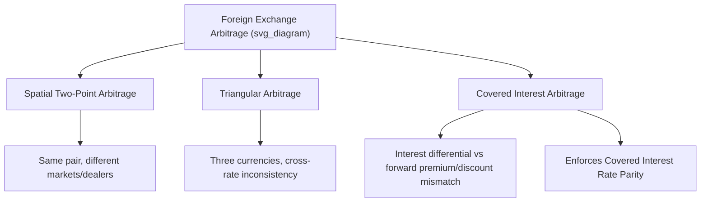

## Arbitrage in the Foreign Exchange Market

### Overview

Arbitrage in the foreign exchange market refers to the simultaneous purchase and sale of currencies (or currency-linked instruments) across different markets, instruments, or time periods to exploit price discrepancies and generate riskless profit. Arbitrage activity is the mechanism through which FX markets enforce internal price consistency, and understanding its various forms — spatial, triangular, and covered interest arbitrage — is essential to understanding why real-world exchange rates and interest rate relationships tend toward specific theoretical equilibria.

### The Concept of Arbitrage: General Principles

**Key Points**

- **Pure arbitrage** involves no capital outlay, no risk, and generates a certain profit by exploiting a temporary price discrepancy for an identical (or equivalent) asset across two markets simultaneously
- Arbitrage activity, by construction, is **self-eliminating**: as arbitrageurs act on a discrepancy, their buying and selling pressure moves prices toward alignment, closing the gap that created the opportunity in the first place
- In modern, highly liquid, electronically connected FX markets, pure arbitrage opportunities are typically extremely short-lived (often surviving for fractions of a second) due to high-frequency algorithmic trading systems designed specifically to detect and exploit such discrepancies

### Spatial (Two-Point) Arbitrage

**Definition**

Spatial arbitrage exploits a price discrepancy for the **same currency pair** quoted in **two different geographic markets or by two different dealers** at the same point in time.

**Key Points**

- Example: if Bank A in one financial center quotes EUR/USD at 1.0850 while Bank B in another center simultaneously quotes EUR/USD at 1.0855, an arbitrageur can buy euros from Bank A and immediately sell them to Bank B, capturing the 5-pip difference risklessly
- With modern electronic trading platforms and real-time price dissemination across global financial centers, spatial arbitrage opportunities in major currency pairs are exceptionally rare and fleeting, though they can still emerge briefly during periods of extreme volatility, technical disruptions, or market fragmentation
- [Inference] Spatial arbitrage was historically more significant in earlier eras of FX trading when communication between geographically dispersed dealers was slower and price information less instantaneously available; its practical relevance in major liquid pairs has diminished substantially with electronic trading infrastructure, though it may remain more relevant in less liquid or less electronically integrated currency markets

### Triangular Arbitrage

**Definition**

Triangular arbitrage exploits an inconsistency among the exchange rates of **three currencies**, where the directly quoted rate between two currencies diverges from the rate implied by their respective rates against a common third currency (the cross rate).

**The Logic**

If Currency A, Currency B, and Currency C are all actively traded against one another, consistency requires:

$$\text{Rate}_{A/B} \times \text{Rate}_{B/C} \times \text{Rate}_{C/A} = 1$$

If this product does not equal 1, a triangular arbitrage opportunity exists: an arbitrageur can execute a sequence of three trades (A → B → C → A) and end up with more of Currency A than they started with, risklessly.

### Worked Example: Triangular Arbitrage

Suppose the following rates are quoted simultaneously:

- USD/EUR = 0.9200 (0.92 dollars per euro... more precisely, let's use standard notation)
- EUR/USD = 1.0870 (1.0870 dollars per euro)
- GBP/USD = 1.2650 (1.2650 dollars per pound)
- EUR/GBP directly quoted = 0.8630 (0.8630 pounds per euro)

**Step 1: Calculate the implied EUR/GBP cross rate**

$$\text{Implied EUR/GBP} = \frac{EUR/USD}{GBP/USD} = \frac{1.0870}{1.2650} \approx 0.8593$$

**Step 2: Compare to the directly quoted rate**

The directly quoted EUR/GBP (0.8630) is higher than the implied cross rate (0.8593) — meaning the euro is priced *relatively higher* against the pound in the direct market than the cross-rate calculation would suggest.

**Step 3: Execute the arbitrage sequence**

1. Convert USD to EUR at the EUR/USD rate
2. Convert EUR to GBP at the (relatively favorable) directly quoted EUR/GBP rate of 0.8630
3. Convert GBP back to USD at the GBP/USD rate

Because the direct EUR/GBP rate is more favorable to euro-holders than the implied cross rate suggests it should be, routing through the direct EUR/GBP market rather than proceeding purely via USD yields more GBP per EUR converted — and ultimately more USD at the end of the three-step sequence than the initial USD amount, generating a riskless profit.

### Diagram: Triangular Arbitrage Sequence

**Key Points**

- The size of the arbitrage profit in the example above depends on transaction costs (bid-ask spreads at each leg), which in practice must be smaller than the pricing discrepancy for the arbitrage to be profitable after costs
- In liquid, actively monitored markets, triangular arbitrage discrepancies are corrected essentially instantaneously by automated trading systems, meaning the opportunity illustrated above would typically exist only briefly in practice, if at all, under normal market conditions

### Covered Interest Arbitrage

**Definition**

Covered interest arbitrage exploits a deviation from **Covered Interest Rate Parity (CIRP)** — the condition that the forward premium or discount on a currency should exactly offset the interest rate differential between the two currencies, such that borrowing in one currency to invest in another, while hedging the currency risk via a forward contract, yields no riskless profit.

**The CIRP Condition**

$$F = S \times \frac{1 + i_d}{1 + i_f}$$

**When CIRP Is Violated**

If the actual forward rate deviates from the CIRP-implied rate, a riskless arbitrage strategy exists:

1. Borrow in the currency with the relatively "cheap" implied cost of funds
2. Convert to the other currency at the spot rate
3. Invest the proceeds at that currency's interest rate
4. Simultaneously enter a forward contract to convert the future proceeds back to the original currency at a locked-in rate
5. Repay the original loan, capturing a riskless profit from the mismatch between the actual forward rate and the interest-rate-differential-implied forward rate

### Worked Example: Covered Interest Arbitrage

Suppose:

- Spot USD/EUR = 1.1000 (dollars per euro)
- 1-year USD interest rate = 5%
- 1-year EUR interest rate = 2%
- CIRP-implied forward rate: $F = 1.1000 \times \frac{1.05}{1.02} \approx 1.1324$
- But the **actual quoted 1-year forward rate** = 1.1500 (higher than CIRP implies)

Because the actual forward rate (1.1500) exceeds the CIRP-implied rate (1.1324), the euro is "too expensive" forward relative to what the interest differential justifies. An arbitrageur can:

1. Borrow USD at 5%
2. Convert USD to EUR at the spot rate (1.1000)
3. Invest EUR at 2%
4. Lock in converting EUR back to USD forward at the (relatively favorable) actual forward rate of 1.1500
5. Repay the USD loan, keeping the difference between the proceeds received (at the favorable forward rate) and the amount owed on the original loan as riskless profit

**Key Points**

- This activity would place upward pressure on spot EUR demand (pushing spot up) and downward pressure on the forward EUR rate (as arbitrageurs sell EUR forward), pushing the actual forward rate back toward the CIRP-implied level, closing the arbitrage opportunity

### CIRP Deviations in Practice: The Cross-Currency Basis

**Key Points**

- [Inference] Despite the theoretical prediction that CIRP should hold precisely in frictionless markets, academic research — particularly intensifying after the 2008 global financial crisis — has documented persistent, measurable deviations from CIRP among major currencies, commonly referred to as a "cross-currency basis"
- These deviations are generally attributed not to unexploited pure arbitrage (which would be quickly closed) but to structural factors: bank balance sheet constraints, post-crisis regulatory capital requirements that make arbitrage capital more costly to deploy, differential credit and liquidity risk among counterparties, and demand/supply imbalances for specific currencies in cross-currency funding markets
- This is a genuinely studied area of ongoing academic and market research rather than a settled or fully resolved phenomenon, and the magnitude of the basis fluctuates with market conditions, particularly widening during periods of financial stress

### Uncovered Interest Arbitrage and Its Distinction from Covered Arbitrage

**Key Points**

- **Uncovered interest arbitrage** involves borrowing in a low-interest-rate currency, converting to a high-interest-rate currency, and investing — **without** hedging the future currency conversion via a forward contract, leaving the strategy exposed to exchange rate risk
- This is **not** true arbitrage in the strict sense (it carries currency risk and is therefore speculative rather than riskless), but it is closely related to the "carry trade" strategy widely discussed in FX markets and is analytically connected to the **Uncovered Interest Rate Parity (UIRP)** condition and the well-documented "forward premium puzzle" in the academic literature
- Distinguishing covered (riskless) from uncovered (risky, speculative) interest arbitrage is a common source of confusion and an important conceptual distinction in international finance coursework

### Practical Constraints Limiting Real-World Arbitrage

**Key Points**

- **Transaction costs**: bid-ask spreads at each leg of a multi-step arbitrage sequence must be smaller than the pricing discrepancy for the strategy to remain profitable
- **Capital and balance sheet constraints**: post-2008 regulatory changes have increased the capital cost of deploying arbitrage capital for banks, limiting the scale and speed of arbitrage activity even when profitable opportunities exist
- **Speed and technology**: modern arbitrage is dominated by high-frequency algorithmic trading systems; opportunities identifiable and exploitable by human traders on manual timescales are largely absent in major liquid currency pairs
- **Capital controls and convertibility restrictions**: in currencies subject to capital controls, arbitrage mechanisms that rely on free cross-border capital movement may be constrained or entirely blocked, which is part of why instruments like Non-Deliverable Forwards exist for such currencies

### Diagram: Types of FX Arbitrage

### Conclusion

Arbitrage in the foreign exchange market — whether spatial, triangular, or covered interest arbitrage — represents the mechanism through which market participants enforce internal price consistency across geographically dispersed dealers, across related currency pairs, and between spot/forward pricing and interest rate differentials. While pure, riskless arbitrage opportunities are largely eliminated within moments in modern, electronically integrated, highly liquid FX markets, understanding these arbitrage relationships remains essential: they explain *why* triangular cross-rate consistency and covered interest rate parity hold as closely as they empirically do, and documented deviations from these relationships (such as the post-2008 cross-currency basis) provide meaningful insight into balance sheet constraints, regulatory costs, and liquidity conditions within the global financial system.

**Related Topics**

- Covered Interest Rate Parity and forward pricing mechanics
- Uncovered Interest Rate Parity and the forward premium puzzle
- The carry trade as a speculative (uncovered) strategy
- The cross-currency basis and post-2008 financial market structure
- Exchange rate quotations and cross rate calculation
- Non-Deliverable Forwards for capital-controlled currencies