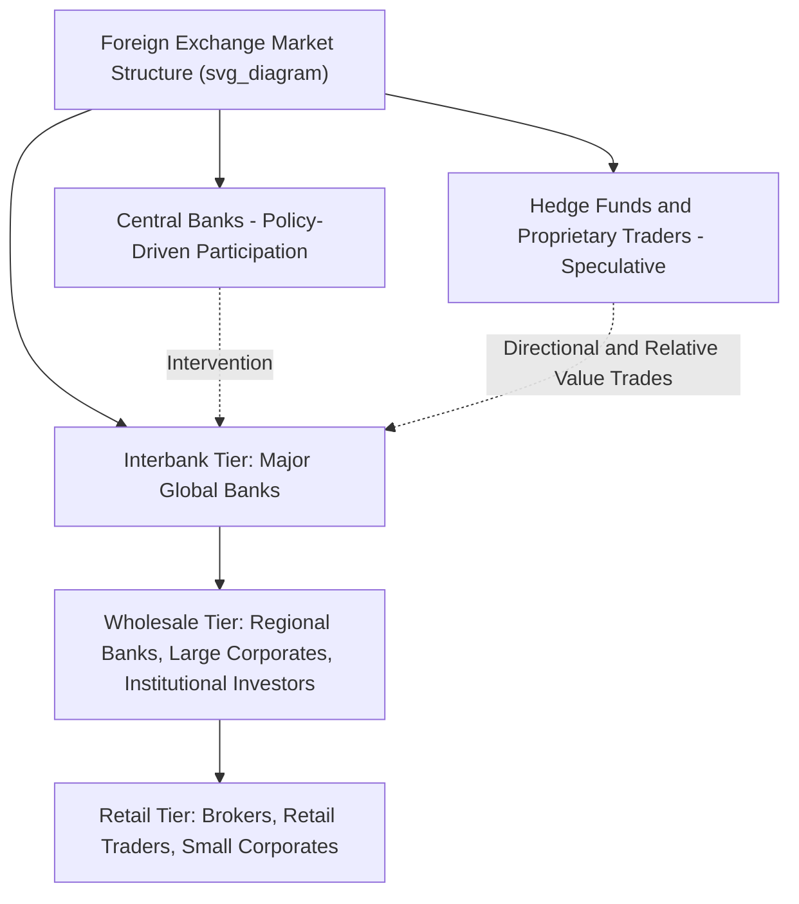

## Market Participants and Market Microstructure

### Overview

The foreign exchange market's distinctive structure — decentralized, over-the-counter, operating nearly continuously across global time zones — is shaped by a diverse ecosystem of participants with different motivations, time horizons, and access to liquidity. Market microstructure, the study of how trading mechanisms, information flows, and participant behavior determine price formation, provides the analytical framework for understanding how these participants interact to produce the exchange rates observed in practice.

### The Tiered Structure of the FX Market

**Key Points**

- The FX market is organized in a loosely tiered structure rather than a single centralized exchange: an **interbank market** (the top tier, where the largest banks trade directly with one another and via electronic brokering platforms) sits above a broader network of banks, brokers, and clients trading with progressively wider spreads as one moves further from the interbank core
- This tiered structure means that the effective exchange rate and spread a given participant faces depends significantly on their tier of market access — large banks and institutional players access the tightest spreads, while retail participants typically transact through intermediaries at wider markups
- The market operates on a **24-hour, near-continuous basis** across major financial centers (Sydney, Tokyo, London, New York), with trading activity and liquidity varying substantially by time of day depending on which centers are actively open

### Major Categories of Market Participants

**1. Commercial and Investment Banks**

**Key Points**

- Serve as the primary **market makers**, continuously quoting bid-ask prices and standing ready to trade with clients and other banks
- Historically the dominant liquidity providers in the interbank market, deriving revenue from bid-ask spreads, client flow, and proprietary trading
- A relatively small number of large global banks have historically accounted for a disproportionate share of total FX turnover, reflecting significant market concentration at the top tier

**2. Central Banks and Monetary Authorities**

**Key Points**

- Participate primarily for **policy purposes** rather than profit: managing official foreign exchange reserves, intervening to influence exchange rates (particularly under managed or fixed exchange rate regimes), and executing monetary policy operations
- Central bank intervention can be **unilateral** (a single central bank acting alone) or **coordinated** (multiple central banks acting jointly, historically used during periods of extreme currency volatility or crisis)
- Central bank participation is distinctive because it is often explicitly non-profit-motivated and can be large enough in scale to materially move prices, particularly for smaller or less liquid currencies

**3. Corporations (Multinational and Trade-Oriented)**

**Key Points**

- Participate primarily to manage **transaction exposure** arising from international trade, investment, and financing activities — converting foreign currency revenues, hedging future payables/receivables, and managing foreign-currency-denominated debt
- Corporate FX activity is generally considered less speculative and more directly tied to underlying commercial activity, though some multinational treasury operations also engage in more active currency risk management or, in some cases, discretionary positioning

**4. Institutional Investors (Asset Managers, Pension Funds, Insurance Companies)**

**Key Points**

- Trade currencies both to facilitate cross-border portfolio investment (buying/selling foreign securities requires currency conversion) and to hedge currency risk on existing foreign holdings
- Some institutional investors also run dedicated currency overlay or active currency management strategies as a distinct source of portfolio return, separate from underlying asset allocation

**5. Hedge Funds and Proprietary Trading Firms**

**Key Points**

- Engage in currency trading primarily for speculative return generation, including macro directional strategies, carry trades, and relative value strategies across currency pairs
- Often significant users of leverage and derivative instruments (options, futures) to express currency views with capital efficiency

**6. Retail Traders**

**Key Points**

- Individual traders accessing the FX market via retail brokers, typically trading smaller notional amounts and facing wider effective spreads and markups compared to institutional participants
- Retail FX trading has grown substantially with the proliferation of online trading platforms, though retail participants generally represent a small fraction of total global FX turnover relative to institutional participants

**7. FX Brokers and Electronic Trading Platforms**

**Key Points**

- Facilitate matching between buyers and sellers without taking principal positions themselves (in the pure broker model), earning revenue via commissions or fees rather than the bid-ask spread
- Electronic communication networks (ECNs) and multi-dealer platforms have increasingly automated and centralized price discovery, particularly at the interbank tier

### Diagram: Tiered Structure of FX Market Participants

### Market Microstructure: Key Concepts

**Price Discovery**

**Key Points**

- Price discovery refers to the process by which new information becomes incorporated into exchange rate prices through the trading activity of market participants
- In FX markets, price discovery is heavily influenced by **order flow** — the aggregate pattern of buy and sell orders — which microstructure research has shown carries significant information content beyond publicly available macroeconomic data, particularly over shorter time horizons
- [Inference] The prominence of order-flow-based explanations for short-run exchange rate movements reflects a broader finding in FX microstructure research that traditional macroeconomic fundamentals models (e.g., purchasing power parity, monetary models) perform poorly in explaining or predicting short-run exchange rate volatility — a well-documented empirical puzzle in international finance often associated with the Meese-Rogoff findings and subsequent literature

**Liquidity and Market Depth**

**Key Points**

- **Liquidity** refers to the ability to execute large transactions without significantly moving the price; **market depth** refers to the volume of orders available at various price levels around the current market price
- Major currency pairs (EUR/USD, USD/JPY, GBP/USD) exhibit substantially deeper liquidity than emerging market or exotic currency pairs, translating into narrower typical spreads and lower price impact for a given transaction size
- Liquidity is not constant throughout the trading day or week — it typically peaks during overlapping trading session hours (e.g., when both London and New York sessions are active) and thins during lower-activity periods (e.g., the transition between the New York close and Asian session open, or around major holidays)

**Bid-Ask Spread Determinants**

**Key Points**

- Spreads reflect compensation for **inventory risk** (the dealer's risk in holding an open currency position while awaiting an offsetting trade), **adverse selection risk** (the risk of trading against a counterparty with superior information), and **order processing costs**
- Spreads widen during periods of heightened volatility, reduced liquidity, or significant uncertainty (e.g., around major economic data releases, central bank announcements, or geopolitical shocks), reflecting increased inventory and adverse selection risk borne by market makers during such periods

**Information Asymmetry**

**Key Points**

- Certain participants (particularly large banks with extensive client order flow visibility, and some sophisticated institutional traders) may possess informational advantages regarding aggregate order flow patterns, even in the absence of traditional "inside information" in the equity market sense
- This has motivated substantial microstructure research into how information is transmitted and incorporated into prices through the trading process itself, rather than solely through public news and data releases

### The Role of Electronic and Algorithmic Trading

**Key Points**

- The past two decades have seen a substantial shift toward electronic trading platforms and algorithmic execution, which has generally increased the speed of price discovery and reduced the persistence of arbitrage opportunities (as discussed in the arbitrage topic)
- High-frequency trading (HFT) firms have become significant participants at the interbank/wholesale tier, engaging in market making, arbitrage, and other strategies at speeds beyond human trader capability
- [Unverified] The precise current market share of algorithmic versus traditional voice/manual trading, and the evolving competitive landscape among electronic platforms, continues to shift; readers seeking current figures should consult the most recent BIS Triennial Central Bank Survey or major FX platform market share reports

### The BIS Triennial Survey as the Primary Data Source

**Key Points**

- The **Bank for International Settlements (BIS) Triennial Central Bank Survey of Foreign Exchange and OTC Derivatives Markets** is the primary authoritative source for understanding global FX market size, participant composition, instrument breakdown, and geographic distribution of trading activity
- Because it is conducted only once every three years, and market conditions (participant composition, instrument mix, trading venue concentration) can shift meaningfully between survey cycles, analysts should consult the most recent survey release for current structural data rather than relying on older figures

### Conclusion

The foreign exchange market's decentralized, tiered structure brings together a diverse array of participants — commercial and investment banks acting as primary market makers, central banks pursuing policy objectives, corporations managing commercial currency exposure, institutional investors facilitating portfolio flows, and hedge funds and retail traders pursuing speculative returns — each interacting through a market microstructure shaped by liquidity conditions, bid-ask spread dynamics, order flow information content, and an increasingly electronic and algorithmic trading infrastructure. Understanding this participant ecosystem and its microstructure dynamics is essential context for interpreting observed exchange rate behavior, particularly given the well-documented empirical difficulty of explaining short-run currency movements through macroeconomic fundamentals alone.

**Related Topics**

- Arbitrage in the foreign exchange market
- Exchange rate quotations and cross rates
- The Meese-Rogoff puzzle and exchange rate forecasting
- Order flow and its role in exchange rate price discovery
- Central bank foreign exchange intervention
- The BIS Triennial Central Bank Survey as a data resource
- High-frequency and algorithmic trading in currency markets