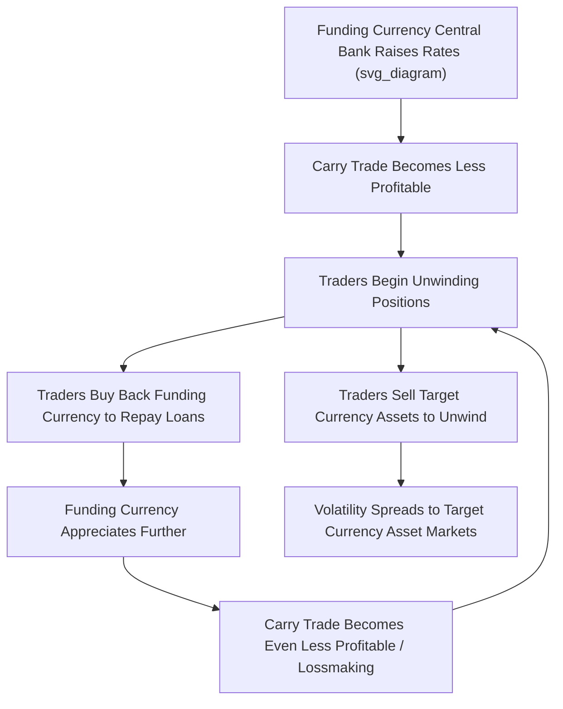

## The Carry Trade

### Overview

The carry trade is a currency speculation strategy that involves borrowing in a low-interest-rate currency (the "funding currency") and investing the proceeds in a higher-interest-rate currency or higher-yielding assets (the "target currency"), profiting from the interest rate differential. Unlike covered interest arbitrage, the carry trade is fundamentally **speculative rather than riskless**, because the currency exposure is typically left unhedged — exposing the trader to potential losses if the funding currency appreciates. The strategy is closely tied to the empirical failure of Uncovered Interest Rate Parity and has been a major driver of global capital flows and periodic financial market volatility, most prominently through the yen carry trade.

### The Basic Mechanics

**Key Points**

- **Step 1**: Borrow in a currency with a low interest rate (historically, and most prominently, the Japanese yen, given decades of near-zero Bank of Japan policy rates)
- **Step 2**: Convert the borrowed funds into a higher-yielding currency at the spot exchange rate
- **Step 3**: Invest the proceeds in higher-yielding assets denominated in that currency — government bonds, equities, or other assets — collecting the interest rate (or return) differential
- **Step 4 (critical distinction from covered arbitrage)**: The position is generally **left unhedged**, meaning the trader bears full exposure to exchange rate movements between the funding and target currencies over the life of the trade

### Theoretical Basis: The Failure of Uncovered Interest Rate Parity

**Uncovered Interest Rate Parity (UIRP)** predicts that the expected change in the exchange rate should exactly offset the interest rate differential between two currencies, such that no systematic profit should be available from borrowing low and investing high without hedging:

$$E[\Delta S] \approx i_d - i_f$$

**Key Points**

- If UIRP held precisely, the high-interest-rate currency would be expected to *depreciate* by approximately the interest rate differential, eliminating the carry trade's expected profitability
- However, decades of empirical research have found that UIRP performs poorly, particularly at short and medium horizons — high-interest-rate currencies do not reliably depreciate by the amount UIRP predicts, and in many periods have even *appreciated*, generating an additional (rather than offsetting) return for carry traders
- This persistent empirical failure is known as the **"forward premium puzzle"** or "UIRP puzzle," and it is one of the most extensively studied anomalies in international finance
- [Inference] Explanations for the puzzle generally center on risk premia (carry trade returns may compensate for exposure to rare, severe "crash risk," discussed below), rather than representing a pure, costless arbitrage opportunity — a distinction that remains an active area of academic research rather than a fully settled question

### The Yen Carry Trade: The Canonical Historical Example

**Key Points**

- The **yen carry trade** has been the most prominent and closely watched carry trade for over two decades, owing to the Bank of Japan's exceptionally long period of near-zero interest rate policy
- Traders would borrow yen at near-zero rates, convert to dollars, and invest in higher-yielding US Treasuries, American equities, or other global assets including emerging market securities, capturing the spread with minimal financing cost
- Estimates of outstanding yen carry trade positions have varied by source and period, with figures cited in the $300 billion to $500 billion range by various market estimates during 2025–2026

**The BOJ Policy Normalization and Unwind Dynamic (2024–2026)**

The yen carry trade's vulnerability became vividly apparent through a series of BOJ tightening moves:

- In **July 2024**, the BOJ raised its policy rate from "around 0–0.1%" to "around 0.25%," triggering a sharp yen appreciation and a roughly 12% single-day crash in Japan's Nikkei 225 — the worst decline since 1987 — alongside broader global equity market volatility, as carry trade positions were rapidly unwound
- The BOJ continued normalizing policy, raising rates to **0.50% in January 2025**
- At its **December 19, 2025** meeting, the BOJ implemented a further 25-basis-point hike to **0.75%**, the highest policy rate since 1995, with Japan's 10-year JGB yield rising above 2% — the highest since 1999
- By **September 2026**, renewed hawkish signals from BOJ Governor Kazuo Ueda and board members triggered a fresh rush to unwind yen-funded carry positions, sending the yen to a one-month high against the dollar

### Diagram: The Carry Trade Unwind Feedback Loop

**Key Points**

- This dynamic illustrates why carry trade unwinds can become **self-reinforcing spirals**: rate hikes in the funding-currency country reduce the trade's attractiveness, prompting unwinding, which requires buying back the funding currency, which pushes that currency higher, which further erodes the trade's profitability and prompts more unwinding
- The effect is not confined to currency markets alone — because carry trade proceeds are typically invested in risk assets (equities, emerging market bonds, and even more speculative assets like cryptocurrency), an unwind can trigger **cross-asset volatility**, as seen in the sharp August 2024 equity sell-off and the broader "risk-off" episodes associated with subsequent BOJ tightening moves through 2025–2026

### Spillover Effects on Third Countries

**Key Points**

- Because yen-funded carry trade proceeds have historically flowed into a wide range of global assets, unwind episodes have generated meaningful spillovers to markets well beyond Japan and the United States
- For example, reporting from 2026 indicated significant Foreign Portfolio Investor outflows from Indian equities amid carry trade unwinding dynamics compounding with other factors such as regional geopolitical tensions and oil price shocks, illustrating how a funding-currency policy shift can transmit volatility to emerging markets with only indirect connection to the original trade
- [Inference] This spillover pattern reflects the broader phenomenon of carry-trade-funded capital acting as a marginal, relatively mobile source of demand for a wide range of global risk assets — when that funding becomes more expensive or is actively repatriated, the effect can be felt disproportionately in markets that had been recipients of such flows, even if those markets have no direct exposure to Japanese monetary policy

### Carry Trade Risk: "Picking Up Pennies in Front of a Steamroller"

**Key Points**

- The carry trade is often characterized by the informal expression that it involves "picking up pennies in front of a steamroller" — generating small, steady returns from the interest differential during calm periods, punctuated by occasional severe, rapid losses when the funding currency appreciates sharply during unwind episodes
- This risk profile is consistent with academic explanations of the forward premium puzzle based on **crash risk** or **peso problem** dynamics: the carry trade's historically favorable average return may partly reflect compensation for infrequent but severe downside risk, rather than representing a genuinely riskless anomaly
- Carry trade unwind episodes have historically coincided with broader financial market stress and "flight to safety" dynamics, since funding currencies (yen, and historically the Swiss franc) often also serve as safe-haven currencies that appreciate during global risk-off episodes — compounding the unwind pressure precisely when carry positions are most vulnerable

### Common Currency Pairs in Carry Trade Strategies

| Funding Currency (Low Rate) | Target Currency (Higher Rate) | Historical Context |
| --- | --- | --- |
| Japanese yen (JPY) | US dollar (USD) | The most prominent, long-running carry trade given decades of near-zero BOJ rates |
| Japanese yen (JPY) | Australian dollar (AUD) | AUD/JPY widely traded given historically higher Australian rates |
| Swiss franc (CHF) | Various higher-yield currencies | CHF historically served as a funding currency, particularly pre-2015 SNB peg era |
| US dollar (USD, during ultra-low-rate periods) | Emerging market currencies | Used during periods of near-zero US rates (e.g., post-2008, post-2020) |

### Risk Management Considerations for Carry Trade Positions

**Key Points**

- Because the strategy relies on interest rate differentials remaining favorable and exchange rates not moving adversely by more than the accumulated interest gain, carry traders closely monitor central bank policy signals, particularly forward guidance from funding-currency central banks
- Position sizing, leverage management, and volatility-based risk limits are central to institutional carry trade risk management, given the strategy's exposure to sudden, sharp reversals
- Some traders use partial hedging (e.g., options-based protection against extreme funding-currency appreciation) to manage tail risk while retaining most of the carry, representing a middle ground between the pure unhedged carry trade and fully covered interest arbitrage

### Distinguishing the Carry Trade from Covered Interest Arbitrage

| Dimension | Covered Interest Arbitrage | Carry Trade |
| --- | --- | --- |
| Currency risk | Fully hedged via forward contract | Typically unhedged (or only partially hedged) |
| Profit source | Riskless mispricing relative to CIRP | Interest differential, exposed to exchange rate risk |
| Theoretical basis | Enforces Covered Interest Rate Parity | Reflects/exploits UIRP failure (forward premium puzzle) |
| Risk profile | Riskless (in frictionless markets) | Speculative; subject to sharp reversal/crash risk |

### Conclusion

The carry trade exploits the persistent empirical failure of Uncovered Interest Rate Parity by borrowing in low-interest-rate currencies and investing unhedged in higher-yielding currencies and assets, generating returns during stable periods that can be sharply reversed during unwind episodes. The yen carry trade stands as the canonical example, with the Bank of Japan's gradual exit from decades of near-zero rates through 2024–2026 repeatedly triggering unwind dynamics that transmitted volatility well beyond currency markets into global equities and emerging market asset classes. Understanding the carry trade requires recognizing both its behavioral/risk-premium theoretical underpinnings and its practical role as a major, policy-sensitive channel of global capital flow — one capable of generating self-reinforcing volatility spirals precisely when funding-currency monetary policy shifts.

**Related Topics**

- Uncovered Interest Rate Parity and the forward premium puzzle
- Covered interest arbitrage and its distinction from carry trading
- Central bank monetary policy transmission through currency markets
- Safe-haven currencies and flight-to-safety dynamics
- Emerging market capital flow volatility and "sudden stops"
- The Bank of Japan's monetary policy normalization (2024–2026)