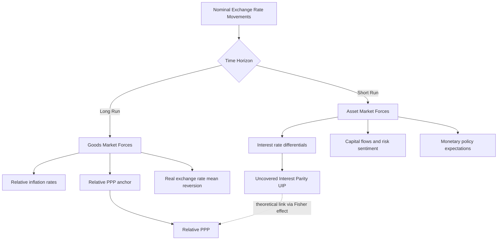

## Absolute and Relative Purchasing Power Parity

### Conceptual Foundation

Purchasing Power Parity (PPP) is a theory of exchange rate determination grounded in the **law of one price** (LOOP): in the absence of transaction costs, transportation costs, and trade barriers, identical goods should sell for the same price when expressed in a common currency, regardless of location. PPP extends this logic from individual goods to the aggregate price level, linking nominal exchange rates to relative national price levels.

PPP theory answers the question: what exchange rate equalizes the purchasing power of two currencies? It is one of the oldest theories in international economics, tracing back to 16th-century Salamanca scholars and formalized by Gustav Cassel in the early 20th century.

### The Law of One Price (Foundational Building Block)

For a single tradable good $i$:

$$P_i = S \times P_i^*$$

Where:

- $P_i$ = domestic price of good $i$
- $P_i^*$ = foreign price of good $i$
- $S$ = nominal exchange rate (domestic currency per unit of foreign currency)

Rearranged, the exchange rate implied by a single good is:

$$S = \frac{P_i}{P_i^*}$$

LOOP is arbitrage-driven: if a good is cheaper abroad after currency conversion, traders buy it there and sell it domestically until prices converge. PPP is essentially LOOP applied to a broad basket of goods (a price index) rather than a single commodity.

### Absolute Purchasing Power Parity

**Definition**

Absolute PPP states that the nominal exchange rate equals the ratio of the two countries' aggregate price levels, such that one unit of domestic currency has the same purchasing power at home and abroad once converted.

$$S = \frac{P}{P^*}$$

Where:

- $P$ = domestic price level (e.g., CPI-based basket cost in domestic currency)
- $P^*$ = foreign price level (same basket, priced in foreign currency)
- $S$ = spot exchange rate (domestic currency per unit of foreign currency)

Equivalently, in real terms, the **real exchange rate** $Q$ is defined as:

$$Q = \frac{S \times P^*}{P}$$

Absolute PPP holds when $Q = 1$: the real exchange rate is constant and equal to unity, meaning a basket of goods costs the same everywhere when expressed in a common currency.

**Interpretation**

If a basket of goods costs $500 in the United States and the same basket costs €450 in the Eurozone, absolute PPP predicts:

$$S_{\$/€} = \frac{500}{450} \approx 1.111 \text{ USD per EUR}$$

**Assumptions Required for Absolute PPP to Hold**

- Goods are perfectly tradable (no non-tradables like haircuts, housing, or local services)
- Zero transportation costs
- No tariffs, quotas, or trade barriers
- Identical goods baskets and identical consumer preferences/weights across countries
- Perfect competition (no pricing-to-market or price discrimination)
- No capital controls distorting arbitrage

Because these assumptions are routinely violated in practice, absolute PPP rarely holds precisely, especially for CPI-based baskets that include large shares of non-tradable goods and services.

### Relative Purchasing Power Parity

**Definition**

Relative PPP is a weaker, more empirically robust condition. Rather than requiring price *levels* to equalize, it requires that changes in the exchange rate over time reflect the *differential* in inflation rates between two countries. Relative PPP can hold even when absolute PPP does not, because it only requires that deviations from absolute PPP (due to transaction costs, trade barriers, etc.) remain roughly constant over time.

$$\frac{S_t - S_{t-1}}{S_{t-1}} \approx \pi - \pi^*$$

Where:

- $\pi$ = domestic inflation rate over the period
- $\pi^*$ = foreign inflation rate over the period
- $S_t$, $S_{t-1}$ = exchange rates at time $t$ and $t-1$

In continuous/log-approximation form, using $s = \ln(S)$:

$$\Delta s \approx \pi - \pi^*$$

**Intuition**

If domestic inflation exceeds foreign inflation, the domestic currency's purchasing power erodes faster, so the domestic currency must **depreciate** (exchange rate rises, if $S$ is defined as domestic currency per foreign unit) to keep relative purchasing power aligned.

**Example**

Suppose:

- US inflation over one year ($\pi$) = 5%
- Eurozone inflation over one year ($\pi^*$) = 2%
- Initial exchange rate $S_0 = 1.10$ USD/EUR

Relative PPP predicts the dollar should depreciate against the euro by approximately the inflation differential (3 percentage points):

$$S_1 \approx S_0 \times (1 + (\pi - \pi^*)) = 1.10 \times 1.03 = 1.133 \text{ USD/EUR}$$

The dollar weakens from 1.10 to approximately 1.133 USD per EUR, consistent with the US losing purchasing power faster than the Eurozone.

### Deriving Relative PPP from Absolute PPP

Relative PPP can be derived by taking the absolute PPP condition at two points in time and differencing:

$$S_t = \frac{P_t}{P_t^*}, \quad S_{t-1} = \frac{P_{t-1}}{P_{t-1}^*}$$

Dividing:

$$\frac{S_t}{S_{t-1}} = \frac{P_t / P_{t-1}}{P_t^* / P_{t-1}^*} = \frac{1+\pi}{1+\pi^*}$$

Taking logs and applying a first-order approximation for small inflation rates yields the relative PPP expression $\Delta s \approx \pi - \pi^*$. This shows relative PPP is a **log-differenced, linearized version** of absolute PPP — it holds under weaker conditions because a constant multiplicative wedge (from trade costs, taxes, or non-tradables) cancels out in the differencing.

### Real Exchange Rate and PPP Deviations

The real exchange rate is the key diagnostic tool for testing and expressing PPP deviations:

$$Q = \frac{S \times P^*}{P}$$

- $Q = 1$: Absolute PPP holds exactly
- $Q > 1$: Domestic currency is **undervalued** in real terms (foreign goods relatively expensive after conversion)
- $Q < 1$: Domestic currency is **overvalued** in real terms

Relative PPP corresponds to the weaker claim that $Q$ is **constant over time** (not necessarily equal to 1), i.e., $\Delta q \approx 0$ where $q = \ln(Q)$.

### The Big Mac Index (Applied Absolute PPP)

The Economist's Big Mac Index is a well-known informal test of absolute PPP, using a single standardized good (a McDonald's Big Mac) as the basket:

$$S_{\text{implied}} = \frac{P_{\text{Big Mac, domestic}}}{P_{\text{Big Mac, foreign}}}$$

Comparing $S_{\text{implied}}$ to the actual market exchange rate reveals apparent over/undervaluation. [Inference] In practice, systematic deviations are large and persistent because Big Macs embed substantial non-tradable input costs (rent, local labor, utilities), which do not equalize across countries even under free trade in tradable goods.

### Why PPP Fails to Hold Precisely: Key Drivers of Deviation

- **Non-tradable goods and services**: Housing, healthcare, haircuts, and labor-intensive services are not arbitraged internationally, so their prices reflect local wages and productivity (this underlies the **Balassa–Samuelson effect**, where richer/more productive countries have systematically higher price levels)
- **Trade costs**: Tariffs, transportation, and insurance create price bands within which arbitrage is unprofitable
- **Market segmentation and pricing-to-market**: Firms price discriminate across markets, especially in imperfectly competitive industries
- **Differentiated products**: Many goods are not homogeneous/identical across countries, undermining the LOOP assumption
- **Capital flows and asset market dynamics**: Short-run exchange rate movements are heavily influenced by interest rate differentials, risk premia, and speculative capital flows rather than goods-market arbitrage
- **Sticky prices**: Nominal price rigidities mean goods prices adjust slowly relative to exchange rates, which are flexible asset prices
- **Basket composition differences**: CPI baskets differ across countries in composition and weighting, undermining a clean absolute PPP comparison

### Empirical Evidence

[Unverified] Empirical consensus, drawing on decades of exchange rate research (e.g., Rogoff's survey literature), generally finds:

- Absolute PPP is strongly rejected in the data; price levels differ systematically and persistently across countries, correlating with income levels (Balassa–Samuelson)
- Relative PPP performs better but still fails to hold in the short-to-medium run; deviations from relative PPP can be large and persistent (often cited half-life of PPP deviations is roughly 3–5 years — the "PPP puzzle" identified in the literature, since this speed of convergence is far slower than nominal price stickiness alone would predict)
- Relative PPP tends to hold better over long horizons and during episodes of high/hyperinflation, where inflation differentials dominate exchange rate movements and swamp other determinants (transaction costs, capital flow noise)
- PPP holds better among similar, geographically proximate economies with high trade integration than among structurally dissimilar economies

### PPP as a Long-Run Anchor, Not a Short-Run Predictor

PPP is best understood within the broader exchange rate determination toolkit as a **long-run equilibrium condition** rather than a short-run forecasting model:

- **Short run**: Exchange rates are dominated by asset-market forces — interest rate differentials (uncovered interest parity), capital flows, risk sentiment, and monetary policy expectations
- **Long run**: Goods-market arbitrage and relative price levels reassert themselves, pulling the real exchange rate back toward its PPP-consistent level (mean reversion)

This distinction motivates monetary models of exchange rate determination (e.g., the flexible-price and sticky-price/Dornbusch overshooting models), which use PPP as a long-run anchor while allowing short-run deviations driven by asset markets.

### Relationship to Interest Rate Parity

PPP connects to nominal interest rate differentials through the **Fisher effect** and **International Fisher Effect (IFE)**:

$$i - i^* \approx \pi^e - \pi^{*e}$$

Combined with relative PPP ($\Delta s^e \approx \pi^e - \pi^{*e}$), this implies:

$$\Delta s^e \approx i - i^*$$

This is the theoretical link between relative PPP and **Uncovered Interest Rate Parity (UIP)** — both predict that the currency of the higher-inflation/higher-nominal-interest-rate country should be expected to depreciate.

### Worked Numerical Example (Combined)

**Given:**

- Base year exchange rate: $S_0 = 110$ JPY/USD
- US price index rises from 100 to 106 (6% inflation, $\pi$)
- Japan price index rises from 100 to 102 (2% inflation, $\pi^*$)

**Relative PPP prediction:**

$$S_1 \approx S_0 \times \frac{1+\pi}{1+\pi^*} = 110 \times \frac{1.06}{1.02} \approx 114.31 \text{ JPY/USD}$$

The dollar is predicted to appreciate against the yen (more yen per dollar) because US inflation exceeds Japanese inflation — this may seem counterintuitive at first (higher-inflation currency appreciating), so it is worth checking the quoting convention carefully: since $S$ is defined as JPY per USD, and the US has *higher* inflation, the dollar should actually **depreciate**, not appreciate. Correcting the direction:

$$S_1 \approx S_0 \times \frac{1+\pi^*}{1+\pi} = 110 \times \frac{1.02}{1.06} \approx 105.85 \text{ JPY/USD}$$

This illustrates a common source of error in applying relative PPP: **the direction of the inflation differential adjustment depends entirely on the exchange rate quoting convention** (domestic currency per foreign unit vs. foreign currency per domestic unit). Always verify whether $S$ is defined as home currency per unit of foreign currency before signing the inflation differential.

### Diagram — Absolute PPP Price Equalization (svg_diagram)

<svg xmlns="http://www.w3.org/2000/svg" viewBox="0 0 700 320">
<text x="350" y="30" text-anchor="middle" font-size="16" font-weight="bold" fill="#1a1a1a">Absolute PPP: Price Equalization via Arbitrage (svg_diagram)</text>
<rect x="60" y="70" width="220" height="160" fill="#e8f0fe" stroke="#4285f4" stroke-width="2" rx="6" />
<text x="170" y="95" text-anchor="middle" font-size="13" font-weight="bold" fill="#1a1a1a">Domestic Market</text>
<text x="170" y="120" text-anchor="middle" font-size="12" fill="#333">Price P</text>
<text x="170" y="140" text-anchor="middle" font-size="12" fill="#333">Basket of goods</text>
<text x="170" y="180" text-anchor="middle" font-size="20" font-weight="bold" fill="#1a73e8">$500</text>
<rect x="420" y="70" width="220" height="160" fill="#fce8e6" stroke="#ea4335" stroke-width="2" rx="6" />
<text x="530" y="95" text-anchor="middle" font-size="13" font-weight="bold" fill="#1a1a1a">Foreign Market</text>
<text x="530" y="120" text-anchor="middle" font-size="12" fill="#333">Price P*</text>
<text x="530" y="140" text-anchor="middle" font-size="12" fill="#333">Identical basket</text>
<text x="530" y="180" text-anchor="middle" font-size="20" font-weight="bold" fill="#ea4335">€450</text>
<line x1="280" y1="150" x2="420" y2="150" stroke="#34a853" stroke-width="3" marker-end="url(#arrow)" />
<line x1="420" y1="170" x2="280" y2="170" stroke="#34a853" stroke-width="3" marker-end="url(#arrow)" />
<text x="350" y="140" text-anchor="middle" font-size="11" fill="#34a853">arbitrage</text>
<text x="350" y="195" text-anchor="middle" font-size="11" fill="#34a853">arbitrage</text>
<text x="350" y="270" text-anchor="middle" font-size="13" fill="`#1a1a1a`">Equilibrium: S = P / P* = 500 / 450 ≈ 1.111 USD/EUR</text>

<text x="350" y="295" text-anchor="middle" font-size="11" fill="#666">Arbitrage forces price convergence until no profit remains</text>

</svg>

### Diagram — Short-Run vs. Long-Run Exchange Rate Determination

### Common Pitfalls and Misconceptions

- **Confusing absolute and relative PPP**: Absolute PPP is about price *levels*; relative PPP is about *rates of change*. A country can satisfy relative PPP (consistent inflation-adjusted depreciation) while its currency remains persistently over- or under-valued in absolute terms.
- **Applying PPP to CPI baskets uncritically**: CPI includes non-tradables, so CPI-based PPP tests are biased toward rejection compared to tests using only tradable-goods price indices.
- **Ignoring the quoting convention**: As shown above, the sign of the inflation-differential adjustment flips depending on whether $S$ is quoted as domestic-per-foreign or foreign-per-domestic.
- **Treating PPP as a short-run trading signal**: Given multi-year half-lives of PPP deviations, using PPP to time short-run currency trades is generally unreliable; [Inference] it is better suited to long-run valuation assessments (e.g., IMF/OECD real effective exchange rate misalignment analysis) than tactical positioning.

**Related Topics**

- Real exchange rates and real effective exchange rate (REER) indices
- Balassa–Samuelson effect and productivity-driven price level differences
- Uncovered Interest Rate Parity (UIP) and Covered Interest Rate Parity (CIP)
- Dornbusch overshooting model (sticky-price monetary model)
- The Fisher effect and International Fisher Effect
- Monetary models of exchange rate determination (flexible-price and sticky-price variants)
- The PPP puzzle and half-life estimates of real exchange rate convergence
- Big Mac Index and other applied LOOP-based valuation metrics
- Non-tradable goods, trade costs, and market segmentation as sources of PPP deviation