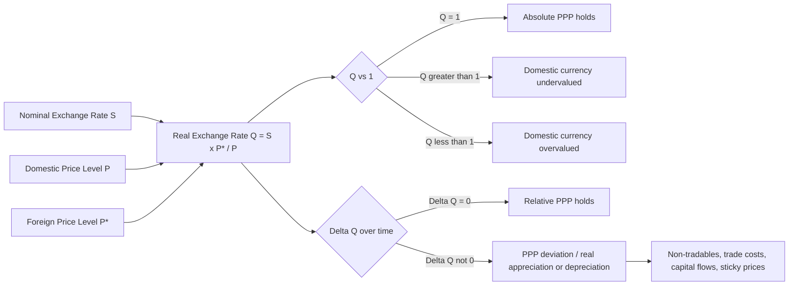

## The Real Exchange Rate and Deviations from PPP

### Definition and Core Formula

The real exchange rate (RER) measures the relative price of a foreign basket of goods in terms of a domestic basket, adjusting the nominal exchange rate for price level differences between two countries. It captures the *actual* purchasing power comparison between countries, as opposed to the nominal exchange rate, which only reflects the currency conversion rate.

$$Q = \frac{S \times P^*}{P}$$

Where:

- $Q$ = real exchange rate
- $S$ = nominal exchange rate (domestic currency per unit of foreign currency)
- $P^*$ = foreign price level
- $P$ = domestic price level

**Interpretation of $Q$:**

- $Q = 1$: Absolute PPP holds; a basket of goods costs the same at home and abroad once converted to a common currency
- $Q > 1$: Foreign goods are relatively expensive; the domestic currency is **undervalued** in real terms (domestic goods are cheap by comparison, favoring domestic competitiveness)
- $Q < 1$: Foreign goods are relatively cheap; the domestic currency is **overvalued** in real terms

An increase in $Q$ is a **real depreciation** of the domestic currency (domestic goods become relatively cheaper); a decrease in $Q$ is a **real appreciation**.

### Log-Linear Form

For empirical and analytical work, the real exchange rate is typically expressed in logs:

$$q = s + p^* - p$$

Where lowercase letters denote natural logs of $Q$, $S$, $P^*$, and $P$ respectively. This linearizes the multiplicative relationship and makes the RER additively decomposable into its nominal exchange rate and price-level components.

### Real Exchange Rate vs. Nominal Exchange Rate

| Aspect | Nominal Exchange Rate ($S$) | Real Exchange Rate ($Q$) |
| --- | --- | --- |
| Measures | Currency conversion rate | Relative purchasing power / competitiveness |
| Determinants | Central bank policy, capital flows, speculation | Nominal rate adjusted for inflation differentials |
| Volatility | Highly volatile, especially under floating regimes | Also volatile in short run; theoretically should mean-revert to PPP-consistent level in long run |
| Relevant for | Currency trading, international transactions | Trade competitiveness, terms of trade, investment decisions |

### Deriving Real Exchange Rate Changes from Relative PPP

Since relative PPP states $\Delta s \approx \pi - \pi^*$, and the definition of $q$ gives $\Delta q = \Delta s + \pi^* - \pi$, substituting:

$$\Delta q \approx (\pi - \pi^*) + \pi^* - \pi = 0$$

This shows that **relative PPP holding exactly is mathematically equivalent to the real exchange rate being constant** ($\Delta q = 0$). Deviations from PPP are therefore precisely deviations of $Q$ from a constant (or from unity, in the absolute PPP case). The real exchange rate is the central empirical object used to test both versions of PPP.

### Sources of Deviation from PPP (Why $Q \neq 1$ and $Q$ Is Not Constant)

**1. Non-Tradable Goods and the Balassa–Samuelson Effect**

CPI baskets include non-tradable goods and services (housing, haircuts, healthcare, domestic labor) whose prices are determined by local labor market conditions rather than international arbitrage. The Balassa–Samuelson framework explains a systematic pattern:

- Higher-productivity (typically richer) countries have higher productivity in the tradable-goods sector relative to the non-tradable sector
- Wages rise economy-wide in richer countries (tradable-sector productivity gains spill into non-tradable-sector wages via labor mobility)
- Since non-tradable productivity does not rise proportionally, non-tradable prices rise more in richer countries
- Result: overall price levels are systematically higher in richer countries, even after nominal exchange rate conversion, causing persistent absolute PPP deviations correlated with income per capita

**2. Trade Costs and Transportation**

Tariffs, shipping costs, insurance, and time-in-transit create a **band of inaction** around the LOOP-implied price: prices can diverge within this band without triggering profitable arbitrage. This is formalized in threshold autoregressive (TAR) models of real exchange rate adjustment, where mean reversion only occurs once deviations exceed the transaction-cost threshold.

**3. Trade Barriers and Non-Tariff Restrictions**

Quotas, licensing requirements, regulatory standards, and outright import bans prevent the free arbitrage flows that LOOP and PPP require.

**4. Market Segmentation and Pricing-to-Market**

Firms with market power price discriminate across national markets based on local demand elasticities and competitive conditions, rather than maintaining a single arbitrage-consistent global price. This is well documented in industries with differentiated products (automobiles, pharmaceuticals, branded consumer goods).

**5. Imperfect Competition and Differentiated Products**

Many goods are not homogeneous across borders (different specifications, branding, quality perceptions), undermining the "identical basket" assumption central to both LOOP and PPP.

**6. Sticky Nominal Prices**

Goods prices adjust slowly due to menu costs, contracts, and price rigidities, while nominal exchange rates are flexible asset prices that can move sharply on news. This asymmetry means short-run real exchange rate volatility is driven primarily by nominal exchange rate volatility, not by price level adjustment — a mechanism central to the Dornbusch overshooting model.

**7. Capital Account and Asset Market Dynamics**

Interest rate differentials, risk premia, capital flow surges/reversals, and speculative positioning drive nominal exchange rates in the short-to-medium run, independent of goods-market fundamentals. These forces can push $Q$ far from 1 for extended periods.

**8. Measurement and Index Issues**

Different countries use different basket compositions and weights in their CPI construction, introducing statistical divergence unrelated to true purchasing power differences.

### The "PPP Puzzle"

[Unverified] A well-known result in the international finance literature, generally attributed to Rogoff's 1996 survey, identifies two seemingly incompatible empirical facts:

- Short-run real exchange rate volatility is comparable to volatility in nominal exchange rates and equity markets — far too volatile to be explained by sticky-goods-price models alone
- Yet the estimated speed of mean reversion toward PPP is slow, with a **half-life** of deviations commonly estimated at roughly 3 to 5 years

The puzzle is that standard sticky-price models predict prices should adjust (and hence $Q$ revert) within the time it takes nominal prices to reset (typically thought to be much shorter), yet empirically observed reversion is far slower. [Inference] Proposed resolutions in the literature include nonlinear adjustment (transaction-cost bands), aggregation bias across heterogeneous goods with different adjustment speeds, and time-varying risk premia in asset markets that keep $Q$ away from equilibrium longer than pure goods-market frictions would predict.

### Real Effective Exchange Rate (REER)

In practice, bilateral real exchange rates are extended to a multilateral, trade-weighted measure — the **Real Effective Exchange Rate (REER)** — to assess a country's overall external competitiveness against its full basket of trading partners:

$$REER = \prod_{j=1}^{n} \left( \frac{S_j \times P_j^*}{P} \right)^{w_j}$$

Where $w_j$ is the trade weight of partner country $j$ (summing to 1), typically based on bilateral trade shares. REER is the standard indicator used by the IMF, BIS, and national central banks to gauge whether a currency is broadly overvalued or undervalued relative to a historical benchmark period.

### Empirical Testing Approaches

- **Unit root / stationarity tests**: If $q_t$ is stationary (mean-reverting), this is evidence in favor of long-run PPP; if $q_t$ follows a random walk (unit root, non-stationary), PPP is rejected as a long-run anchor
- **Panel unit root tests**: Pooling across many country pairs increases statistical power to detect mean reversion, since single-country time series are often too short/noisy to reject a unit root even when true reversion exists
- **Half-life estimation**: Measures how long it takes for a given PPP deviation to shrink by half, typically via autoregressive estimation of $q_t = \rho q_{t-1} + \varepsilon_t$, where the half-life is $\ln(0.5)/\ln(\rho)$
- **Threshold/nonlinear models**: Explicitly model the transaction-cost band within which no mean reversion occurs, and reversion only outside the band — often better matching observed dynamics than linear models

### Worked Example: Computing and Interpreting $Q$

**Given:**

- Nominal exchange rate: $S = 1.20$ USD/EUR
- US price index: $P = 115$
- Eurozone price index: $P^* = 108$

$$Q = \frac{S \times P^*}{P} = \frac{1.20 \times 108}{115} = \frac{129.6}{115} \approx 1.127$$

**Interpretation:** $Q > 1$ indicates the euro-basket, converted to dollars, costs more than the equivalent dollar basket — European goods appear relatively expensive, implying the dollar is **undervalued** in real terms relative to the euro (or equivalently, the euro is overvalued). This could reflect the US having relatively lower inflation, a weaker dollar, or persistent non-tradable price differentials, and would generally be viewed as a competitiveness advantage for US exporters.

### Real Exchange Rate and Macroeconomic Adjustment

The real exchange rate plays a central role in external adjustment mechanisms:

- A **real depreciation** ($Q$ rises) makes domestic goods cheaper relative to foreign goods, which — subject to the **Marshall–Lerner condition** (sum of export and import demand elasticities exceeding 1) — improves the trade balance over time, though often only after an initial worsening (the **J-curve effect**, due to contracts and demand elasticities being lower in the short run than the long run)
- A **real appreciation** ($Q$ falls) erodes export competitiveness and can widen trade deficits, and is often a symptom of the Balassa–Samuelson effect in fast-growing economies (sometimes mislabeled as a competitiveness "problem" when it partly reflects genuine productivity catch-up)

### Diagram — Real Exchange Rate Dynamics and PPP Deviation

### Diagram — Sources of Deviation from PPP (svg_diagram)

<svg xmlns="http://www.w3.org/2000/svg" viewBox="0 0 720 380">
<text x="360" y="30" text-anchor="middle" font-size="16" font-weight="bold" fill="#1a1a1a">Sources of Deviation from PPP (svg_diagram)</text>
<circle cx="360" cy="190" r="55" fill="#fef7e0" stroke="#f9ab00" stroke-width="2" />
<text x="360" y="185" text-anchor="middle" font-size="12" font-weight="bold" fill="#333">Real Exchange</text>
<text x="360" y="200" text-anchor="middle" font-size="12" font-weight="bold" fill="#333">Rate Q ≠ 1</text>

<rect x="30" y="60" width="150" height="55" fill="#e8f0fe" stroke="#4285f4" stroke-width="1.5" rx="5" />
<text x="105" y="82" text-anchor="middle" font-size="11" fill="#1a1a1a">Non-tradable goods</text>
<text x="105" y="98" text-anchor="middle" font-size="11" fill="#1a1a1a">(Balassa-Samuelson)</text>
<line x1="150" y1="100" x2="320" y2="165" stroke="#999" stroke-width="1.5" />

<rect x="540" y="60" width="150" height="55" fill="#e6f4ea" stroke="#34a853" stroke-width="1.5" rx="5" />
<text x="615" y="82" text-anchor="middle" font-size="11" fill="#1a1a1a">Trade costs &amp;</text>
<text x="615" y="98" text-anchor="middle" font-size="11" fill="#1a1a1a">transport frictions</text>
<line x1="570" y1="100" x2="400" y2="165" stroke="#999" stroke-width="1.5" />

<rect x="30" y="270" width="150" height="55" fill="#fce8e6" stroke="#ea4335" stroke-width="1.5" rx="5" />
<text x="105" y="292" text-anchor="middle" font-size="11" fill="#1a1a1a">Tariffs &amp; trade</text>
<text x="105" y="308" text-anchor="middle" font-size="11" fill="#1a1a1a">barriers</text>
<line x1="150" y1="280" x2="320" y2="215" stroke="#999" stroke-width="1.5" />

<rect x="540" y="270" width="150" height="55" fill="#f3e8fd" stroke="#a142f4" stroke-width="1.5" rx="5" />
<text x="615" y="292" text-anchor="middle" font-size="11" fill="#1a1a1a">Capital flows &amp;</text>
<text x="615" y="308" text-anchor="middle" font-size="11" fill="#1a1a1a">sticky prices</text>
<line x1="570" y1="280" x2="400" y2="215" stroke="#999" stroke-width="1.5" />

<rect x="255" y="330" width="210" height="45" fill="#fde7ec" stroke="#e8618c" stroke-width="1.5" rx="5" />
<text x="360" y="357" text-anchor="middle" font-size="11" fill="#1a1a1a">Market segmentation / pricing-to-market</text>
<line x1="360" y1="330" x2="360" y2="245" stroke="#999" stroke-width="1.5" />
</svg>

### Common Pitfalls and Misconceptions

- **Treating a real appreciation as automatically harmful**: Real appreciation can reflect legitimate productivity gains (Balassa–Samuelson) rather than competitiveness loss; the two must be distinguished using structural context, not the RER movement alone.
- **Assuming linear/constant-speed mean reversion**: The PPP puzzle and threshold models show that adjustment is likely nonlinear, with a "no-arbitrage band" where deviations persist without correction.
- **Conflating nominal and real depreciation**: A nominal depreciation ($S$ rises) does not guarantee a real depreciation ($Q$ rises) if domestic inflation rises correspondingly (or exceeds) the nominal currency movement — this is a common error when analyzing high-inflation or crisis economies.
- **Using bilateral RER for policy conclusions better suited to REER**: Bilateral real exchange rates versus a single partner can be misleading for assessing aggregate competitiveness; REER (trade-weighted, multilateral) is the appropriate policy-relevant metric.

**Related Topics**

- Absolute and relative purchasing power parity
- Balassa–Samuelson effect and productivity-driven price divergence
- Real Effective Exchange Rate (REER) construction and interpretation
- Dornbusch overshooting model and sticky-price dynamics
- Marshall–Lerner condition and the J-curve effect
- Threshold autoregressive (TAR) models of real exchange rate adjustment
- Unit root and panel stationarity testing for PPP
- Uncovered Interest Rate Parity and the link between asset markets and goods markets