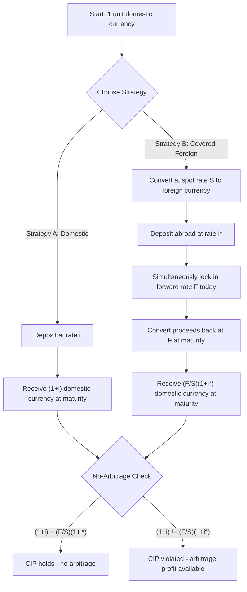

## Covered Interest Parity

### Conceptual Foundation

Covered Interest Parity (CIP) is a no-arbitrage condition linking spot exchange rates, forward exchange rates, and nominal interest rates in two currencies. It states that the return on a domestic-currency deposit must equal the return on a foreign-currency deposit **when the foreign currency exposure is fully hedged ("covered") using a forward contract**. Because the currency risk is eliminated through the forward contract, CIP is considered one of the most fundamental and historically reliable arbitrage conditions in international finance — a deviation represents a genuine, риск-free arbitrage opportunity (subject to transaction costs and capital constraints).

CIP is distinguished from Uncovered Interest Parity (UIP) by the presence of the forward contract: CIP involves no exchange rate risk, while UIP relies on the *expected* future spot rate and therefore embeds currency risk and risk premia.

### The Core Formula

$$1 + i = \frac{F}{S}(1 + i^*)$$

Where:

- $i$ = domestic nominal interest rate (for the relevant maturity)
- $i^*$ = foreign nominal interest rate (for the same maturity)
- $S$ = spot exchange rate (domestic currency per unit of foreign currency)
- $F$ = forward exchange rate (domestic currency per unit of foreign currency, contracted today for delivery at maturity)

Rearranged to solve for the forward rate implied by no-arbitrage:

$$F = S \times \frac{1+i}{1+i^*}$$

### Derivation from an Arbitrage Argument

Consider an investor with 1 unit of domestic currency who has two strategies available over a fixed horizon (e.g., one year):

**Strategy A — Invest domestically:**

Deposit 1 unit of domestic currency at rate $i$, yielding $(1+i)$ units of domestic currency at maturity.

**Strategy B — Invest abroad, covered:**

1. Convert 1 unit of domestic currency to foreign currency at the spot rate: receive $1/S$ units of foreign currency
2. Deposit the foreign currency at rate $i^*$, yielding $(1/S)(1+i^*)$ units of foreign currency at maturity
3. Simultaneously enter a forward contract today to convert the foreign currency proceeds back to domestic currency at the forward rate $F$, locking in $(1/S)(1+i^*) \times F$ units of domestic currency at maturity, with **no exchange rate risk** since $F$ is fixed today

For no arbitrage to exist, both strategies must yield identical domestic-currency returns:

$$(1+i) = \frac{F}{S}(1+i^*)$$

If this equality fails, riskless arbitrage profits are available (covered interest arbitrage), and market forces (capital flows, spot/forward rate adjustments) should eliminate the discrepancy.

### The Forward Premium/Discount Approximation

Taking the CIP equation and rearranging in terms of the **forward premium** (or discount):

$$\frac{F - S}{S} \approx i - i^*$$

**Interpretation:** The percentage difference between the forward rate and spot rate (the forward premium if positive, forward discount if negative) approximately equals the interest rate differential between the two countries. A currency with a *higher* interest rate trades at a **forward discount** (its forward rate is weaker than spot), and a currency with a *lower* interest rate trades at a **forward premium** (its forward rate is stronger than spot). This ensures that covered returns are equalized despite the interest rate gap — the forward market "pays for" the interest rate advantage.

### Worked Numerical Example

**Given:**

- Spot rate: $S = 1.25$ USD/GBP
- US one-year interest rate: $i = 4\%$
- UK one-year interest rate: $i^* = 6\%$

**Step 1 — Compute the no-arbitrage forward rate:**

$$F = S \times \frac{1+i}{1+i^*} = 1.25 \times \frac{1.04}{1.06} \approx 1.2264 \text{ USD/GBP}$$

**Step 2 — Verify via forward premium approximation:**

$$\frac{F-S}{S} \approx i - i^* = 0.04 - 0.06 = -0.02$$

$$F \approx S(1 - 0.02) = 1.25 \times 0.98 = 1.225 \text{ USD/GBP}$$

Both methods converge closely (the small discrepancy, 1.2264 vs. 1.225, arises from the linear approximation ignoring the cross-term $i \times i^*$ in the exact formula). Since the UK has the higher interest rate, the pound trades at a **forward discount** relative to the dollar — the forward rate (1.2264) is lower than the spot rate (1.25), meaning fewer dollars per pound in the future, which offsets the pound's superior interest rate.

**Verification of no-arbitrage (both strategies pay the same):**

- Strategy A: $1 \times 1.04 = 1.04$ USD
- Strategy B: $(1/1.25) \times 1.06 \times 1.2264 = 0.80 \times 1.06 \times 1.2264 \approx 1.040$ USD ✓

### CIP and the Absence of Exchange Rate Risk

The defining feature of CIP relative to other parity conditions is that **all quantities are known at time zero**: $S$, $F$, $i$, and $i^*$ are all observable/contracted today, with no reliance on expectations. This makes CIP a pure arbitrage condition rather than an equilibrium condition based on risk-adjusted expected returns — which is why, historically, CIP deviations were considered near-impossible to sustain in liquid, unrestricted markets.

### Empirical Status: The Breakdown of CIP Post-2008

[Unverified] Prior to the 2008 Global Financial Crisis, CIP was widely regarded as holding almost exactly in major currency pairs among developed economies, with deviations attributable only to bid-ask spreads and minor transaction costs. However, a substantial body of post-crisis research (frequently associated with work by Claudio Borio, Hyun Song Shin, and others at the BIS, alongside academic work by scholars such as Wenxin Du and Jesse Schreger) documents **persistent, economically significant CIP deviations** since 2008, particularly in the USD funding market.

**Measuring the deviation — the cross-currency basis:**

$$\text{Basis} = i - i^* - \frac{F-S}{S}$$

A non-zero basis (commonly quoted in basis points) indicates a CIP violation: covered returns are no longer equalized across currencies, even though the theoretical arbitrage should eliminate this.

[Inference] Commonly cited explanations for the persistent post-2008 basis include:

- **Regulatory balance sheet costs**: Post-crisis banking regulations (e.g., Basel III leverage ratio requirements) increased the capital cost of holding the large, low-risk-weighted balance sheet positions required to execute CIP arbitrage, even though the arbitrage itself is risk-free from a market-risk perspective
- **Reduced dealer risk-bearing capacity**: Constraints on bank balance sheets limit the intermediation capacity available to close arbitrage gaps, especially around quarter-end reporting dates when balance sheet costs spike (documented "window dressing" effects)
- **USD funding demand and safe-asset scarcity**: Structural global demand for USD funding (from non-US banks and institutions) creates persistent premium for USD liquidity, particularly acute during periods of market stress
- **Counterparty and settlement risk**: Even "riskless" arbitrage carries residual counterparty risk on the forward contract and settlement risk, which became more salient and costlier to hedge/collateralize after 2008

This has led to CIP being reframed in the academic literature less as a pure "law" and more as a condition subject to limits-to-arbitrage, with the deviation itself serving as a useful barometer of financial market stress and dollar funding conditions.

### CIP vs. Uncovered Interest Parity (UIP) — Key Distinction

| Feature | Covered Interest Parity (CIP) | Uncovered Interest Parity (UIP) |
| --- | --- | --- |
| Forward contract used | Yes — hedges currency risk | No — relies on expected future spot rate |
| Exchange rate risk | None (fully covered) | Present (uncovered exposure) |
| Formula | $F = S(1+i)/(1+i^*)$ | $E[S_{t+1}] = S_t(1+i)/(1+i^*)$ |
| Nature of condition | Near-pure arbitrage (mechanical) | Risk-adjusted expectations equilibrium |
| Empirical robustness | Historically strong; deviations emerged post-2008 (basis) | Widely and robustly rejected in the data (the "forward premium puzzle" / "Fama puzzle") |

### Relationship to the Forward Premium Puzzle

CIP and UIP together imply, by substitution, that the forward rate should be an **unbiased predictor** of the future spot rate:

$$F_t = E_t[S_{t+1}]$$

This combined implication is heavily rejected empirically — high-interest-rate currencies tend to *appreciate* rather than depreciate as UIP would predict, generating the profitable (but risky) **carry trade** strategy. Since CIP itself holds reasonably well (pre-2008) or is directly measurable via the basis (post-2008), the failure of $F_t = E_t[S_{t+1}]$ is generally attributed to the failure of UIP (via risk premia, expectational errors) rather than to CIP.

### Practical Applications

- **Covered interest arbitrage**: Traders and institutions monitor the cross-currency basis for near-riskless arbitrage opportunities, subject to balance sheet and regulatory capacity
- **Forward rate pricing**: CIP is used mechanically by banks and dealers to price forward and swap contracts from observed spot rates and money market interest rates, rather than from independent forward market expectations
- **Cross-currency basis swaps**: A related derivative market has grown explicitly around trading the CIP deviation itself, allowing institutions to hedge or speculate on funding cost differentials across currencies
- **Central bank and regulatory monitoring**: The cross-currency basis, especially the USD basis, is tracked as an indicator of dollar funding stress and financial market fragility (e.g., spiked sharply during the 2008 crisis and again during the March 2020 COVID liquidity crunch)

### Diagram — Covered Interest Arbitrage Mechanics

### Diagram — Covered Interest Arbitrage Cash Flows (svg_diagram)

<svg xmlns="http://www.w3.org/2000/svg" viewBox="0 0 720 340">
<text x="360" y="28" text-anchor="middle" font-size="16" font-weight="bold" fill="#1a1a1a">Covered Interest Parity: Two Equivalent Paths (svg_diagram)</text>

<text x="60" y="60" font-size="12" font-weight="bold" fill="`#4285f4`">t = 0 (Today)</text>

<text x="560" y="60" font-size="12" font-weight="bold" fill="`#ea4335`">t = 1 (Maturity)</text>

<rect x="40" y="90" width="140" height="50" fill="#e8f0fe" stroke="#4285f4" stroke-width="2" rx="5" />
<text x="110" y="112" text-anchor="middle" font-size="11" fill="#1a1a1a">1 unit domestic</text>
<text x="110" y="128" text-anchor="middle" font-size="11" fill="#1a1a1a">currency</text>
<line x1="180" y1="115" x2="500" y2="115" stroke="#4285f4" stroke-width="2" marker-end="url(#arrowA)" />
<text x="340" y="105" text-anchor="middle" font-size="11" fill="#4285f4">deposit at rate i</text>
<rect x="500" y="90" width="180" height="50" fill="#e8f0fe" stroke="#4285f4" stroke-width="2" rx="5" />
<text x="590" y="118" text-anchor="middle" font-size="12" font-weight="bold" fill="#1a1a1a">(1+i) domestic ccy</text>

<rect x="40" y="200" width="140" height="50" fill="#fce8e6" stroke="#ea4335" stroke-width="2" rx="5" />
<text x="110" y="222" text-anchor="middle" font-size="11" fill="#1a1a1a">1 unit domestic</text>
<text x="110" y="238" text-anchor="middle" font-size="11" fill="#1a1a1a">currency</text>
<line x1="180" y1="225" x2="300" y2="225" stroke="#ea4335" stroke-width="2" marker-end="url(#arrowB)" />
<text x="240" y="215" text-anchor="middle" font-size="10" fill="#ea4335">convert at S</text>
<rect x="300" y="200" width="130" height="50" fill="#fce8e6" stroke="#ea4335" stroke-width="2" rx="5" />
<text x="365" y="222" text-anchor="middle" font-size="11" fill="#1a1a1a">1/S foreign ccy</text>
<text x="365" y="238" text-anchor="middle" font-size="10" fill="#1a1a1a">deposit at i*</text>
<line x1="430" y1="225" x2="500" y2="225" stroke="#ea4335" stroke-width="2" marker-end="url(#arrowB)" />
<text x="465" y="215" text-anchor="middle" font-size="10" fill="#ea4335">convert at F</text>
<rect x="500" y="200" width="180" height="50" fill="#fce8e6" stroke="#ea4335" stroke-width="2" rx="5" />
<text x="590" y="228" text-anchor="middle" font-size="12" font-weight="bold" fill="#1a1a1a">(F/S)(1+i*) dom ccy</text>
<line x1="590" y1="140" x2="590" y2="200" stroke="#34a853" stroke-width="2" stroke-dasharray="4,3" />
<text x="600" y="175" font-size="11" fill="#34a853" font-weight="bold">= (no arbitrage)</text>
<text x="360" y="300" text-anchor="middle" font-size="12" fill="`#1a1a1a`">Forward contract eliminates exchange rate risk entirely</text>

<text x="360" y="320" text-anchor="middle" font-size="11" fill="#666">Post-2008: cross-currency basis measures deviation from this equality</text>

</svg>

### Common Pitfalls and Misconceptions

- **Confusing CIP with UIP**: CIP is a mechanical no-arbitrage condition using an actual forward contract; UIP relies on *expected* future spot rates and carries genuine currency risk. CIP holding does not imply UIP holds.
- **Assuming CIP is a "law" with zero exceptions**: Post-2008 evidence clearly shows persistent, non-trivial cross-currency basis deviations, driven by regulatory and balance-sheet constraints rather than classical transaction costs.
- **Sign confusion on premium/discount**: The *higher*-interest-rate currency trades at a forward *discount*, not premium — a frequent source of error. Always anchor the direction using the exact formula rather than intuition.
- **Ignoring maturity matching**: $i$, $i^*$, and the forward maturity must all refer to the same time horizon; mismatched maturities invalidate the parity comparison.
- **Treating the cross-currency basis as pure arbitrage profit**: [Inference] In practice, exploiting the basis requires balance sheet capacity and is subject to regulatory capital costs, so a non-zero basis does not necessarily represent a freely exploitable profit opportunity for all market participants.

**Related Topics**

- Uncovered Interest Parity (UIP) and the forward premium puzzle
- Cross-currency basis swaps and USD funding stress indicators
- The carry trade and risk premia in currency markets
- Forward and futures pricing of foreign exchange contracts
- Absolute and relative purchasing power parity
- The Dornbusch overshooting model
- Basel III regulatory capital requirements and balance sheet constrained arbitrage
- Real exchange rate and deviations from PPP