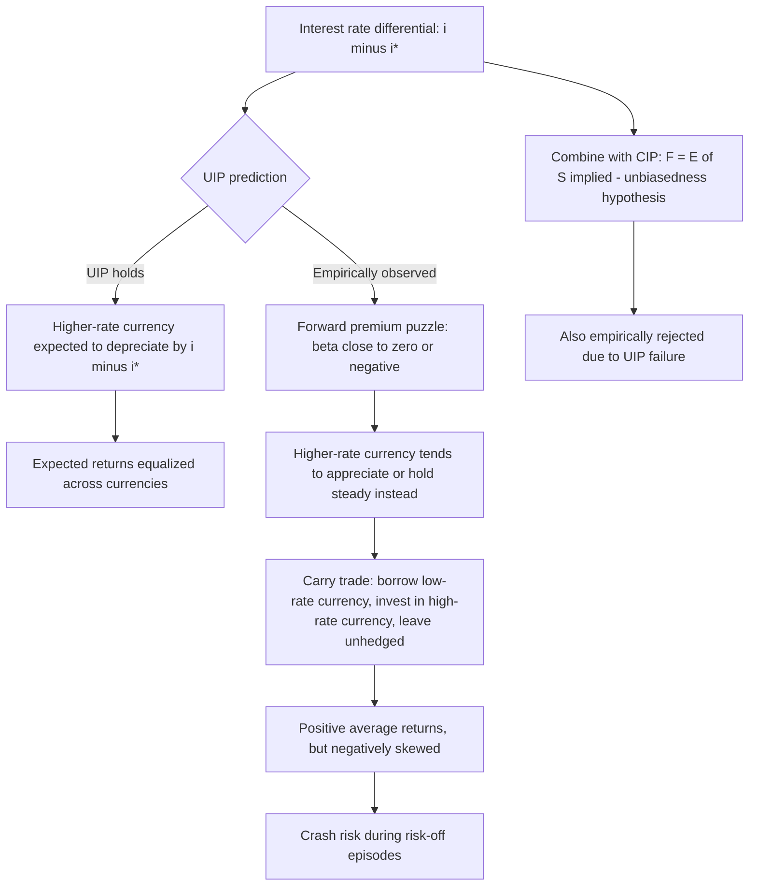

## Uncovered Interest Parity

### Conceptual Foundation

Uncovered Interest Parity (UIP) is a no-arbitrage condition stating that the expected return on domestic-currency deposits should equal the expected return on foreign-currency deposits, **when the foreign currency exposure is left unhedged ("uncovered")** — that is, without using a forward contract to lock in the future exchange rate. Unlike Covered Interest Parity (CIP), UIP relies on the *expected* future spot exchange rate rather than an observable forward rate, and therefore embeds genuine exchange rate risk.

UIP is a cornerstone of the asset-market approach to exchange rate determination, linking interest rate differentials directly to expected currency movements, and underpins many monetary models of exchange rates, including the Dornbusch overshooting model.

### The Core Formula

$$1 + i = \frac{E_t[S_{t+1}]}{S_t}(1 + i^*)$$

Where:

- $i$ = domestic nominal interest rate (for the relevant maturity)
- $i^*$ = foreign nominal interest rate (for the same maturity)
- $S_t$ = spot exchange rate today (domestic currency per unit of foreign currency)
- $E_t[S_{t+1}]$ = expected future spot exchange rate, conditional on information available at time $t$

Rearranged, the expected future exchange rate implied by UIP:

$$E_t[S_{t+1}] = S_t \times \frac{1+i}{1+i^*}$$

### Approximate (Linearized) Form

For small interest rates, taking a first-order approximation:

$$\frac{E_t[S_{t+1}] - S_t}{S_t} \approx i - i^*$$

Or in terms of expected depreciation:

$$E_t[\Delta s_{t+1}] \approx i - i^*$$

**Interpretation:** The domestic currency is expected to **depreciate** by approximately the amount that domestic interest rates exceed foreign interest rates. This ensures that expected total returns are equalized across currencies: a currency offering a higher interest rate must be expected to depreciate to offset that advantage, otherwise all capital would flow toward the higher-yielding currency until returns equalize.

### Derivation from an Arbitrage/Equilibrium Argument

Consider an investor choosing between two one-period strategies with 1 unit of domestic currency, **without any forward hedge**:

**Strategy A — Invest domestically:**

$(1+i)$ units of domestic currency at maturity, with certainty.

**Strategy B — Invest abroad, uncovered:**

1. Convert to foreign currency at spot: $1/S_t$ units of foreign currency
2. Deposit at foreign rate $i^*$: $(1/S_t)(1+i^*)$ units of foreign currency at maturity
3. Convert back to domestic currency at the **future spot rate** $S_{t+1}$, which is unknown today

Expected domestic-currency proceeds: $E_t[S_{t+1}]/S_t \times (1+i^*)$

Under **risk neutrality**, investors equate expected returns across the two strategies (since there is no reason to prefer one expected value over another absent risk aversion), yielding the UIP condition above. Under **risk aversion**, a risk premium term must be added, since foreign-currency exposure carries risk investors demand compensation for.

### UIP with a Risk Premium

$$E_t[\Delta s_{t+1}] \approx (i - i^*) + \rho_t$$

Where $\rho_t$ is a time-varying risk premium compensating investors for bearing uncovered currency risk. This premium can arise from exchange rate volatility risk, consumption-based risk aversion (currencies that depreciate in "bad states of the world" require higher expected returns), liquidity risk, and sovereign/political risk. [Inference] The existence and volatility of this risk premium is central to explaining why UIP fails so persistently and severely in the data — much of the empirical literature interprets deviations from simple UIP as evidence of a substantial, time-varying risk premium rather than pure market inefficiency, though behavioral and expectational-error explanations are also prominent in the literature.

### CIP + UIP: The Unbiasedness Hypothesis

Combining CIP ($F_t = S_t(1+i)/(1+i^*)$) with UIP ($E_t[S_{t+1}] = S_t(1+i)/(1+i^*)$) implies:

$$F_t = E_t[S_{t+1}]$$

This is the **unbiasedness hypothesis**: the forward rate should be an unbiased predictor of the future spot rate. Since CIP holds reasonably well empirically (at least pre-2008, and is directly measurable via the cross-currency basis post-2008), the extensive empirical rejection of $F_t = E_t[S_{t+1}]$ is attributed primarily to the failure of UIP.

### The Forward Premium Puzzle (Fama Puzzle)

[Unverified] This is one of the most robust and widely studied anomalies in international finance, originating from Eugene Fama's 1984 paper. The standard test regresses realized exchange rate changes on the forward premium (or equivalently, the interest rate differential):

$$\Delta s_{t+1} = \alpha + \beta (i - i^*) + \varepsilon_{t+1}$$

**UIP predicts** $\beta = 1$ (a one-for-one relationship between the interest differential and subsequent depreciation).

**Empirically**, regressions across many currency pairs and time periods consistently find $\beta$ estimates that are close to zero or, more strikingly, **negative** — often clustering around $\beta \approx -1$ to $-3$ in various studies. A negative $\beta$ implies that currencies with *higher* interest rates tend to **appreciate**, not depreciate, on average — the *opposite* of what UIP predicts. This is the forward premium puzzle (or Fama puzzle).

### The Carry Trade

The empirical failure of UIP directly motivates the **carry trade**, one of the most well-known trading strategies in currency markets:

1. Borrow in a **low-interest-rate currency** (the "funding currency")
2. Convert and invest in a **high-interest-rate currency** (the "target currency")
3. Leave the currency exposure uncovered (unhedged)
4. Profit if the high-interest-rate currency does not depreciate by the amount UIP would predict (and historically, on average, it has tended to appreciate or depreciate less than the interest differential)

[Inference] The persistence of positive average carry trade returns across long samples is widely cited as the strongest practical evidence against UIP, though carry trade returns are documented to be negatively skewed — earning small, steady gains most of the time but subject to sharp, large losses during risk-off/crisis episodes ("goes up by the stairs, comes down by the elevator"), which is consistent with the returns representing compensation for crash risk rather than a pure "free lunch."

### Proposed Explanations for UIP Failure

- **Time-varying risk premia**: Consumption-based asset pricing models suggest currency risk premia vary with macroeconomic conditions, business cycles, and global risk aversion (e.g., relating to the VIX or similar risk indicators), generating a wedge between $E_t[\Delta s_{t+1}]$ and $i - i^*$ that standard UIP regressions misattribute to bias in $\beta$
- **Peso problem**: Small-sample regressions can be distorted by rare, large events (e.g., currency crises or devaluations) that were rationally anticipated by markets (built into the risk premium) but did not occur within the sample period, biasing empirical estimates
- **Irrational expectations / expectational errors**: Survey-based measures of exchange rate expectations often deviate systematically from rational expectations, suggesting market participants may not form expectations consistent with the efficient-markets assumption underlying UIP tests
- **Limits to arbitrage**: Constraints on capital (funding costs, leverage limits, risk management constraints at financial institutions) may prevent the arbitrage capital needed to enforce UIP from fully mobilizing
- **Peso/crash risk and negative skewness**: Carry trade returns exhibit negative skewness and crash risk, consistent with compensation for rare, severe downside events not well captured in short-run linear regressions

### Worked Numerical Example

**Given:**

- Spot rate: $S_t = 110$ JPY/USD
- Japanese one-year interest rate: $i^* = 0.5\%$
- US one-year interest rate: $i = 4.5\%$

**UIP-implied expected future spot rate:**

$$E_t[S_{t+1}] = S_t \times \frac{1+i}{1+i^*} = 110 \times \frac{1.045}{1.005} \approx 114.36 \text{ JPY/USD}$$

UIP predicts the dollar should be expected to **depreciate against the yen is incorrect here** — checking carefully: since $S$ is JPY per USD and it *rises* from 110 to 114.36, this means *more* yen are needed per dollar, so the dollar is expected to **appreciate**... but the US has the *higher* interest rate, and UIP says the higher-interest-rate currency should *depreciate* to equalize expected returns. This is an inconsistency requiring correction: the formula $E_t[S_{t+1}] = S_t(1+i)/(1+i^*)$ with $S$ defined as JPY/USD (yen per dollar) means the dollar (domestic, $i$) is expected to change according to the ratio — a *higher* domestic rate $i$ relative to $i^*$ pushes $E_t[S_{t+1}]$ *above* $S_t$, meaning **more yen per dollar**, i.e., the **dollar appreciates**, which would appear to contradict "the higher-rate currency depreciates."

The resolution is that the earlier verbal rule ("higher-interest-rate currency depreciates") implicitly assumes $S$ is quoted as *foreign currency per domestic currency* consistently with which country's rate is "$i$" in the formula. Precisely: UIP states the currency with the **higher interest rate** ($i$, the domestic one here, USD) must be expected to **depreciate** in a *domestic-currency-per-foreign-currency* quoting convention. Since $S_t$ here is JPY per USD (yen is foreign... no — USD is being treated as domestic since $i$ is the US rate, so $S$ should be defined as JPY needed per USD, meaning JPY is foreign currency and USD is domestic). Under that convention, an *increase* in $S$ (more JPY per USD) **is** a USD appreciation, which would contradict "USD (higher rate) should depreciate."

**This demonstrates the critical importance of rigorously fixing the quoting convention before applying the formula.** Applying it correctly: with $i$ = USD rate (domestic) and $S$ = JPY/USD (foreign currency per unit of domestic), UIP predicts $E_t[S_{t+1}] > S_t$ specifically means the yen amount needed to buy one dollar *falls* is what would reflect USD depreciation — so the correct UIP formula for *this* quoting convention should have $i^*$ and $i$ swapped relative to how it was initially set up, or equivalently, $S$ must be redefined as USD per JPY (domestic per foreign) for the standard formula to apply directly. Using $S$ = USD per JPY consistently: if $S_t = 1/110 = 0.009091$ USD/JPY, then:

$$E_t[S_{t+1}] = 0.009091 \times \frac{1.045}{1.005} \approx 0.009455 \text{ USD/JPY}$$

This means more dollars are needed to buy one yen at $t+1$ — the yen appreciates against the dollar, equivalently the dollar depreciates against the yen, which **correctly** reflects the US (higher-rate) currency depreciating as UIP predicts. Converting back: $1/0.009455 \approx 105.76$ JPY/USD, i.e., UIP predicts the exchange rate moves from 110 to approximately 105.76 JPY/USD (fewer yen per dollar, dollar depreciation) — consistent with the higher-interest-rate dollar being expected to weaken.

### UIP vs. CIP — Summary Comparison

| Feature | UIP | CIP |
| --- | --- | --- |
| Hedging instrument | None — uncovered/unhedged | Forward contract — fully covered |
| Exchange rate risk | Present | Eliminated |
| Key variable | Expected future spot rate $E_t[S_{t+1}]$ | Observable forward rate $F_t$ |
| Empirical validity | Strongly and robustly rejected (forward premium puzzle) | Historically strong; basis deviations emerged post-2008 |
| Underlying nature | Risk-adjusted expectations equilibrium | Near-mechanical arbitrage condition |
| Practical strategy exploiting failure | Carry trade | Covered interest arbitrage / basis trading |

### Role in Monetary Models of Exchange Rates

UIP is a foundational building block of asset-market approaches to exchange rate determination:

- **Flexible-price monetary model**: Combines UIP with PPP and money market equilibrium to determine the exchange rate as a function of relative money supplies, income levels, and interest rates
- **Dornbusch overshooting model**: Uses UIP as the mechanism connecting the asset market (where prices adjust instantaneously) to exchange rate dynamics, while goods prices are sticky in the short run — a monetary expansion that lowers domestic interest rates requires, via UIP, an *immediate* expected appreciation, which (combined with a fixed long-run depreciated equilibrium) generates short-run exchange rate overshooting beyond the long-run level

### Diagram — UIP Equilibrium and Carry Trade Mechanics

### Diagram — Forward Premium Puzzle: Predicted vs. Observed Relationship (svg_diagram)

<svg xmlns="http://www.w3.org/2000/svg" viewBox="0 0 700 380">
<text x="350" y="28" text-anchor="middle" font-size="16" font-weight="bold" fill="#1a1a1a">Forward Premium Puzzle (svg_diagram)</text>

<line x1="80" y1="320" x2="620" y2="320" stroke="#333" stroke-width="1.5" />
<line x1="350" y1="60" x2="350" y2="320" stroke="#333" stroke-width="1.5" />
<text x="620" y="340" text-anchor="middle" font-size="11" fill="#333">Interest rate differential (i - i*)</text>
<text x="345" y="50" text-anchor="middle" font-size="11" fill="#333">Δs (exchange rate change)</text>

<line x1="150" y1="270" x2="550" y2="110" stroke="#4285f4" stroke-width="2.5" />
<text x="560" y="105" font-size="11" fill="#4285f4" font-weight="bold">UIP prediction</text>
<text x="560" y="120" font-size="10" fill="#4285f4">(slope β = 1)</text>

<line x1="150" y1="150" x2="550" y2="270" stroke="#ea4335" stroke-width="2.5" />
<text x="560" y="270" font-size="11" fill="#ea4335" font-weight="bold">Typical empirical</text>
<text x="560" y="285" font-size="10" fill="#ea4335">finding (β &lt; 0)</text>
<circle cx="350" cy="190" r="4" fill="#333" />
<text x="360" y="205" font-size="10" fill="#333">origin</text>

<text x="350" y="365" text-anchor="middle" font-size="12" fill="`#1a1a1a`">UIP predicts β = 1; empirical estimates often cluster near β ≈ -1 to -3</text>

</svg>

### Common Pitfalls and Misconceptions

- **Confusing UIP with CIP**: UIP involves expectations and risk; CIP involves an actual forward contract and no risk. Many students incorrectly treat them as interchangeable.
- **Sign/direction errors from quoting convention ambiguity**: As demonstrated in the worked example, failing to fix whether $S$ is domestic-per-foreign or foreign-per-domestic before applying the formula is one of the most common sources of directional errors in UIP problems — always verify the convention explicitly before signing the interest differential.
- **Treating carry trade profits as "free money"**: Carry trade returns are compensation for bearing crash/skewness risk, not a costless arbitrage; large drawdowns during risk-off episodes (e.g., 2008, and periodic JPY carry unwinds) are a well-documented feature, not a bug.
- **Assuming UIP failure means markets are irrational**: [Inference] A substantial share of the academic literature attributes UIP failure to rationally-priced, time-varying risk premia and peso-problem effects rather than to irrationality per se, though behavioral explanations remain an active area of research and no single explanation is universally accepted as complete.
- **Applying UIP at short horizons for forecasting**: Given the severity of the forward premium puzzle, using UIP directly to forecast near-term exchange rate movements from interest differentials is empirically unreliable; interest differentials have historically been a poor short-run predictor of currency direction.

**Related Topics**

- Covered Interest Parity (CIP) and the cross-currency basis
- The carry trade and currency risk premia
- The Dornbusch overshooting model
- Absolute and relative purchasing power parity
- The real exchange rate and deviations from PPP
- Peso problem and rare-event risk in exchange rate expectations
- Monetary models of exchange rate determination
- Survey-based exchange rate expectations and behavioral finance in FX markets