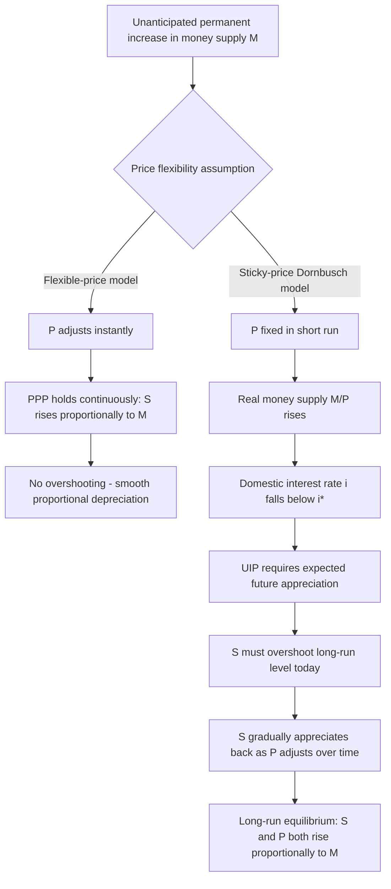

## The Monetary Approach to Exchange Rate Determination

### Conceptual Foundation

The monetary approach to exchange rate determination treats the exchange rate as the relative price of two national monies, determined fundamentally by the relative supply and demand for each currency, rather than by the flow of trade in goods alone. It emerged from the classical and monetarist tradition in macroeconomics, extending domestic monetary theory (the quantity theory of money) to an open-economy, two-country setting. The exchange rate is conceptualized as an **asset price**: it adjusts instantly to equilibrate the demand and supply of monies, much like any financial asset price responds to news and expectations.

The approach unifies two families of models built on common foundations but differing in their treatment of price flexibility:

- **Flexible-price monetary model** (Frenkel-Bilson model): assumes continuous PPP and instantaneous goods-price adjustment
- **Sticky-price monetary model** (Dornbusch overshooting model): assumes goods prices are sticky in the short run, generating exchange rate overshooting

### Core Building Blocks

The monetary approach combines three foundational relationships:

**1. Money Market Equilibrium (Domestic and Foreign)**

$$\frac{M}{P} = L(i, Y) = k \cdot Y \cdot e^{-\lambda i}$$

Or in a simpler log-linear form commonly used in these models:

$$m - p = \phi y - \lambda i$$

$$m^* - p^* = \phi y^* - \lambda i^*$$

Where:

- $m, m^*$ = log domestic/foreign money supply
- $p, p^*$ = log domestic/foreign price level
- $y, y^*$ = log domestic/foreign real income
- $i, i^*$ = domestic/foreign nominal interest rate
- $\phi$ = income elasticity of money demand
- $\lambda$ = interest semi-elasticity of money demand

Real money demand rises with income (transactions motive) and falls with the interest rate (opportunity cost of holding non-interest-bearing money).

**2. Purchasing Power Parity**

$$s = p - p^*$$

The nominal exchange rate (in logs) equals the relative price level between the two countries — a direct application of absolute PPP.

**3. Uncovered Interest Parity**

$$i - i^* = E[\Delta s]$$

Interest rate differentials reflect expected exchange rate changes, linking the asset market to exchange rate dynamics.

### The Flexible-Price Monetary Model (Frenkel-Bilson)

**Derivation**

Solving the money market equations for price levels:

$$p = m - \phi y + \lambda i$$

$$p^* = m^* - \phi y^* + \lambda i^*$$

Substituting into the PPP condition $s = p - p^*$:

$$s = (m - m^*) - \phi(y - y^*) + \lambda(i - i^*)$$

**Interpretation of Comparative Statics**

| Change | Effect on $s$ (domestic ccy per foreign ccy) | Intuition |
| --- | --- | --- |
| $m \uparrow$ (domestic money supply increases) | $s \uparrow$ (domestic currency depreciates) | More money chasing same goods raises $P$; PPP requires $S$ to rise proportionally |
| $y \uparrow$ (domestic income increases) | $s \downarrow$ (domestic currency appreciates) | Higher income raises money *demand*, which (for given $M$) requires $P$ to fall to maintain equilibrium, appreciating the currency |
| $i \uparrow$ (domestic interest rate increases) | $s \uparrow$ (domestic currency depreciates) | Higher $i$ lowers real money demand, raising $P$ (via money market equilibrium) and thus $S$ via PPP — this is the model's most counterintuitive prediction |

**The Interest Rate Puzzle in the Flexible-Price Model**

A striking feature: this model predicts a *rise* in the domestic interest rate causes domestic currency *depreciation* — the opposite of naive intuition (and opposite of the "high interest rates attract capital and strengthen the currency" heuristic often used in casual analysis). This occurs because, within this model, higher nominal interest rates are assumed to reflect higher expected inflation (via the Fisher effect), and higher expected inflation depreciates the currency through the PPP/UIP channel. The model implicitly interprets interest rate changes as driven by **inflation expectations** rather than by monetary tightening actions holding inflation expectations fixed — a key assumption to keep in mind when applying the model.

**Key Assumption and Limitation**

The flexible-price model assumes PPP holds continuously — that is, goods prices adjust instantaneously to clear markets. This assumption is empirically unrealistic (as established in the treatment of PPP deviations), and the model performs poorly in matching observed short-run exchange rate volatility and correlation patterns with interest rate changes.

### The Sticky-Price Monetary Model (Dornbusch Overshooting Model)

**Motivation**

Rudiger Dornbusch's 1976 model relaxes the assumption of continuous PPP, instead assuming that **goods prices are sticky in the short run** (adjusting slowly due to contracts, menu costs, and nominal rigidities) while the **asset market (exchange rate) is fully flexible and adjusts instantaneously**. This asymmetry in adjustment speeds is the central mechanism generating the model's signature result: exchange rate **overshooting**.

**Mechanism**

Consider an unanticipated, permanent increase in the domestic money supply ($m \uparrow$):

1. **Long run**: Goods prices eventually adjust proportionally ($p \uparrow$ by the same percentage as $m$), and by PPP, the exchange rate depreciates proportionally to reach its new long-run equilibrium $\bar{s}$
2. **Short run**: Prices are sticky, so $p$ does not immediately rise. With $p$ fixed in the short run, the real money supply $M/P$ rises, which — via money market equilibrium — requires the domestic interest rate $i$ to **fall** to restore equilibrium (more real balances require a lower opportunity cost of holding money, i.e., a lower $i$, to induce people to hold the additional real balances)
3. **UIP linkage**: With $i$ now below $i^*$, UIP requires the domestic currency to be **expected to appreciate** going forward (since $i - i^* < 0$ implies $E[\Delta s] < 0$) to equalize expected returns
4. **Overshooting**: For the currency to be expected to appreciate *back toward* its new (depreciated) long-run level $\bar{s}$, the exchange rate must **initially depreciate beyond** $\bar{s}$ — i.e., **overshoot** — so that the subsequent expected appreciation exactly satisfies UIP

**The overshooting result**: the short-run exchange rate response to a monetary expansion **exceeds** the long-run equilibrium depreciation, before gradually reversing (appreciating) back toward the new, smaller long-run depreciation as prices adjust over time.

$$|s_{\text{short-run}} - s_{\text{initial}}| > |\bar{s} - s_{\text{initial}}|$$

**Formal Overshooting Condition**

The degree of overshooting can be derived from the model's dynamics; a simplified expression for the initial exchange rate jump relative to the long-run change is:

$$s_0 - \bar{s} = -\frac{1}{\lambda \cdot \theta}(p_0 - \bar{p})$$

Where $\theta$ is the speed of price adjustment and the overshooting magnitude depends inversely on the interest semi-elasticity of money demand $\lambda$ and the price adjustment speed $\theta$: slower price adjustment (stickier prices) and/or lower interest sensitivity of money demand produce **greater** overshooting, since the interest rate must fall further to absorb the real balance increase.

### Time Path of Adjustment

Following a monetary expansion:

| Variable | Immediate (t=0) | Transition | Long run |
| --- | --- | --- | --- |
| Money supply $M$ | Jumps up (permanent) | Constant | Constant (at new higher level) |
| Price level $P$ | Unchanged (sticky) | Gradually rises | Rises proportionally to $M$ |
| Interest rate $i$ | Falls (below $i^*$) | Gradually rises back | Returns to $i^*$ (unchanged in long run under standard assumptions) |
| Exchange rate $S$ | **Overshoots** — depreciates beyond long-run level | Gradually appreciates back | Settles at new, smaller depreciated level $\bar{S}$ |

### Empirical Relevance and Testing

[Unverified] The Dornbusch model is widely credited in the literature with providing the first coherent theoretical explanation for a key stylized fact: nominal and real exchange rates are dramatically more volatile than relative price levels or fundamentals would suggest under simple PPP-based models — a pattern broadly consistent with observed floating exchange rate behavior since the collapse of Bretton Woods in the early 1970s. [Inference] However, direct econometric tests of the precise overshooting magnitude and dynamic path have produced mixed results, and the model's reliance on assumptions such as static/backward-looking expectations of price adjustment (in its original formulation) and continuously-clearing asset markets remain debated simplifications relative to more recent New Open Economy Macroeconomics (NOEM) models that incorporate explicit micro-foundations, nominal rigidities derived from optimizing behavior, and forward-looking rational expectations more rigorously.

### Comparison of Flexible-Price vs. Sticky-Price Monetary Models

| Feature | Flexible-Price Model | Sticky-Price (Dornbusch) Model |
| --- | --- | --- |
| Goods price adjustment | Instantaneous | Slow/sticky in short run |
| PPP | Holds continuously | Holds only in long run |
| Interest rate ↑ effect on $S$ | Immediate depreciation (via inflation expectations channel) | Short-run: if driven by money supply, initial depreciation *overshoots* long-run level |
| Exchange rate volatility explained | Poorly (too smooth relative to data) | Better matches high observed volatility (overshooting) |
| Underlying interest rate interpretation | Reflects inflation expectations (Fisher effect) | Reflects liquidity effect (monetary policy stance) in short run |

### Broader Position Within Exchange Rate Determination Theory

The monetary approach forms one pillar of the **asset market approach** to exchange rates, alongside the **portfolio balance model** (which relaxes the assumption of perfect substitutability between domestic and foreign bonds, introducing wealth effects and current account dynamics as additional determinants). Together, these models represent a shift away from purely flow-based (trade-balance-driven) theories of exchange rate determination toward stock-based, asset-market equilibrium theories, reflecting the empirical observation that daily/weekly exchange rate movements are dominated by capital account and financial market activity rather than by the comparatively slow-moving trade balance.

[Inference] Despite their theoretical elegance, monetary models (in both flexible- and sticky-price forms) have historically performed poorly in out-of-sample exchange rate forecasting relative to a naive random walk, a finding most famously documented by Meese and Rogoff (1983) — a result that remains an active and only partially resolved puzzle in international finance, motivating continued research into microstructure-based, behavioral, and risk-premium-augmented exchange rate models.

### Diagram — Dornbusch Overshooting Dynamics (svg_diagram)

<svg xmlns="http://www.w3.org/2000/svg" viewBox="0 0 720 400">
<text x="360" y="28" text-anchor="middle" font-size="16" font-weight="bold" fill="#1a1a1a">Dornbusch Exchange Rate Overshooting (svg_diagram)</text>

<line x1="80" y1="340" x2="660" y2="340" stroke="#333" stroke-width="1.5" />
<line x1="80" y1="60" x2="80" y2="340" stroke="#333" stroke-width="1.5" />
<text x="660" y="360" text-anchor="middle" font-size="11" fill="#333">Time</text>
<text x="40" y="55" text-anchor="middle" font-size="11" fill="#333">s</text>

<line x1="80" y1="260" x2="180" y2="260" stroke="#666" stroke-width="1.5" stroke-dasharray="3,3" />
<text x="60" y="264" text-anchor="end" font-size="10" fill="#666">s0</text>

<line x1="180" y1="180" x2="660" y2="180" stroke="#34a853" stroke-width="1.5" stroke-dasharray="5,3" />
<text x="670" y="184" font-size="10" fill="#34a853">s̄ (long-run)</text>

<line x1="180" y1="110" x2="660" y2="110" stroke="#ea4335" stroke-width="1" stroke-dasharray="2,2" opacity="0.5" />
<text x="670" y="114" font-size="10" fill="#ea4335">overshoot peak</text>

<line x1="80" y1="260" x2="180" y2="260" stroke="#4285f4" stroke-width="2.5" />
<line x1="180" y1="260" x2="180" y2="110" stroke="#4285f4" stroke-width="2.5" />
<path d="M 180 110 Q 350 130 660 180" stroke="#4285f4" stroke-width="2.5" fill="none" />

<text x="180" y="95" text-anchor="middle" font-size="10" fill="`#1a1a1a`">Money supply shock at t*</text>

<line x1="180" y1="340" x2="180" y2="345" stroke="#333" stroke-width="1.5" />

<text x="180" y="358" text-anchor="middle" font-size="10" fill="#333">t*</text>

<line x1="690" y1="110" x2="690" y2="180" stroke="#ea4335" stroke-width="1.5" />
<text x="700" y="148" font-size="10" fill="#ea4335" transform="rotate(90 700 148)">overshoot</text>

<text x="360" y="385" text-anchor="middle" font-size="11" fill="`#1a1a1a`">S jumps past long-run level on impact, then gradually appreciates back as prices adjust</text>

</svg>

### Diagram — Monetary Approach Transmission Channels

### Common Pitfalls and Misconceptions

- **Assuming higher interest rates always strengthen a currency**: The flexible-price monetary model predicts the *opposite* in response to money-supply-driven interest rate changes (via the inflation-expectations channel), which frequently conflicts with simplified capital-flow intuition; the correct interpretation depends critically on *why* the interest rate changed.
- **Conflating the two monetary models**: The flexible-price and sticky-price models generate opposite short-run predictions for the same money supply shock; students should always specify which model's assumptions apply before answering.
- **Treating overshooting as a permanent feature**: Overshooting is a **transitional dynamic** — the exchange rate overshoots on impact and then gradually reverses; it is not a permanent departure from the long-run equilibrium.
- **Ignoring the crucial role of price stickiness**: Overshooting arises specifically from the *asymmetry* in adjustment speeds between asset markets (fast) and goods markets (slow) — without this asymmetry (i.e., under flexible prices), no overshooting occurs.
- **Overstating monetary models' forecasting power**: Despite their theoretical coherence, [Inference] monetary models have a well-documented poor empirical forecasting track record relative to a random walk, a limitation that should temper claims about their practical predictive validity even while their qualitative comparative-statics insights remain influential.

**Related Topics**

- The Dornbusch overshooting model (detailed formal treatment)
- Uncovered Interest Parity and its role in exchange rate dynamics
- Absolute and relative purchasing power parity
- The portfolio balance model of exchange rate determination
- The Meese-Rogoff puzzle and exchange rate forecasting
- New Open Economy Macroeconomics (NOEM) models
- The Fisher effect and nominal vs. real interest rates
- Money demand functions and the quantity theory of money