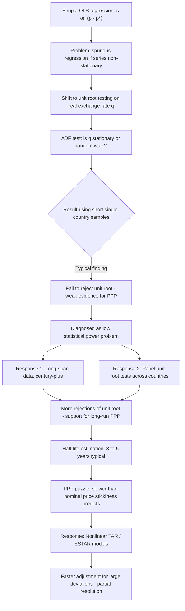

## Empirical Tests of Purchasing Power Parity

### Overview of the Empirical Testing Problem

Testing PPP empirically requires evaluating whether the real exchange rate $q_t = s_t + p_t^* - p_t$ behaves consistently with either absolute PPP ($q_t$ constant and equal to some baseline, typically normalized to zero in logs) or relative PPP ($q_t$ stationary and mean-reverting around a constant, even if not equal to zero). The central empirical question across decades of research has been: **is the real exchange rate stationary (mean-reverting) or does it follow a random walk (non-stationary, with no tendency to return to any long-run level)?** This question has proven surprisingly difficult to resolve conclusively, generating one of the most extensive and methodologically evolving literatures in international economics.

### Early Testing Approaches: Simple Regressions

**The Frenkel Regression Approach**

Early tests (notably Jacob Frenkel's work in the late 1970s and early 1980s) regressed the nominal exchange rate on relative price levels:

$$s_t = \alpha + \beta(p_t - p_t^*) + \varepsilon_t$$

Absolute PPP requires $\alpha = 0$ and $\beta = 1$. [Unverified] Early studies using data from the 1920s (a period of high inflation variability, particularly German hyperinflation) tended to find support for PPP, since large inflation differentials dominated exchange rate movements and swamped other determinants — but subsequent tests using post-Bretton-Woods floating-rate data (1970s onward) generally rejected the restriction, often finding $\beta$ estimates significantly different from 1, or unstable across sample periods.

**Limitations of Simple Regression Tests**

These early tests suffered from significant methodological weaknesses later identified in the literature:

- **Spurious regression risk**: If both $s_t$ and $(p_t - p_t^*)$ are non-stationary (integrated) series, standard OLS regression can produce statistically significant coefficients and high $R^2$ even when no genuine long-run relationship exists — a classic spurious regression problem
- **Failure to account for time-series properties**: Simple regressions ignore the dynamic, time-dependent nature of exchange rate and price data, and do not properly test for mean reversion (the core PPP hypothesis) versus a random walk

### Unit Root Testing Framework

The methodological shift toward testing PPP via the statistical properties of the real exchange rate itself began with the application of unit root tests, following advances in time-series econometrics (particularly the Dickey-Fuller and Augmented Dickey-Fuller tests).

**The Testing Logic**

If $q_t$ follows:

$$q_t = \rho q_{t-1} + \varepsilon_t$$

- If $|\rho| < 1$: $q_t$ is **stationary** — shocks to the real exchange rate are temporary, and $q_t$ reverts to its long-run mean. This is evidence **in favor of** long-run PPP.
- If $\rho = 1$: $q_t$ follows a **random walk** (unit root, non-stationary) — shocks are permanent, and there is no tendency for the real exchange rate to revert to any fixed level. This is evidence **against** PPP as a valid long-run relationship.

**The Augmented Dickey-Fuller (ADF) Test**

The standard test equation:

$$\Delta q_t = \alpha + \gamma q_{t-1} + \sum_{j=1}^{k} \delta_j \Delta q_{t-j} + \varepsilon_t$$

Testing the null hypothesis $H_0: \gamma = 0$ (unit root, no mean reversion) against the alternative $H_1: \gamma < 0$ (stationary, mean-reverting).

**Key Empirical Finding: Failure to Reject the Unit Root**

[Unverified] A large body of research using single-country time series over the post-Bretton-Woods floating period generally **failed to reject the unit root null hypothesis** for most major currency real exchange rates — meaning the data could not statistically distinguish real exchange rates from a random walk, casting doubt on PPP as even a long-run equilibrium condition. This became a significant puzzle, since a random walk in $q_t$ would imply PPP has essentially no explanatory power even over long horizons.

### The Low-Power Problem and the Shift to Long-Span and Panel Data

[Inference] Researchers recognized that standard unit root tests applied to typical post-1973 floating-era samples (roughly 20-30 years of monthly or quarterly data) had **low statistical power** to reject the unit root null even when true, slow mean reversion existed — the sample simply was not long enough, relative to the estimated slow speed of adjustment, to detect reversion with confidence. This motivated two complementary responses:

**1. Long-Span Data**

Extending time series to span a century or more (e.g., using data back to the late 19th century, incorporating both fixed and floating exchange rate regimes) increases the number of "long cycles" observed, improving power to detect slow mean reversion. [Unverified] Studies using century-long spans (e.g., work by Lothian and Taylor in the 1990s) more frequently found evidence supporting stationarity of $q_t$ and rejection of the unit root, lending qualified support to long-run PPP.

**2. Panel Unit Root Tests**

Pooling data across many countries simultaneously (panel data) substantially increases the effective sample size and statistical power. Common panel unit root tests include:

- **Levin-Lin-Chu (LLC) test**: Assumes a common autoregressive root across all cross-sectional units
- **Im-Pesaran-Shin (IPS) test**: Allows for heterogeneous autoregressive roots across countries, testing the null that *all* units have a unit root against the alternative that *some* (not necessarily all) units are stationary

[Unverified] Panel studies (prominently associated with work by Alan Taylor, Mark Taylor, and others through the 1990s and 2000s) generally found **stronger evidence against the unit root** (i.e., more support for mean-reverting real exchange rates) than single-country time series tests, reinforcing the view that PPP holds as a long-run tendency, even if adjustment is slow.

**Critiques of Panel Testing**

[Inference] Panel unit root tests carry their own methodological concerns frequently raised in the literature: cross-sectional dependence across real exchange rates (since many countries' currencies are measured against a common numeraire, typically the US dollar, inducing correlated errors across the panel) can bias standard panel test statistics toward over-rejecting the unit root null, potentially overstating the evidence for PPP.

### Half-Life Estimation

Beyond simply testing for stationarity, researchers quantify the *speed* of convergence using the **half-life** of a PPP deviation — the time required for half of a given deviation from equilibrium to be eliminated:

$$\text{Half-life} = \frac{\ln(0.5)}{\ln(\hat{\rho})}$$

Where $\hat{\rho}$ is the estimated autoregressive coefficient from $q_t = \rho q_{t-1} + \varepsilon_t$.

[Unverified] The widely cited consensus estimate from Rogoff's 1996 survey places the half-life of PPP deviations at approximately **3 to 5 years** across many studies — remarkably slow relative to how quickly one would expect nominal price stickiness alone (typically thought to resolve within a year or two) to allow convergence. This gap between the observed slow convergence and the presumed faster speed of nominal price adjustment is the essence of the **PPP puzzle**.

### Nonlinear and Threshold Models

[Inference] A further methodological advance addresses a key limitation of linear AR models: they impose a constant speed of mean reversion regardless of the size of the deviation, whereas transaction-cost theory suggests reversion should only occur once deviations are large enough to exceed the costs of arbitrage.

**Threshold Autoregressive (TAR) and Exponential Smooth Transition Autoregressive (ESTAR) Models**

These models allow the speed of mean reversion to depend on the *size* of the current deviation from PPP:

$$q_t = \left[1 - \exp(-\theta (q_{t-1} - \mu)^2)\right] \rho \, q_{t-1} + \varepsilon_t$$

(ESTAR functional form, schematically) — near the equilibrium $\mu$, mean reversion is weak or absent (small deviations are not worth arbitraging away given transaction costs); far from equilibrium, mean reversion becomes strong (large deviations attract arbitrage capital). [Unverified] Studies employing these nonlinear specifications (e.g., work by Taylor, Peel, and Sarno) have generally found **faster estimated adjustment speeds** for large deviations than linear models suggest, offering one resolution to the PPP puzzle: linear models, by averaging across small (non-adjusting) and large (rapidly-adjusting) deviations, may understate the "true" speed of adjustment for economically meaningful deviations.

### Testing at the Sectoral / Disaggregated Level

[Inference] Another branch of the literature tests PPP using disaggregated price data (individual goods or narrow product categories, sometimes from micro-level datasets like the Economist's Big Mac Index or scanner/retail price data) rather than aggregate CPI indices, since aggregation across heterogeneous goods with different price stickiness and different degrees of tradability can bias aggregate tests. Findings from this literature generally suggest **substantial heterogeneity**: reversion to LOOP is faster and stronger for highly tradable, homogeneous goods and much weaker or absent for non-tradable-intensive categories — consistent with the theoretical prediction that non-tradables are a primary driver of aggregate PPP deviations.

### Real Exchange Rate Volatility Tests

Separate from stationarity testing, another empirical dimension examines whether real exchange rate **volatility** is consistent with PPP-based models. [Unverified] It is well documented that:

- Real exchange rate volatility under floating exchange rate regimes (post-1973) is dramatically higher than under fixed exchange rate regimes (e.g., Bretton Woods, 1945-1971) for the same underlying economies — strongly suggesting that **nominal exchange rate volatility itself, not relative price level volatility, drives real exchange rate volatility** in floating regimes
- This finding directly supports the sticky-price monetary approach (Dornbusch model) over the flexible-price/continuous-PPP model, since continuous PPP would imply $q_t$ should be smooth and stable if $s_t$ and $(p_t - p_t^*)$ moved together — the empirical divergence between exchange rate regime and real exchange rate volatility is a strong stylized fact in the literature

### Structural Breaks and Regime Considerations

[Inference] A further complication in empirical PPP testing is the presence of structural breaks — shifts in exchange rate regimes (fixed to floating, currency union entry/exit), major policy changes, or shifts in trade openness — which can alter the underlying equilibrium real exchange rate itself. Standard unit root and stationarity tests that do not account for structural breaks may spuriously fail to reject a unit root even when PPP holds within distinct sub-regimes, motivating the use of tests explicitly designed to accommodate one or more structural breaks (e.g., Zivot-Andrews, Perron-type tests).

### Summary of Empirical Consensus

| Testing Approach | Typical Finding |
| --- | --- |
| Simple OLS regression ($s$ on $p - p^*$) | Frequently spurious; unreliable due to non-stationarity of underlying series |
| Single-country unit root tests (short spans, post-1973) | Often fail to reject unit root — weak/no evidence for PPP |
| Long-span time series (century-plus) | More often reject unit root — support for long-run PPP |
| Panel unit root tests | Generally reject unit root more readily — support for PPP, but subject to cross-sectional dependence concerns |
| Linear AR half-life estimates | Approximately 3-5 years — slower than nominal price stickiness alone would predict (the PPP puzzle) |
| Nonlinear/threshold models | Suggest faster adjustment for large deviations; potential resolution to the PPP puzzle |
| Disaggregated/sectoral tests | Strong heterogeneity; tradables converge faster than non-tradables |
| Real exchange rate volatility (fixed vs. floating regimes) | Volatility far higher under floating regimes — supports sticky-price/overshooting framework over continuous PPP |

### Diagram — Evolution of PPP Testing Methodology

### Diagram — Real Exchange Rate Behavior: Stationary vs. Random Walk (svg_diagram)

<svg xmlns="http://www.w3.org/2000/svg" viewBox="0 0 720 380">
<text x="360" y="28" text-anchor="middle" font-size="16" font-weight="bold" fill="#1a1a1a">Stationary vs. Random Walk Real Exchange Rate (svg_diagram)</text>

<text x="190" y="55" text-anchor="middle" font-size="13" font-weight="bold" fill="`#1a1a1a`">Stationary (mean-reverting)</text>

<line x1="50" y1="180" x2="370" y2="180" stroke="`#34a853`" stroke-width="1.5" stroke-dasharray="4,3" />

<text x="30" y="184" font-size="10" fill="`#34a853`">mean</text>

<polyline points="50,180 70,140 90,200 110,150 130,210 150,160 170,190 190,145 210,205 230,170 250,195 270,155 290,180 310,165 330,190 350,175 370,180" fill="none" stroke="`#4285f4`" stroke-width="2" />

<line x1="50" y1="230" x2="370" y2="230" stroke="#333" stroke-width="1" />

<text x="540" y="55" text-anchor="middle" font-size="13" font-weight="bold" fill="`#1a1a1a`">Random Walk (unit root)</text>

<polyline points="400,200 420,190 440,210 460,175 480,185 500,150 520,160 540,120 560,135 580,100 600,110 620,80 640,95 660,70" fill="none" stroke="`#ea4335`" stroke-width="2" />

<line x1="400" y1="230" x2="680" y2="230" stroke="#333" stroke-width="1" />

<text x="190" y="270" text-anchor="middle" font-size="11" fill="`#1a1a1a`">Shocks are temporary</text>

<text x="190" y="288" text-anchor="middle" font-size="11" fill="`#1a1a1a`">q reverts to constant mean</text>

<text x="190" y="306" text-anchor="middle" font-size="11" fill="`#1a1a1a`">→ Evidence FOR PPP</text>

<text x="540" y="270" text-anchor="middle" font-size="11" fill="`#1a1a1a`">Shocks are permanent</text>

<text x="540" y="288" text-anchor="middle" font-size="11" fill="`#1a1a1a`">No tendency to revert</text>

<text x="540" y="306" text-anchor="middle" font-size="11" fill="`#1a1a1a`">→ Evidence AGAINST PPP</text>

<text x="360" y="350" text-anchor="middle" font-size="11" fill="#666">ADF/panel unit root tests distinguish these two data-generating processes</text>

</svg>

### Common Pitfalls and Misconceptions

- **Interpreting a failure to reject the unit root as proof PPP is false**: Failing to reject a null hypothesis is not the same as accepting it — the low-power problem means many early tests were simply underpowered to detect true (slow) mean reversion, not necessarily evidence of its absence.
- **Treating panel test rejections as unambiguous support for PPP**: Cross-sectional dependence (common shocks to a common-numeraire currency, e.g., all currencies measured against USD) can artificially inflate panel test power, so panel rejections of the unit root should be interpreted cautiously rather than as definitive confirmation.
- **Using simple OLS regression of $s$ on $(p-p^*)$ without checking stationarity**: This is a textbook example of the spurious regression problem in time-series econometrics; a high $R^2$ and significant $t$-statistics do not validate the model if the underlying series are non-stationary and not cointegrated.
- **Assuming a single "half-life" estimate applies uniformly to all countries and periods**: Half-life estimates vary substantially depending on country pairs, sample periods, exchange rate regime, and estimation methodology (linear vs. nonlinear) — citing a single number (e.g., "3-5 years") should be understood as a broad, approximate literature consensus rather than a precise universal constant.
- **Neglecting structural breaks**: Applying standard unit root tests across periods spanning major regime changes (e.g., Bretton Woods collapse, euro adoption) without accounting for structural breaks can bias results toward non-rejection of the unit root even when PPP holds within stable sub-periods.

**Related Topics**

- Absolute and relative purchasing power parity (theoretical foundations)
- The real exchange rate and deviations from PPP
- The PPP puzzle and half-life estimation
- Cointegration and spurious regression in time-series econometrics
- Threshold autoregressive (TAR) and ESTAR nonlinear adjustment models
- The Dornbusch overshooting model and real exchange rate volatility
- Balassa-Samuelson effect and sectoral price divergence
- Panel data econometrics and cross-sectional dependence