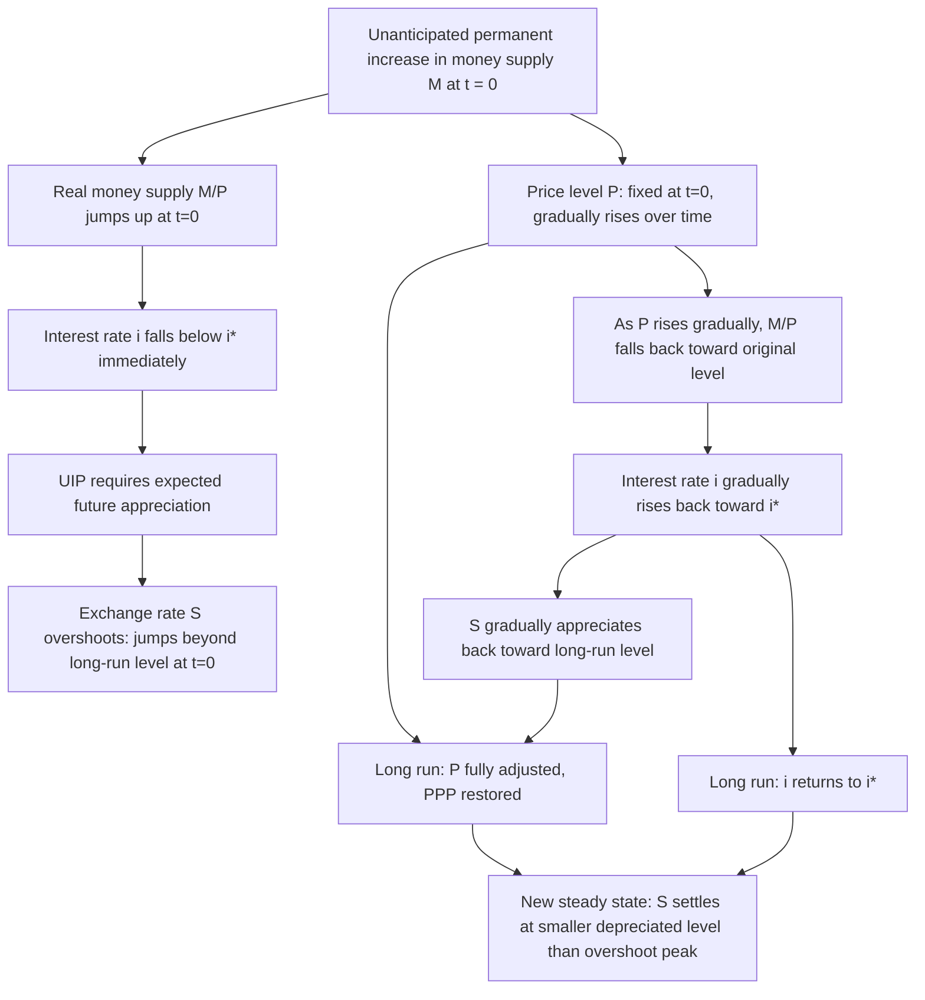

## Sticky Prices and Short Run Versus Long Run Adjustment

### Conceptual Foundation

The distinction between short-run and long-run adjustment in open-economy macroeconomics rests on a fundamental asymmetry: **asset markets (including the foreign exchange market) clear instantaneously**, while **goods markets adjust slowly** because nominal prices are "sticky" — they do not immediately jump to their new market-clearing level in response to shocks. This asymmetry is the single most important mechanical assumption underlying modern exchange rate dynamics, most notably the Dornbusch overshooting model, and it explains why exchange rates are empirically far more volatile than the slow-moving price levels and trade fundamentals that classical/flexible-price models would suggest should anchor them.

### Why Prices Are "Sticky": Microeconomic Foundations

Sticky (nominal) prices are a form of **nominal rigidity** — the tendency of prices, particularly for goods and wages, to adjust slowly or infrequently in response to changes in economic conditions, even when the market-clearing price has changed. Several complementary microeconomic explanations are offered in the literature:

- **Menu costs**: Physical or administrative costs of changing posted prices (reprinting menus, catalogs, contracts, updating systems) make firms reluctant to adjust prices continuously in response to every shock, instead adjusting periodically or only when the benefit of adjustment exceeds the fixed cost
- **Long-term contracts**: Many prices, especially wages and business-to-business supply contracts, are fixed for a specified duration (e.g., annual wage contracts, multi-year supply agreements), mechanically preventing instantaneous adjustment
- **Staggered price/wage setting**: Not all firms or workers reset prices/wages simultaneously; adjustment is staggered across time (formalized in models such as Calvo pricing, where each firm faces a fixed probability each period of being able to reset its price), so the aggregate price level adjusts gradually even though individual prices eventually do change
- **Imperfect information and rational inattention**: Firms may not immediately observe or fully process new information relevant to optimal pricing, delaying adjustment
- **Coordination failures**: Even absent explicit costs, firms may be reluctant to be the first to change prices without confidence that competitors will do the same, generating inertia in aggregate price adjustment

In contrast, financial asset prices — including the exchange rate — are essentially costless to adjust: they are continuously traded, quoted, and can jump discretely in response to new information with no equivalent of "menu costs" or contractual rigidity.

### The Short Run vs. Long Run Distinction in Formal Terms

| Dimension | Short Run | Long Run |
| --- | --- | --- |
| Price level $P$ | Fixed/sticky (does not respond immediately to shocks) | Fully flexible; adjusts to restore equilibrium |
| Asset markets / exchange rate $S$ | Instantaneously flexible; jumps immediately | Settles at new steady-state level |
| Money market equilibrium | Achieved via interest rate adjustment (since $P$ fixed) | Achieved via price level adjustment (since $i$ returns to baseline) |
| PPP | Does not hold (since $S$ moves but $P$ does not, yet) | Holds (both $S$ and $P$ have fully adjusted) |
| Real variables (output, real exchange rate) | Can deviate from natural/long-run levels | Return to natural/long-run levels |

The economy is conceptualized as transitioning from an initial equilibrium, through a short-run "impact" phase where only flexible variables (the exchange rate, interest rates) adjust, toward a long-run equilibrium where sticky variables (the price level) have fully caught up and all markets — including the goods market via PPP — clear simultaneously.

### The Adjustment Mechanism: A Step-by-Step Framework

Consider a permanent, unanticipated increase in the domestic money supply, the canonical shock used to illustrate sticky-price dynamics (as formalized in the Dornbusch model):

**Step 1 — Immediate impact (asset markets clear instantly):**

With $P$ fixed by assumption in the very short run, the real money supply $M/P$ rises. Money market equilibrium requires the domestic interest rate $i$ to fall to induce agents to hold the additional real balances (since money demand is decreasing in $i$).

**Step 2 — Exchange rate response (UIP linkage):**

The fall in $i$ below the (unchanged) foreign rate $i^*$ means, via Uncovered Interest Parity, that the domestic currency must be **expected to appreciate** going forward to equalize expected returns across currencies. For this expectation to be consistent with convergence toward a *depreciated* long-run equilibrium, the exchange rate must **overshoot** — jump immediately beyond its new long-run level — so that the anticipated appreciation from the overshot level back down to the long-run level exactly satisfies UIP.

**Step 3 — Gradual price adjustment:**

Over time, as sticky prices gradually adjust upward (reflecting the now-higher money supply and the initial real exchange rate depreciation, which raises demand for domestic goods and puts upward pressure on domestic prices), the price level $P$ rises toward its new long-run level.

**Step 4 — Interest rate and exchange rate reversion:**

As $P$ rises, the real money supply $M/P$ falls back toward its original level, allowing the interest rate to rise back toward $i^*$. Consistent with UIP, as $i$ rises back toward $i^*$, the expected appreciation shrinks, and the actual exchange rate gradually appreciates from its overshot level back toward the long-run equilibrium $\bar{S}$.

**Step 5 — Long-run equilibrium:**

Once $P$ has fully adjusted (risen proportionally to $M$), PPP is restored, $i$ returns to $i^*$, and $S$ settles at its new long-run level $\bar{S}$, which reflects a smaller depreciation than the short-run overshot peak.

### Formal Characterization

Using the standard Dornbusch-style setup, the speed of price adjustment can be modeled as:

$$\dot{p} = \theta(\bar{p} - p)$$

Where $\theta > 0$ governs how quickly the price level closes the gap toward its long-run target $\bar{p}$; a **smaller** $\theta$ represents **stickier** prices (slower adjustment). This differential-equation formulation captures the gradual, continuous convergence of the price level, in contrast to the instantaneous jump characterizing the exchange rate at the moment of the shock.

The overshooting magnitude is inversely related to both the speed of price adjustment $\theta$ and the interest-sensitivity of money demand $\lambda$:

$$s_0 - \bar{s} \propto \frac{1}{\lambda \theta}(p_0 - \bar{p})$$

Slower price adjustment (smaller $\theta$) requires a **larger** initial exchange rate overshoot to generate the necessary path of expected future appreciation consistent with UIP, since the interest rate gap (and hence the required offsetting expected appreciation) must persist longer when prices adjust more slowly.

### Why This Matters: Reconciling Theory with Observed Volatility

[Unverified] A central stylized fact motivating the sticky-price framework is that **nominal and real exchange rates are dramatically more volatile under floating exchange rate regimes than relative price levels are** — a puzzle that flexible-price models (which assume continuous PPP) cannot explain, since under continuous PPP, exchange rate volatility should mirror relative price level volatility, and price levels are empirically much smoother than exchange rates. The sticky-price/overshooting framework resolves this by attributing the "excess" volatility of the nominal exchange rate to its role as the sole fully flexible variable that must absorb the entire short-run adjustment burden while goods prices remain anchored.

### Short-Run vs. Long-Run Output Effects

Sticky prices also generate real (output) effects of monetary shocks in the short run — a feature absent from flexible-price models where money is neutral even in the short run:

- **Short run**: The real exchange rate depreciation (nominal depreciation exceeding the still-unadjusted price level change) makes domestic goods more competitive internationally, potentially stimulating demand for domestic output and raising output above its natural/long-run level (subject to the Marshall-Lerner condition and demand elasticities)
- **Long run**: As prices fully adjust, the real exchange rate returns to its long-run level, and any short-run output gains dissipate — money is neutral in the long run, consistent with classical dichotomy, but **not** in the short run, consistent with Keynesian-style sticky-price macroeconomics

This is a key channel through which the sticky-price monetary model connects international finance to broader open-economy macroeconomic policy analysis (e.g., the effectiveness of monetary policy in stimulating output via the exchange rate channel in the short run).

### Comparison: Flexible-Price vs. Sticky-Price Adjustment Paths

| Feature | Flexible-Price Model | Sticky-Price Model |
| --- | --- | --- |
| Price adjustment speed | Instantaneous | Gradual (governed by $\theta$) |
| PPP | Holds at all times | Holds only in the long run |
| Exchange rate path after money shock | Immediate jump directly to new long-run level; no overshooting | Overshoots beyond long-run level, then gradually reverts |
| Interest rate path | Determined by inflation expectations (Fisher effect); can rise with expected inflation | Falls initially (liquidity effect), then gradually returns to baseline |
| Real output effects | None (money neutral even short run) | Present in short run (real depreciation stimulates demand); dissipate long run |
| Explains high observed FX volatility? | Poorly | Well — a key empirical strength |

### Diagram — Time Paths of Key Variables Following a Monetary Expansion

### Diagram — Short-Run vs. Long-Run Adjustment Speed Comparison (svg_diagram)

<svg xmlns="http://www.w3.org/2000/svg" viewBox="0 0 720 360">
<text x="360" y="28" text-anchor="middle" font-size="16" font-weight="bold" fill="#1a1a1a">Speed of Adjustment: Assets vs. Goods Markets (svg_diagram)</text>

<line x1="80" y1="310" x2="650" y2="310" stroke="#333" stroke-width="1.5" />
<line x1="80" y1="60" x2="80" y2="310" stroke="#333" stroke-width="1.5" />
<text x="650" y="330" text-anchor="middle" font-size="11" fill="#333">Time since shock</text>
<text x="40" y="55" text-anchor="middle" font-size="11" fill="#333">Level</text>

<line x1="80" y1="150" x2="650" y2="150" stroke="#666" stroke-width="1.5" stroke-dasharray="4,3" />
<text x="655" y="154" font-size="10" fill="#666">long-run level</text>

<line x1="80" y1="230" x2="180" y2="230" stroke="#ea4335" stroke-width="2.5" />
<line x1="180" y1="230" x2="180" y2="90" stroke="#ea4335" stroke-width="2.5" />
<path d="M 180 90 Q 400 110 650 150" stroke="#ea4335" stroke-width="2.5" fill="none" />
<text x="500" y="95" font-size="11" fill="#ea4335" font-weight="bold">Exchange rate S (fast, overshoots)</text>

<line x1="80" y1="270" x2="180" y2="270" stroke="#4285f4" stroke-width="2.5" />
<path d="M 180 270 Q 400 220 650 150" stroke="#4285f4" stroke-width="2.5" fill="none" />
<text x="500" y="235" font-size="11" fill="#4285f4" font-weight="bold">Price level P (slow, gradual)</text>
<line x1="180" y1="310" x2="180" y2="315" stroke="#333" stroke-width="1.5" />
<text x="180" y="328" text-anchor="middle" font-size="10" fill="#333">shock at t=0</text>

<text x="360" y="350" text-anchor="middle" font-size="11" fill="`#1a1a1a`">Asset markets jump instantly; goods prices converge gradually to the same long-run level</text>

</svg>

### Common Pitfalls and Misconceptions

- **Assuming all variables adjust at the same speed**: The entire framework hinges on the asymmetry between asset market speed and goods market speed; conflating the two eliminates the mechanism generating overshooting and short-run real effects entirely.
- **Treating "sticky prices" as meaning prices never change**: Sticky prices adjust *gradually*, not never — the long-run equilibrium still fully restores PPP and classical neutrality; stickiness is about the *speed*, not the *existence*, of adjustment.
- **Forgetting that overshooting requires a specific shock type**: Overshooting specifically arises from unanticipated, typically monetary, shocks under sticky prices; anticipated shocks, or shocks under different model assumptions (e.g., real shocks such as productivity changes), can generate different — sometimes even opposite — dynamic paths, and this should not be assumed to generalize uniformly to every disturbance.
- **Neglecting the short-run real effects on output**: Students often focus solely on exchange rate/price dynamics and forget that sticky prices also generate genuine short-run output and competitiveness effects, which are central to the policy relevance of these models (e.g., monetary policy transmission via the exchange rate channel).
- **Assuming a single universal value for the adjustment speed $\theta$**: [Inference] The empirically-relevant speed of price adjustment varies substantially by country, sector, and time period, and is not a fixed structural constant — this is part of why the precise magnitude of overshooting is difficult to pin down empirically, consistent with the broader PPP puzzle discussed in the empirical PPP-testing literature.

**Related Topics**

- The Dornbusch overshooting model (formal treatment)
- The monetary approach to exchange rate determination
- Uncovered Interest Parity and its role in short-run dynamics
- Empirical tests of purchasing power parity
- Menu costs, Calvo pricing, and New Keynesian nominal rigidities
- The Marshall-Lerner condition and short-run competitiveness effects
- Money neutrality and the classical dichotomy
- News, expectations, and anticipated versus unanticipated shocks in exchange rate models