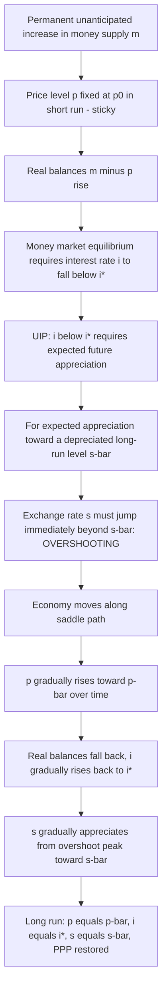

## The Dornbusch Overshooting Model

### Conceptual Foundation and Historical Context

The Dornbusch overshooting model, introduced by Rudiger Dornbusch in his 1976 paper "Expectations and Exchange Rate Dynamics" (Journal of Political Economy), is widely regarded as the foundational model of modern open-economy exchange rate dynamics. Its central achievement was reconciling two seemingly incompatible observations: (1) asset markets, including foreign exchange, are highly efficient and adjust instantaneously to new information, while (2) goods markets exhibit substantial nominal price rigidity. Dornbusch showed that combining these two realistic assumptions — rather than assuming continuous market clearing everywhere, as earlier flexible-price monetary models did — generates **exchange rate overshooting**: a short-run exchange rate movement that exceeds the eventual long-run equilibrium change, providing the first coherent theoretical explanation for why floating exchange rates are so much more volatile than the underlying macroeconomic fundamentals (money supplies, price levels) they are theoretically anchored to.

### Model Assumptions

1. **Sticky goods prices**: The domestic price level $P$ is fixed in the short run and adjusts only gradually over time toward its long-run equilibrium
2. **Instantaneous asset market clearing**: The money market and foreign exchange market clear continuously; the exchange rate can jump discretely at any moment
3. **Uncovered Interest Parity (UIP)** holds continuously, linking the interest rate differential to the expected rate of exchange rate change
4. **Money market equilibrium** holds continuously, determining the domestic interest rate given the money supply, income, and price level
5. **Long-run Purchasing Power Parity** holds — once prices fully adjust, $S = P/P^*$
6. **Rational (or perfect foresight) expectations**: Economic agents correctly anticipate the future path of the exchange rate given the model's structure, so realized future exchange rates equal previously expected values along the equilibrium path
7. **Small open economy** (or, in the two-country version, well-defined foreign variables treated as exogenous) with perfect capital mobility

### The Three Core Equations

**1. Money Market Equilibrium**

$$m - p = \phi y - \lambda i$$

Real money supply equals real money demand, which depends positively on income $y$ (transactions demand) and negatively on the interest rate $i$ (opportunity cost of holding money).

**2. Uncovered Interest Parity**

$$i - i^* = \dot{s}^e$$

The domestic interest rate exceeds the foreign rate by exactly the expected rate of currency depreciation $\dot{s}^e$ (the expected proportional rate of change of the exchange rate).

**3. Goods Market / Price Adjustment (Sticky-Price Phillips-Curve-Type Relation)**

$$\dot{p} = \theta(\bar{p} - p) \quad \text{or equivalently} \quad \dot{p} = \pi(d - \bar{y})$$

Where the price level adjusts gradually toward its long-run target, often modeled as a function of excess demand $d$ relative to the economy's natural output level $\bar{y}$, with excess demand itself depending on the real exchange rate (competitiveness) and other factors. $\theta$ or $\pi$ is the speed-of-adjustment parameter governing how quickly prices respond to disequilibrium.

### Long-Run Equilibrium

In the long run, prices have fully adjusted, output returns to its natural level, and the interest rate returns to its initial (foreign-determined) level $i = i^*$. Under these conditions, PPP holds:

$$\bar{s} = \bar{p} - p^*$$

A permanent increase in the money supply $\Delta m$ produces a long-run exchange rate depreciation and price level increase of the **same proportional magnitude**:

$$\Delta \bar{s} = \Delta \bar{p} = \Delta m$$

This is the classical, long-run neutral-money result: in the long run, a monetary expansion simply scales up all nominal variables proportionally, with no effect on real variables (real money balances, real exchange rate, output, or the real interest rate).

### Short-Run Dynamics: Deriving Overshooting

**Step 1 — Immediate effect on the interest rate**

At the moment of an unanticipated, permanent increase in $m$ (from $m_0$ to $m_1$), the price level $p$ is fixed at its pre-shock level $p_0$ (sticky in the short run). From the money market equation, holding $y$ fixed:

$$m_1 - p_0 = \phi y - \lambda i_0'$$

Since $m_1 > m_0$ and $p_0$ is unchanged, real balances $m_1 - p_0$ have risen, which (given fixed $\phi y$) requires the interest rate to **fall**: $i_0' < i^*$.

**Step 2 — UIP requires expected appreciation, forcing overshooting**

With $i_0' < i^*$, UIP requires $\dot{s}^e < 0$: the exchange rate must be **expected to appreciate** from this point forward. But the long-run equilibrium level $\bar{s}$ reflects a *depreciation* relative to the initial pre-shock rate $s_0$ (since $\Delta \bar{s} = \Delta m > 0$). For the exchange rate to be expected to appreciate *while converging toward a depreciated long-run level* $\bar{s}$, it must have **overshot** — jumped immediately to a level $s_0'$ that lies *beyond* $\bar{s}$ (i.e., $s_0' > \bar{s} > s_{\text{initial}}$) — so that the subsequent gradual appreciation from $s_0'$ down to $\bar{s}$ is exactly consistent with the expected appreciation required by UIP.

**Step 3 — Gradual convergence**

As time passes, $p$ rises gradually toward $\bar{p}$ (governed by the price adjustment equation). As $p$ rises, real balances fall back, $i$ rises back toward $i^*$, the expected (and actual) rate of appreciation shrinks toward zero, and $s$ gradually appreciates from its overshot peak down to $\bar{s}$, arriving exactly when $p$ reaches $\bar{p}$.

### Formal Overshooting Magnitude

Combining the three core equations and solving the resulting differential equation system (a standard saddle-path analysis), the initial jump in the exchange rate relative to its long-run level can be expressed as proportional to the initial price gap:

$$s_0' - \bar{s} = -\frac{1}{\lambda \theta}(p_0 - \bar{p})$$

Since $p_0 - \bar{p} < 0$ (prices have not yet risen to their higher long-run level) and the proportionality constant is positive, this yields $s_0' - \bar{s} > 0$: **the exchange rate initially overshoots above its long-run depreciated level**, confirming the overshooting result algebraically. The magnitude of overshooting is:

- **Inversely related to $\lambda$** (interest semi-elasticity of money demand): if money demand is highly interest-sensitive, only a small interest rate change is needed to absorb the real balance increase, requiring less overshooting
- **Inversely related to $\theta$** (speed of price adjustment): slower price adjustment means the interest rate gap (and thus the required expected appreciation) must persist longer, requiring a larger initial overshoot to generate a sufficiently long, gradual appreciation path

### The Saddle Path

The Dornbusch model is typically presented graphically in $(p, s)$ space using a phase diagram with two key loci:

- **Goods market equilibrium locus ($\dot{p} = 0$)**: downward-sloping, representing combinations of $p$ and $s$ consistent with zero price change (goods market at rest)
- **Asset market equilibrium locus ($\dot{s} = 0$)**: vertical line at $p = \bar{p}$ (money market equilibrium combined with UIP pins down a unique relationship, often depicted as a vertical or steeply-sloped locus depending on the exact formulation)

The **saddle path** is the unique trajectory converging to the new long-run equilibrium; given sticky $p$ (which cannot jump) and flexible $s$ (which can jump), the economy's dynamics are pinned down by $s$ jumping immediately onto the saddle path at the initial (given) value of $p_0$, after which the system moves along the saddle path toward the new steady state as $p$ gradually adjusts.

### Comparative Statics Summary

| Shock | Short-Run Exchange Rate Response | Long-Run Exchange Rate Response |
| --- | --- | --- |
| Permanent ↑ in money supply $m$ | Overshoots — depreciates *more* than the long-run change | Depreciates proportionally to $\Delta m$ |
| Permanent ↑ in domestic income $y$ | Appreciates (raises money demand, raises $i$ short run in some variants; net effect on $s$ typically an appreciation) | Appreciates proportionally to the effect on relative money demand |
| Temporary ↑ in money supply | Smaller overshoot, since expected future depreciation is smaller (money supply expected to revert) | No long-run change (temporary shock) |

### Empirical Evidence and the Overshooting Result

[Unverified] The Dornbusch model's central qualitative prediction — that nominal and real exchange rates should be substantially more volatile under floating regimes than relative price levels — is broadly consistent with the well-documented stylized fact that exchange rate volatility rose sharply following the shift from fixed (Bretton Woods) to floating exchange rate regimes in the early 1970s, while relative price level volatility did not show a comparable increase. This qualitative match is often cited as the model's principal empirical success.

[Inference] However, direct tests of the model's specific quantitative predictions — the precise magnitude and time path of overshooting following identified monetary shocks — have produced more mixed results in the econometric literature, and the model's simplifying assumptions (particularly backward-looking or mechanically-specified price adjustment in the original formulation, rather than fully micro-founded forward-looking price setting) have been extended and refined by later New Open Economy Macroeconomics (NOEM) models, such as the Obstfeld-Rogoff "redux" model, which derive nominal rigidities from explicit optimizing behavior with monopolistic competition and menu costs, providing firmer microeconomic foundations while typically preserving the qualitative overshooting-type dynamics under appropriate conditions.

### Policy Implications

- **Monetary policy transmission**: The model demonstrates that monetary policy affects the exchange rate disproportionately in the short run relative to its ultimate long-run effect, with implications for the credibility and communication of monetary policy (large short-run exchange rate swings from policy actions that will only have proportionally smaller long-run effects)
- **Exchange rate as a leading indicator**: Since the exchange rate jumps immediately upon policy news (even before real economic effects materialize), it can act as a rapid, forward-looking signal of monetary policy stance, though this also means it can generate volatility that complicates trade and investment planning
- **Case for gradualism or credibility in policy**: Because overshooting arises specifically from *unanticipated* shocks under sticky prices, well-communicated and gradual/anticipated policy changes can, in principle, generate smaller exchange rate disruptions relative to sudden, unanticipated shifts, though this depends on the specific expectations formation embedded in the model extension used

### Diagram — Dornbusch Model Phase Diagram Logic

### Diagram — Dornbusch Phase Diagram: p vs. s Space (svg_diagram)

<svg xmlns="http://www.w3.org/2000/svg" viewBox="0 0 700 420">
<text x="350" y="28" text-anchor="middle" font-size="16" font-weight="bold" fill="#1a1a1a">Dornbusch Model Phase Diagram (svg_diagram)</text>

<line x1="90" y1="360" x2="620" y2="360" stroke="#333" stroke-width="1.5" />
<line x1="90" y1="60" x2="90" y2="360" stroke="#333" stroke-width="1.5" />
<text x="620" y="380" text-anchor="middle" font-size="12" fill="#333">p (price level)</text>
<text x="55" y="55" text-anchor="middle" font-size="12" fill="#333">s (exchange rate)</text>

<line x1="150" y1="100" x2="550" y2="300" stroke="#4285f4" stroke-width="2" />
<text x="560" y="295" font-size="11" fill="#4285f4" font-weight="bold">ṗ = 0 locus</text>

<line x1="380" y1="80" x2="380" y2="340" stroke="#34a853" stroke-width="2" />
<text x="390" y="75" font-size="11" fill="#34a853" font-weight="bold">ṡ = 0 locus (p = p̄)</text>

<circle cx="260" cy="190" r="5" fill="#333" />
<text x="260" y="210" text-anchor="middle" font-size="10" fill="#333">Initial equilibrium (p0, s0)</text>

<circle cx="380" cy="240" r="5" fill="#ea4335" />
<text x="380" y="260" text-anchor="middle" font-size="10" fill="#ea4335">New long-run (p̄, s̄)</text>

<circle cx="260" cy="130" r="5" fill="#f9ab00" />
<text x="230" y="120" text-anchor="middle" font-size="10" fill="#f9ab00">Overshoot jump (p0, s0')</text>

<path d="M 260 130 Q 320 175 380 240" stroke="#a142f4" stroke-width="2.5" stroke-dasharray="6,3" fill="none" />
<text x="330" y="160" font-size="10" fill="#a142f4" font-weight="bold">Saddle path</text>

<line x1="260" y1="190" x2="260" y2="135" stroke="#f9ab00" stroke-width="2" marker-end="url(#arrowUp)" />
<text x="350" y="400" text-anchor="middle" font-size="11" fill="`#1a1a1a`">s jumps instantly to the saddle path; p adjusts gradually along it to the new equilibrium</text>

</svg>

### Common Pitfalls and Misconceptions

- **Assuming overshooting occurs for any shock**: Overshooting is specifically the result of *unanticipated* monetary shocks combined with sticky prices; anticipated shocks or non-monetary (real) shocks can generate qualitatively different dynamic paths, including cases with no overshooting or even "undershooting" depending on the model extension.
- **Confusing the direction of the interest rate and exchange rate movements**: A common error is assuming a monetary expansion should raise interest rates (as it might via an inflation-expectations channel in the flexible-price model); in the Dornbusch sticky-price model, the *short-run* liquidity effect dominates, and $i$ **falls**, not rises, immediately after the shock.
- **Treating the overshoot as a permanent feature of the new equilibrium**: The overshoot is a **transitional, short-run phenomenon**; it is corrected over time as prices adjust, and the economy converges smoothly to $\bar{s}$, not to the overshot peak.
- **Ignoring the specific role of $\lambda$ and $\theta$**: The *magnitude* of overshooting is not a fixed universal constant — it depends explicitly on the interest-sensitivity of money demand and the speed of price adjustment, both of which can vary by economy and time period, [Inference] meaning cross-country or cross-episode comparisons of the "degree" of overshooting should account for these underlying structural differences rather than assuming a uniform degree of overshooting applies everywhere.
- **Overstating the model's forecasting reliability**: Despite its powerful qualitative insight, [Inference] the Dornbusch model — like other monetary approach models — has not demonstrated strong out-of-sample forecasting performance in the broader empirical literature (see the Meese-Rogoff findings referenced in the monetary approach discussion), so its primary value is best understood as a *qualitative and pedagogical framework* for understanding exchange rate volatility rather than a precise quantitative forecasting tool.

**Related Topics**

- The monetary approach to exchange rate determination (flexible-price vs. sticky-price)
- Sticky prices and short-run versus long-run adjustment (mechanism detail)
- Uncovered Interest Parity and its role in the overshooting mechanism
- Empirical tests of purchasing power parity
- New Open Economy Macroeconomics (NOEM) and micro-founded nominal rigidity models
- The Meese-Rogoff exchange rate forecasting puzzle
- Saddle-path stability and phase diagram analysis in dynamic macroeconomics
- News, anticipated versus unanticipated shocks, and rational expectations in exchange rate models