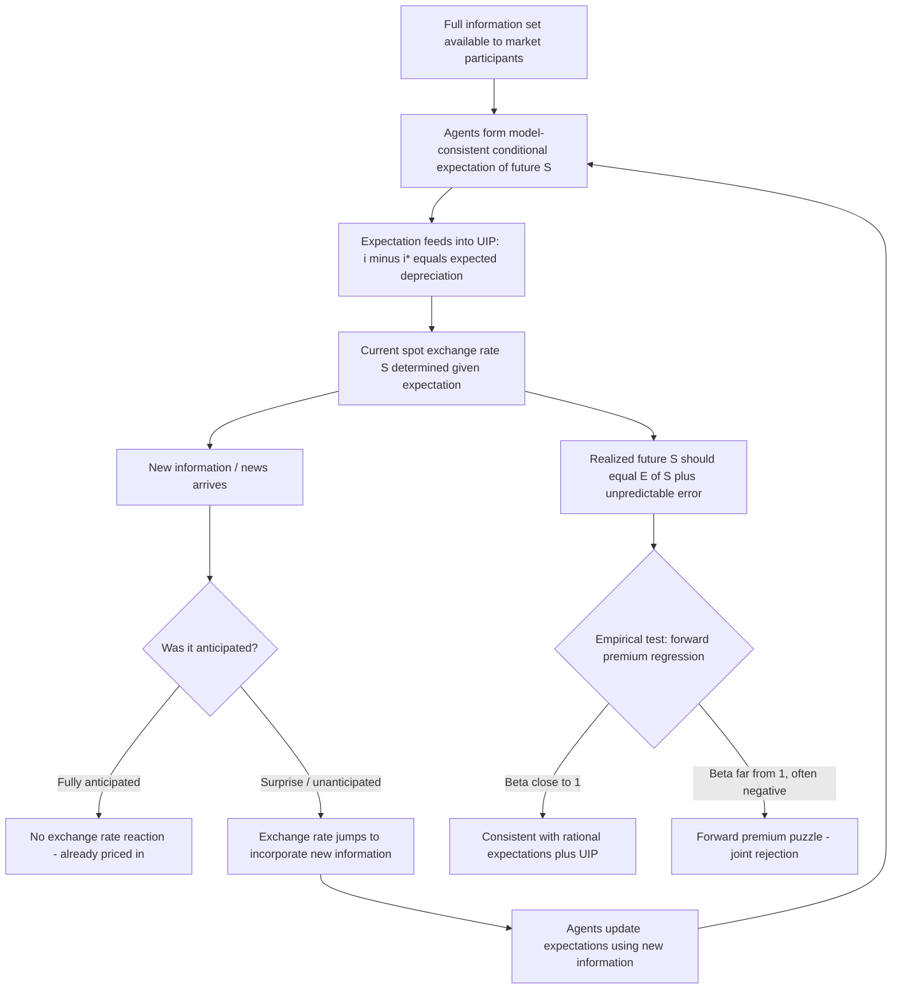

## Rational Expectations in the Foreign Exchange Market

### Conceptual Foundation

The rational expectations hypothesis (REH), introduced into economics by John Muth (1961) and popularized in macroeconomics by Robert Lucas and Thomas Sargent, posits that economic agents form expectations about future variables using all available, relevant information efficiently — including full knowledge of the structure of the economic model governing that variable — such that their subjective expectations coincide with the mathematically correct conditional expectation implied by the model, given available information. In the foreign exchange market, rational expectations means market participants' forecasts of future exchange rates are formed using all publicly available information (macroeconomic fundamentals, policy announcements, the structure of the exchange rate model itself) and are, on average, correct — systematic, predictable forecast errors should not persist, since arbitrage and profit-seeking behavior would eliminate any exploitable pattern.

Formally, rational expectations requires:

$$E_t[S_{t+1}] = E[S_{t+1} \mid \Omega_t]$$

Where $\Omega_t$ is the full information set available at time $t$, and the expectation is the objectively correct conditional expectation given the true underlying model of exchange rate determination. Equivalently, actual realized values can be decomposed as:

$$S_{t+1} = E_t[S_{t+1}] + \varepsilon_{t+1}$$

Where the forecast error $\varepsilon_{t+1}$ is **unpredictable** given information available at time $t$ (i.e., $E_t[\varepsilon_{t+1}] = 0$), and uncorrelated with any variable in $\Omega_t$.

### Role in Exchange Rate Models

Rational expectations plays a foundational, structural role across the parity conditions and asset-approach models:

- **Uncovered Interest Parity (UIP)**: The condition $i - i^* = E_t[\Delta s_{t+1}]$ requires a well-defined expectation of future depreciation; under rational expectations, this expectation is model-consistent, meaning the interest differential should, on average, correctly predict subsequent exchange rate changes if UIP and rational expectations jointly hold
- **The Dornbusch overshooting model**: Explicitly relies on **perfect foresight** (a limiting, deterministic case of rational expectations under no uncertainty) to derive the saddle-path solution — agents correctly anticipate the entire future adjustment path of prices and the exchange rate following a monetary shock, which is essential to pinning down the unique non-explosive (saddle-path) solution among the infinite mathematically possible trajectories
- **The monetary approach more broadly**: Requires that agents understand and correctly apply the money-market and PPP relationships governing the exchange rate's long-run equilibrium, using that understanding to form forecasts consistent with the model's structure

### The "News" Model of Exchange Rate Determination

A key implication of rational expectations combined with efficient asset markets is the **news model**: since all currently available information is already incorporated into today's exchange rate (an efficient-markets-type argument), the exchange rate should only move in response to **genuinely new information ("news")** — unanticipated deviations of announced data (money supply figures, interest rate decisions, GDP releases, political events) from what was already expected by the market.

$$\Delta s_t = f(\text{news}_t) = f(\text{actual}_t - \text{expected}_t)$$

This has a strong testable implication: the *anticipated* component of any announcement (e.g., a widely expected interest rate hike) should produce **little or no exchange rate reaction**, since it was already priced in; only the **surprise component** (the deviation from consensus expectations) should move the exchange rate. [Unverified] This prediction is broadly, though not perfectly, consistent with a substantial body of event-study literature examining exchange rate reactions to scheduled macroeconomic announcements and central bank decisions, which generally finds that exchange rates react primarily to the surprise component of news relative to survey-based consensus forecasts, rather than to the announced figure itself.

### The Efficient Markets Hypothesis (EMH) Connection

Rational expectations in the FX market is closely linked to the **efficient markets hypothesis**, which in its foreign exchange application states that the current spot exchange rate fully reflects all available information, such that no trading strategy based on that information set can generate systematic, risk-adjusted excess returns. Under joint rational expectations and risk neutrality, this implies the **forward rate unbiasedness hypothesis**:

$$F_t = E_t[S_{t+1}]$$

The forward rate should be an unbiased predictor of the future spot rate, with any deviation representing pure, unpredictable forecast error.

### Empirical Testing of Rational Expectations in FX Markets

**1. Forward Rate Unbiasedness Regressions**

The standard test regresses the realized change in the spot rate on the forward premium:

$$s_{t+1} - s_t = \alpha + \beta(f_t - s_t) + \varepsilon_{t+1}$$

Under joint rational expectations, risk neutrality, and market efficiency, the null hypothesis is $\alpha = 0$ and $\beta = 1$. [Unverified] As discussed in the context of the forward premium puzzle, empirical estimates of $\beta$ are overwhelmingly found to be far below 1 — frequently negative — representing one of the most robust rejections of the joint hypothesis in all of empirical international finance. Since this test jointly examines rational expectations *and* risk neutrality *and* UIP together, the rejection does not by itself identify which specific component fails.

**2. Survey-Based Expectations Data**

To separately test whether the failure stems from *irrational expectations* versus a *risk premium*, researchers use survey data on market participants' actual exchange rate expectations (e.g., from surveys conducted by Consensus Economics or similar providers) rather than relying on the forward rate as an implicit proxy for expectations.

[Unverified] A substantial strand of this literature (associated notably with work by Jeffrey Frankel, Kenneth Froot, and Menzie Chinn, among others) has found that survey-based expectations often deviate systematically from what rational expectations would predict — for example, exhibiting excessive extrapolation of recent trends in the short run, or predictable forecast errors correlated with variables that should be irrelevant under full rationality. This evidence is often interpreted as suggesting that at least part of the empirical failure of the joint UIP/rational-expectations hypothesis stems from expectational biases or heterogeneous/adaptive expectations formation among market participants, rather than solely from a rationally-priced risk premium.

**3. Decomposing the Forward Premium Puzzle**

Using survey data, the forecast error can be decomposed as:

$$s_{t+1} - f_t = \underbrace{(s_{t+1} - E_t^{survey}[s_{t+1}])}_{\text{expectational error}} + \underbrace{(E_t^{survey}[s_{t+1}] - f_t)}_{\text{risk premium (implied)}}$$

[Inference] Different studies attribute varying relative weight to these two components, and the literature has not converged on a single dominant explanation; this remains an active and genuinely unresolved area of research, with the balance of evidence generally suggesting that **both** a time-varying risk premium and some degree of expectational bias or heterogeneity contribute to the observed anomalies, rather than either being a complete standalone explanation.

### Challenges to Strict Rational Expectations: Behavioral and Heterogeneous Expectations Models

Given the empirical difficulties facing the strict rational expectations hypothesis in FX markets, several alternative or complementary frameworks have gained prominence in the literature:

- **Heterogeneous agent models**: Distinguish between different types of market participants — e.g., "fundamentalists" who trade based on models like PPP or UIP, and "chartists" or "noise traders" who extrapolate recent trends — whose interaction can generate persistent deviations from fundamentals and excess volatility not explained by rational, homogeneous-expectations models
- **Peso problem explanations**: Even under fully rational expectations, if market participants correctly assign a small probability to a large, rare event (e.g., a currency devaluation or crisis) that does not occur within a given (finite) sample, standard statistical tests can spuriously reject rational expectations/UIP due to this small-sample distortion, without expectations actually being irrational
- **Learning models**: Relax the assumption that agents know the true model with certainty from the outset, instead having agents learn about the correct model or parameters over time using adaptive or Bayesian updating rules, which can generate transitional dynamics and forecast errors that appear non-rational in finite samples even though the underlying learning process is fully rational
- **Behavioral finance approaches**: Incorporate psychological biases (overconfidence, herding, anchoring, loss aversion) documented in experimental and survey settings directly into exchange rate expectation formation, departing more fundamentally from the rational expectations paradigm

### Rational Expectations and the Overshooting Result Specifically

It is worth emphasizing the tight logical connection between rational (perfect foresight) expectations and the Dornbusch overshooting result: overshooting is not an arbitrary assumption but a **necessary implication** of combining sticky prices with rational expectations and UIP. If agents were *not* rational — for instance, if they naively expected the exchange rate to remain unchanged after a monetary shock — there would be no reason for the exchange rate to overshoot at all; the overshooting jump exists precisely *because* rational agents correctly anticipate the future gradual price adjustment and appreciation path, and this anticipation feeds back, via UIP, into the size of today's required jump. This illustrates a broader and important lesson: **rational expectations models generate forward-looking asset price dynamics** in which the future is "pulled" into the determination of the present price — a hallmark feature distinguishing rational-expectations-based asset pricing from purely backward-looking, adaptive-expectations frameworks.

### Diagram — Rational Expectations Feedback Loop in Exchange Rate Determination

### Diagram — Decomposing the Forward Premium Puzzle (svg_diagram)

<svg xmlns="http://www.w3.org/2000/svg" viewBox="0 0 700 340">
<text x="350" y="28" text-anchor="middle" font-size="16" font-weight="bold" fill="#1a1a1a">Decomposing the Forward Premium Puzzle (svg_diagram)</text>
<rect x="40" y="70" width="620" height="60" fill="#fef7e0" stroke="#f9ab00" stroke-width="2" rx="6" />
<text x="350" y="95" text-anchor="middle" font-size="13" font-weight="bold" fill="#1a1a1a">Observed forecast error: s(t+1) − f(t)</text>
<text x="350" y="115" text-anchor="middle" font-size="11" fill="#555">(joint rejection of rational expectations + risk neutrality + UIP)</text>
<line x1="230" y1="130" x2="150" y2="190" stroke="#666" stroke-width="1.5" />
<line x1="470" y1="130" x2="550" y2="190" stroke="#666" stroke-width="1.5" />
<rect x="30" y="190" width="280" height="90" fill="#e8f0fe" stroke="#4285f4" stroke-width="2" rx="6" />
<text x="170" y="215" text-anchor="middle" font-size="12" font-weight="bold" fill="#1a1a1a">Expectational Error</text>
<text x="170" y="235" text-anchor="middle" font-size="10" fill="#333">s(t+1) − survey expectation</text>
<text x="170" y="255" text-anchor="middle" font-size="10" fill="#333">Evidence: systematic survey</text>
<text x="170" y="270" text-anchor="middle" font-size="10" fill="#333">bias, trend extrapolation</text>
<rect x="390" y="190" width="280" height="90" fill="#fce8e6" stroke="#ea4335" stroke-width="2" rx="6" />
<text x="530" y="215" text-anchor="middle" font-size="12" font-weight="bold" fill="#1a1a1a">Risk Premium</text>
<text x="530" y="235" text-anchor="middle" font-size="10" fill="#333">survey expectation − f(t)</text>
<text x="530" y="255" text-anchor="middle" font-size="10" fill="#333">Evidence: time-varying,</text>
<text x="530" y="270" text-anchor="middle" font-size="10" fill="#333">correlated with risk sentiment</text>

<text x="350" y="315" text-anchor="middle" font-size="11" fill="`#1a1a1a`">Literature consensus: both components likely contribute; no single dominant explanation</text>

</svg>

### Common Pitfalls and Misconceptions

- **Equating "rational expectations" with "always correct forecasts"**: Rational expectations does not mean forecasts are never wrong — it means forecast *errors* are unpredictable given available information, not that errors don't occur; ex-post forecast errors are entirely consistent with rationality.
- **Assuming the forward premium puzzle proves markets are irrational**: The standard test is a **joint** test of rational expectations, risk neutrality, and UIP together; rejecting the joint hypothesis does not identify which specific assumption fails, and a substantial share of the literature attributes the failure primarily to a time-varying risk premium rather than irrationality per se.
- **Ignoring the peso problem in small-sample tests**: A rational, correctly-anticipated small probability of a rare event can generate apparent rejections of rational expectations in finite samples that do not reflect genuine irrationality — a frequently overlooked caveat in interpreting rejection results.
- **Treating survey-based expectations as a perfect, unbiased measure of "true" market expectations**: [Inference] Survey expectations carry their own measurement issues (respondent selection, incentive misalignment, aggregation across heterogeneous respondents), so evidence of survey-expectation bias, while informative, should be interpreted as one imperfect proxy for market expectations rather than definitive proof of market-wide irrationality.
- **Conflating rational expectations with perfect foresight**: Perfect foresight (used in the deterministic version of the Dornbusch model) is a special, degenerate case of rational expectations under no uncertainty; in a genuinely stochastic setting, rational expectations only requires expectations to be correct *on average* (unbiased), not that every individual realization is perfectly predicted in advance.

**Related Topics**

- Uncovered Interest Parity and the forward premium puzzle
- The Dornbusch overshooting model and perfect foresight dynamics
- The carry trade and time-varying risk premia
- Heterogeneous agent and behavioral models of exchange rate determination
- The peso problem in exchange rate expectations
- Survey-based measures of exchange rate expectations
- Efficient markets hypothesis in foreign exchange markets
- News announcements and exchange rate volatility (event-study evidence)