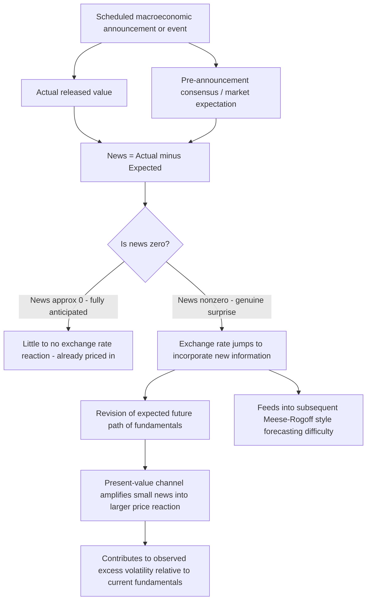

## News, Surprises, and Exchange Rate Volatility

### Conceptual Foundation

The "news model" of exchange rate determination formalizes a direct implication of combining rational expectations with efficient, forward-looking asset markets: since the current exchange rate already reflects all information available at time $t$, subsequent exchange rate *changes* can only be driven by genuinely **new** information — unanticipated deviations between what actually occurs and what was already expected by market participants. This framework, developed prominently by Richard Meese, Kenneth Rogoff, Jeff Frankel, and others building on the asset-pricing efficient-markets tradition, reframes exchange rate volatility not as a puzzle to be explained by fundamentals moving a great deal, but as a natural consequence of continuous, unpredictable information arrival being priced instantly into a forward-looking asset price.

### Formal Structure of the News Model

Starting from the monetary approach's asset-pricing representation of the exchange rate (as derived from combining money market equilibrium, PPP, and UIP), the current exchange rate can be expressed as the expected present discounted value of current and future fundamentals:

$$s_t = f_t + \gamma E_t\left[\sum_{j=0}^{\infty} \left(\frac{\gamma}{1+\gamma}\right)^{j+1} \Delta f_{t+1+j}\right]$$

Where $f_t$ represents current observable fundamentals (relative money supplies, income levels) and the summation captures the *expected future path* of those fundamentals, discounted by a factor related to $\gamma = \lambda$ (the interest semi-elasticity of money demand). This forward-looking, present-value structure is the key theoretical insight: **the exchange rate today depends not just on current fundamentals but on the entire expected future trajectory of fundamentals**, exactly analogous to how a stock price depends on the discounted present value of expected future dividends, not merely current earnings.

**The change in the exchange rate** between periods can then be decomposed as:

$$\Delta s_t = s_t - s_{t-1} = (E_t - E_{t-1})\left[\text{PDV of current and future fundamentals}\right]$$

This is precisely the definition of "news": the revision in expectations about the discounted present value of fundamentals caused by the arrival of new information between $t-1$ and $t$. If no new information arrives, $\Delta s_t = 0$ in expectation; the exchange rate only moves in response to the surprise component of incoming data.

### Distinguishing Anticipated from Unanticipated Components

For any macroeconomic announcement or event, the news model implies a sharp distinction:

$$\text{Announced value} = \text{Anticipated (expected) component} + \text{Surprise (news) component}$$

$$\text{news}_t = \text{Actual}_t - E_{t-1}[\text{Actual}_t]$$

**Key testable prediction**: only the surprise component should generate an exchange rate reaction; the anticipated component, having already been priced in prior to the announcement, should produce no additional movement.

$$\Delta s_t = \beta \cdot \text{news}_t + \varepsilon_t$$

This motivates a large **event-study literature** examining exchange rate reactions to scheduled announcements (central bank interest rate decisions, employment reports, GDP releases, inflation data), typically using survey-based consensus forecasts (e.g., from Bloomberg or Reuters economist polls) as the proxy for the market's prior expectation, with the "surprise" defined as the deviation of the actual released figure from that consensus.

### Empirical Evidence on News and Exchange Rate Reactions

[Unverified] A substantial body of high-frequency event-study research (examining exchange rate movements in narrow windows, often minutes, around scheduled announcements) has generally found results broadly consistent with the news model's core prediction: exchange rates react significantly and quickly to the **surprise** component of macroeconomic announcements relative to consensus forecasts, while the anticipated component of the same announcement produces comparatively little independent reaction, since it was already reflected in pre-announcement prices. [Inference] This finding is widely regarded as one of the more robust pieces of evidence supporting market efficiency and rational, forward-looking pricing in FX markets, even in an environment (as discussed regarding UIP and the forward premium puzzle) where other joint tests of rationality and no-arbitrage conditions have been more decisively rejected — the news-reaction literature and the UIP-forecasting literature test somewhat different, complementary implications of the broader efficient-markets/rational-expectations framework.

### Types of News Relevant to Exchange Rates

- **Monetary policy news**: Central bank interest rate decisions, forward guidance language changes, and unscheduled policy statements — often among the most impactful category, given the direct UIP linkage between interest rates and expected exchange rate paths
- **Macroeconomic data surprises**: Inflation (CPI), employment/labor market reports, GDP growth, trade balance figures — relevant insofar as they update expectations about future monetary policy or relative economic fundamentals
- **Fiscal policy news**: Budget announcements, changes in government spending or taxation plans, especially where they affect expected future money supply growth, debt sustainability, or growth trajectories
- **Political and geopolitical news**: Election outcomes, referenda, trade policy announcements (tariffs, sanctions), geopolitical conflict — often generate large, discrete exchange rate jumps precisely because they are difficult to forecast in advance and can significantly shift expectations about future economic policy or stability
- **Financial market and risk sentiment news**: Shifts in global risk appetite (e.g., reflected in equity market volatility indices), banking sector stress, or sovereign credit events, which can affect currency risk premia independent of pure macroeconomic fundamentals

### Why News Generates "Excess" Volatility Relative to Fundamentals

A central puzzle the news model helps address (though does not fully resolve) is why exchange rates appear far more volatile day-to-day than the *observed* fundamentals (money supply growth, relative output, current levels of inflation) would seem to justify under a simple contemporaneous relationship. The forward-looking, present-value structure of the news model offers a partial resolution: because the exchange rate depends on the *entire expected future path* of fundamentals, even a small piece of news that causes agents to revise their expectations about fundamentals far into the future can generate a disproportionately large *immediate* jump in the current exchange rate, since that revision is capitalized across the entire discounted future stream. [Inference] This "long-horizon expectations revision" channel is one reason why exchange rates can react sharply to individual announcements or events whose direct, near-term fundamental impact seems modest — the market may be pricing in an inferred *change in trend* or *policy regime* rather than reacting only to the single data point itself.

### Relation to the Meese-Rogoff Puzzle

[Unverified] The news model's insight — that exchange rate changes are driven by the *unpredictable* component of expectations revisions — is directly connected to the well-known Meese and Rogoff (1983) finding that standard structural exchange rate models (including monetary approach models) fail to outperform a naive random walk in out-of-sample forecasting, even when using actual realized future values of fundamentals. This is consistent with, and arguably a natural implication of, the news model: since exchange rate changes are driven by information that was unavailable at the time the forecast was made (essentially by definition, since it is *news*), no model using only information available at time $t$ should be expected to forecast changes in $s_t$ well, regardless of how correctly the underlying structural model is specified. The news framework thus reframes the Meese-Rogoff puzzle less as evidence that monetary models are "wrong" and more as an expected consequence of rational, efficient pricing in a market where the primary driver of price changes is, by construction, unforecastable news.

### Volatility Clustering and GARCH-Type Behavior

[Unverified] Separately from the pure news-content question, a well-documented empirical regularity in high-frequency exchange rate data is **volatility clustering**: periods of large exchange rate movements tend to be followed by further periods of large movements (of either sign), and calm periods tend to be followed by continued calm — a pattern commonly modeled using ARCH/GARCH-family econometric models. [Inference] This is often linked, at least partially, to clustering in the *arrival* of significant news and macroeconomic/policy uncertainty (e.g., periods surrounding major central bank meetings, elections, or financial crises tend to generate bunched news flow and elevated uncertainty), though volatility clustering is also observed even controlling for scheduled news arrival, suggesting that market microstructure factors (order flow, liquidity conditions, position unwinding) also contribute independently to volatility dynamics beyond pure fundamental news content.

### Interaction with the Dornbusch Overshooting Framework

News and overshooting are closely connected concepts: in the Dornbusch model, the large initial exchange rate jump following an unanticipated permanent money supply increase is itself best understood as the market's *immediate reaction to news* — the surprise monetary policy shock. The overshooting result specifically depends on the shock being **unanticipated**; had the money supply increase been fully anticipated in advance (already "priced in" as expected future news), the exchange rate would have already adjusted gradually beforehand, and no discrete jump would occur precisely at the moment of the actual announcement. This illustrates how the "news" framework and the sticky-price overshooting framework are two complementary lenses on the same underlying rational-expectations, forward-looking asset-pricing logic.

### Diagram — News Decomposition and Exchange Rate Reaction

### Diagram — Exchange Rate Reaction Window Around a News Event (svg_diagram)

<svg xmlns="http://www.w3.org/2000/svg" viewBox="0 0 700 340">
<text x="350" y="28" text-anchor="middle" font-size="16" font-weight="bold" fill="#1a1a1a">Exchange Rate Reaction to a News Surprise (svg_diagram)</text>

<line x1="70" y1="280" x2="650" y2="280" stroke="#333" stroke-width="1.5" />
<line x1="70" y1="60" x2="70" y2="280" stroke="#333" stroke-width="1.5" />
<text x="650" y="300" text-anchor="middle" font-size="11" fill="#333">Time (around announcement)</text>
<text x="35" y="55" text-anchor="middle" font-size="11" fill="#333">s</text>

<line x1="70" y1="180" x2="340" y2="178" stroke="#4285f4" stroke-width="2.5" />

<line x1="340" y1="178" x2="340" y2="100" stroke="#ea4335" stroke-width="2.5" stroke-dasharray="3,2" />

<line x1="340" y1="100" x2="650" y2="102" stroke="#4285f4" stroke-width="2.5" />
<line x1="340" y1="280" x2="340" y2="285" stroke="#333" stroke-width="1.5" />
<text x="340" y="298" text-anchor="middle" font-size="10" fill="#333">Announcement (t=0)</text>

<text x="200" y="160" text-anchor="middle" font-size="11" fill="`#1a1a1a`">Pre-announcement level</text>

<text x="500" y="85" text-anchor="middle" font-size="11" fill="`#1a1a1a`">New level (post-surprise)</text>

<text x="360" y="140" font-size="11" fill="`#ea4335`" font-weight="bold">Jump = news reaction</text>

<text x="350" y="325" text-anchor="middle" font-size="11" fill="`#1a1a1a`">Anticipated component priced in beforehand; only the surprise moves S at t=0</text>

</svg>

### Common Pitfalls and Misconceptions

- **Assuming any large exchange rate move must reflect a large fundamental shift**: Under the news model, even a modest piece of new information can generate a large exchange rate reaction if it substantially revises expectations about the *entire future path* of fundamentals via the present-value discounting channel — the size of the reaction is not directly proportional to the "size" of the news event in isolation.
- **Confusing the announced figure with the relevant "news"**: A strong economic data release that was *already fully expected* by the market (e.g., matching consensus forecasts exactly) should generate little to no reaction, even if the figure itself represents strong or weak economic performance in absolute terms — what matters is the deviation from prior expectations, not the announced level itself.
- **Treating the news model as fully resolving the excess volatility puzzle**: [Inference] While the present-value/expectations-revision channel provides a coherent theoretical mechanism for amplified reactions to news, it does not by itself fully quantitatively account for all observed exchange rate volatility, and volatility clustering evident even absent identifiable scheduled news suggests other factors (market microstructure, liquidity, order flow) also play an independent role.
- **Assuming all types of news have symmetric or uniform effects**: Different categories of news (monetary policy vs. political vs. data surprises) can have different transmission mechanisms and magnitudes of effect, and the relevant channel (e.g., direct UIP-type interest rate linkage vs. broader risk-sentiment shifts) should be considered specific to the type of news rather than assumed uniform.
- **Interpreting the Meese-Rogoff result as showing fundamentals are irrelevant**: The news framework suggests fundamentals *do* matter for exchange rate determination — but because exchange rates are forward-looking asset prices, only the *unpredictable revisions* to expected future fundamentals move the rate, which is a fundamentally different (and much harder to forecast) object than the *level* of currently observed fundamentals that standard forecasting models typically use as regressors.

**Related Topics**

- Rational expectations in the foreign exchange market
- The Meese-Rogoff exchange rate forecasting puzzle
- The Dornbusch overshooting model and unanticipated shocks
- The monetary approach to exchange rate determination (present-value asset-pricing formulation)
- Volatility clustering and GARCH models in financial time series
- Central bank forward guidance and monetary policy communication
- Event-study methodology in empirical finance
- Uncovered Interest Parity and the forward premium puzzle