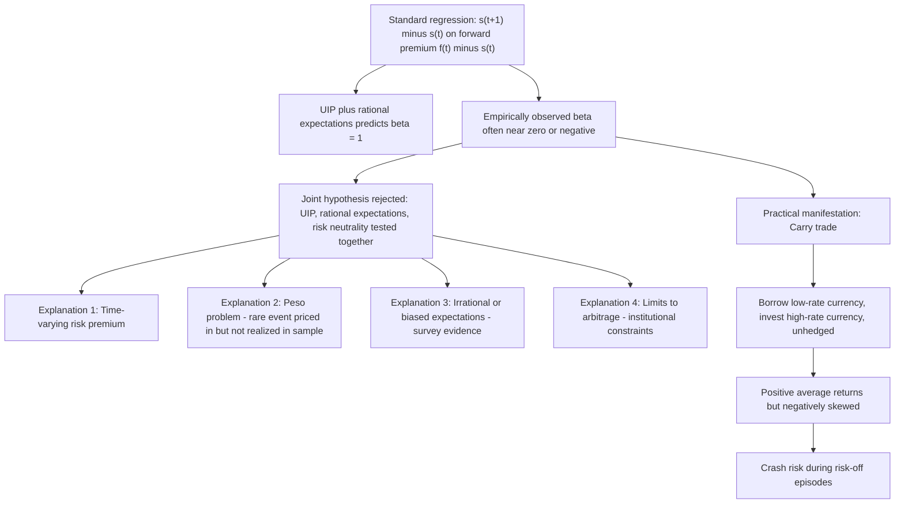

## The Forward Premium Puzzle

### Conceptual Foundation

The forward premium puzzle — also known as the Fama puzzle, after Eugene Fama's seminal 1984 paper "Forward and Spot Exchange Rates" — is one of the most robust and extensively documented anomalies in international finance. It refers to the persistent empirical finding that regressing realized exchange rate changes on the forward premium (equivalently, the interest rate differential) produces coefficient estimates that are not just different from the value predicted by Uncovered Interest Parity (UIP) combined with rational expectations, but frequently of the **wrong sign** — implying that currencies with higher interest rates tend to **appreciate**, on average, rather than depreciate as UIP-based theory predicts. This directly contradicts the textbook intuition that arbitrage should equalize expected returns across currencies via offsetting exchange rate movements.

### The Standard Test Equation

Combining Covered Interest Parity (which pins down the forward rate mechanically from interest rates) with the joint hypothesis of Uncovered Interest Parity and rational expectations yields the **forward rate unbiasedness hypothesis**: $F_t = E_t[S_{t+1}]$. This motivates the canonical regression specification:

$$s_{t+1} - s_t = \alpha + \beta(f_t - s_t) + \varepsilon_{t+1}$$

Where:

- $s_{t+1} - s_t$ = the realized (log) change in the spot exchange rate
- $f_t - s_t$ = the forward premium (or discount), which by Covered Interest Parity equals approximately $i - i^*$, the interest rate differential
- $\alpha$ = intercept (predicted to be zero under the null)
- $\beta$ = slope coefficient (predicted to equal exactly 1 under the null)

**The joint null hypothesis**: $\alpha = 0, \beta = 1$. Under this null, the forward premium is an unbiased, efficient predictor of the subsequent exchange rate change, consistent with UIP holding under rational expectations and risk neutrality.

### The Empirical Anomaly

[Unverified] An extensive body of empirical work spanning decades, multiple currency pairs, sample periods, and estimation techniques has consistently found estimates of $\beta$ that deviate sharply from the predicted value of 1. Commonly cited stylized findings from this literature include:

- $\hat{\beta}$ estimates frequently **close to zero**, implying the forward premium has essentially **no predictive power** for subsequent exchange rate changes in the direction UIP would suggest
- In many studies, particularly using major developed-market currency pairs over floating-rate periods, $\hat{\beta}$ estimates are **negative**, often in the range of roughly **-1 to -3** depending on the specific sample and currency pair
- A negative $\beta$ implies the **opposite** of the UIP prediction: currencies with a positive interest rate differential (higher $i$ relative to $i^*$) tend to subsequently **appreciate** rather than depreciate — meaning that, contrary to naive economic intuition, high-interest-rate currencies have historically tended to deliver *both* a higher interest yield *and*, on average, capital gains from appreciation, rather than the depreciation that would offset the yield advantage

This combination — positive average excess returns to holding high-interest-rate currencies unhedged — is the direct empirical foundation of the **carry trade** as a historically profitable (though risky) trading strategy.

### Why This Matters: Decomposing the Rejection

The joint test of $\alpha=0, \beta=1$ actually tests **three separate underlying assumptions simultaneously**:

1. **Uncovered Interest Parity holds** (equalization of expected returns via exchange rate expectations)
2. **Rational expectations** (market forecasts are, on average, correct given available information)
3. **Risk neutrality** (no compensation required for bearing uncovered currency risk — investors care only about expected returns, not risk)

A rejection of $\beta=1$ does not, by itself, indicate *which* of these three assumptions is failing — this ambiguity has been a central organizing theme of subsequent research, generating multiple, partially competing explanations.

### Explanation 1 — Time-Varying Risk Premium

[Inference] The most widely cited explanation within mainstream (rational-expectations-consistent) finance theory holds that UIP fails to hold in its simple form because of a **time-varying risk premium** compensating investors for bearing uncovered currency risk:

$$E_t[\Delta s_{t+1}] = (i - i^*) + \rho_t$$

If $\rho_t$ is correlated with the interest rate differential itself (e.g., if high-interest-rate currencies are also perceived as riskier during certain periods, requiring a *negative* risk premium adjustment relative to the naive UIP prediction, or conversely if funding-currency risk dynamics dominate), this correlation can generate exactly the kind of negative $\beta$ bias observed in the data, entirely consistent with fully rational agents who correctly price risk. Consumption-based asset pricing models (relating currency risk premia to state-dependent marginal utility, business cycle risk, or "bad times" consumption risk) have been developed specifically to try to generate quantitatively realistic time-varying risk premia matching the observed puzzle, [Unverified] though matching the puzzle's full magnitude with plausible, economically-grounded risk aversion parameters has proven a persistent challenge across much of this literature (an issue conceptually related to the broader equity premium puzzle in asset pricing).

### Explanation 2 — The Peso Problem

A **peso problem** arises when market participants rationally assign a small but non-negligible probability to a large, discrete future event (historically named after expectations of a Mexican peso devaluation that market participants priced in for years before it eventually occurred in 1976 and again in 1994) that does not materialize within the sample period used for empirical testing. [Inference] If agents are rationally pricing in some probability of, for example, a currency crisis or large devaluation that ultimately does not occur in-sample, standard regression-based tests can produce coefficient estimates that appear to reject rational expectations/UIP, purely as a **small-sample statistical artifact**, even though expectations were fully rational at the time they were formed. This explanation has been particularly influential in interpreting anomalies observed in emerging-market or historically pegged-currency contexts, though its applicability to persistent anomalies across long samples of major floating developed-market currencies is more debated.

### Explanation 3 — Irrational Expectations / Expectational Errors

Using survey-based measures of market participants' actual exchange rate expectations (rather than relying on the forward rate as an implicit rational-expectations-consistent proxy), a separate strand of research has found evidence that **survey expectations themselves deviate systematically from what full rational expectations would predict** — for example, exhibiting patterns consistent with excessive extrapolation of recent trends, or predictable forecast errors correlated with past exchange rate movements or interest differentials in ways that should not occur under strict rationality. [Unverified] This body of work (associated with researchers such as Jeffrey Frankel and Kenneth Froot in earlier contributions, and extended by subsequent survey-based studies) suggests that at least part of the forward premium puzzle may reflect genuine expectational biases among market participants, rather than being fully explained by rationally-priced risk premia.

### Explanation 4 — Limits to Arbitrage

[Inference] Even if "true" (risk-adjusted) expected excess returns implied a profitable arbitrage opportunity, financial institutions may face constraints — funding costs, capital requirements, risk management limits, value-at-risk constraints — that prevent sufficient arbitrage capital from flowing in to fully eliminate the anomaly. This connects the forward premium puzzle to the broader "limits to arbitrage" literature in financial economics, which studies how institutional and financing frictions can allow persistent pricing anomalies to survive despite the theoretical existence of an exploitable strategy.

### The Carry Trade as the Practical Manifestation

The forward premium puzzle's most direct real-world manifestation is the **currency carry trade**:

1. Borrow (go short) in a low-interest-rate **funding currency** (historically, currencies such as the Japanese yen and Swiss franc have frequently served this role)
2. Convert and invest (go long) in a high-interest-rate **target currency**
3. Leave the position **unhedged** (uncovered), collecting the interest rate differential as carry income
4. Profit accrues whenever the target currency does not depreciate by the amount the (violated) UIP condition would predict

**Documented properties of carry trade returns:**

- [Unverified] Historically, diversified carry trade strategies (going long a basket of high-interest currencies, short a basket of low-interest currencies) have generated positive average excess returns over extended sample periods in much of the empirical literature examining this strategy
- Returns exhibit pronounced **negative skewness**: the strategy tends to earn small, steady gains over most periods but is subject to occasional sharp, severe losses, particularly during periods of financial market stress or "risk-off" episodes — commonly summarized by the market aphorism that carry trades "go up by the stairs and come down by the elevator"
- This return pattern is consistent with carry trade profits representing, at least in part, **compensation for crash risk** — a rationally-priced premium for bearing the risk of rare, large adverse currency movements — rather than a pure, costless market inefficiency

### Interpreting $\beta$ Geometrically

The regression coefficient $\beta$ can be understood by comparing the predicted UIP relationship to the empirically estimated one:

| Value of $\beta$ | Interpretation |
| --- | --- |
| $\beta = 1$ | UIP holds exactly; forward premium is an unbiased, one-for-one predictor of depreciation |
| $0 < \beta < 1$ | Partial predictive relationship in the correct direction, but attenuated (consistent with a risk premium correlated with, but not perfectly offsetting, the interest differential) |
| $\beta = 0$ | Forward premium has no predictive power for subsequent exchange rate changes |
| $\beta < 0$ | Forward premium predicts movement in the **opposite** direction from UIP — high-interest currencies tend to appreciate, generating profitable (though risky) carry trade opportunities |

### Time-Variation and Regime-Dependence

[Inference] More recent research has explored whether the magnitude (and even sign) of $\beta$ varies systematically across different market regimes — for instance, distinguishing "risk-on" periods (when carry trades tend to perform well and negative $\beta$ estimates are more pronounced) from "risk-off" or crisis periods (when carry trade unwinds can generate sharp reversals, potentially producing $\beta$ estimates closer to, or even exceeding, the UIP-predicted value of 1 during the unwind episodes themselves). This regime-dependence is consistent with the risk-premium-based explanation, since risk premia plausibly vary substantially with global risk sentiment and financial conditions rather than remaining constant over time — motivating extensions of the standard, constant-coefficient regression to time-varying-parameter or regime-switching econometric specifications.

### Diagram — Sources of the Forward Premium Puzzle

### Diagram — Carry Trade Return Profile: Positive Skew of Losses (svg_diagram)

<svg xmlns="http://www.w3.org/2000/svg" viewBox="0 0 700 360">
<text x="350" y="28" text-anchor="middle" font-size="16" font-weight="bold" fill="#1a1a1a">Carry Trade Cumulative Return Pattern (svg_diagram)</text>
<line x1="70" y1="300" x2="650" y2="300" stroke="#333" stroke-width="1.5" />
<line x1="70" y1="60" x2="70" y2="300" stroke="#333" stroke-width="1.5" />
<text x="650" y="320" text-anchor="middle" font-size="11" fill="#333">Time</text>
<text x="35" y="55" text-anchor="middle" font-size="11" fill="#333">Cumulative return</text>

<polyline points="70,260 130,255 130,245 190,240 190,230 250,225 250,215 310,210 310,200 370,195 370,185 430,180" fill="none" stroke="#34a853" stroke-width="2.5" />
<text x="220" y="200" font-size="11" fill="#34a853" font-weight="bold">"up the stairs" — steady carry income</text>

<line x1="430" y1="180" x2="480" y2="290" stroke="#ea4335" stroke-width="3" />
<text x="500" y="250" font-size="11" fill="#ea4335" font-weight="bold">"down the elevator"</text>
<text x="500" y="265" font-size="10" fill="#ea4335">— crash / risk-off unwind</text>

<polyline points="480,290 540,275 600,255 650,240" fill="none" stroke="#4285f4" stroke-width="2" stroke-dasharray="4,3" />

<text x="350" y="345" text-anchor="middle" font-size="11" fill="`#1a1a1a`">Negative skewness: small frequent gains, rare severe losses — consistent with a rationally-priced crash-risk premium</text>

</svg>

### Common Pitfalls and Misconceptions

- **Interpreting the puzzle as proof that arbitrage never works in FX markets**: The forward premium puzzle concerns *uncovered* positions specifically; Covered Interest Parity (which uses an actual forward hedge) has historically held far more robustly (with post-2008 basis deviations being a distinct phenomenon), so the puzzle should not be conflated with a general failure of arbitrage in currency markets.
- **Assuming a single explanation fully accounts for the puzzle**: [Inference] The academic literature has not converged on one dominant explanation; risk premia, peso problems, expectational biases, and limits to arbitrage are generally regarded as complementary, partially overlapping explanations rather than mutually exclusive competing theories, and the relative importance of each likely varies by currency pair, time period, and market regime.
- **Treating carry trade profits as a riskless "free lunch"**: The pronounced negative skewness and crash risk documented in carry trade returns indicate the strategy carries genuine downside risk, consistent with the profits representing compensation for bearing that risk rather than pure inefficiency-driven arbitrage profit.
- **Misinterpreting a negative $\beta$ as meaning "interest rates don't matter" for exchange rates**: A negative $\beta$ specifically means the interest differential predicts the *opposite* direction of movement from naive UIP — interest rates still matter for exchange rate expectations, just not in the simple, textbook direction, and the relationship itself may be regime-dependent rather than a fixed, universal negative relationship.
- **Applying the puzzle's findings uniformly across all currency pairs and eras**: [Unverified] The magnitude and even sign of estimated $\beta$ coefficients have been found to vary meaningfully across different currency pairs, sample periods, and monetary policy regimes in the literature, so citing a single representative $\beta$ estimate should be understood as illustrative of a broad pattern rather than a precise universal constant.

**Related Topics**

- Uncovered Interest Parity and Covered Interest Parity
- The carry trade and currency risk premia
- Rational expectations in the foreign exchange market
- The peso problem in exchange rate expectations
- Survey-based measures of exchange rate expectations
- Limits to arbitrage in financial markets
- Consumption-based asset pricing and the equity premium puzzle
- The Dornbusch overshooting model and UIP-driven dynamics