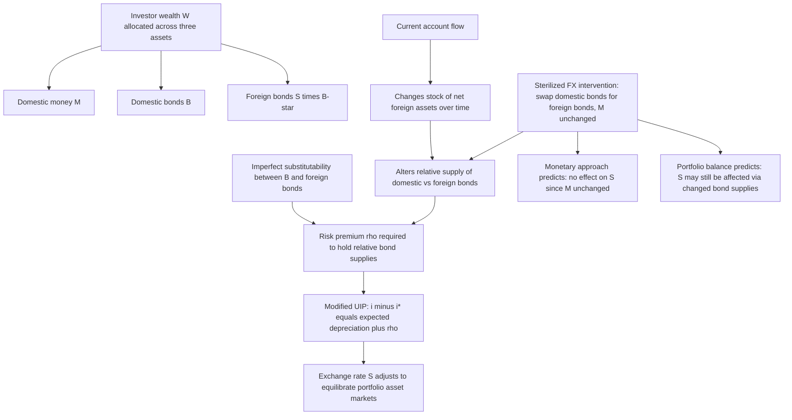

## The Portfolio Balance Approach to Exchange Rates

### Conceptual Foundation

The portfolio balance approach to exchange rate determination relaxes one of the central, restrictive assumptions of the monetary approach models (both the flexible-price Frenkel-Bilson model and the sticky-price Dornbusch model): that domestic and foreign bonds are **perfect substitutes** in investors' portfolios. Under perfect substitutability, Uncovered Interest Parity holds exactly, and investors are indifferent between holding any mix of domestic and foreign bonds so long as expected returns are equalized — meaning bond *supply* (and thus the current account and net foreign asset position) plays no independent role in exchange rate determination, since investors will hold whatever quantity of each bond is outstanding without requiring any change in relative expected returns.

The portfolio balance approach, developed prominently through the work of William Branson, Pentti Kouri, and others in the 1970s and 1980s, instead assumes domestic and foreign bonds are **imperfect substitutes** — investors have well-defined portfolio preferences over the *composition* of their wealth across domestic money, domestic bonds, and foreign bonds, and require compensation (a risk premium) to hold a larger share of their portfolio in any particular asset. This single change has significant implications: bond supplies, wealth levels, and current account dynamics become independent determinants of the exchange rate, distinct from and in addition to the money-market and interest-parity channels emphasized in monetary approach models.

### Why Imperfect Substitutability Matters

If domestic and foreign bonds are imperfect substitutes, investors demand a **risk premium** to hold relatively more of one asset over another, since the two assets are not viewed as interchangeable in a mean-variance portfolio optimization sense (they may differ in currency-of-denomination risk, default risk, liquidity, or other characteristics not fully captured by the interest rate alone). The UIP condition is modified to include this risk premium:

$$i - i^* = E[\Delta s] + \rho$$

Where $\rho$ is the portfolio-balance-determined risk premium, which depends on the **relative supplies** of domestic and foreign bonds held by investors (relative to domestic money and total wealth), rather than being a constant or purely exogenous term. This is the crucial departure from the perfect-substitutability assumption underlying standard UIP in the monetary approach.

### Portfolio Allocation Framework

The representative domestic investor's wealth $W$ is allocated across three asset classes:

$$W = M + B + S \cdot B^*$$

Where:

- $M$ = domestic money holdings
- $B$ = domestic bonds held
- $S \cdot B^*$ = domestic-currency value of foreign bonds held ($B^*$ denominated in foreign currency, converted at the exchange rate $S$)

Asset demand functions are typically specified as depending on relative expected returns and total wealth:

$$M = M(i, i^* + E[\Delta s], W), \quad M_i < 0$$

$$B = B(i, i^* + E[\Delta s], W), \quad B_i > 0$$

$$S B^* = SB^*(i, i^* + E[\Delta s], W), \quad SB^*_{i^*+E[\Delta s]} > 0$$

An increase in the domestic interest rate $i$ (relative to the foreign expected return) shifts portfolio demand toward domestic bonds and away from both money and foreign bonds, with these substitution effects governing the model's comparative statics.

### Equilibrium and the Role of the Exchange Rate

For any given stock of domestic money $M$, domestic bonds $B$, and foreign bonds $B^*$ (all predetermined at a point in time, since bond and money stocks are **slow-moving state variables** determined by past monetary and fiscal policy and by cumulative current account imbalances), the **exchange rate $S$ adjusts to equilibrate the portfolio-balance asset markets** — specifically, to make investors willing to hold the existing, given stocks of domestic and foreign bonds given prevailing interest rates and expectations.

**Key mechanism**: since $S$ enters the wealth constraint and the relative-return calculation, a change in $S$ directly affects the domestic-currency value of foreign bond holdings, and thus the composition of investor wealth — this gives the exchange rate an independent asset-market equilibrating role distinct from its function in UIP-only monetary models.

### Comparative Statics: Key Departures from the Monetary Approach

**1. Current Account and Net Foreign Assets Matter**

Because bonds are imperfect substitutes, the **stock of net foreign assets** (accumulated via historical current account surpluses or deficits) directly affects the equilibrium exchange rate and risk premium — a channel entirely absent from standard monetary approach models, where only relative money supplies (and PPP/UIP-consistent flow relationships) determine $S$.

- A country running a persistent **current account deficit** accumulates foreign liabilities (equivalently, foreigners accumulate domestic bonds), increasing the relative supply of domestic-currency assets in global portfolios; to induce investors to hold this larger stock, either $i$ must rise or the currency's risk premium must adjust, [Inference] often generating a tendency toward currency depreciation over time to induce sufficient foreign holding of the growing domestic bond stock, all else equal
- Conversely, sustained **current account surpluses** (net foreign asset accumulation) can, through this channel, be associated with different equilibrium exchange rate dynamics than a pure money-market/UIP framework would predict

**2. Open Market Operations Have Distinct Effects Depending on Composition**

A crucial portfolio-balance insight is that **not all monetary policy actions are equivalent**, even if they have identical effects on the money supply, because the *composition* of the change matters:

- **Open market purchase of domestic bonds** (central bank buys domestic bonds with newly created money): increases $M$, decreases $B$ held by the public — a pure monetary expansion with money-for-bonds swap, broadly similar to standard monetary approach predictions
- **Sterilized foreign exchange intervention** (central bank buys/sells foreign bonds while offsetting the domestic money supply effect via an equal and opposite domestic bond operation, leaving $M$ unchanged): under the *monetary approach*, sterilized intervention should have **no effect** on the exchange rate, since the money supply — the sole determinant of $S$ in that framework — is unchanged. Under the **portfolio balance approach**, sterilized intervention *can* affect the exchange rate, because it changes the relative *supplies* of domestic versus foreign bonds held by the public, altering the risk premium $\rho$ required to induce investors to hold the new portfolio composition, even with $M$ held constant

This distinction — that sterilized intervention can be effective under portfolio balance but ineffective under the pure monetary approach — is one of the model's most cited practical/policy implications, since it provides a theoretical channel through which central banks might influence exchange rates via foreign exchange intervention *without* altering domestic monetary conditions (interest rates, money supply), which is precisely what sterilized intervention is designed to achieve in practice.

### Stock-Flow Dynamics and the Current Account Feedback Loop

The portfolio balance model is fundamentally a **stock-flow model**: the current account (a flow) determines the *change* in the stock of net foreign assets over time, and this evolving stock feeds back into the determination of the exchange rate in subsequent periods.

$$\dot{B}^* = \text{Current Account}_t$$

This generates richer, more gradual dynamic adjustment paths than typical monetary approach models, since the exchange rate's equilibrium level in any period depends on the entire history of accumulated current account imbalances, not merely on current money supplies and income levels. [Inference] This stock-flow structure implies that portfolio balance models can, in principle, generate persistent trends or gradual, multi-period exchange rate adjustment dynamics driven by ongoing current account imbalances, in a way that pure monetary models (which typically feature the exchange rate jumping immediately to a level consistent with current and expected future money supplies) do not naturally capture.

### Portfolio Balance vs. Monetary Approach — Summary Comparison

| Feature | Monetary Approach (Flexible/Sticky-Price) | Portfolio Balance Approach |
| --- | --- | --- |
| Bond substitutability | Perfect substitutes (UIP holds exactly) | Imperfect substitutes (risk premium exists) |
| Role of current account / net foreign assets | None (flow variables irrelevant to $S$ once monetary variables are known) | Central — stock of net foreign assets directly affects $S$ |
| Effect of sterilized FX intervention | Ineffective (money supply unchanged, so $S$ unaffected) | Potentially effective (changes relative bond supplies, affecting risk premium) |
| Primary state variables | Money supplies, income, expected inflation | Money, domestic bonds, foreign bonds (wealth composition) |
| Adjustment dynamics | Often features discrete jumps (e.g., overshooting) to new equilibrium given current/expected fundamentals | Gradual, path-dependent stock-flow adjustment tied to cumulative current account history |

### Empirical Evidence and Limitations

[Unverified] Empirical testing of the portfolio balance model has historically faced significant challenges, in large part because reliable, high-frequency data on the currency composition of national and international bond portfolios (necessary to construct the relevant relative-supply variables) has been difficult to obtain, particularly for earlier sample periods. [Inference] Studies examining whether sterilized intervention has statistically detectable effects on exchange rates consistent with the portfolio balance channel have generally found, at best, modest and often short-lived effects — a body of evidence frequently summarized as suggesting sterilized intervention alone has limited power to durably move exchange rates, though it may still play a signaling role (conveying information about future, potentially unsterilized, policy intentions) that produces effects operating through a channel closer to the "news"/expectations framework rather than through the pure portfolio-rebalancing mechanism the model formally emphasizes. This has led much of the subsequent literature and central bank practice to treat the **signaling channel** of intervention as at least as important as, if not more important than, the pure portfolio-balance channel in explaining observed intervention effects.

### Relationship to Other Exchange Rate Frameworks

The portfolio balance approach can be viewed as complementary to, rather than a wholesale replacement for, monetary approach models: it relaxes the perfect-substitutability assumption to introduce a role for asset supplies and wealth effects, while still generally incorporating money demand and (modified) interest parity relationships as core building blocks. [Inference] In practice, many modern open-economy macroeconomic models (including more recent New Open Economy Macroeconomics frameworks) incorporate elements of both traditions — money market equilibrium and nominal rigidities from the monetary/Dornbusch tradition, alongside imperfect asset substitutability and balance-sheet/wealth effects reminiscent of the portfolio balance tradition — reflecting a broader convergence rather than treating the two as strictly competing paradigms.

### Diagram — Portfolio Balance Equilibrium and Channels

### Diagram — Sterilized Intervention: Monetary Approach vs. Portfolio Balance Prediction (svg_diagram)

<svg xmlns="http://www.w3.org/2000/svg" viewBox="0 0 720 360">
<text x="360" y="28" text-anchor="middle" font-size="16" font-weight="bold" fill="#1a1a1a">Sterilized Intervention: Two Competing Predictions (svg_diagram)</text>
<rect x="40" y="60" width="640" height="70" fill="#fef7e0" stroke="#f9ab00" stroke-width="2" rx="6" />
<text x="360" y="85" text-anchor="middle" font-size="12" font-weight="bold" fill="#1a1a1a">Central bank sells domestic bonds, buys foreign bonds</text>
<text x="360" y="105" text-anchor="middle" font-size="11" fill="#555">(offsetting operation keeps domestic money supply M unchanged)</text>
<line x1="280" y1="130" x2="180" y2="180" stroke="#666" stroke-width="1.5" />
<line x1="440" y1="130" x2="540" y2="180" stroke="#666" stroke-width="1.5" />
<rect x="30" y="180" width="300" height="130" fill="#e8f0fe" stroke="#4285f4" stroke-width="2" rx="6" />
<text x="180" y="205" text-anchor="middle" font-size="12" font-weight="bold" fill="#1a1a1a">Monetary Approach</text>
<text x="180" y="230" text-anchor="middle" font-size="10" fill="#333">M unchanged (sterilized)</text>
<text x="180" y="248" text-anchor="middle" font-size="10" fill="#333">Only M determines S</text>
<text x="180" y="270" text-anchor="middle" font-size="11" font-weight="bold" fill="#4285f4">Prediction: No effect on S</text>
<rect x="390" y="180" width="300" height="130" fill="#fce8e6" stroke="#ea4335" stroke-width="2" rx="6" />
<text x="540" y="205" text-anchor="middle" font-size="12" font-weight="bold" fill="#1a1a1a">Portfolio Balance</text>
<text x="540" y="230" text-anchor="middle" font-size="10" fill="#333">Relative bond supplies change</text>
<text x="540" y="248" text-anchor="middle" font-size="10" fill="#333">Risk premium rho adjusts</text>
<text x="540" y="270" text-anchor="middle" font-size="11" font-weight="bold" fill="#ea4335">Prediction: S may move</text>

<text x="360" y="345" text-anchor="middle" font-size="11" fill="`#1a1a1a`">Empirical evidence: modest/short-lived direct portfolio effects; signaling channel often more important</text>

</svg>

### Common Pitfalls and Misconceptions

- **Assuming perfect and imperfect asset substitutability are simply "more" or "less" of the same thing**: The distinction is qualitative, not merely a matter of degree in casual usage — perfect substitutability implies UIP holds *exactly* with no independent role for relative bond supplies, while imperfect substitutability fundamentally changes which variables belong in the exchange rate determination equation (adding stock variables like net foreign assets).
- **Treating sterilized intervention as guaranteed to be effective under portfolio balance theory**: The model predicts sterilized intervention *can* have an effect via the portfolio-rebalancing channel, but [Inference] the empirical literature generally finds this effect to be modest in magnitude and often not statistically robust across studies, distinct from the theoretically possible channel the model identifies — theoretical possibility should not be conflated with a confirmed strong empirical effect.
- **Ignoring the signaling channel as a competing explanation for intervention effects**: Even where sterilized intervention is empirically found to move exchange rates, [Inference] much of the literature attributes this at least partly to the *signaling* function (revealing information about future policy intentions) rather than solely to the pure portfolio-rebalancing mechanism the model formally derives — these are distinct channels that can be difficult to separate empirically.
- **Conflating portfolio balance with the monetary approach**: The two frameworks share some building blocks (money demand, interest-parity-type relationships) but differ fundamentally in whether current account/net foreign asset stocks play an independent causal role in exchange rate determination — a common source of confusion in comparative treatments of these models.
- **Assuming current account deficits mechanically and immediately depreciate the currency**: [Inference] While persistent current account deficits do, in the portfolio balance framework, tend to be associated with pressure toward depreciation to induce continued foreign holding of accumulating domestic liabilities, the actual relationship is mediated by evolving risk premia and investor portfolio preferences, and need not manifest as an immediate or mechanically predictable exchange rate response in any given period.

**Related Topics**

- The monetary approach to exchange rate determination
- Uncovered Interest Parity and risk premia
- The Dornbusch overshooting model
- Current account dynamics and net foreign asset accumulation
- Sterilized versus unsterilized foreign exchange intervention
- The signaling channel of central bank intervention
- New Open Economy Macroeconomics and balance-sheet effects
- Consumption-based asset pricing and time-varying currency risk premia