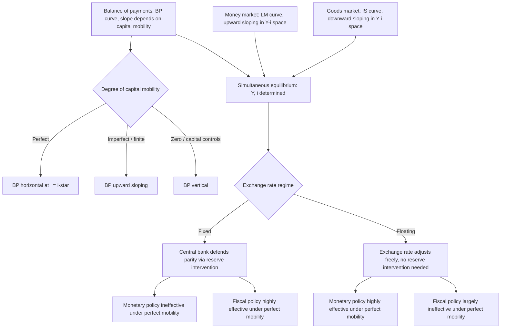

## The IS LM BP Framework in an Open Economy

### Conceptual Foundation

The IS-LM-BP framework — commonly known as the **Mundell-Fleming model**, developed independently by Robert Mundell and Marcus Fleming in the early 1960s — extends the closed-economy IS-LM model of income-expenditure and money-market equilibrium to an open economy by adding a third equilibrium locus: the **BP curve**, representing balance of payments equilibrium. This extension allows the model to jointly determine output, the interest rate, and (depending on the exchange rate regime assumed) either the exchange rate or the level of foreign exchange reserves, while explicitly incorporating international trade and capital flows into short-run macroeconomic analysis. The model remains foundational for analyzing the effectiveness of monetary and fiscal policy under alternative exchange rate regimes (fixed vs. floating) and degrees of capital mobility.

### The Three Curves

**1. The IS Curve (Goods Market Equilibrium)**

$$Y = C(Y-T) + I(i) + G + NX(Y, Y^*, Q)$$

Where:

- $Y$ = domestic output/income
- $C$ = consumption (function of disposable income)
- $I$ = investment (decreasing function of the interest rate $i$)
- $G$ = government spending
- $NX$ = net exports, depending positively on foreign income $Y^*$ and the real exchange rate $Q$ (a real depreciation, i.e., higher $Q$, improves net exports, subject to the Marshall-Lerner condition), and negatively on domestic income $Y$ (higher domestic income raises import demand)

The IS curve slopes **downward** in $(Y, i)$ space: a higher interest rate reduces investment, and (indirectly, through the exchange rate channel under floating rates) can also affect net exports, both working to reduce equilibrium output.

**2. The LM Curve (Money Market Equilibrium)**

$$\frac{M}{P} = L(i, Y)$$

Real money supply equals real money demand, which rises with income (transactions demand) and falls with the interest rate (opportunity cost of holding money). The LM curve slopes **upward** in $(Y, i)$ space: higher income raises money demand, requiring a higher interest rate to maintain money market equilibrium given a fixed real money supply.

**3. The BP Curve (Balance of Payments Equilibrium)**

$$BP: \quad NX(Y, Y^*, Q) + KA(i - i^*) = 0$$

Where $KA$ represents the capital account, typically modeled as an increasing function of the domestic-foreign interest rate differential (higher $i$ relative to $i^*$ attracts capital inflows). The BP curve represents combinations of $Y$ and $i$ consistent with overall balance of payments equilibrium (current account plus capital account summing to zero, with no need for reserve changes under a fixed rate, or with the exchange rate adjusting to clear the market under floating rates).

**Slope of the BP curve** depends critically on the degree of capital mobility:

- **Perfect capital mobility**: The BP curve is **horizontal** at $i = i^*$ — since capital flows are infinitely sensitive to any interest rate differential, even the smallest deviation from $i^*$ triggers unlimited capital flows that instantly restore $i = i^*$
- **Imperfect (finite) capital mobility**: The BP curve is **upward-sloping** — a higher domestic income $Y$ worsens the current account (via higher imports), requiring a higher interest rate $i$ to attract sufficient compensating capital inflows and maintain balance of payments equilibrium
- **Zero capital mobility (capital controls)**: The BP curve is **vertical** — with no capital account response to interest rate differentials, balance of payments equilibrium depends solely on the current account, which is determined by income alone (fixing $Y$ regardless of $i$)

### Equilibrium and the Role of Capital Mobility

The overall equilibrium is the point where all three curves intersect simultaneously. Given the differing slopes possible for the BP curve depending on capital mobility assumptions, and combined with the IS and LM curves, the framework generates a rich set of comparative-statics results that differ sharply depending on (a) the exchange rate regime (fixed or floating) and (b) the degree of capital mobility.

**The relative slope comparison** (BP curve vs. LM curve) is central to Mundell-Fleming's core policy-effectiveness conclusions: whether the BP curve is flatter or steeper than the LM curve fundamentally determines the direction and magnitude of exchange rate and reserve-flow adjustments following fiscal or monetary shocks.

### Fixed Exchange Rate Regime

Under fixed exchange rates, the central bank commits to defending a specific parity, which requires it to buy or sell foreign exchange reserves as needed to accommodate any balance of payments imbalance, and this reserve intervention directly and automatically adjusts the money supply (absent sterilization).

**Monetary Policy under Fixed Rates (Perfect Capital Mobility) — Ineffective**

1. Central bank expands the money supply → LM shifts right → domestic interest rate $i$ falls below $i^*$
2. With perfect capital mobility, the interest rate gap triggers massive capital outflows
3. To defend the fixed exchange rate against the resulting depreciation pressure, the central bank must **sell foreign reserves and buy domestic currency**, which **contracts** the money supply
4. This process continues until the money supply returns to its original level and $i = i^*$ is restored (LM curve shifts back to its original position)
5. **Net effect: monetary policy is completely ineffective** at changing output under fixed exchange rates with perfect capital mobility — the initial monetary expansion is entirely and automatically reversed by the required reserve intervention

**Fiscal Policy under Fixed Rates (Perfect Capital Mobility) — Highly Effective**

1. Government increases spending → IS shifts right → output $Y$ rises, and (at unchanged money supply) the interest rate $i$ tends to rise above $i^*$
2. With perfect capital mobility, this generates massive capital inflows
3. To prevent the resulting appreciation pressure and defend the fixed parity, the central bank must **buy foreign reserves and sell domestic currency**, which **expands** the money supply
4. The LM curve shifts right, further raising output, until $i = i^*$ is restored
5. **Net effect: fiscal policy is highly effective** at raising output under fixed exchange rates with perfect capital mobility, since the required monetary accommodation to defend the fixed rate reinforces rather than crowds out the fiscal expansion

### Floating Exchange Rate Regime

Under floating rates, the exchange rate itself adjusts freely to clear the balance of payments, so there is no need for reserve intervention, and the money supply remains under the central bank's independent control.

**Monetary Policy under Floating Rates (Perfect Capital Mobility) — Highly Effective**

1. Central bank expands the money supply → LM shifts right → $i$ falls below $i^*$
2. With perfect capital mobility, capital outflows occur, putting depreciation pressure on the currency
3. Under floating rates, the currency is allowed to **depreciate** freely
4. Depreciation improves net export competitiveness (subject to Marshall-Lerner), shifting the **IS curve right**
5. **Net effect: monetary policy is highly effective** at raising output under floating exchange rates with perfect capital mobility — the exchange rate depreciation channel reinforces the initial monetary expansion's effect on output, rather than the reserve-driven reversal that occurs under fixed rates

**Fiscal Policy under Floating Rates (Perfect Capital Mobility) — Largely Ineffective**

1. Government increases spending → IS shifts right → $Y$ rises, $i$ tends to rise above $i^*$
2. With perfect capital mobility, capital inflows surge, putting appreciation pressure on the currency
3. Under floating rates, the currency **appreciates**
4. Appreciation worsens net export competitiveness, shifting the **IS curve back left**, offsetting the initial fiscal expansion
5. **Net effect: fiscal policy is largely ineffective** at raising output under floating exchange rates with perfect capital mobility, since exchange rate appreciation crowds out net exports, substantially offsetting the direct fiscal stimulus (in the polar perfect-capital-mobility case, the offset can be complete)

### Summary Table: Policy Effectiveness by Regime and Capital Mobility

| Regime | Monetary Policy | Fiscal Policy |
| --- | --- | --- |
| Fixed exchange rate, perfect capital mobility | **Ineffective** — fully reversed by required reserve intervention | **Highly effective** — reinforced by required monetary accommodation |
| Floating exchange rate, perfect capital mobility | **Highly effective** — reinforced by exchange rate depreciation | **Largely ineffective** — offset by exchange rate appreciation and crowding out of net exports |
| Fixed exchange rate, zero capital mobility | Ineffective (similar logic, driven via current account rather than capital account reserve pressure) | Effective, but with different (typically smaller than perfect-mobility case) reinforcement magnitude |
| Floating exchange rate, zero capital mobility | Effective, primarily through domestic interest rate/investment channel rather than exchange rate channel | Relatively more effective than under perfect mobility, since no appreciation-driven net export offset occurs |

### The BP Curve's Role in Diagnosing Disequilibrium

Away from full equilibrium (where all three curves do not intersect at a single point), the position of the economy relative to the BP curve indicates the direction of pressure on the balance of payments:

- **Above the BP curve** (interest rate higher than required for BP equilibrium at that income level): balance of payments **surplus** — capital/current account inflows exceed outflows, creating appreciation pressure (floating) or reserve accumulation (fixed)
- **Below the BP curve**: balance of payments **deficit** — creating depreciation pressure (floating) or reserve depletion (fixed)

### Limitations and Extensions

[Inference] The Mundell-Fleming framework, while foundational and still widely used pedagogically, has several recognized limitations relative to more modern open-economy macro models: it typically assumes static or naive expectations (unlike the rational-expectations-driven Dornbusch model or news-based asset-pricing frameworks), a fixed price level in the short run (similar in spirit to, though less formally dynamic than, the Dornbusch sticky-price setup), and does not incorporate explicit micro-foundations or intertemporal optimization. It is best understood as a **short-run, comparative-static, IS-LM-style extension** for analyzing policy effectiveness questions, rather than a fully dynamic, forward-looking asset-pricing model of exchange rate determination in the way the monetary approach or Dornbusch overshooting frameworks are. Subsequent New Open Economy Macroeconomics (NOEM) models (e.g., Obstfeld-Rogoff) sought to provide more rigorous micro-founded generalizations while often preserving many of Mundell-Fleming's qualitative policy-effectiveness insights under comparable assumptions about exchange rate regimes and capital mobility.

### The "Impossible Trinity" (Policy Trilemma) Connection

The stark contrast in monetary policy effectiveness across fixed and floating regimes under perfect capital mobility is closely connected to the broader **Mundell-Fleming trilemma** (or "impossible trinity"): a country cannot simultaneously maintain (1) a fixed exchange rate, (2) free capital mobility, and (3) independent monetary policy — it must give up at least one of the three. The Mundell-Fleming model's core comparative-statics results are, in essence, a direct formal illustration of this trilemma: under fixed rates with perfect capital mobility, monetary policy is rendered ineffective (sacrificing monetary independence), precisely because the two other legs of the trilemma (the fixed rate commitment and free capital mobility) are both being maintained.

### Diagram — IS-LM-BP Equilibrium and Curve Slopes

### Diagram — IS-LM-BP Diagram with Perfect Capital Mobility (svg_diagram)

<svg xmlns="http://www.w3.org/2000/svg" viewBox="0 0 700 400">
<text x="350" y="28" text-anchor="middle" font-size="16" font-weight="bold" fill="#1a1a1a">IS-LM-BP with Perfect Capital Mobility (svg_diagram)</text>

<line x1="90" y1="340" x2="620" y2="340" stroke="#333" stroke-width="1.5" />
<line x1="90" y1="60" x2="90" y2="340" stroke="#333" stroke-width="1.5" />
<text x="620" y="360" text-anchor="middle" font-size="12" fill="#333">Y (output)</text>
<text x="55" y="55" text-anchor="middle" font-size="12" fill="#333">i (interest rate)</text>

<line x1="90" y1="200" x2="620" y2="200" stroke="#34a853" stroke-width="2.5" />
<text x="630" y="204" font-size="11" fill="#34a853" font-weight="bold">BP (i = i*)</text>

<line x1="150" y1="90" x2="450" y2="320" stroke="#4285f4" stroke-width="2.5" />
<text x="460" y="325" font-size="11" fill="#4285f4" font-weight="bold">IS</text>

<line x1="200" y1="320" x2="500" y2="90" stroke="#ea4335" stroke-width="2.5" />
<text x="510" y="85" font-size="11" fill="#ea4335" font-weight="bold">LM</text>

<circle cx="340" cy="200" r="5" fill="#1a1a1a" />
<text x="340" y="185" text-anchor="middle" font-size="10" fill="#1a1a1a">Equilibrium</text>
<line x1="340" y1="340" x2="340" y2="200" stroke="#999" stroke-width="1" stroke-dasharray="3,3" />

<text x="350" y="385" text-anchor="middle" font-size="11" fill="`#1a1a1a`">Equilibrium interest rate pinned to i* by horizontal BP curve</text>

</svg>

### Common Pitfalls and Misconceptions

- **Assuming policy effectiveness conclusions apply universally regardless of regime**: The framework's central, and often examined, insight is that the **same** policy (monetary or fiscal) can have starkly different — even opposite — effectiveness depending on whether the exchange rate is fixed or floating; conclusions cannot be stated without specifying the regime.
- **Forgetting the capital mobility assumption drives the BP curve's slope**: Many analytical errors stem from applying perfect-capital-mobility conclusions (horizontal BP) to a scenario that specifies imperfect or zero capital mobility, or vice versa — the relative slope of BP versus LM is essential to signing the comparative statics correctly.
- **Confusing which variable adjusts under each regime**: Under fixed rates, it is **reserves** (and consequently the money supply, absent sterilization) that adjust to maintain balance of payments equilibrium; under floating rates, it is the **exchange rate** itself that adjusts, with reserves and the money supply remaining under independent central bank control.
- **Treating the Mundell-Fleming model as incorporating expectations or dynamic asset-pricing behavior**: Unlike the Dornbusch overshooting model or monetary approach models with rational expectations, the standard Mundell-Fleming IS-LM-BP framework is typically presented as a comparative-static model without explicit forward-looking expectations of future exchange rates — a key limitation relative to more modern frameworks that students should keep in mind when comparing across models in this broader subject area.
- **Overlooking the trilemma connection**: The stark fixed-vs-floating asymmetry in monetary policy effectiveness is not a separate, unrelated result — it is the direct formal manifestation of the impossible trinity, and exam or analytical questions often expect this connection to be made explicit.

**Related Topics**

- The Mundell-Fleming trilemma (impossible trinity)
- Fixed versus floating exchange rate regimes: trade-offs and policy implications
- The Dornbusch overshooting model (comparison of dynamic vs. comparative-static frameworks)
- Sterilized versus unsterilized foreign exchange intervention
- The Marshall-Lerner condition and net export responses to exchange rate changes
- Capital account liberalization and capital mobility measurement
- New Open Economy Macroeconomics and micro-founded open-economy models
- Balance of payments accounting: current account and capital account