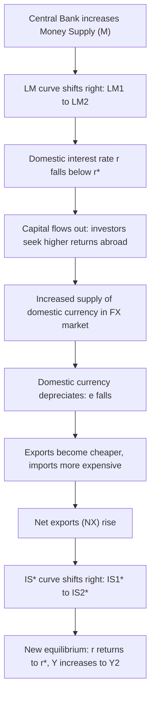
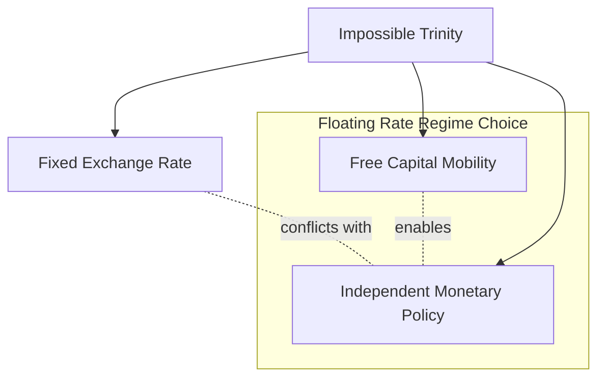

## Monetary Policy Under Floating Exchange Rates

### Overview

The Mundell-Fleming model extends the closed-economy IS-LM framework to an open economy, analyzing how monetary policy operates when the exchange rate is allowed to float (determined by market forces of supply and demand rather than fixed by the central bank). Under floating rates, monetary policy becomes highly effective for influencing output, particularly under conditions of high capital mobility, because exchange rate adjustments reinforce rather than offset the policy's intended effect.

### Core Assumptions of the Model

- **Small open economy**: The country is a price-taker in world capital markets; domestic interest rate changes do not affect the world interest rate $r^*$.
- **Perfect capital mobility**: Capital flows instantly and freely across borders, forcing the domestic interest rate $r$ to equal the world interest rate $r^*$ ($r = r^*$) in equilibrium. [Inference — this is the standard textbook simplification; real-world capital mobility is imperfect and interest parity holds only approximately.]
- **Floating exchange rate**: The nominal exchange rate $e$ adjusts freely to equilibrate the foreign exchange market; the central bank does not intervene.
- **Fixed price level (short run)**: Prices are sticky in the short run, so nominal and real variables move together.
- **Small country assumption**: Domestic output changes do not meaningfully affect world income or world prices.

### The Three-Market Framework

Monetary policy under floating rates operates through interactions among three markets:

**IS* Curve (Goods Market)**

$$Y = C(Y-T) + I(r) + G + NX(e)$$

Output demand depends on consumption, investment (inversely related to $r$), government spending, and net exports (inversely related to the real exchange rate $e$, since a stronger currency makes exports less competitive).

**LM Curve (Money Market)**

$$\frac{M}{P} = L(r, Y)$$

Real money supply must equal real money demand, which depends positively on income $Y$ and negatively on the interest rate $r$.

**Interest Rate Parity Condition**

$$r = r^*$$

Under perfect capital mobility, arbitrage ensures the domestic rate equals the world rate; any deviation triggers capital flows large enough to eliminate the gap instantly.

### Transmission Mechanism: How Expansionary Monetary Policy Works

Consider a central bank increasing the money supply $M$ under a floating exchange rate:

1. **Initial LM shift**: An increase in $M$ shifts the LM curve rightward (LM₁ → LM₂), since more real money balances require either lower $r$ or higher $Y$ to maintain money-market equilibrium.
2. **Downward pressure on domestic interest rate**: At the initial income level, the increased money supply pushes $r$ below $r^*$.
3. **Capital outflow**: Because $r < r^*$, domestic assets become less attractive relative to foreign assets. Investors sell domestic currency to purchase foreign assets, causing capital to flow out.
4. **Currency depreciation**: The sell-off of domestic currency in the foreign exchange market causes $e$ to fall (domestic currency depreciates).
5. **Net export boost**: A weaker currency makes domestic goods cheaper abroad and foreign goods more expensive domestically, increasing net exports $NX$.
6. **IS* shift**: The rise in $NX$ shifts the IS* curve rightward (IS₁* → IS₂*).
7. **New equilibrium**: The economy settles where the new IS* and new LM curves intersect at $r = r^*$, with **higher output** $Y_2 > Y_1$.

This process continues until the interest rate returns to $r^*$, meaning the entire adjustment happens through the exchange rate and net exports rather than through a sustained interest rate change.

### Diagram: IS*-LM* Adjustment to Monetary Expansion (svg_diagram)

<svg xmlns="http://www.w3.org/2000/svg" viewBox="0 0 640 480" font-family="Arial, sans-serif">
<text x="320" y="24" text-anchor="middle" font-size="16" font-weight="bold">Monetary Expansion Under Floating Rates (svg_diagram)</text>

<line x1="80" y1="420" x2="580" y2="420" stroke="black" stroke-width="2" />
<line x1="80" y1="420" x2="80" y2="50" stroke="black" stroke-width="2" />
<text x="590" y="425" font-size="13">Y (Output)</text>
<text x="55" y="45" font-size="13">r</text>

<line x1="80" y1="230" x2="580" y2="230" stroke="#888" stroke-dasharray="6,4" stroke-width="1.5" />
<text x="90" y="222" font-size="12" fill="#555">r* (world interest rate)</text>

<path d="M 150 400 Q 300 300 460 90" stroke="#1f77b4" stroke-width="2.5" fill="none" />
<text x="465" y="85" font-size="12" fill="#1f77b4">LM1</text>

<path d="M 230 400 Q 380 300 540 90" stroke="#1f77b4" stroke-width="2.5" stroke-dasharray="8,4" fill="none" />
<text x="545" y="85" font-size="12" fill="#1f77b4">LM2</text>

<path d="M 500 90 Q 350 250 130 400" stroke="#d62728" stroke-width="2.5" fill="none" />
<text x="105" y="410" font-size="12" fill="#d62728">IS1*</text>

<path d="M 570 90 Q 420 250 200 400" stroke="#d62728" stroke-width="2.5" stroke-dasharray="8,4" fill="none" />
<text x="575" y="80" font-size="12" fill="#d62728">IS2*</text>

<circle cx="313" cy="230" r="5" fill="black" />
<text x="300" y="250" font-size="12">E1 (Y1)</text>
<circle cx="410" cy="230" r="5" fill="black" />
<text x="415" y="215" font-size="12">E2 (Y2)</text>

<line x1="313" y1="230" x2="313" y2="420" stroke="#999" stroke-dasharray="3,3" />
<line x1="410" y1="230" x2="410" y2="420" stroke="#999" stroke-dasharray="3,3" />
<text x="300" y="440" font-size="12">Y1</text>
<text x="400" y="440" font-size="12">Y2</text>

<line x1="320" y1="300" x2="380" y2="300" stroke="green" stroke-width="2" marker-end="url(#arrow)" />
</svg>

### Process Flow Diagram

### Contrast: Fiscal Policy Under Floating Rates

A key insight of the Mundell-Fleming model is the asymmetry between monetary and fiscal policy effectiveness depending on the exchange rate regime:

| Policy | Floating Rate (Perfect Capital Mobility) | Fixed Rate (Perfect Capital Mobility) |
| --- | --- | --- |
| Monetary Policy | **Highly effective** — exchange rate channel amplifies effect on $Y$ | **Ineffective** — central bank must intervene to defend peg, offsetting the money supply change |
| Fiscal Policy | **Ineffective (crowded out)** — expansion raises $r$, causes currency to appreciate, reduces $NX$, offsetting the initial demand boost | **Highly effective** — central bank must expand $M$ to maintain the peg, reinforcing the fiscal expansion |

Under fiscal expansion with floating rates: government spending increases $\to$ IS* shifts right $\to$ $r$ rises above $r^*$ $\to$ capital inflow $\to$ currency **appreciates** $\to$ $NX$ falls $\to$ IS* shifts back left, largely **crowding out** the initial fiscal stimulus through the trade channel. This is the mirror image of the monetary transmission mechanism above.

### Worked Numerical Example

Assume a small open economy with:

- $M/P = 1000$
- Money demand: $L(r, Y) = 0.5Y - 100r$
- $r^* = 5$
- Initial equilibrium: $Y_1 = 2200$

**Step 1 — Verify initial money market equilibrium:**

$$1000 = 0.5(2200) - 100(5) = 1100 - 500 = 600$$

[Note: this illustrates the mechanical form of the LM condition; for full consistency, money demand parameters would be recalibrated to $M/P=1000$ — the example is illustrative of the solution method, not a fully calibrated dataset.] [Inference]

**Step 2 — Central bank increases money supply to $M/P = 1200$.**

At the *old* income level $Y_1 = 2200$, solving $L(r, Y_1) = 1200$:

$$1200 = 0.5(2200) - 100r \implies 1200 = 1100 - 100r \implies r = -1$$

This pushes $r$ below $r^*=5$, confirming downward pressure on the domestic rate.

**Step 3 — New equilibrium with $r$ restored to $r^*=5$:**

Since perfect capital mobility restores $r = r^* = 5$ in the new equilibrium, solve for $Y_2$:

$$1200 = 0.5Y_2 - 100(5) \implies 1200 = 0.5Y_2 - 500 \implies Y_2 = 3400$$

**Result**: Output rises from $Y_1 = 2200$ to $Y_2 = 3400$ — the entire adjustment occurs at $r = r^*$, meaning the interest rate is unchanged in the final equilibrium, and the whole expansionary effect is transmitted via currency depreciation and higher net exports.

### Imperfect Capital Mobility: A Modification

In reality, capital mobility is rarely perfect. [Unverified — the degree of capital mobility varies substantially by country and historical period, and is difficult to measure precisely.] When capital mobility is imperfect:

- The interest parity condition becomes $r = r^* + \theta$, where $\theta$ is a risk/mobility premium that may respond to portfolio composition.
- Monetary policy remains effective but the transmission is dampened relative to the perfect-mobility case, since interest rate differentials can persist longer before capital flows fully arbitrage them away.
- The size of the exchange rate response and the resulting output effect depend on the elasticity of capital flows with respect to interest rate differentials.

### Policy Trilemma (Impossible Trinity) Connection

Monetary policy autonomy under floating rates is a direct application of the **Impossible Trinity**: a country cannot simultaneously maintain (1) a fixed exchange rate, (2) free capital mobility, and (3) independent monetary policy. By choosing a floating exchange rate, a country sacrifices exchange rate stability in exchange for retaining monetary policy autonomy — this is precisely why monetary policy is potent under floating rates but impotent under fixed rates with open capital accounts.

### Real-World Considerations and Limitations

- **J-curve effect**: Depreciation may worsen the trade balance in the short run before improving it, due to pre-existing contracts and slow quantity adjustments, delaying the output response predicted by the model. [Inference]
- **Exchange rate overshooting**: Dornbusch's overshooting model suggests that because goods prices are sticky while asset prices adjust instantly, the nominal exchange rate may depreciate *more* than its long-run equilibrium level immediately following a monetary expansion, then gradually appreciate back. [Unverified — degree of overshooting is model- and calibration-dependent]
- **Pass-through effects**: The extent to which exchange rate changes affect import/export prices (exchange rate pass-through) varies by country and industry, affecting the strength of the $NX$ channel.
- **Expectations**: The simple model assumes static expectations; incorporating rational or adaptive expectations about future exchange rates can alter the speed and magnitude of capital flow responses.

### Key Points

- Under floating exchange rates with high capital mobility, monetary policy is **effective** at changing output because exchange rate depreciation/appreciation reinforces the policy's direct effect via net exports.
- The interest rate returns to $r = r^*$ in the new equilibrium; the transmission channel is entirely through the exchange rate and trade balance, not a sustained interest rate change.
- Fiscal policy is comparatively weakened under floating rates due to crowding out via currency appreciation — the opposite is true under fixed rates.
- This asymmetry is a foundational application of the Mundell-Fleming model and connects directly to the **Impossible Trinity**.

**Related Topics**

- Fiscal policy under floating exchange rates (crowding-out mechanism)
- Monetary and fiscal policy under fixed exchange rates
- The Impossible Trinity / Policy Trilemma in depth
- Interest rate parity conditions (covered vs. uncovered)
- Dornbusch overshooting model
- J-curve effect and trade balance dynamics
- Imperfect capital mobility and country risk premiums
- Exchange rate pass-through to domestic prices