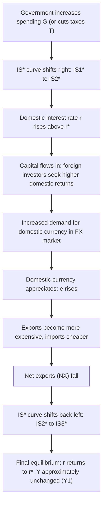
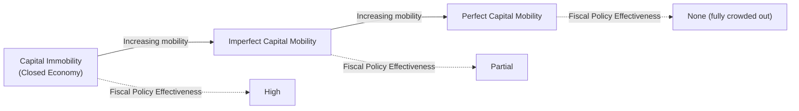

## Fiscal Policy Under Floating Exchange Rates

### Overview

In the Mundell-Fleming model, fiscal policy's effectiveness depends critically on the exchange rate regime and the degree of capital mobility. Under a **floating exchange rate with perfect capital mobility**, expansionary fiscal policy (increased government spending or tax cuts) is largely **ineffective** at raising output in the short run, because the resulting currency appreciation crowds out net exports, offsetting the initial demand stimulus. This stands in direct contrast to fiscal policy's high effectiveness under fixed exchange rates.

### Core Assumptions

- **Small open economy**: Domestic policy does not affect the world interest rate $r^*$.
- **Perfect capital mobility**: Capital flows instantaneously to equalize $r = r^*$.
- **Floating exchange rate**: $e$ is market-determined; the central bank does not intervene to stabilize it.
- **Sticky prices (short run)**: The price level $P$ is fixed, so real and nominal variables coincide.

### The Three-Market Framework

**IS* Curve (Goods Market)**

$$Y = C(Y-T) + I(r) + G + NX(e)$$

**LM Curve (Money Market)**

$$\frac{M}{P} = L(r, Y)$$

**Interest Rate Parity**

$$r = r^*$$

Fiscal policy operates through $G$ or $T$, directly shifting the IS* curve. Since the LM curve depends only on $M/P$, which the central bank holds constant under this policy experiment, LM does not shift.

### Transmission Mechanism: How Expansionary Fiscal Policy Is Crowded Out

Consider a government increasing spending $G$ under a floating exchange rate:

1. **Initial IS* shift**: Higher $G$ shifts the IS* curve rightward (IS₁* → IS₂*), since at any given interest rate, aggregate demand rises.
2. **Upward pressure on domestic interest rate**: At the initial exchange rate, higher demand for goods and money pushes $r$ above $r^*$.
3. **Capital inflow**: Because $r > r^*$, domestic assets offer a higher return than foreign assets. Foreign investors buy domestic-currency assets, causing capital to flow in.
4. **Currency appreciation**: The surge in demand for domestic currency in the foreign exchange market causes $e$ to rise (domestic currency appreciates).
5. **Net export decline**: A stronger currency makes domestic goods more expensive abroad and foreign goods cheaper domestically, reducing net exports $NX$.
6. **IS* shifts back**: The fall in $NX$ shifts the IS* curve back toward its original position (IS₂* → IS₃*, moving left again).
7. **Final equilibrium**: The economy returns to $r = r^*$ at (in the case of perfect capital mobility) **approximately the original output level** $Y_1$, with the composition of output altered — $G$ is higher, but $NX$ is lower by a roughly offsetting amount.

Under the polar case of *perfect* capital mobility, this crowding-out is **complete**: output returns exactly to $Y_1$, and fiscal policy has no effect on aggregate output, only on the composition of spending (higher government spending, lower net exports).

### Diagram: IS*-LM* Adjustment to Fiscal Expansion (svg_diagram)

<svg xmlns="http://www.w3.org/2000/svg" viewBox="0 0 640 480" font-family="Arial, sans-serif">
<text x="320" y="24" text-anchor="middle" font-size="16" font-weight="bold">Fiscal Expansion Under Floating Rates (svg_diagram)</text>

<line x1="80" y1="420" x2="580" y2="420" stroke="black" stroke-width="2" />
<line x1="80" y1="420" x2="80" y2="50" stroke="black" stroke-width="2" />
<text x="590" y="425" font-size="13">Y (Output)</text>
<text x="55" y="45" font-size="13">r</text>

<line x1="80" y1="230" x2="580" y2="230" stroke="#888" stroke-dasharray="6,4" stroke-width="1.5" />
<text x="90" y="222" font-size="12" fill="#555">r* (world interest rate)</text>

<path d="M 190 400 Q 340 300 500 90" stroke="#1f77b4" stroke-width="2.5" fill="none" />
<text x="505" y="85" font-size="12" fill="#1f77b4">LM (unchanged)</text>

<path d="M 480 90 Q 330 250 110 400" stroke="#d62728" stroke-width="2.5" fill="none" />
<text x="85" y="410" font-size="12" fill="#d62728">IS1*</text>

<path d="M 560 90 Q 410 250 190 400" stroke="#ff7f0e" stroke-width="2" stroke-dasharray="5,5" fill="none" />
<text x="565" y="80" font-size="11" fill="#ff7f0e">IS2* (temporary, G up)</text>

<path d="M 495 90 Q 345 250 125 400" stroke="#9467bd" stroke-width="2.5" stroke-dasharray="9,3" fill="none" />
<text x="410" y="105" font-size="11" fill="#9467bd">IS3* (final, NX down)</text>

<circle cx="295" cy="230" r="5" fill="black" />
<text x="270" y="250" font-size="12">E1 = E3 (Y1)</text>
<circle cx="365" cy="180" r="5" fill="black" />
<text x="370" y="170" font-size="11">E2 (temporary, r &gt; r*)</text>

<line x1="295" y1="230" x2="295" y2="420" stroke="#999" stroke-dasharray="3,3" />
<text x="282" y="440" font-size="12">Y1</text>

<line x1="380" y1="300" x2="330" y2="300" stroke="green" stroke-width="2" marker-end="url(#arrow2)" />
</svg>

### Process Flow Diagram

### Contrast: Monetary Policy Under Floating Rates

| Policy | Floating Rate (Perfect Capital Mobility) | Fixed Rate (Perfect Capital Mobility) |
| --- | --- | --- |
| Fiscal Policy | **Ineffective (fully crowded out)** — appreciation reduces $NX$, offsetting the initial $G$/$T$ stimulus | **Highly effective** — central bank must expand $M$ to defend the peg, reinforcing fiscal stimulus |
| Monetary Policy | **Highly effective** — depreciation boosts $NX$, amplifying the effect on $Y$ | **Ineffective** — central bank intervention to defend the peg offsets the money supply change |

This asymmetry is the central policy lesson of the Mundell-Fleming model: **under floating rates, monetary policy dominates; under fixed rates, fiscal policy dominates** (in the perfect capital mobility case).

### Worked Numerical Example

Assume a small open economy with:

- $M/P = 1000$ (held constant by the central bank)
- Money demand: $L(r, Y) = 0.5Y - 100r$
- $r^* = 5$
- Initial equilibrium: $Y_1 = 2200$ (consistent with $L(5, 2200) = 1100 - 500 = 600$; treat $M/P=600$ for consistency in this illustrative example) [Inference — figures chosen for arithmetic clarity rather than calibrated to real data]

**Step 1 — Government increases $G$, temporarily shifting IS* right.**

At the unchanged money supply $M/P = 600$, the LM curve is fixed. For the money market to clear at any output level $Y$, we need:

$$600 = 0.5Y - 100r \implies r = \frac{0.5Y - 600}{100}$$

**Step 2 — Impose $r = r^* = 5$ (interest parity restored in final equilibrium):**

$$5 = \frac{0.5Y - 600}{100} \implies 500 = 0.5Y - 600 \implies 0.5Y = 1100 \implies Y = 2200$$

**Result**: The final equilibrium output $Y = 2200$ is **identical** to the initial output $Y_1 = 2200$. Because the LM curve did not shift (money supply unchanged) and the interest rate must return to $r^*$, output is *pinned down entirely by the unchanged LM curve* — fiscal policy cannot move equilibrium output at all under perfect capital mobility and a floating rate. The increase in $G$ is exactly offset by a decrease in $NX$ of equal magnitude, with **no change in the interest rate** in the final equilibrium.

### Imperfect Capital Mobility: A Modification

When capital mobility is imperfect [Unverified — the degree varies by country, era, and capital account openness]:

- The interest parity condition becomes $r = r^* + \theta$, where $\theta$ may adjust gradually rather than instantaneously.
- Crowding-out is **partial rather than complete**: some of the fiscal stimulus persists because the interest rate can rise and remain elevated to some degree, and capital inflows/appreciation do not fully offset the demand boost.
- The closer the economy is to perfect capital mobility, the closer fiscal policy's output effect approaches zero; the closer to capital immobility (autarky in financial markets), the closer the outcome resembles the closed-economy IS-LM result, where fiscal policy is effective and crowding-out operates only through domestic interest rates (not the exchange rate channel).

### Real-World Considerations and Limitations

- **Imperfect capital mobility in practice**: Few economies exhibit truly perfect capital mobility; frictions, capital controls, and risk premiums mean fiscal policy typically retains *some* output effect even under floating rates. [Inference]
- **Expectations and credibility**: If fiscal expansion is perceived as unsustainable (raising concerns about debt sustainability), the exchange rate and interest rate responses may deviate from the textbook prediction — for example, a risk premium could cause depreciation instead of appreciation despite higher $r$. [Speculation]
- **J-curve and pass-through lags**: The net export response to appreciation is not instantaneous; trade volumes adjust with a lag, so the model's comparative-static prediction represents a longer-run outcome rather than an immediate one. [Inference]
- **Zero lower bound interactions**: When monetary policy is constrained (e.g., interest rates near zero), the standard crowding-out story may be muted since the LM curve can behave differently near the ZLB, though this extension goes beyond the basic Mundell-Fleming setup. [Unverified]
- **Multiplier effects before crowding-out**: In the short interval before capital flows and exchange rate adjustment fully occur, fiscal expansion can have transitory output effects; the "no effect" result is a comparative-static long-run conclusion within the model's timeframe, not necessarily an instantaneous one. [Inference]

### Key Points

- Under floating exchange rates with perfect capital mobility, fiscal policy is **ineffective** at changing aggregate output because currency appreciation crowds out net exports, exactly offsetting the initial stimulus.
- The interest rate returns to $r = r^*$, and the LM curve (unchanged, since $M$ is fixed) pins down the final output level.
- This result is the mirror image of monetary policy's high effectiveness under floating rates.
- Under fixed exchange rates, the roles reverse entirely: fiscal policy becomes highly effective and monetary policy becomes ineffective.
- Real-world imperfect capital mobility means crowding-out is typically partial rather than complete.

**Related Topics**

- Monetary policy under floating exchange rates (contrast case)
- Fiscal and monetary policy under fixed exchange rates
- The Impossible Trinity / Policy Trilemma
- Imperfect capital mobility and country risk premiums
- Interest rate parity (covered vs. uncovered)
- Twin deficits hypothesis (fiscal deficits and trade deficits)
- Ricardian equivalence in an open-economy context
- Exchange rate overshooting (Dornbusch model)