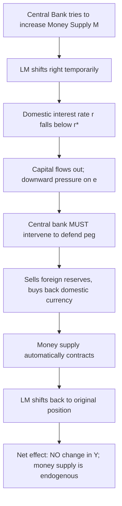
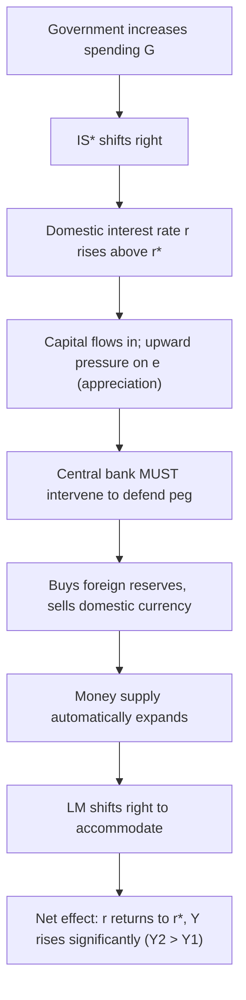

## Monetary and Fiscal Policy Under Fixed Exchange Rates

### Overview

Under a fixed exchange rate regime, the central bank commits to maintaining a target exchange rate $\bar{e}$ by standing ready to buy or sell foreign currency reserves at that rate. This commitment fundamentally alters the effectiveness of monetary and fiscal policy relative to the floating-rate case: **monetary policy becomes ineffective** (the central bank loses control over the money supply, since it must be used to defend the peg) while **fiscal policy becomes highly effective** (any interest rate pressure from fiscal expansion triggers a monetary response that reinforces rather than offsets the fiscal impulse). This is the reverse of the outcome under floating rates.

### Core Assumptions

- **Small open economy**: Domestic policy does not move the world interest rate $r^*$.
- **Perfect capital mobility**: Capital flows instantly to equalize $r = r^*$.
- **Fixed exchange rate**: The central bank commits to $e = \bar{e}$ and intervenes in the FX market (buying/selling reserves) to maintain it.
- **Sticky prices (short run)**: $P$ is fixed, so real and nominal variables coincide.

### The Three-Market Framework

**IS* Curve (Goods Market)**

$$Y = C(Y-T) + I(r) + G + NX(\bar{e})$$

Since $\bar{e}$ is fixed by policy, $NX$ depends only on the (constant) exchange rate target, not on market-driven fluctuations — it can still shift if $\bar{e}$ itself is changed (devaluation/revaluation), but not from ordinary IS/LM shocks.

**LM Curve (Money Market)**

$$\frac{M}{P} = L(r, Y)$$

Critically, $M$ is now **endogenous** — it is not a policy instrument the central bank can set independently, because it must adjust to whatever level keeps $e = \bar{e}$.

**Interest Rate Parity**

$$r = r^*$$

### Why Monetary Policy Is Ineffective Under a Fixed Rate

Consider a central bank attempting to increase the money supply $M$ under a fixed exchange rate:

1. **Initial LM shift**: An increase in $M$ shifts LM rightward, pushing $r$ below $r^*$ at the initial income level — identical to the floating-rate case initially.
2. **Capital outflow and depreciation pressure**: With $r < r^*$, capital flows out, creating **downward pressure on $e$** (tendency to depreciate).
3. **Central bank intervention required**: Because the central bank has committed to $\bar{e}$, it must intervene by **selling foreign reserves and buying back domestic currency** to prevent depreciation.
4. **Money supply automatically contracts**: This intervention directly **reduces the money supply**, shifting LM back to its original position.
5. **Result**: The LM curve returns to LM₁; the attempted monetary expansion is completely undone by the required defense of the peg. **The money supply is not truly a policy instrument under a fixed exchange rate with open capital markets** — it is determined by the balance-of-payments requirement to maintain $\bar{e}$.

This is a direct manifestation of the **Impossible Trinity**: with free capital mobility and a fixed exchange rate, the central bank forfeits independent monetary policy.

### Why Fiscal Policy Is Highly Effective Under a Fixed Rate

Consider a government increasing spending $G$ under a fixed exchange rate:

1. **Initial IS* shift**: Higher $G$ shifts IS* rightward, pushing $r$ above $r^*$ at the initial income level — identical to the floating-rate case initially.
2. **Capital inflow and appreciation pressure**: With $r > r^*$, capital flows in, creating **upward pressure on $e$** (tendency to appreciate).
3. **Central bank intervention required**: To prevent appreciation and maintain $\bar{e}$, the central bank must **buy foreign reserves and sell domestic currency**, injecting domestic currency into circulation.
4. **Money supply automatically expands**: This intervention **increases the money supply**, shifting LM rightward (LM₁ → LM₂).
5. **Result**: The economy settles at a new equilibrium with $r = r^*$ and **substantially higher output** $Y_2 > Y_1$ — the LM expansion reinforces rather than offsets the fiscal stimulus, unlike the floating-rate case where currency appreciation would have crowded it out.

### Diagram: Fiscal Expansion Under a Fixed Exchange Rate (svg_diagram)

<svg xmlns="http://www.w3.org/2000/svg" viewBox="0 0 640 480" font-family="Arial, sans-serif">
<text x="320" y="24" text-anchor="middle" font-size="15" font-weight="bold">Fiscal Expansion Under Fixed Rate: LM Accommodates (svg_diagram)</text>
<line x1="80" y1="420" x2="580" y2="420" stroke="black" stroke-width="2" />
<line x1="80" y1="420" x2="80" y2="50" stroke="black" stroke-width="2" />
<text x="590" y="425" font-size="13">Y (Output)</text>
<text x="55" y="45" font-size="13">r</text>
<line x1="80" y1="230" x2="580" y2="230" stroke="#888" stroke-dasharray="6,4" stroke-width="1.5" />
<text x="90" y="222" font-size="12" fill="#555">r* (world interest rate)</text>

<path d="M 150 400 Q 300 300 460 90" stroke="#1f77b4" stroke-width="2.5" fill="none" />
<text x="465" y="85" font-size="12" fill="#1f77b4">LM1</text>

<path d="M 235 400 Q 385 300 545 90" stroke="#1f77b4" stroke-width="2.5" stroke-dasharray="8,4" fill="none" />
<text x="550" y="85" font-size="12" fill="#1f77b4">LM2 (money supply rises)</text>

<path d="M 500 90 Q 350 250 130 400" stroke="#d62728" stroke-width="2.5" fill="none" />
<text x="105" y="410" font-size="12" fill="#d62728">IS1*</text>

<path d="M 570 90 Q 420 250 200 400" stroke="#d62728" stroke-width="2.5" stroke-dasharray="8,4" fill="none" />
<text x="575" y="80" font-size="12" fill="#d62728">IS2* (G up, stays put)</text>
<circle cx="313" cy="230" r="5" fill="black" />
<text x="300" y="250" font-size="12">E1 (Y1)</text>
<circle cx="410" cy="230" r="5" fill="black" />
<text x="415" y="215" font-size="12">E2 (Y2)</text>
<line x1="313" y1="230" x2="313" y2="420" stroke="#999" stroke-dasharray="3,3" />
<line x1="410" y1="230" x2="410" y2="420" stroke="#999" stroke-dasharray="3,3" />
<text x="300" y="440" font-size="12">Y1</text>
<text x="400" y="440" font-size="12">Y2</text>

<text x="150" y="330" font-size="11" fill="green">Note: IS* does NOT get</text>

<text x="150" y="345" font-size="11" fill="green">crowded out — e is pegged</text>

</svg>

### Process Flow Diagrams

**Monetary Policy Attempt (Fails):**

**Fiscal Policy Expansion (Succeeds):**

### Comparative Summary Table

| Policy | Fixed Exchange Rate | Floating Exchange Rate |
| --- | --- | --- |
| **Monetary Policy** | Ineffective — money supply is endogenous, automatically reversed to defend peg | Highly effective — exchange rate channel amplifies output effect |
| **Fiscal Policy** | Highly effective — required FX intervention expands money supply, reinforcing stimulus | Ineffective — currency appreciation crowds out net exports, offsetting stimulus |
| **Exchange Rate** | Fixed by policy; adjusts only via deliberate devaluation/revaluation | Market-determined; absorbs the burden of adjustment |
| **Money Supply** | Endogenous (determined by balance-of-payments needs) | Exogenous (set independently by the central bank) |

### Worked Numerical Example: Fiscal Expansion Under Fixed Rate

Assume:

- Money demand: $L(r, Y) = 0.5Y - 100r$
- $r^* = 5$
- Initial equilibrium: $Y_1 = 2200$, requiring $M_1/P = 0.5(2200) - 100(5) = 600$

**Step 1 — Government increases $G$, pushing IS* right, initially raising $r$ above 5 at $Y=2200$.**

**Step 2 — Interest parity requires $r$ to return to $r^*=5$.** Since the new IS* curve at $r=5$ implies a higher $Y_2$ (say the new IS* equation yields $Y_2 = 2600$ at $r=5$, based on the fiscal multiplier), the central bank must supply enough money to validate this new equilibrium:

$$\frac{M_2}{P} = 0.5(2600) - 100(5) = 1300 - 500 = 800$$

**Result**: The money supply **automatically rises** from $600$ to $800$ (a $200$ increase) as a byproduct of FX intervention to prevent appreciation — the central bank did not choose this expansion; it was forced by the commitment to the peg. Output rises to $Y_2 = 2600$, the full fiscal multiplier effect, with **no crowding out** via the exchange rate channel (unlike the floating-rate case, where output would have returned to $Y_1$).

### Devaluation as a Distinct Policy Tool

Under a fixed regime, the government/central bank retains one exchange-rate-related lever: **discrete devaluation** (lowering $\bar{e}$) or **revaluation** (raising $\bar{e}$).

- A **devaluation** directly increases net exports at any interest rate, shifting IS* rightward — analogous to the effect of currency depreciation under floating rates, but achieved through a deliberate one-time policy decision rather than continuous market adjustment.
- This gives fixed-rate regimes a discrete substitute for the continuous monetary-policy channel available under floating rates, though it is a blunt, infrequently-used instrument rather than a fine-tuning tool. [Inference]

### Real-World Considerations and Limitations

- **Reserve constraints**: A central bank's ability to defend a peg against sustained capital outflows is limited by its stock of foreign exchange reserves; speculative attacks can force abandonment of the peg (as in various historical currency crises). [Inference]
- **Capital controls as a workaround**: Some countries maintain fixed rates alongside independent monetary policy by imposing capital controls, restricting the free capital mobility assumption of the model — this is the third corner of the Impossible Trinity. [Inference]
- **Credibility effects**: If markets doubt the central bank's commitment to the peg, expectations of devaluation can trigger speculative capital flight even before any policy change occurs, an effect not captured in the basic comparative-static model. [Speculation]
- **Imperfect capital mobility**: With less-than-perfect capital mobility, monetary policy retains partial (rather than zero) effectiveness even under a fixed rate, since capital flows and thus the required reserve intervention are more gradual. [Unverified — degree depends on the specific economy's capital account openness]
- **Sterilization**: Central banks can attempt to "sterilize" the money supply effects of FX intervention (offsetting reserve purchases/sales with domestic open-market operations), but this is only sustainable in the short run and undermines the credibility of the peg if pursued persistently. [Inference]

### Key Points

- Under fixed exchange rates, the money supply becomes **endogenous** — determined by the need to defend $\bar{e}$ — which renders independent monetary policy **ineffective**.
- Fiscal policy becomes **highly effective**, since any interest rate pressure triggers FX intervention that expands or contracts the money supply in a direction that reinforces the fiscal impulse.
- This is the exact reverse of the floating-rate case, illustrating the fundamental **policy asymmetry** central to the Mundell-Fleming model.
- The **Impossible Trinity** explains this outcome: fixed exchange rate + free capital mobility necessarily sacrifices monetary policy autonomy.
- Devaluation/revaluation remains available as a discrete (not continuous) policy tool under fixed regimes.

**Related Topics**

- Monetary policy under floating exchange rates
- Fiscal policy under floating exchange rates
- The Impossible Trinity / Policy Trilemma in depth
- Currency crises and speculative attacks (first- and second-generation models)
- Sterilized vs. unsterilized foreign exchange intervention
- Capital controls as a policy alternative
- Devaluation, revaluation, and competitiveness effects
- Imperfect capital mobility and the risk premium