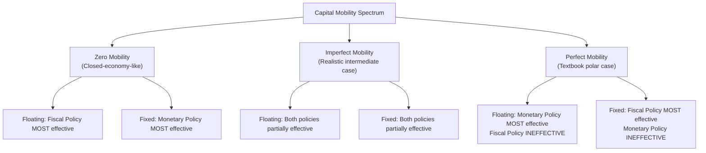
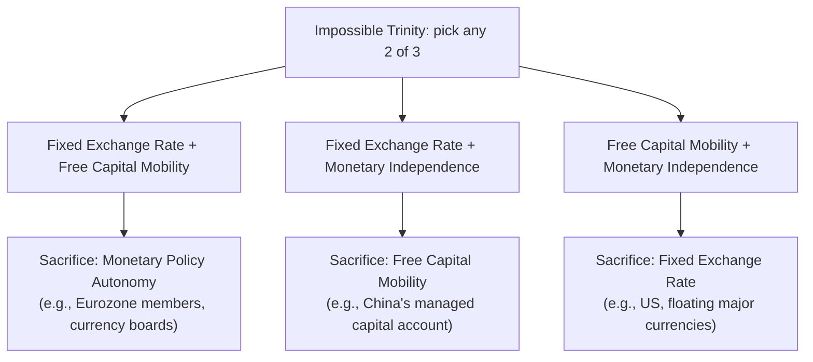

## Capital Mobility and the Effectiveness of Policy

### Overview

The degree of international capital mobility is the pivotal parameter that determines how monetary and fiscal policy transmit through an open economy. The Mundell-Fleming model's sharpest predictions — monetary policy effective/fiscal ineffective under floating rates, and the reverse under fixed rates — hold in their strongest form only under the polar assumption of **perfect capital mobility**. As capital mobility varies along the spectrum from complete immobility to perfect mobility, policy effectiveness shifts continuously, and understanding this spectrum is essential to applying the model realistically.

### Defining the Capital Mobility Spectrum

**Capital mobility** refers to the ease and speed with which financial capital moves across national borders in response to interest rate differentials, driven by portfolio rebalancing and arbitrage.

| Degree of Mobility | Description | BP Curve Slope |
| --- | --- | --- |
| **Zero (complete immobility)** | No cross-border capital flows regardless of interest differentials (e.g., due to capital controls or non-convertibility) | Vertical |
| **Imperfect mobility** | Capital responds to interest differentials, but flows are finite and gradual; $r$ can deviate from $r^*$ persistently | Upward-sloping |
| **Perfect mobility** | Capital flows instantaneously and in unlimited volume to eliminate any $r \neq r^*$ gap | Horizontal |

### The BP Curve (Balance of Payments Equilibrium)

The **BP curve** represents combinations of $Y$ and $r$ consistent with balance-of-payments equilibrium (current account plus capital account = 0, under floating rates; or the financing of any imbalance via reserves, under fixed rates):

$$BP: \quad NX(e, Y) + CF(r - r^*) = 0$$

where $CF$ is net capital inflow, increasing in the domestic-foreign interest differential.

- **Slope of BP** depends on the capital account's sensitivity to $r$: the more responsive capital flows are to interest differentials, the **flatter** the BP curve.
- In the **perfect capital mobility** limit, $CF$ becomes infinitely sensitive to any deviation of $r$ from $r^*$, so BP is **horizontal at $r = r^*$** — this is the standard case used in the floating/fixed rate comparisons discussed elsewhere in this chapter.
- In the **zero capital mobility** limit, $CF$ does not respond to $r$ at all, so BP is **vertical** — external balance depends only on $Y$ (through its effect on imports via $NX$), not on $r$.

### Diagram: BP Curve Slopes Under Varying Capital Mobility (svg_diagram)

<svg xmlns="http://www.w3.org/2000/svg" viewBox="0 0 640 420" font-family="Arial, sans-serif">
<text x="320" y="24" text-anchor="middle" font-size="15" font-weight="bold">BP Curve Slope vs. Capital Mobility (svg_diagram)</text>
<line x1="80" y1="370" x2="580" y2="370" stroke="black" stroke-width="2" />
<line x1="80" y1="370" x2="80" y2="50" stroke="black" stroke-width="2" />
<text x="590" y="375" font-size="13">Y</text>
<text x="55" y="45" font-size="13">r</text>

<line x1="180" y1="60" x2="180" y2="360" stroke="#d62728" stroke-width="2.5" />
<text x="130" y="55" font-size="11" fill="#d62728">BP (zero mobility)</text>

<line x1="260" y1="360" x2="440" y2="70" stroke="#2ca02c" stroke-width="2.5" />
<text x="440" y="65" font-size="11" fill="#2ca02c">BP (imperfect mobility)</text>

<line x1="80" y1="200" x2="580" y2="200" stroke="#1f77b4" stroke-width="2.5" stroke-dasharray="8,4" />
<text x="500" y="195" font-size="11" fill="#1f77b4">BP (perfect mobility, r = r*)</text>

<text x="160" y="400" font-size="12">More vertical = less mobile</text>

<text x="380" y="400" font-size="12">More horizontal = more mobile</text>

</svg>

### Policy Effectiveness Across the Mobility Spectrum

**Under Floating Exchange Rates:**

| Capital Mobility | Monetary Policy Effect on Y | Fiscal Policy Effect on Y |
| --- | --- | --- |
| Perfect | **Maximally effective** — full exchange-rate channel amplification | **Zero (fully crowded out)** |
| Imperfect | Effective, but less than the perfect-mobility case | Partially effective |
| Zero | Least effective via the exchange rate channel [Inference — reduces toward the closed-economy result] | **Most effective** — approaches closed-economy fiscal multiplier, since no offsetting capital-flow/exchange-rate response occurs |

**Under Fixed Exchange Rates:**

| Capital Mobility | Monetary Policy Effect on Y | Fiscal Policy Effect on Y |
| --- | --- | --- |
| Perfect | **Zero** — money supply fully endogenous | **Maximally effective** — full LM accommodation via reserve flows |
| Imperfect | Partially effective — central bank retains some independence | Effective, though less than the perfect-mobility case |
| Zero | **Most effective** — behaves like closed economy; central bank has full control over $M$ [Inference] | Effective, similar to closed-economy fiscal policy, since no reserve-driven monetary accommodation is needed |

Notice the **symmetry**: as capital mobility rises, monetary policy effectiveness rises under floating rates and falls under fixed rates; fiscal policy effectiveness falls under floating rates and rises under fixed rates. Zero capital mobility collapses both regimes toward the standard closed-economy IS-LM predictions, since the exchange-rate/BOP channel that distinguishes floating from fixed regimes is absent.

### Diagram: Policy Effectiveness as a Function of Capital Mobility

### Mathematical Intuition: Imperfect Capital Mobility

With imperfect capital mobility, the interest parity condition is relaxed to:

$$r = r^* + \theta$$

where $\theta$ represents a risk/liquidity premium or reflects the finite capacity of capital flows to arbitrage the differential over the relevant time horizon. The equilibrium condition for the BP curve becomes:

$$NX(e, Y) + CF(r - r^*) = 0 \quad \implies \quad r = r^* + \phi(Y)$$

where $\phi'(Y) > 0$ captures the fact that higher $Y$ raises imports, worsening the current account, requiring a higher interest rate (more capital inflow) to maintain external balance — this is what gives the BP curve its **upward slope** under imperfect mobility.

**Key comparative statics:**

- The **flatter** the BP curve (higher capital mobility), the closer monetary and fiscal policy effectiveness approaches the perfect-mobility predictions of the standard Mundell-Fleming model.
- The **steeper** the BP curve (lower capital mobility), the closer the economy's response resembles the closed-economy IS-LM model, with the fixed/floating distinction mattering less.

### The IS-LM-BP Framework (Three-Curve Extension)

For imperfect capital mobility, the full model requires three curves in $(Y, r)$ space simultaneously:

1. **IS** — goods market equilibrium
2. **LM** — money market equilibrium
3. **BP** — external balance (upward-sloping, given imperfect mobility)

Equilibrium requires all three curves to intersect at a single point. If BP is flatter than LM (relatively high capital mobility relative to money demand's interest sensitivity), monetary policy retains meaningful effectiveness; if BP is steeper than LM, the qualitative predictions resemble the fixed/floating polar cases more closely. [Inference — this relative-slope condition is a standard textbook heuristic for signing the disequilibrium adjustment dynamics.]

### Real-World Capital Mobility: Empirical Notes

- **Advanced economies with open capital accounts** (e.g., US, Eurozone, UK, Japan, Canada) are typically treated as closer to the perfect-mobility end of the spectrum in stylized models, though even here, home bias in portfolios and other frictions mean capital mobility is not literally infinite. [Unverified — precise empirical measurement of "capital mobility" is contested and metric-dependent]
- **Emerging markets and developing economies** often exhibit lower effective capital mobility due to capital controls, less-developed financial markets, sovereign risk premiums, and currency risk — meaning fiscal policy may retain more independent traction even under a floating rate. [Inference]
- **The Feldstein-Horioka puzzle**: cross-country studies have historically found that domestic savings and domestic investment rates are more highly correlated than a perfect-capital-mobility world would predict, suggesting that observed international capital mobility, while substantial, may be less than "perfect" in practice. [Unverified — this remains a debated empirical finding with multiple interpretations]
- **Capital controls** (e.g., Chile's historical unremunerated reserve requirements, China's managed capital account) represent deliberate policy choices to retain monetary independence by sacrificing free capital mobility, consistent with the Impossible Trinity framework. [Inference]

### Connection to the Impossible Trinity

The capital mobility spectrum operationalizes the **Impossible Trinity** (Policy Trilemma): a country cannot simultaneously have (1) a fixed exchange rate, (2) free capital mobility, and (3) independent monetary policy. Countries choose their position along the capital-mobility axis partly *because* of this trilemma — restricting capital mobility (via controls) is one of the three available ways to reconcile a fixed rate with monetary autonomy, alongside floating the currency or abandoning monetary independence (e.g., currency board, dollarization, or currency union).

### Key Points

- Capital mobility is the parameter governing the **slope of the BP curve**, ranging from vertical (zero mobility) to horizontal (perfect mobility).
- Under **perfect capital mobility**, the Mundell-Fleming polar results hold exactly: monetary policy dominates under floating rates; fiscal policy dominates under fixed rates.
- Under **imperfect capital mobility**, both policies retain partial effectiveness under both exchange rate regimes, with the degree depending on the relative slopes of BP and LM.
- Under **zero capital mobility**, the economy's behavior converges toward the closed-economy IS-LM model, and the exchange-rate regime matters less for policy effectiveness.
- Real-world economies occupy a continuum, not the textbook polar cases, and the choice of capital account openness is itself a policy decision linked to the Impossible Trinity.

**Related Topics**

- Monetary policy under floating exchange rates
- Fiscal policy under floating exchange rates
- Monetary and fiscal policy under fixed exchange rates
- The Impossible Trinity / Policy Trilemma in depth
- The IS-LM-BP model with imperfect capital mobility
- Capital controls: theory and case studies
- The Feldstein-Horioka puzzle
- Currency boards, dollarization, and monetary unions