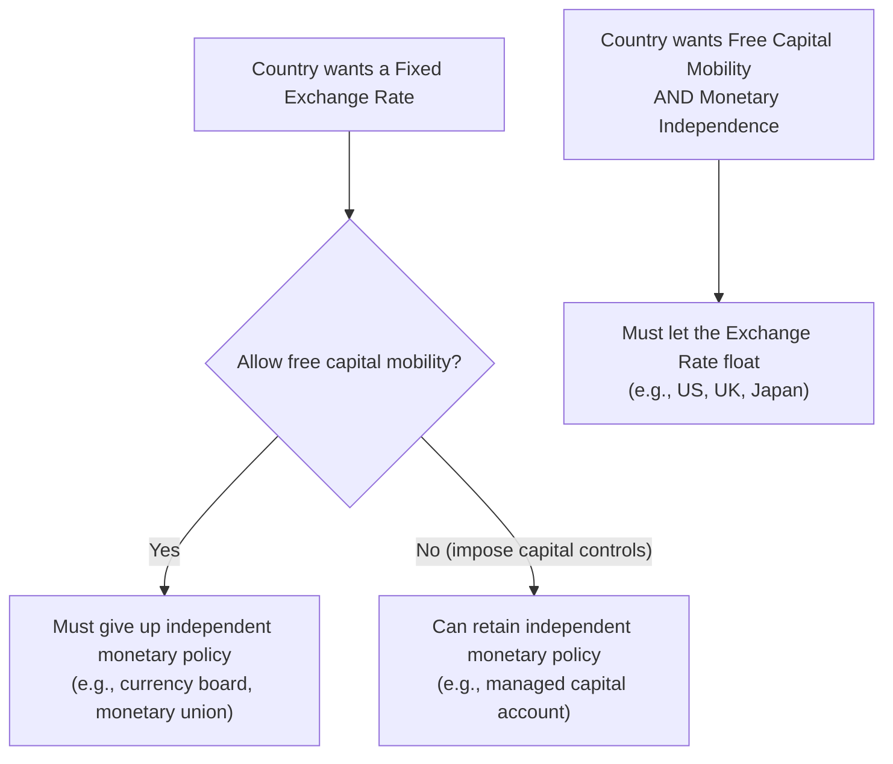

## The Impossible Trinity

### Overview

The **Impossible Trinity** (also called the **Policy Trilemma** or **Mundell-Fleming Trilemma**) is one of the most influential propositions in open-economy macroeconomics. It states that a country cannot simultaneously maintain all three of the following policy objectives — it can achieve at most **two out of three**:

1. **A fixed exchange rate**
2. **Free international capital mobility**
3. **An independent monetary policy**

Attempting to pursue all three simultaneously is unsustainable and typically results in a currency crisis, capital account closure, or abandonment of the exchange rate peg. This proposition emerges directly as a corollary of the Mundell-Fleming model's core results on monetary and fiscal policy effectiveness under different exchange rate regimes.

### The Three Corners

**Corner 1 — Fixed Exchange Rate + Free Capital Mobility (sacrifice Monetary Independence)**

If a country pegs its currency and allows capital to flow freely, any attempt to set an independent interest rate (different from $r^*$, the world rate) triggers capital flows large enough to force the central bank to intervene in the FX market, which automatically adjusts the money supply and neutralizes the intended monetary policy. Examples: Eurozone member states (which have unified monetary policy set by the ECB), Hong Kong's currency board pegged to the USD, Denmark's peg to the euro.

**Corner 2 — Fixed Exchange Rate + Monetary Independence (sacrifice Free Capital Mobility)**

A country can maintain both a currency peg and its own independent monetary policy only by restricting capital flows (capital controls), preventing arbitrage-driven capital movements from undermining the peg. Examples: China's historically managed capital account alongside a managed exchange rate, Malaysia's capital controls during the 1998 Asian Financial Crisis, Bretton Woods-era capital controls used by many advanced economies.

**Corner 3 — Free Capital Mobility + Monetary Independence (sacrifice Fixed Exchange Rate)**

A country can retain both open capital markets and an independent monetary policy only by allowing the exchange rate to float, so that currency value — not the money supply or capital account — absorbs external adjustment pressure. Examples: the United States, Japan, the United Kingdom, Canada, Australia, and most major floating-currency economies.

### Diagram: The Trilemma Triangle (svg_diagram)

<svg xmlns="http://www.w3.org/2000/svg" viewBox="0 0 640 560" font-family="Arial, sans-serif">
<text x="320" y="28" text-anchor="middle" font-size="16" font-weight="bold">The Impossible Trinity (svg_diagram)</text>

<polygon points="320,80 100,460 540,460" fill="none" stroke="black" stroke-width="2.5" />

<circle cx="320" cy="80" r="6" fill="#1f77b4" />
<text x="320" y="60" text-anchor="middle" font-size="13" font-weight="bold" fill="#1f77b4">Fixed Exchange Rate</text>
<circle cx="100" cy="460" r="6" fill="#d62728" />
<text x="100" y="490" text-anchor="middle" font-size="13" font-weight="bold" fill="#d62728">Free Capital Mobility</text>
<circle cx="540" cy="460" r="6" fill="#2ca02c" />
<text x="540" y="490" text-anchor="middle" font-size="13" font-weight="bold" fill="#2ca02c">Monetary Independence</text>

<text x="175" y="250" font-size="12" transform="rotate(-51 175 250)" fill="#555">Sacrifice: Monetary Independence</text>

<text x="470" y="250" font-size="12" transform="rotate(51 470 250)" fill="#555">Sacrifice: Free Capital Mobility</text>

<text x="320" y="500" text-anchor="middle" font-size="12" fill="#555">Sacrifice: Fixed Exchange Rate</text>

<text x="150" y="230" font-size="10" fill="`#1f77b4`" transform="rotate(-51 150 230)">e.g., Eurozone, Hong Kong (HKD peg)</text>

<text x="500" y="230" font-size="10" fill="`#2ca02c`" transform="rotate(51 500 230)">e.g., China (managed capital account)</text>

<text x="320" y="520" text-anchor="middle" font-size="10" fill="`#d62728`">e.g., US, UK, Japan (floating rates)</text>

</svg>

### Theoretical Basis in the Mundell-Fleming Model

The Trilemma follows directly from the interest rate parity condition under perfect capital mobility:

$$r = r^*$$

If a country fixes $e$ **and** allows free capital mobility, this equation becomes a binding constraint: the domestic interest rate is *pinned* to the world rate, leaving the central bank with no independent lever. The money supply becomes endogenous — it adjusts automatically to whatever level is required to keep $r = r^*$ and defend $\bar{e}$, exactly as shown in the analysis of monetary policy under fixed exchange rates.

If instead the exchange rate floats, $e$ becomes the adjustment variable, absorbing shocks so that $r$ can diverge from $r^*$ — the money supply remains an independent policy tool.

If capital controls restrict $CF(r-r^*)$, the interest parity condition no longer binds tightly; a wedge $\theta$ can persist between $r$ and $r^*$ indefinitely, permitting both a peg and independent monetary policy.

### Flowchart: Choosing a Corner

### Historical Illustrations

- **Bretton Woods System (1944-1973)**: Fixed exchange rates against the US dollar were maintained alongside capital controls in most participating countries, sacrificing free capital mobility (Corner 2). The system's collapse in the early 1970s is frequently attributed in part to growing capital mobility making the fixed-rate-plus-controls combination increasingly difficult to sustain. [Inference — the collapse had multiple contributing causes including US balance-of-payments deficits and the abandonment of gold convertibility]
- **European Exchange Rate Mechanism (ERM) crisis, 1992**: The UK and Italy attempted to maintain fixed rates against the Deutsche Mark while allowing largely free capital mobility, without a unified monetary policy. Speculative attacks (notably against the British pound on "Black Wednesday," September 1992) forced both countries to abandon their pegs, illustrating the unsustainability of attempting all three corners at once. [Inference — details of speculative dynamics are widely documented but specific magnitudes are best verified against primary historical sources]
- **Eurozone**: Member states achieve exchange rate fixity (via a shared currency) and free capital mobility, but sacrifice independent national monetary policy entirely to the European Central Bank (Corner 1, taken to its logical extreme of currency union).
- **China**: Has historically maintained a managed/fixed exchange rate regime alongside capital controls, preserving monetary policy independence (Corner 2), though the degree of capital account liberalization has evolved over time. [Unverified — China's specific capital account policies have changed over the years and current details should be verified against up-to-date sources]

### The Middle Ground: "Two-and-a-Half" Corners

In practice, few countries occupy a pure corner. Most economies exhibit **intermediate combinations**:

- **Managed floats**: Central banks allow the exchange rate to move but intervene periodically, retaining a degree of both exchange rate influence and monetary independence, at the cost of a fully free capital account or complete monetary autonomy in the strictest sense. [Inference]
- **Partial capital controls**: Countries may liberalize some categories of capital flows (e.g., FDI) while restricting others (e.g., short-term portfolio flows), achieving intermediate positions on the capital mobility axis.
- **Trilemma vs. "Dilemma" debate**: Some researchers have argued that in a world of highly integrated global financial markets, even floating exchange rates may not fully insulate domestic monetary policy from global financial cycles driven by major central banks (sometimes framed as a "global financial cycle" constraint), suggesting the trilemma may function more like a "dilemma" in certain conditions. [Speculation — this is an active area of academic debate, not settled consensus, associated with researchers such as Hélène Rey; specifics should be verified against current literature]

### Related Extensions

- **Trilemma and exchange rate regime classification**: The IMF and academic researchers classify countries along a spectrum from hard pegs (currency boards, dollarization) through soft pegs and managed floats to fully independent floats, corresponding to different trilemma resolutions.
- **Optimal Currency Area (OCA) theory**: Evaluates when it makes sense for a group of countries to sacrifice monetary independence entirely by adopting a common currency (an extreme form of Corner 1), based on criteria like labor mobility, fiscal transfers, and the symmetry of economic shocks.
- **Sequencing of capital account liberalization**: Policy literature on how and when countries should relax capital controls, given trilemma trade-offs, particularly for emerging markets. [Inference]

### Key Points

- The Impossible Trinity states a country can achieve at most two of: fixed exchange rate, free capital mobility, and independent monetary policy.
- This is the theoretical foundation explaining why monetary policy is effective under floating rates but not fixed rates (and vice versa for fiscal policy) under perfect capital mobility.
- Historical episodes (Bretton Woods, the 1992 ERM crisis, the Eurozone, China's managed capital account) illustrate real-world resolutions of the trilemma.
- Most countries occupy intermediate positions rather than pure corners, and the strength of the trilemma constraint itself is debated in light of global financial integration.

**Related Topics**

- Monetary policy under floating exchange rates
- Fiscal policy under floating exchange rates
- Monetary and fiscal policy under fixed exchange rates
- Capital mobility and the effectiveness of policy
- Optimal Currency Area theory
- Currency crises and speculative attacks
- Capital controls: theory and case studies
- The "global financial cycle" and dilemma vs. trilemma debate